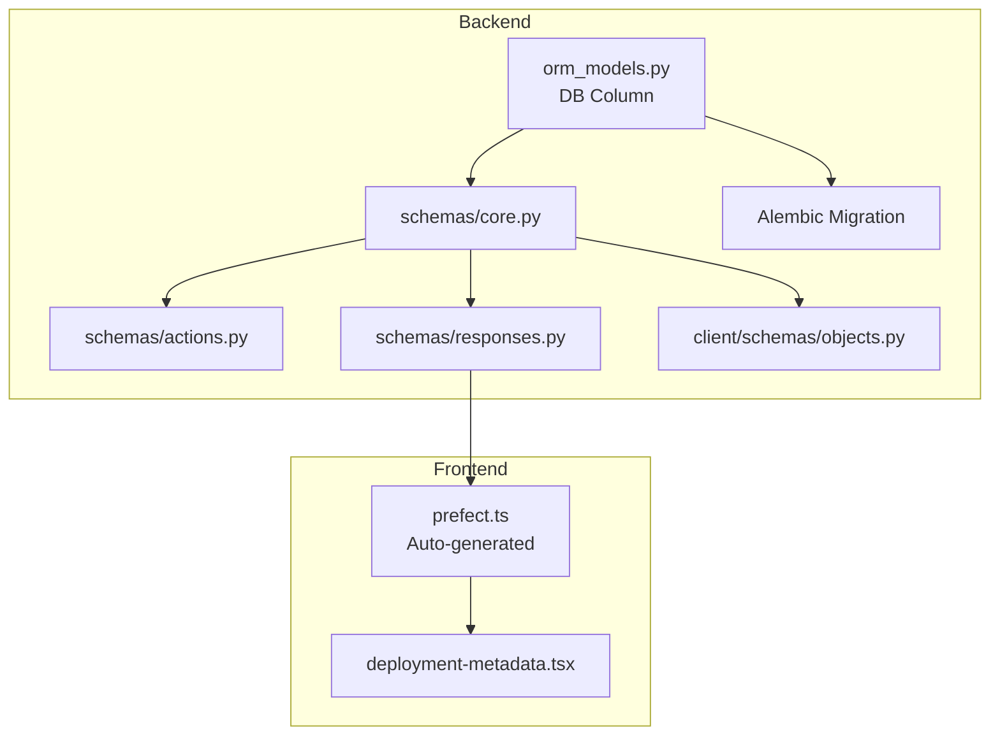

# Deployment Repository URL Feature

This PR adds the ability to store and display a code repository URL for deployments, addressing [issue #19834](https://github.com/PrefectHQ/prefect/issues/19834).

## Architecture Overview



## Implementation

### 1. Backend - Database Schema

Add `code_repository_url` column to Deployment table:

**[src/prefect/server/database/orm_models.py](src/prefect/server/database/orm_models.py)**

```python
class Deployment(Base):
    # ... existing fields ...
    code_repository_url: Mapped[Optional[str]] = mapped_column(sa.Text())
```

### 2. Backend - Create Alembic Migrations

Generate migration files for both PostgreSQL and SQLite:

```bash
cd src/prefect/server/database/_migrations/versions
# Create migration files manually following existing patterns
```

- PostgreSQL: `versions/postgresql/YYYY_MM_DD_HHMMSS_add_code_repository_url_to_deployment.py`
- SQLite: `versions/sqlite/YYYY_MM_DD_HHMMSS_add_code_repository_url_to_deployment.py`

### 3. Backend - Update Pydantic Schemas

Add field to all relevant schemas:

**[src/prefect/server/schemas/core.py](src/prefect/server/schemas/core.py)** - `Deployment` class

**[src/prefect/server/schemas/actions.py](src/prefect/server/schemas/actions.py)** - `DeploymentCreate`, `DeploymentUpdate` classes

**[src/prefect/server/schemas/responses.py](src/prefect/server/schemas/responses.py)** - `DeploymentResponse` class

**[src/prefect/client/schemas/objects.py](src/prefect/client/schemas/objects.py)** - Client `Deployment` class

```python
code_repository_url: Optional[str] = Field(
    default=None,
    description="URL to the code repository for this deployment.",
)
```

### 4. Frontend - Sync API Types

```bash
cd ui-v2
npm run service-sync  # Regenerates prefect.ts from OpenAPI schema
```

### 5. Frontend - Display Repository Link in UI

**[ui-v2/src/components/deployments/deployment-metadata.tsx](ui-v2/src/components/deployments/deployment-metadata.tsx)**

Add Repository URL field to `BOTTOM_FIELDS` array, rendering as a clickable external link when present.

### 6. Testing

- **Backend**: Add tests for the new field in deployment create/update/read operations
- **Frontend**: Update Storybook story with mock data containing `code_repository_url`

## Scope Limitations (First PR)

- Input is only via API/SDK (no UI form for editing repository URL yet)
- No automatic git ref/commit linking (future enhancement)
- No deep linking to specific files (future enhancement)

## Verification

1. Run `prefect server start`
2. Create a deployment with `code_repository_url` via API
3. View Deployment details page and confirm Repository link appears