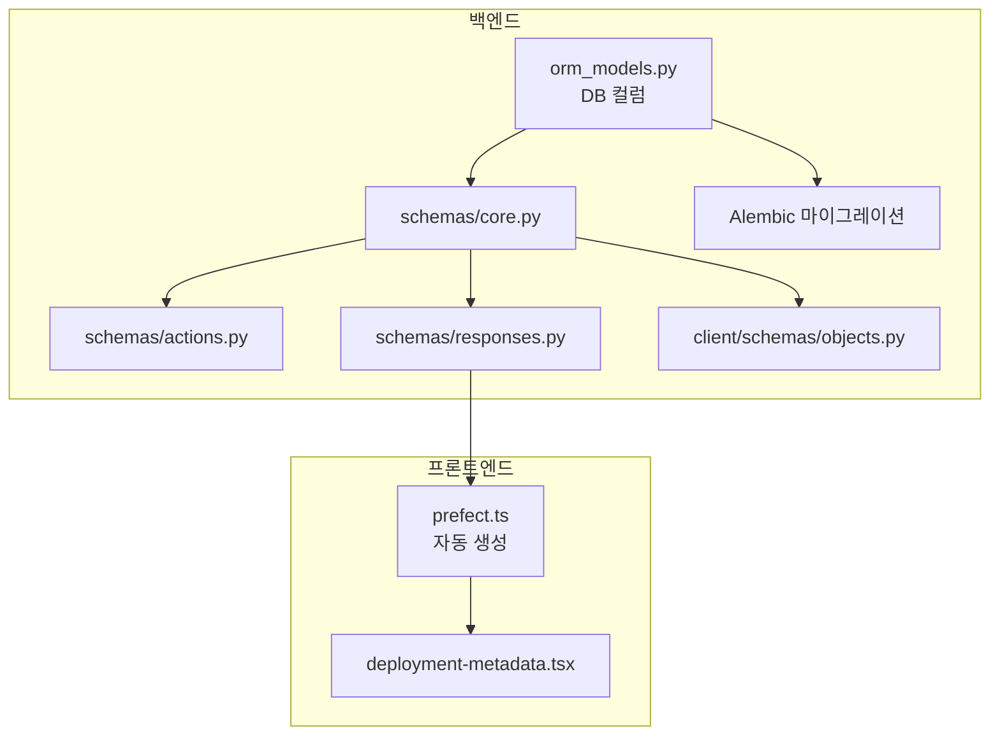

# Deployment Repository URL 기능

이 PR은 deployment에 코드 저장소 URL을 저장하고 표시하는 기능을 추가합니다.

[이슈 #19834](https://github.com/PrefectHQ/prefect/issues/19834) 해결.

## 아키텍처 개요



## 구현 상세

### 1. 백엔드 - 데이터베이스 스키마

Deployment 테이블에 `code_repository_url` 컬럼 추가:

**[src/prefect/server/database/orm_models.py](src/prefect/server/database/orm_models.py)**

```python
class Deployment(Base):
    # ... 기존 필드들 ...
    code_repository_url: Mapped[Optional[str]] = mapped_column(sa.Text())
```

### 2. 백엔드 - Alembic 마이그레이션 생성

PostgreSQL과 SQLite 모두에 대한 마이그레이션 파일 생성:

```bash
cd src/prefect/server/database/_migrations/versions
# 기존 패턴을 따라 마이그레이션 파일 수동 생성
```

- PostgreSQL: `versions/postgresql/YYYY_MM_DD_HHMMSS_add_code_repository_url_to_deployment.py`
- SQLite: `versions/sqlite/YYYY_MM_DD_HHMMSS_add_code_repository_url_to_deployment.py`

**마이그레이션 코드 예시:**

```python
"""add code_repository_url to deployment

Revision ID: <자동 생성>
Revises: <이전 마이그레이션>
Create Date: <현재 날짜>
"""

import sqlalchemy as sa
from alembic import op

# revision identifiers
revision = "<자동 생성>"
down_revision = "<이전 마이그레이션>"

def upgrade():
    op.add_column(
        "deployment",
        sa.Column("code_repository_url", sa.Text(), nullable=True),
    )

def downgrade():
    op.drop_column("deployment", "code_repository_url")
```

### 3. 백엔드 - Pydantic 스키마 업데이트

모든 관련 스키마에 필드 추가:

**[src/prefect/server/schemas/core.py](src/prefect/server/schemas/core.py)** - `Deployment` 클래스

**[src/prefect/server/schemas/actions.py](src/prefect/server/schemas/actions.py)** - `DeploymentCreate`, `DeploymentUpdate` 클래스

**[src/prefect/server/schemas/responses.py](src/prefect/server/schemas/responses.py)** - `DeploymentResponse` 클래스

**[src/prefect/client/schemas/objects.py](src/prefect/client/schemas/objects.py)** - 클라이언트 `Deployment` 클래스

```python
code_repository_url: Optional[str] = Field(
    default=None,
    description="이 deployment의 코드 저장소 URL.",
)
```

### 4. 프론트엔드 - API 타입 동기화

```bash
cd ui-v2
npm run service-sync  # OpenAPI 스키마에서 prefect.ts 재생성
```

### 5. 프론트엔드 - UI에 Repository 링크 표시

**[ui-v2/src/components/deployments/deployment-metadata.tsx](ui-v2/src/components/deployments/deployment-metadata.tsx)**

`BOTTOM_FIELDS` 배열에 Repository URL 필드 추가, URL이 있을 때 클릭 가능한 외부 링크로 렌더링:

```tsx
{
    field: "Repository",
    ComponentValue: () =>
        deployment.code_repository_url ? (
            <FieldValue>
                <a 
                    href={deployment.code_repository_url}
                    target="_blank"
                    rel="noopener noreferrer"
                    className="text-blue-500 hover:underline"
                >
                    {deployment.code_repository_url}
                </a>
            </FieldValue>
        ) : (
            <None />
        ),
},
```

### 6. 테스트

- **백엔드**: deployment 생성/수정/조회 작업에서 새 필드에 대한 테스트 추가
- **프론트엔드**: `code_repository_url`이 포함된 mock 데이터로 Storybook 스토리 업데이트

## 첫 PR 범위 제한

| 포함됨 ✅ | 미포함 ❌ (후속 PR) |

|----------|---------------------|

| API/SDK로 repository URL 저장 | UI에서 repository URL 편집 폼 |

| Deployment 상세 페이지에 링크 표시 | git ref/commit 자동 연결 |

| | 특정 파일로 deep link |

## 검증 방법

1. `prefect server start` 실행
2. API로 `code_repository_url`이 포함된 deployment 생성:
   ```python
   from prefect.client import get_client
   
   async with get_client() as client:
       await client.create_deployment(
           flow_id="...",
           name="my-deployment",
           code_repository_url="https://github.com/org/repo"
       )
   ```

3. Deployment 상세 페이지에서 Repository 링크가 표시되는지 확인

## 관련 파일 요약

| 파일 | 변경 내용 |

|------|----------|

| `src/prefect/server/database/orm_models.py` | DB 컬럼 추가 |

| `src/prefect/server/database/_migrations/versions/postgresql/...` | PostgreSQL 마이그레이션 |

| `src/prefect/server/database/_migrations/versions/sqlite/...` | SQLite 마이그레이션 |

| `src/prefect/server/schemas/core.py` | 코어 스키마 필드 추가 |

| `src/prefect/server/schemas/actions.py` | Create/Update 액션 스키마 |

| `src/prefect/server/schemas/responses.py` | Response 스키마 |

| `src/prefect/client/schemas/objects.py` | 클라이언트 스키마 |

| `ui-v2/src/api/prefect.ts` | 자동 생성 (service-sync) |

| `ui-v2/src/components/deployments/deployment-metadata.tsx` | UI 컴포넌트 |