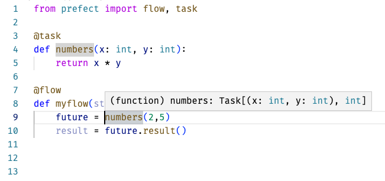
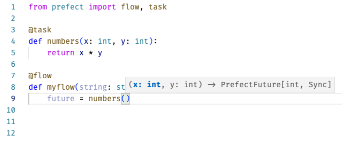

# Prefect Release Notes

## Release 2.4.2

### Fixes
- Remove types in blocks docstring attributes to avoid annotation parsing warnings — https://github.com/PrefectHQ/prefect/pull/6937
- Fixes `inject_client` in scenarios where the `client` kwarg is passed `None` — https://github.com/PrefectHQ/prefect/pull/6942

### Contributors
* @john-jam made their first contribution in https://github.com/PrefectHQ/prefect/pull/6937

## Release 2.4.1

### Enhancements
- Add TTL to `KubernetesJob` for automated cleanup of finished jobs — https://github.com/PrefectHQ/prefect/pull/6785
- Add `prefect kubernetes manifest agent` to generate an agent Kubernetes manifest — https://github.com/PrefectHQ/prefect/pull/6771
- Add `prefect block type delete` to delete block types — https://github.com/PrefectHQ/prefect/pull/6849
- Add dynamic titles to tabs in UI — https://github.com/PrefectHQ/prefect/pull/6914
- Hide secret tails by default — https://github.com/PrefectHQ/prefect/pull/6846
- Add runs tab to show flow runs on the flow, deployment, and work-queue pages in the UI — https://github.com/PrefectHQ/prefect/pull/6721
- Add toggle to disable block registration on application start — https://github.com/PrefectHQ/prefect/pull/6858
- Use injected client during block registration, save, and load — https://github.com/PrefectHQ/prefect/pull/6857
- Refactor of `prefect.client` into `prefect.client.orion` and `prefect.client.cloud` — https://github.com/PrefectHQ/prefect/pull/6847
- Improve breadcrumbs on radar page in UI — https://github.com/PrefectHQ/prefect/pull/6757
- Reject redundant state transitions to prevent duplicate runs — https://github.com/PrefectHQ/prefect/pull/6852
- Update block auto-registration to use a cache to improve performance — https://github.com/PrefectHQ/prefect/pull/6841
- Add ability to define blocks from collections to be registered by default — https://github.com/PrefectHQ/prefect/pull/6890
- Update file systems interfaces to be sync compatible — https://github.com/PrefectHQ/prefect/pull/6511
- Add flow run URLs to notifications — https://github.com/PrefectHQ/prefect/pull/6798
- Add client retries on 503 responses — https://github.com/PrefectHQ/prefect/pull/6927
- Update injected client retrieval to use the flow and task run context client for reduced overhead — https://github.com/PrefectHQ/prefect/pull/6859
- Add Microsoft Teams notification block — https://github.com/PrefectHQ/prefect/pull/6920

### Fixes
- Fix `LocalFileSystem.get_directory` when from and to paths match — https://github.com/PrefectHQ/prefect/pull/6824
- Fix registration of block schema versions — https://github.com/PrefectHQ/prefect/pull/6803
- Update agent to capture infrastructure errors and fail the flow run instead of crashing — https://github.com/PrefectHQ/prefect/pull/6903
- Fix bug where `OrionClient.read_logs` filter was ignored — https://github.com/PrefectHQ/prefect/pull/6885

### Documentation
- Add GitHub and Docker deployment recipe — https://github.com/PrefectHQ/prefect/pull/6825
- Add parameter configuration examples — https://github.com/PrefectHQ/prefect/pull/6886

### Collections
- Add `prefect-firebolt` to collections catalog — https://github.com/PrefectHQ/prefect/pull/6917

### Helm Charts
- Major overhaul in how helm charts in `prefect-helm` are structured and how we version and release them — [2022.09.21 release](https://github.com/PrefectHQ/prefect-helm/releases/tag/2022.09.21)

### Contributors
- @jmg-duarte
- @taljaards
- @yashlad681
- @hallenmaia made their first contributions(!) in https://github.com/PrefectHQ/prefect/pull/6903, https://github.com/PrefectHQ/prefect/pull/6785, and https://github.com/PrefectHQ/prefect/pull/6771
- @dobbersc made their first contribution in https://github.com/PrefectHQ/prefect/pull/6870
- @jnovinger made their first contribution in https://github.com/PrefectHQ/prefect/pull/6916
- @mathijscarlu made their first contribution in https://github.com/PrefectHQ/prefect/pull/6885


## Release 2.4.0

### Exciting New Features 🎉
- Add `ECSTask` infrastructure block to run commands and flows on AWS ECS<br />
    See [the documentation](https://prefecthq.github.io/prefect-aws/ecs/) in the [prefect-aws collection](https://prefecthq.github.io/prefect-aws/) and usage notes in the [infrastructure guide](https://docs.prefect.io/concepts/infrastructure/#ecstask)

### Enhancements
- Update the deployments CLI to better support CI/CD use cases — https://github.com/PrefectHQ/prefect/pull/6697
- Improve database query performance by removing unnecessary SQL transactions — https://github.com/PrefectHQ/prefect/pull/6714
- Update blocks to dispatch instance creation using slugs — https://github.com/PrefectHQ/prefect/pull/6622
- Add flow run start times to flow run metadata in UI — https://github.com/PrefectHQ/prefect/pull/6743
- Update default infrastructure command to be set at runtime — https://github.com/PrefectHQ/prefect/pull/6610
- Allow environment variables to be "unset" in infrastructure blocks — https://github.com/PrefectHQ/prefect/pull/6650
- Add favicon switching feature for flow and task run pages — https://github.com/PrefectHQ/prefect/pull/6794
- Update `Deployment.infrastructure` to accept types outside of the core library i.e. custom infrastructure or from collections — https://github.com/PrefectHQ/prefect/pull/6674
- Update `deployment build --rrule` input to allow start date and timezones — https://github.com/PrefectHQ/prefect/pull/6761

### Fixes
- Update crash detection to ignore abort signals — https://github.com/PrefectHQ/prefect/pull/6730
- Protect against race condition with deployment schedules — https://github.com/PrefectHQ/prefect/pull/6673
- Fix saving of block fields with aliases — https://github.com/PrefectHQ/prefect/pull/6758
- Preserve task dependencies to futures passed as parameters in `.map` — https://github.com/PrefectHQ/prefect/pull/6701
- Update task run orchestration to include latest metadata in context — https://github.com/PrefectHQ/prefect/pull/6791

### Documentation
- Task runner documentation fixes and clarifications — https://github.com/PrefectHQ/prefect/pull/6733
- Add notes for Windows and Linux installation — https://github.com/PrefectHQ/prefect/pull/6750
- Add a catalog of implementation recipes — https://github.com/PrefectHQ/prefect/pull/6408
- Improve storage and file systems documentation — https://github.com/PrefectHQ/prefect/pull/6756
- Add CSS for badges — https://github.com/PrefectHQ/prefect/pull/6655

### Contributors
* @robalar made their first contribution in https://github.com/PrefectHQ/prefect/pull/6701
* @shraddhafalane made their first contribution in https://github.com/PrefectHQ/prefect/pull/6784

## 2.3.2

### Enhancements
* UI displays an error message when backend is unreachable - https://github.com/PrefectHQ/prefect/pull/6670

### Fixes
* Fix issue where parameters weren't updated when a deployment was re-applied by @lennertvandevelde in https://github.com/PrefectHQ/prefect/pull/6668
* Fix issues with stopping Orion on Windows machines - https://github.com/PrefectHQ/prefect/pull/6672
* Fix issue with GitHub storage running in non-empty directories - https://github.com/PrefectHQ/prefect/pull/6693
* Fix issue where some user-supplied values were ignored when creating new deployments - https://github.com/PrefectHQ/prefect/pull/6695

### Collections
* Added [prefect-fugue](https://fugue-project.github.io/prefect-fugue/) 

### Contributors
* @lennertvandevelde made their first contribution! — [https://github.com/PrefectHQ/prefect/pull/6668](https://github.com/PrefectHQ/prefect/pull/6668)

## 2.3.1

### Enhancements
* Add sync compatibility to `run` for all infrastructure types — https://github.com/PrefectHQ/prefect/pull/6654
* Update Docker container name collision log to `INFO` level for clarity — https://github.com/PrefectHQ/prefect/pull/6657
* Refactor block documents queries for speed ⚡️ — https://github.com/PrefectHQ/prefect/pull/6645
* Update block CLI to match standard styling — https://github.com/PrefectHQ/prefect/pull/6679

### Fixes
* Add `git` to the Prefect image — https://github.com/PrefectHQ/prefect/pull/6653
* Update Docker container runs to be robust to container removal — https://github.com/PrefectHQ/prefect/pull/6656
* Fix parsing of `PREFECT_TEST_MODE` in `PrefectBaseModel` — https://github.com/PrefectHQ/prefect/pull/6647
* Fix handling of `.prefectignore` paths on Windows — https://github.com/PrefectHQ/prefect/pull/6680

### Collections
* [prefect-juptyer](https://prefecthq.github.io/prefect-jupyter/)

### Contributors
* @mars-f made their first contribution — https://github.com/PrefectHQ/prefect/pull/6639
* @pdashk made their first contribution — https://github.com/PrefectHQ/prefect/pull/6640

## 2.3.0

### Exciting New Features 🎉

- Add support for deploying flows stored in Docker images — [#6574](https://github.com/PrefectHQ/prefect/pull/6574)
- Add support for deploying flows stored on GitHub — [#6598](https://github.com/PrefectHQ/prefect/pull/6598)
- Add file system block for reading directories from GitHub — [#6517](https://github.com/PrefectHQ/prefect/pull/6517)
- Add a context manager to disable the flow and task run loggers for testing — [#6575](https://github.com/PrefectHQ/prefect/pull/6575)
- Add task run pages to the UI — [#6570](https://github.com/PrefectHQ/prefect/pull/6570)

### Enhancements

- Add "cloud" to `prefect version` server type display — [#6523](https://github.com/PrefectHQ/prefect/pull/6523)
- Use the parent flow run client for child flow runs if available — [#6526](https://github.com/PrefectHQ/prefect/pull/6526)
- Add display of Prefect version when starting agent — [#6545](https://github.com/PrefectHQ/prefect/pull/6545)
- Add type hints to state predicates, e.g. `is_completed()` — [#6561](https://github.com/PrefectHQ/prefect/pull/6561)
- Add error when sync compatible methods are used incorrectly — [#6565](https://github.com/PrefectHQ/prefect/pull/6565)
- Improve performance of task run submission — [#6527](https://github.com/PrefectHQ/prefect/pull/6527)
- Improve performance of flow run serialization for `/flow_runs/filter` endpoint — [#6553](https://github.com/PrefectHQ/prefect/pull/6553)
- Add field to states with untrackable dependencies due to result types — [#6472](https://github.com/PrefectHQ/prefect/pull/6472)
- Update `Task.map` iterable detection to exclude strings and bytes — [#6582](https://github.com/PrefectHQ/prefect/pull/6582)
- Add a version attribute to the block schema model — [#6491](https://github.com/PrefectHQ/prefect/pull/6491)
- Add better error handling in the telemetry service — [#6124](https://github.com/PrefectHQ/prefect/pull/6124)
- Update the Docker entrypoint display for the Prefect image — [#655](https://github.com/PrefectHQ/prefect/pull/6552)
- Add a block creation link to `prefect block type ls` — [#6493](https://github.com/PrefectHQ/prefect/pull/6493)
- Allow customization of notifications of queued flow runs — [#6538](https://github.com/PrefectHQ/prefect/pull/6538)
- Avoid duplicate saves of storage blocks as anonymous blocks — [#6550](https://github.com/PrefectHQ/prefect/pull/6550)
- Remove save of agent default infrastructure blocks — [#6550](https://github.com/PrefectHQ/prefect/pull/6550)
- Add a `--skip-upload` flag to `prefect deployment build` — [#6560](https://github.com/PrefectHQ/prefect/pull/6560)
- Add a `--upload` flag to `prefect deployment apply` — [#6560](https://github.com/PrefectHQ/prefect/pull/6560)
- Add the ability to specify relative sub-paths when working with remote storage for deployments — [#6518](https://github.com/PrefectHQ/prefect/pull/6518)
- Prevent non-UUID slugs from raising errors on `/block_document` endpoints — [#6541](https://github.com/PrefectHQ/prefect/pull/6541)
- Improve Docker image tag parsing to support the full Moby specification — [#6564](https://github.com/PrefectHQ/prefect/pull/6564)
### Fixes

- Set uvicorn `--app-dir` when starting Orion to avoid module collisions — [#6547](https://github.com/PrefectHQ/prefect/pull/6547)
- Resolve issue with Python-based deployments having incorrect entrypoint paths — [#6554](https://github.com/PrefectHQ/prefect/pull/6554)
- Fix Docker image tag parsing when ports are included — [#6567](https://github.com/PrefectHQ/prefect/pull/6567)
- Update Kubernetes Job to use `args` instead of `command` to respect image entrypoints — [#6581](https://github.com/PrefectHQ/prefect/pull/6581)
    - Warning: If you are using a custom image with an entrypoint that does not allow passthrough of commands, flow runs will fail.
- Fix edge case in `sync_compatible` detection when using AnyIO task groups — [#6602](https://github.com/PrefectHQ/prefect/pull/6602)
- Add check for infrastructure and storage block capabilities during deployment build — [#6535](https://github.com/PrefectHQ/prefect/pull/6535)
- Fix issue where deprecated work queue pages showed multiple deprecation notices — [#6531](https://github.com/PrefectHQ/prefect/pull/6531)
- Fix path issues with `RemoteFileSystem` and Windows — [#6620](https://github.com/PrefectHQ/prefect/pull/6620)
- Fix a bug where `RemoteFileSystem.put_directory` did not respect `local_path` — [#6620](https://github.com/PrefectHQ/prefect/pull/6620)

### Documentation

- Add tutorials for creating and using storage and infrastructure blocks — [#6608](https://github.com/PrefectHQ/prefect/pull/6608)
- Update tutorial for running flows in Docker — [#6612](https://github.com/PrefectHQ/prefect/pull/6612)
- Add example of calling a task from a task — [#6501](https://github.com/PrefectHQ/prefect/pull/6501)
- Update database documentation for Postgres to clarify required plugins — [#6566](https://github.com/PrefectHQ/prefect/pull/6566)
- Add example of using `Task.map` in docstring — [#6579](https://github.com/PrefectHQ/prefect/pull/6579)
- Add details about flow run retention policies — [#6577](https://github.com/PrefectHQ/prefect/pull/6577)
- Fix flow parameter name docstring in deployments — [#6599](https://github.com/PrefectHQ/prefect/pull/6599)


### Contributors

Thanks to our external contributors!

- @darrida
- @jmg-duarte
- @MSSandroid

## 2.2.0

### Exciting New Features 🎉
* Added automatic detection of static arguments to `Task.map` in https://github.com/PrefectHQ/prefect/pull/6513

### Fixes
* Updated deployment flow run retry settings with runtime values in https://github.com/PrefectHQ/prefect/pull/6489
* Updated media queries for flow-run-filter in https://github.com/PrefectHQ/prefect/pull/6484
* Added `empirical_policy` to flow run update route in https://github.com/PrefectHQ/prefect/pull/6486
* Updated flow run policy retry settings to be nullable in https://github.com/PrefectHQ/prefect/pull/6488
* Disallowed extra attribute initialization on `Deployment` objects in https://github.com/PrefectHQ/prefect/pull/6505
* Updated `deployment build` to raise an informative error if two infrastructure configs are provided in https://github.com/PrefectHQ/prefect/pull/6504
* Fixed calling async subflows from sync parents in https://github.com/PrefectHQ/prefect/pull/6514

## 2.1.1

### Fixes

* Fixed log on abort when the flow run context is not available in https://github.com/PrefectHQ/prefect/pull/6402
* Fixed error message in `submit_run` in https://github.com/PrefectHQ/prefect/pull/6453
* Fixed error if default parameters are missing on a deployment flow run in https://github.com/PrefectHQ/prefect/pull/6465
* Added error message if `get_run_logger` receives context of unknown type in https://github.com/PrefectHQ/prefect/pull/6401

## 2.1.0

### Build Deployments in Python
The new, YAML-based deployment definition provides a simple, extensible foundation for our new deployment creation experience. Now, by popular demand, we're extending that experience to enable you to define deployments and build them from within Python. You can do so by defining a `Deployment` Python object, specifying the deployment options as properties of the object, then building and applying the object using methods of `Deployment`. See the [documentation](https://docs.prefect.io/concepts/deployments/) to learn more.

### Simplified Agents & Work Queues
Agents and work queues give you control over where and how flow runs are executed. Now, creating an agent (and corresponding work queue) is even easier. Work queues now operate strictly by name, not by matching tags. Deployments, and the flow runs they generate, are explicitly linked to a single work queue, and the work queue is automatically created whenever a deployment references it. This means you no longer need to manually create a new work queue each time you want to want to route a deployment's flow runs separately. Agents can now pull from multiple work queues, and also automatically generate work queues that don't already exist. The result of these improvements is that most users will not have to interact directly with work queues at all, but advanced users can take advantage of them for increased control over how work is distributed to agents. These changes are fully backwards compatible. See the [documentation](https://docs.prefect.io/concepts/work-queues/) to learn more.

### Improvements and bug fixes
* Added three new exceptions to improve errors when parameters are incorrectly supplied to flow runs in https://github.com/PrefectHQ/prefect/pull/6091
* Fixed a task dependency issue where unpacked values were not being correctly traced in https://github.com/PrefectHQ/prefect/pull/6348
* Added the ability to embed `BaseModel` subclasses as fields within blocks, resolving an issue with the ImagePullPolicy field on the KubernetesJob block in https://github.com/PrefectHQ/prefect/pull/6389
* Added comments support for deployment.yaml to enable inline help in https://github.com/PrefectHQ/prefect/pull/6339
* Added support for specifying three schedule types - cron, interval and rrule - to the `deployment build` CLI in https://github.com/PrefectHQ/prefect/pull/6387
* Added error handling for exceptions raised during the pre-transition hook fired by an OrchestrationRule during state transitions in https://github.com/PrefectHQ/prefect/pull/6315
* Updated `visit_collection` to be a synchronous function in https://github.com/PrefectHQ/prefect/pull/6371
* Revised loop service method names for clarity in https://github.com/PrefectHQ/prefect/pull/6131
* Modified deployments to load flows in a worker thread in https://github.com/PrefectHQ/prefect/pull/6340
* Resolved issues with capture of user-raised timeouts in https://github.com/PrefectHQ/prefect/pull/6357
* Added base class and async compatibility to DockerRegistry in https://github.com/PrefectHQ/prefect/pull/6328
* Added `max_depth` to `visit_collection`, allowing recursion to be limited in https://github.com/PrefectHQ/prefect/pull/6367
* Added CLI commands for inspecting and deleting Blocks and Block Types in https://github.com/PrefectHQ/prefect/pull/6422
* Added a Server Message Block (SMB) file system block in https://github.com/PrefectHQ/prefect/pull/6344 - Special thanks to @darrida for this contribution!
* Removed explicit type validation from some API routes in https://github.com/PrefectHQ/prefect/pull/6448
* Improved robustness of streaming output from subprocesses in https://github.com/PrefectHQ/prefect/pull/6445
* Added a default work queue ("default") when creating new deployments from the Python client or CLI in https://github.com/PrefectHQ/prefect/pull/6458

### New Collections
- [prefect-monday](https://prefecthq.github.io/prefect-monday/)
- [prefect-databricks](https://prefecthq.github.io/prefect-databricks/)
- [prefect-fugue](https://github.com/fugue-project/prefect-fugue/)

**Full Changelog**: https://github.com/PrefectHQ/prefect/compare/2.0.4...2.1.0

## 2.0.4

### Simplified deployments
The deployment experience has been refined to remove extraneous artifacts and make configuration even easier. In particular:

-   `prefect deployment build` no longer generates a  `manifest.json` file. Instead, all of the relevant information is written to the `deployment.yaml` file.
- Values in the `deployment.yaml` file are more atomic and explicit
-   Local file system blocks are no longer saved automatically
-   Infrastructure block values can now be overwritten with the new `infra_overrides` field

### Start custom flow runs from the UI
Now, from the deployment page, in addition to triggering an immediate flow run with default parameter arguments, you can also create a custom run. A custom run enables you to configure the run's parameter arguments, start time, name, and more, all while otherwise using the same deployment configuration. The deployment itself will be unchanged and continue to generate runs on its regular schedule.

### Improvements and bug fixes
- Made timeout errors messages on state changes more intuitive
- Added debug level logs for task run rehydration
- Added basic CLI functionality to inspect Blocks; more to come
- Added support for filtering on state name to `prefect flow-run ls`
- Refined autogenerated database migration output

## 2.0.3

This release contains a number of bug fixes and documentation improvements.

### Introducing [`prefect-dbt`](https://prefecthq.github.io/prefect-dbt/)

We've released `prefect-dbt` - a collection of Prefect integrations for working with dbt in your Prefect flows. This collection has been built as part of a partnership with dbt Labs to ensure that it follows best practices for working with dbt.

### Improvements and bug fixes
- Azure storage blocks can use `.prefectignore`
- Resolved bugs and improved interface in the Orion client.
- Resolved a bug in Azure storage blocks that would cause uploads to get stuck.
- Resolved a bug where calling a flow in a separate thread would raise an exception.
- Resolved issues with loading flows from a deployment.
- Corrected some erroneous type annotations.
- Better handling of database errors during state transition validation.
- Better sanitization of labels for Kubernetes Jobs.
- Fixes `--manifest-only` flag of `prefect deployment build` command to ensure that using this flag, the manifest gets generated, but the upload to a storage location is skipped.
- Added support for multiple YAML deployment paths to the `prefect deployment apply` command.


## 2.0.2

This release implements a number of improvements and bug fixes in response to continued engagement by members of our community. Thanks, as always, to all who submitted ideas on how to make Prefect 2 even better.

### Introducing .prefectignore files
 .prefectignore files allow users to omit certain files or directories from their deployments. Similar to other .ignore files, the syntax supports pattern matching, so an entry of `*.pyc` will ensure *all* .pyc files are ignored by the deployment call when uploading to remote storage. Prefect provides a default .prefectignore file, but users can customize it to their needs.

### Improvements and bug fixes
- Users can now leverage Azure storage blocks.
- Users can now submit bug reports and feature enhancements using our issue templates.
- Block deletion is now more performant.
- Inconsistencies in UI button copy have been removed.
- Error messaging is clearer in the `deployment build` CLI command.
- Resolved timeout errors that occurred when using async task functions inside synchronous flows.

## 2.0.1

The response to Prefect 2 has been overwhelming in the best way possible. Thank you to the many community members who tried it out and gave us feedback! Thanks in particular to the students at this week's Prefect Associate Certification Course (PACC) in San Jose for their thoughtful recommendations. This release is a compilation of enhancements and fixes that make for a more resilient, performant, and refined Prefect experience.

### Improvements and bug fixes
- Schedules set via the API or UI are now preserved when building deployments from the CLI
- JSON types are now coerced to none, following Javascript convention and supporting standards compatibility
- The `prefect deployment execute` command has been removed to avoid confusion between running a flow locally from a Python script and running it by an agent using `prefect deployment run`
- This repository now includes templates for pull requests and issues to make bug reports and community contributions easier
- The `scheduler` and `flow-run-notifications` LoopServices have been made more resilient
- Log inserts have been made more performant through smaller log batches
- Local file system blocks created from the UI now point to the right `base_path`
- Support for unmapped values to Task.map has been added as requested by Club42 members
- The `deployment build` command now supports an optional output flag to customize the name of the deployment.yaml file, to better support projects with multiple flows

## 2.0.0

We're thrilled to announce that, with this release, Prefect 2.0 has exited its public beta! Hopefully, this release comes as no surprise. It is the culmination of nearly a year of building in public and incorporating your feedback. Prefect 2.0 is now the default version of the open source `prefect` framework provided [upon installation](https://docs.prefect.io/getting-started/installation/). We will continue enhancing Prefect 2.0 rapidly, but future breaking changes will be less frequent and more notice will be provided.

Prefect 2.0 documentation is now hosted at [docs.prefect.io](https://docs.prefect.io). Prefect 1.0 documentation is now hosted at [docs-v1.prefect.io](https://docs-v1.prefect.io).

### Upgrading from Prefect 1.0
Flows written with Prefect 1.0 will require modifications to run with Prefect 2.0. If you're using Prefect 1.0, please see our [guidance on Discourse for explicitly pinning your Prefect version in your package manager and Docker](https://discourse.prefect.io/t/the-general-availability-release-of-prefect-2-0-going-live-on-wednesday-27th-of-july-may-break-your-flows-unless-you-take-action-as-soon-as-possible/1227), so that you can make the transition to Prefect 2.0 when the time is right for you. See our [migration page](https://upgrade.prefect.io/) to learn more about upgrading.

### Upgrading from earlier versions of Prefect 2.0
We have shipped a lot of breaking changes to Prefect 2.0 over the past week. Most importantly, **recent changes to deployments required that schedules for all previously created deployments be turned off**. You can learn more about the changes via the [deployments concept documentation](https://docs.prefect.io/concepts/deployments/), the [tutorial](https://docs.prefect.io/tutorials/deployments/), or the [discourse guide](https://discourse.prefect.io/t/deployments-are-now-simpler-and-declarative/1255).

## 2.0b16

### Simplified, declarative deployments
Prefect 2.0's deployments are a powerful way to encapsulate a flow, its required infrastructure, its schedule, its parameters, and more. Now, you can create deployments simply, with just two commands:
1. `prefect deployment build ./path/to/flow/file.py:name_of_flow_obj --name "Deployment Name"` produces two files:
     - A manifest file, containing workflow-specific information such as the code location, the name of the entrypoint flow, and flow parameters
     - A `deployment.yaml` file - a complete specification of the metadata and configuration for the deployment such as the name, tags, and description
3. `prefect deployment apply ./deployment.yaml` creates or updates a deployment with the Orion server

Once the deployment is created with the Orion server, it can now be edited via the UI! See the [Deployments documentation to learn more](https://orion-docs.prefect.io/concepts/deployments/).

### Improvements and bug fixes
- The [Dask and Ray tutorials](https://orion-docs.prefect.io/tutorials/dask-ray-task-runners/) have been updated to reflect recent changes
- The [Blocks concept doc](https://orion-docs.prefect.io/concepts/blocks/) has been updated to reflect recent enhancements and includes additional examples
- The [Storage concept doc](https://orion-docs.prefect.io/concepts/storage/) has been updated to reflect recent enhancements
- All IntervalSchedules now require both an anchor date and a timezone
- The new S3 file system block enables you to read and write data as a file on Amazon S3
- The new GCS file system block allows you to read and write data as a file on Google Cloud Storage

## 2.0b15

### Uniquely refer to blocks with slugs
Blocks are a convenient way to secure store and retrieve configuration. Now, retrieving configuration stored with blocks is even easier with slugs, both human and machine readable unique identifiers. By default, block type slugs are a lowercase, dash delimited version of the block type name, but can be customized via the `_block_type_slug` field on a custom Block subclass. Block document slugs are a concatenation of [block-type-slug]/[block-document-name] and can be used as an argument to the `Block.load` method. Slugs and block document names may only include alphanumeric characters and dashes.

**Warning**: This breaking change makes this release incompatible with previous versions of the Orion server and Prefect Cloud 2.0

### Other improvements and bug fixes

## 2.0b14

### Retreive the state of your tasks or flows with the `return_state` kwarg
Beginning with 2.0b9, Prefect 2.0 began returning function results, instead of Prefect futures and states, by default. States are still an important concept in Prefect 2. They can be used to dictate and understand the behavior of your flows. Now, you can access the state for _any_ task or flow with the new `return_state` kwarg. Just set `return_state=True` in you flow or task call and you can access its state with the `.result()` method, even if it's been submitted to a task runner.

### `prefect cloud` commands are easier to use
The `prefect cloud login` command no longer overwrites your current profile with a new API URL and auth key. Instead, the command will prompt you to create a new profile when logging into Prefect Cloud 2.0. Subsequent calls to prefect cloud login using the same key will simply "log in" to prefect cloud by switching to the profile associated with that authentication key.

The new `prefect cloud workspace ls` command lists availible workspaces.

### Other improvements and bug fixes
- The anchor datetime (aka start datetime) for all newly created interval schedules will be the current date & time
- The `prefect orion start` command now handles keyboard interrupts
- CLI performance has been sped up 30-40% through improved import handling
- UI screenschots have been updated throughout the documentation
- Broken links don't feel as bad with our slick new 404 page

## 2.0b13

### Improvements and bug fixes
- RRule schedule strings are now validated on initialization to confirm that the provided RRule strings are valid
- Concepts docs have been updated for clarity and consistency
- `IntervalSchedule`'s now coerce naive datetimes to timezone-aware datetimes, so that interval schedules created with timezone-unaware datetimes will work

## 2.0b12

### Work queue pages now display upcoming runs
A new "Upcoming runs" tab has been added to the work queue page, enabling you to see all of the runs that are eligible for that work queue before they are picked up by an agent.

### Other improvements and bug fixes
- You can now set a concurrency limit when creating a work queue via the CLI
- In order to avoid unwittingly breaking references to shared blocks, block names are no longer editable
- Getting started documentation has been updated and edited for clarity
- Blocks API documentation has been updated to include system, kubernetes, and notifications block modules

## 2.0b11

This release builds upon the collection of small enhancements made in the previous release.

### Default storage has been removed
For convenience, earlier versions of Prefect 2.0 allowed for a global storage setting. With forthcoming enhancements to blocks, this will no longer be necessary.

### Other improvements and bug fixes
- We have published a [guide for migrating workflows from Prefect 1.0 (and lower) to Prefect 2.0](https://orion-docs.prefect.io/migration_guide/)
- The Flow run page now has a clearer empty state that is more consistent with other pages
- Tutorial documentation has been further updated to reflect new result behavior
- Tasks and flows now run in interruptible threads when timeouts are used
- Parameter validation no longer fails on unsupported types
- The UI now returns you to the blocks overview after deleting a block
- Flow run logs have been updated to improve user visibility into task runner usage
- Concurrency limits of 0 are now respected on work queues

## 2.0b10

This release is the first of a series of smaller releases to be released daily.

### Improvements and bug fixes
- The Blocks selection page now includes more complete and consistent metadata about each block type, including block icons, descriptions, and examples
- We've added a new [CLI style guide](https://github.com/PrefectHQ/prefect/blob/orion/docs/contributing/style.md#command-line-interface-cli-output-messages) for contributors
- Work queues no longer filter on flow runner types, this capability will instead be achieved through tags
- Tutorial documentation has been updated to reflect new result behavior

## 2.0b9

Big things are in the works for Prefect 2! This release includes breaking changes and deprecations in preparation for Prefect 2 graduating from its beta period to General Availability.

**With next week's release on July 27th, Prefect 2 will become the default package installed with `pip install prefect`. Flows written with Prefect 1 will require modifications to run with Prefect 2**. Please ensure that your package management process enables you to make the transition when the time is right for you.

### Code as workflows
As Prefect 2 usage has grown, we've observed a pattern among users, especially folks that were not previously users of Prefect 1. Working with Prefect was so much like working in native Python, users were often surprised that their tasks returned futures and states, Prefect objects, rather than results, the data that their Python functions were handling. This led to unfamiliar, potentially intimidating, errors in some cases. With this release, Prefect moves one step closer to code as workflows - tasks now return the results of their functions, rather than their states, by default. This means that you can truly take most native Python scripts, add the relevant @flow and @task decorators, and start running that script as a flow, benefitting from the observability and resilience that Prefect provides.

States and futures are still important concepts in dictating and understanding the behavior of flows. You will still be able to easily access and use them with the `.submit()` method. You will need to modify tasks in existing Prefect 2 flows to use this method to continue working as before.

### Other improvements and bug fixes
- A new `Secret` block can store a string that is encrypted at rest as well as obfuscated in logs and the UI
- Date filters on the flow run page in the UI now support filtering by date _and_ time
- Each work queue page in the UI now includes a command to start a corresponding agent
- Tutorials have been updated for increased clarity and consistency
- Cron schedule setting errors are now more informative
- Prefect now still works even if the active profile is missing
- Conda requirements regex now supports underscores and dots
- The previously deprecated `DeploymentSpec` has been removed

## 2.0b8

This is our biggest release yet! It's full of exciting new features and refinements to existing concepts. Some of these features are the result of careful planning and execution over the past few months, while others are responses to your feedback, unplanned but carefully considered. None would be possible without your continued support. Take it for a spin and let us know what you think!

This release removes the deprecated `DaskTaskRunner` and `RayTaskRunner` from the core library, breaking existing references to them. You can find them in their respective collections [prefect-ray](https://prefecthq.github.io/prefect-ray/) and [prefect-dask](https://prefecthq.github.io/prefect-dask). It also removes the previously deprecated restart policy for the `KubernetesFlowRunnner`. Most importantly, there are new **breaking changes** to the Deployments interface described below.

### Flow Run Retries
Flow run retries have been one of our most requested features, especially given how easy it is to run a flow as a "subflow" or "child flow" with Prefect 2.0. Flow run retries are configured just as task retries are - with the `retries` and `retry_delay_seconds` parameters.

If both a task and its flow have retries configured, tasks within the flow will retry up to their specified task retry limit for each flow run. For example, if you have a **flow** configured with a limit of 2 retries (up to 3 total runs, including the initial attempt), and a **task** in the flow configured with 3 retries (up to 4 attempts per flow run, including the initial attempt). The task could run up to a total of 12 attempts, since task retry limits are reset after each flow run or flow run attempt.

### Notifications
At any time, you can visit the Prefect UI to get a comprehensive view of the state of all of your flows, but when something goes wrong with one of them, you need that information immediately. Prefect 2.0’s new notifications can alert you and your team when any flow enters any state you specify, with or without specific tags.

To create a notification, go to the new Notifications page via the sidebar navigation and select “Create Notification.” Notifications are structured just as you would describe them to someone. For example, if I want to get a Slack message every time my daily-ETL flow fails, my notification will simply read:

> If a run of any flow with **any** tag enters a **failed** state, send a notification to **my-slack-webhook**

When the conditions of the notification are triggered, you’ll receive a simple message:

> The **fuzzy-leopard** run of the **daily-etl** flow entered a **failed** state at **yy-MM-dd HH:mm:ss TMZ**.

Currently, notifications can only be sent to a [Slack webhook](https://api.slack.com/messaging/webhooks) (or email addresses if you are using [Prefect Cloud 2.0](https://app.prefect.cloud)). Over time, notifications will support additional messaging services. Let us know which messaging services you’d like to send your notifications to!

### Flow packaging and deployment
We've revisited our flow packaging and deployment UX, making it both more powerful and easier to use. `DeploymentSpec`s are now just `Deployment`s. Most of the fields are unchanged, but there are a few differences:
- The `flow_storage` field has been replaced with a `packager` field.
- The `flow_location`, `flow_name`, and `flow` parameters are now just `flow`.

We now support customization of the deployment of your flow. Previously, we just uploaded the source code of the flow to a file. Now, we've designed a packaging systems which allows you to control how and where your flow is deployed. We're including three packagers in this release:

- `OrionPackager`: Serializes the flow and stores it in the Orion database, allowing you to get started without setting up remote storage.
- `FilePackager`: Serializes the flow and stores it in a file. The core library supports local and remote filesystems. Additional remote file systems will be available in collections.
- `DockerPackager`: Copies the flow into a new Docker image. You can take full control of the Docker image build or use Prefect to detect your current Python dependencies and install them in the image.

For packagers that support it, three serializers are available as well:

- `ImportSerializer`: Serializes to the import path of the flow. The flow will need to be importable at runtime.
- `SourceSerializer`: Serializes to the source code of the flow's module.
- `PickleSerializer`: Serializes the flow using cloudpickle with support for serialization full modules.

Learn more in the [Deployment concept documentation](https://docs.prefect.io/concepts/deployments/).

You can continue to use your existing `DeploymentSpec`s, but they are deprecated and will be removed in the coming weeks.

### Blocks
We've been working on Blocks behind the scenes for a while. Whether you know it or not, if you've used the past few releases, you've used them. Blocks enable you to securely store configuration with the Prefect Orion server and access it from your code later with just a simple reference. Think of Blocks as secure, UI-editable, type-checked environment variables. We're starting with just a few Blocks - mostly storage, but over time we’ll expand this pattern to include every tool and service in the growing modern data stack. You'll be able to set up access to your entire stack once in just a few minutes, then manage access forever without editing your code. In particular, we've made the following enhancements:
- Block document values can now be updated via the Python client with the `overwrite` flag.
- Blocks now support secret fields. By default, fields identified as secret will be obfuscated when returned to the Prefect UI. The actual values can still be retrieved as necessary.
-  `BlockSchema` objects have a new `secret_fields: List[str]` item in their schema's extra fields. This is a list of all fields that should be considered "secret". It also includes any secret fields from nested blocks referenced by the schema.
- You can now browse your Blocks on the new "Blocks" page, create, and edit them right in the UI.

### Other Improvements
- Task keys, previously a concatenation of several pieces of metadata, are now only the qualified function name. While it is likely to be globally unique, the key can be used to easily identify every instance in which a function of the same name is utilized.
- Tasks now have a `version` that you can set via the task decorator, like the flow version identifier on flow runs.
- An Orion setting, `PREFECT_ORION_DATABASE_PASSWORD`, has been added to allow templating in the database connection URL
- A link to API reference documentation has been added to the Orion startup message.
- Where possible, Prefect 2.0 now exits processes earlier for synchronous flow or task runs that are cancelled. This reduces the range of conditions under which a task run would be marked failed, but continue to run.
- All Prefect client models now allow extras, while the API continues to forbid them, such that older Prefect 2.0 clients can receive and load objects from the API that have additional fields, facilitating backwards compatibility.
- The _all_ attribute has been added to __init__.py for all public modules, declaring the public API for export.
- A new endpoint, `/deployments/{id}/work_queue_check`, enables you to to check which work queues the scheduled runs of a deployment will be eligible for.


### Bug fixes
- Attempting to create a schedule with a cron string that includes a "random" or "hashed" expression will now return an error.

### Contributors
- [Cole Murray](https://github.com/ColeMurray)
- [Oliver Mannion](https://github.com/tekumara)
- [Steve Flitcroft](https://github.com/redsquare)
- [Laerte Pereira](https://github.com/Laerte)

## 2.0b7

This release includes a number of important improvements and bug fixes in response to continued feedback from the community. Note that this release makes a **breaking change** to the Blocks API, making the `2.0b7` Orion server incompatible with previous Orion client versions.```

### Improvements
- Added the color select to the Orion UI in OSS (enabling users to change their state color scheme) for the UI.
- Added anonymous blocks, allowing Prefect to dynamically store blocks for you without cluttering your workspace.
- Performance improvements to the service that marks flows runs as late.
- Added the ability for flow names to include underscores for use in DeploymentSpecs.
- Split [Ray](https://prefecthq.github.io/prefect-ray/) and [Dask](https://prefecthq.github.io/prefect-dask/) task runners into their own collections.
- Removed delays to agent shutdown on keyboard interrupt.
- Added informative messaging when an agent is reading from a paused work queue.
- Improved task naming conventions for tasks defined using lambda functions

### Documentation improvements
- Updated screenshots and description of workflows to reflect new UI
- Revised and extended Prefect Cloud quickstart tutorial
- Added deployments page
- Added documentation for `prefect cloud workspace set` command

### Collections
- [prefect-sqlalchemy](https://prefecthq.github.io/prefect-sqlalchemy/)
- [prefect-dask](https://prefecthq.github.io/prefect-dask/)
- [prefect-ray](https://prefecthq.github.io/prefect-ray/)
- [prefect-snowflake](https://prefecthq.github.io/prefect-snowflake/)
- [prefect-openmetadata](https://prefecthq.github.io/prefect-openmetadata/)
- [prefect-airbyte](https://prefecthq.github.io/prefect-airbyte/)

Note that the Dask and Ray task runners have been moved out of the Prefect core library to reduce the number of dependencies we require for most use cases. Install from the command line with `pip install prefect-dask` and import with `from prefect_dask.task_runners import DaskTaskRunner`.

### Bug fixes
- [Allow Orion UI to run on Windows](https://github.com/PrefectHQ/prefect/pull/5802)
- Fixed a bug in terminal state data handling that caused timeouts
- Disabled flow execution during deployment creation to prevent accidental execution.
- Fixed a bug where Pydantic models being passed to Prefect tasks would drop extra keys and private attributes.
- Fixed a bug where the `KubernetesFlowRunner` was not serializable.

## 2.0b6

We're so grateful for the fountain of feedback we've received about Prefect 2. One of the themes in feedback was that Prefect 2's UI didn't reflect the same clarity and elegance that the rest of Prefect 2 did. We agreed! Today, we've proud to share Prefect 2's completely redesigned UI. It's simpler, faster, and easier to use. Give it a spin!

This release includes several other exciting changes, including:

- **Windows** support
- A new CLI command to delete flow runs: `prefect flow-run delete`
- Improved API error messages
- Support for type-checking with VS Code and other editors that look for a `py.typed` file

Here's a preview of the type hints that you'll start seeing now in editors like VS Code:





Note that this release makes a **breaking change** to the Blocks API, making the `2.0b6` Orion server incompatible with previous Orion client versions. You may not be familiar with Blocks, but it's likely that you have already used one in the `flow_storage` part of your `DeploymentSpec`. This change is foundational for powerful new features we're working on for upcoming releases. Blocks will make all sorts of exciting new use cases possible.

After the upgrade your data will remain intact, but you will need to upgrade to `2.0b6` to continue using the Cloud 2.0 API. You can upgrade in just a few simple steps:

-   Install the latest Prefect 2.0 python package: `pip install -U "prefect>=2.0b6"`
-   Restart any existing agent processes
	- If you are using an agent running on Kubernetes, update the Prefect image version to `2.0b6` in your Kubernetes manifest and re-apply the deployment.
	- You don't need to recreate any deployments or pause any schedules - stopping your agent process to perform an upgrade may result in some Late Runs, but those will be picked up once you restart your agent.

## 2.0b5

This release includes some small improvements that we want to deliver immediately instead of bundling them with the next big release.

The `prefect.testing` module is now correctly included in the package on PyPI.

The Prefect UI no longer uses a hard-coded API URL pointing at `localhost`. Instead, the URL is pulled from the `PREFECT_ORION_UI_API_URL` setting. This setting defaults to `PREFECT_API_URL` if set. Otherwise, the default URL is generated from `PREFECT_ORION_API_HOST` and `PREFECT_ORION_API_PORT`. If providing a custom value, the aforementioned settings may be templated into the given string.

## 2.0b4

We're really busy over here at Prefect! We've been getting great feedback from early adopters. There's a lot of work going on behind the scenes as we work on building some exciting new features that will be exclusive to Prefect 2.0, but we want to keep the enhancements flowing to you. In that spirit, there are a lot of quality-of-life improvements here!

While most of the development of Prefect 2.0 is still happening internally, we're incredibly excited to be getting contributions in our open source repository. Big shoutout to our contributors for this last release:

- @dannysepler
- @ColeMurray
- @albarrentine
- @mkarbo
- @AlessandroLollo


### Flow and task runners

- Flow runners now pass all altered settings to their jobs instead of just the API key and URL
- The Kubernetes flow runner supports configuration of a service account name
- The subprocess flow runner streams output by default to match the other flow runners
- The Dask task runner has improved display of task keys in the Dask dashboard
- The Dask task runner now submits the execution graph to Dask allowing optimization by the Dask scheduler

Note that the Dask and Ray task runners will be moving out of the core Prefect library into dedicated `prefect-ray` and `prefect-dask` collections with the next release. This will reduce the number of dependencies we require for most use cases. Since we now have concurrent execution built in to the core library, these packages do not need to be bundled with Prefect. We're looking forward to building additional tasks and flows specific to Ray and Dask in their respective collections.

### Collections

Speaking of collections, we've received our first [user-contributed collection](https://github.com/AlessandroLollo/prefect-cubejs). It includes tasks for [Cube.js](https://cube.dev/), check it out!

The following collections have also been recently released:

- [`prefect-great-expectations`](https://github.com/PrefectHQ/prefect-great-expectations)
- [`prefect-twitter`](https://github.com/PrefectHQ/prefect-twitter)
- [`prefect-github`](https://github.com/PrefectHQ/prefect-github)

You can see a list of all available collections in the [Prefect Collections Catalog](https://docs.prefect.io/collections/catalog/).

### Windows compatibility

We've excited to announce that we've begun work on Windows compatibility. Our full test suite isn't passing yet, but we have core features working on Windows. We expect the majority of the edge cases to be addressed in an upcoming release.

### Documentation improvements

We've added some new documentation and made lots of improvements to existing documentation and tutorials:

- Added documentation for associating conda environments with separate Prefect profiles
- Added storage steps and advanced examples to the Deployments tutorial
- Expanded documentation of storage options
- Added workspace details to the Prefect Cloud documentation
- Improved schedules documentation with examples
- Revised the Kubernetes tutorial to include work queue setup
- Improved tutorial examples of task caching

### CLI

- Deployments can be deleted from the CLI
- The CLI displays help by default
- `prefect version` is robust to server connection errors
- `prefect config view` shows sources by default
- `prefect deployment create` exits with a non-zero exit code if one of the deployments fails to be created
- `prefect config set` allows setting values that contain equal signs
- `prefect config set` validates setting types before saving them
- `prefect profile inpect` displays settings in a profile instead of duplicating prefect config view behavior
- `prefect storage create` trims long descriptions

### Bug squashing

We've eradicated some bugs, replacing them with good behavior:

- Flow runs are now robust to log worker failure
- Deployment creation is now robust to `ObjectAlreadyExists` errors
- Futures from async tasks in sync flows are now marked as synchronous
- Tildes (~) in user-provided paths for `PREFECT_HOME` are expanded
- Fixed parsing of deployments defined in YAML
- Deployment deletion cleans up scheduled runs

### Optimizations and refactors

You might not see these fixes in your day-to-day, but we're dedicated to improving performance and maintaining our reputation as maintainers of an approachable and clean project.

- The `state_name` is attached to run models for improved query performance
- Lifespan management for the ephemeral Orion application is now robust to deadlocks
- The `hello` route has moved out of the `admin` namespace so it is available on Prefect Cloud
- Improved readability and performance of profile management code
- Improved lower-bounds dependency parsing
- Tests are better isolated and will not run against a remote API
- Improved representation of Prefect `Setting` objects
- Added extensive tests for `prefect config` and `prefect profile` commands
- Moved testing utilities and fixtures to the core library for consumption by collections

## 2.0b3

### Improvements

- Improved filter expression display and syntax in the UI.
- Flow runs can be queried more flexibly and performantly.
- Improved results persistence handling.
- Adds code examples to schedules documentation.
- Added a unit testing utility, `prefect_test_harness`.
- Various documentation updates.

### Bug fixes

- The Scheduler no longer crashes on misconfigured schedules.
- The MarkLateRuns service no longer marks runs as `Late` several seconds too early.
- Dashboard filters including flow/task run states can now be saved.
- Flow runs can no longer transition from terminal states. The engine will no longer try to set the final state of a flow run twice.
- Scheduled flow runs are now deleted when their corresponding deployment is deleted.
- Work queues created in the UI now work the same as those created with the CLI.
- Kubernetes flow runners now correctly inject credentials into the execution environment.
- Work queues created via the UI now function correctly.

## 2.0b2


### Improvements

- Docker flow runners can connect to local API applications on Linux without binding to `0.0.0.0`.
- Adds `with_options` method to flows allowing override of settings e.g. the task runner.

### Bug fixes

- The CLI no longer displays tracebacks on sucessful exit.
- Returning pandas objects from tasks does not error.
- Flows are listed correctly in the UI dashboard.

## 2.0b1

We are excited to introduce this branch as [Prefect 2.0](https://www.prefect.io/blog/introducing-prefect-2-0/), powered by [Orion, our second-generation orchestration engine](https://www.prefect.io/blog/announcing-prefect-orion/)! We will continue to develop Prefect 2.0 on this branch. Both the Orion engine and Prefect 2.0 as a whole will remain under active development in beta for the next several months, with a number of major features yet to come.

This is the first release that's compatible with Prefect Cloud 2.0's beta API - more exciting news to come on that soon!

### Expanded UI
Through our technical preview phase, our focus has been on establishing the right [concepts](https://docs.prefect.io/concepts/overview/) and making them accessible through the CLI and API. Now that some of those concepts have matured, we've made them more accessible and tangible through UI representations. This release adds some very important concepts to the UI:

**Flows and deployments**

If you've ever created a deployment without a schedule, you know it can be difficult to find that deployment in the UI. This release gives flows and their deployments a dedicated home on the growing left sidebar navigation. The dashboard continues to be the primary interface for exploring flow runs and their task runs.

**Work queues**

With the [2.0a13 release](https://github.com/PrefectHQ/prefect/blob/orion/RELEASE-NOTES.md#work-queues), we introduced [work queues](https://docs.prefect.io/concepts/work-queues/), which could only be created through the CLI. Now, you can create and edit work queues directly from the UI, then copy, paste, and run a command that starts an agent that pulls work from that queue.

### Collections
Prefect Collections are groupings of pre-built tasks and flows used to quickly build data flows with Prefect.

Collections are grouped around the services with which they interact. For example, to download data from an S3 bucket, you could use the `s3_download` task from the [prefect-aws collection](https://github.com/PrefectHQ/prefect-aws), or if you want to send a Slack message as part of your flow you could use the `send_message` task from the [prefect-slack collection](https://github.com/PrefectHQ/prefect-slack).

By using Prefect Collections, you can reduce the amount of boilerplate code that you need to write for interacting with common services, and focus on the outcome you're seeking to achieve. Learn more about them in [the docs](https://docs.prefect.io/collections/overview.md).

### Profile switching

We've added the `prefect profile use <name>` command to allow you to easily switch your active profile.

The format for the profiles file has changed to support this. Existing profiles will not work unless their keys are updated.

For example, the profile "foo" must be changed to "profiles.foo" in the file `profiles.toml`:

```toml
[foo]
SETTING = "VALUE"
```

to

```toml
[profiles.foo]
SETTING = "VALUE"
```

### Other enhancements
- It's now much easier to explore Prefect 2.0's major entities, including flows, deployments, flow runs, etc. through the CLI with the `ls` command, which produces consistent, beautifully stylized tables for each entity.
- Improved error handling for issues that the client commonly encounters, such as network errors, slow API requests, etc.
- The UI has been polished throughout to be sleeker, faster, and even more intuitive.
- We've made it even easier to access file storage through [fsspec](https://filesystem-spec.readthedocs.io/en/latest/index.html), which includes [many useful built in implementations](https://filesystem-spec.readthedocs.io/en/latest/api.html#built-in-implementations).

## 2.0a13

We've got some exciting changes to cover in our biggest release yet!

### Work queues

Work queues aggregate work to be done and agents poll a specific work queue for new work. Previously, agents would poll for any scheduled flow run. Now, scheduled flow runs are added to work queues that can filter flow runs by tags, deployment, and flow runner type.

Work queues enable some exiting new features:

- Filtering: Each work queue can target a specific subset of work. This filtering can be adjusted without restarting your agent.
- Concurrency limits: Each work queue can limit the number of flows that run at the same time.
- Pausing: Each work queue can be paused independently. This prevents agents from submitting additional work.

Check out the [work queue documentation](https://docs.prefect.io/concepts/work-queues/) for more details.

Note, `prefect agent start` now requires you to pass a work queue identifier and `prefect orion start` no longer starts an agent by default.

### Remote storage

Prior to this release, the Orion server would store your flow code and results in its local file system. Now, we've introduced storage with external providers including AWS S3, Google Cloud Storage, and Azure Blob Storage.

There's an interactive command, `prefect storage create`, which walks you through the options required to configure storage. Your settings are encrypted and stored in the Orion database.

Note that you will no longer be able to use the Kubernetes or Docker flow runners without configuring storage. While automatically storing flow code in the API was convenient for early development, we're focused on enabling the [hybrid model](https://www.prefect.io/why-prefect/hybrid-model/) as a core feature of Orion.

### Running tasks on Ray

We're excited to announce a new task runner with support for [Ray](https://www.ray.io/). You can run your tasks on an existing Ray cluster, or dynamically create one with each flow run. Ray has powerful support for customizing runtime environments, parallelizing tasks to make use of your full compute power, and dynamically creating distributed task infrastructure.

An [overview of using Ray](https://docs.prefect.io/concepts/task-runners/#running-tasks-on-ray) can be found in our documentation.

### Profiles

Prefect now supports profiles for configuration. You can store settings in profiles and switch between them. For example, this allows you to quickly switch between using a local and hosted API.

View all of the available commands with `prefect config --help` and check out our [settings documentation](https://docs.prefect.io/concepts/settings/) for a full description of how to use profiles.

We've also rehauled our [settings reference](https://docs.prefect.io/api-ref/prefect/settings/#prefect.settings.Settings) to make it easier to see all the available settings. You can override any setting with an environment variable or `prefect config set`.

## 2.0a12

### Filters
Orion captures valuable metadata about your flows, deployments, and their runs. We want it to be just as simple to retrieve this information as it is to record it. This release exposes a powerful set of filter operations to cut through this body of information with ease and precision. Want to see all of the runs of your Daily ETL flow? Now it's as easy as typing `flow:"Daily ETL"` into the filter bar. This update also includes a query builder UI, so you can utilize and learn these operators quickly and easily.

## 2.0a11

### Run Orion on Kubernetes
You can now can run the Orion API, UI, and agent on Kubernetes. We've included a new Prefect CLI command, `prefect kubernetes manifest orion`, that you can use to automatically generate a manifest that runs Orion as a Kubernetes deployment.

Note: Prefect 2.0 beta versions prior to 2.0b6 used the CLI command `prefect orion kubernetes-manifest`.

### Run flows on Kubernetes

With the `KubernetesJob` [infrastructure](https://orion-docs.prefect.io/concepts/infrastructure/), you can now run flows as Kubernetes Jobs. You may specify the Kubernetes flow runner when creating a deployment. If you're running Orion in Kubernetes, you don't need to configure any networking. When the agent runs your deployment, it will create a job, which will start a pod, which creates a container, which runs your flow. You can use standard Kubernetes tooling to display flow run jobs, e.g. `kubectl get jobs -l app=orion`.

## 2.0a10

### Concurrent task runner

Speed up your flow runs with the new Concurrent Task Runner. Whether your code is synchronous or asynchronous, this [task runner](https://docs.prefect.io/concepts/task-runners/) will enable tasks that are blocked on input/output to yield to other tasks. To enable this behavior, this task runner always runs synchronous tasks in a worker thread, whereas previously they would run in the main thread.

### Task run concurrency limits

When running a flow using a task runner that enables concurrent execution, or running many flows across multiple execution environments, you may want to limit the number of certain tasks that can run at the same time.

Concurrency limits are set and enforced with task run tags. For example, perhaps you want to ensure that, across all of your flows, there are no more than three open connections to your production database at once. You can do so by creating a “prod-db” tag and applying it to all of the tasks that open a connection to that database. Then, you can create a concurrency limit with `prefect concurrency-limit create prod-db 3`. Now, Orion will ensure that no more than 3 task runs with the “prod-db” tag will run at the same time. Check out [the documentation](https://docs.prefect.io/concepts/tasks/) for more information about task run concurrency limits and other task level concepts.

This feature was previously only available in a paid tier of Prefect Cloud, our hosted commercial offering. We’re very happy to move it to the open source domain, furthering our goal of making Orion the most capable workflow orchestration tool ever.

### Flow parameters

Previously, when calling a flow, we required passed arguments to be serializable data types. Now, flows will accept arbitrary types, allowing ad hoc flow runs and subflow runs to consume unserializable data types. This change is motivated by two important use-cases:

- The flow decorator can be added to a wider range of existing Python functions
- Results from tasks can be passed directly into subflows without worrying about types

Setting flow parameters via the API still requires serializable data so we can store your new value for the parameter. However, we support automatic deserialization of those parameters via type hints. See the [parameters documentation](https://docs.prefect.io/concepts/flows/#parameters) for more details.

### Database migrations

The run metadata that Orion stores in its database is a valuable record of what happened and why. With new database migrations for both SQLite and PostgreSQL, you can retain your data when upgrading. The CLI interface has been updated to include new commands and revise an existing command to leverage these migrations:

- `prefect orion reset-db` is now `prefect orion database reset`
- `prefect orion database upgrade` runs upgrade migrations
- `prefect orion database downgrade` runs downgrade migrations

**Breaking Change**
Because these migrations were not in place initially, if you have installed any previous version of Orion, you must first delete or stamp the existing database with `rm ~/.prefect/orion.db` or `prefect orion database stamp`, respectively. Learn more about database migrations in [the documentation](https://docs.prefect.io/tutorials/orion/#the-database).

### CLI refinements

The CLI has gotten some love with miscellaneous additions and refinements:

- Added `prefect --version` and `prefect -v` to expose version info
- Updated `prefect` to display `prefect --help`
- Enhanced `prefect dev` commands:
    - Added `prefect dev container` to start a container with local code mounted
    - Added `prefect dev build-image` to build a development image
    - Updated `prefect dev start` to hot-reload on API and agent code changes
    - Added `prefect dev api` and `prefect dev agent` to launch hot-reloading services individually

### Other enhancements

- Feel the thrill when you start Orion or an agent with our new banners
- Added a new logging setting for the Orion server log level, defaulting to "WARNING", separate from the client logging setting
- Added a method, `with_options`, to the `Task` class. With this method, you can easily create a new task with modified settings based on an existing task. This will be especially useful in creating tasks from a prebuilt collection, such as Prefect’s task library.
- The logs tab is now the default tab on flow run page, and has been refined with usability and aesthetic improvements.
- As Orion becomes more capable of distributed deployments, the risk of client/server incompatibility issues increases. We’ve added a guard against these issues with API version checking for every request. If the version is missing from the request header, the server will attempt to handle it. If the version is incompatible with the Orion server version, the server will reject it.

## 2.0a9

### Logs

This release marks another major milestone on Orion's continued evolution into a production ready tool. Logs are fundamental output of any orchestrator. Orion's logs are designed to work exactly the way that you'd expect them to work. Our logger is built entirely on Python's [standard library logging configuration hooks](https://docs.python.org/3/library/logging.config.html), so you can easily output to JSON, write to files, set levels, and more - without Orion getting in the way. All logs are associated with a flow run ID. Where relevant, they are also associated with a task run ID.

Once you've run your flow, you can find the logs in a dedicated tab on the flow run page, where you can copy them all or one line at a time. You can even watch them come in as your flow run executes. Future releases will enable further filter options and log downloads.
Learn more about logging in [the docs](https://docs.prefect.io/concepts/logs/).

### Other Enhancements

In addition to logs, we also included the scheduler in the set of services started with `prefect orion start`. Previously, this required a dedicated flag or an additional command. Now, the scheduler is always available while Orion is running.

## 2.0a8

The 2.0a7 release required users to pull Docker images (e.g. `docker pull prefecthq/prefect:2.0a7-python3.8`) before the agent could run flows in Docker.

This release adds pull policies to the `DockerFlowRunner` allowing full control over when your images should be pulled from a registry. We infer reasonable defaults from the tag of your image, following the behavior of [Kubernetes image pull policies](https://kubernetes.io/docs/concepts/containers/images/#image-pull-policy).

## 2.0a7

### Flow Runners

On the heels of the recent rename of Onion's `Executor` to `TaskRunner`, this release introduces `FlowRunner`, an analogous concept that specifies the infrastructure that a flow runs on. Just as a task runner can be specified for a flow, which encapsulates tasks, a flow runner can be specified for a deployment, which encapsulates a flow. This release includes two flow runners, which we expect to be the most commonly used:
- **SubprocessFlowRunner** - The subprocess flow runner is the default flow runner. It allows for specification of a runtime Python environment with `virtualenv` and `conda` support.
- **DockerFlowRunner** - Executes the flow run in a Docker container. The image, volumes, labels, and networks can be customized. From this release on, Docker images for use with this flow runner will be published with each release.

Future releases will introduce runners for executing flows on Kubernetes and major cloud platform's container compute services (e.g. AWS ECS, Google Cloud Run).

### Other enhancements
In addition to flow runners, we added several other enhancements and resolved a few issues, including:
- Corrected git installation command in docs
- Refined UI through color, spacing, and alignment updates
- Resolved memory leak issues associated with the cache of session factories
- Improved agent locking of double submitted flow runs and handling for failed flow run submission

## 2.0a6

### Subflows and Radar follow up
With the 2.0a5 release, we introduced the ability to navigate seamlessly between subflows and parent flows via Radar. In this release, we further enabled that ability by:
- Enabling the dedicated subflow runs tab on the Flow Run page
- Tracking of upstream inputs to subflow runs
- Adding a flow and task run count to all subflow run cards in the Radar view
- Adding a mini Radar view on the Flow run page

### Task Runners
Previous versions of Prefect could only trigger execution of code defined within tasks. Orion can trigger execution of significant code that can be run _outside of tasks_. In order to make the role previously played by Prefect's `Executor` more explicit, we have renamed `Executor` to `TaskRunner`.

A related `FlowRunner` component is forthcoming.

### Other enhancements
In addition to task runners and subflow UI enhancements, we added several other enhancements and resolved a few issues, including:
- Introduced dependency injection pathways so that Orion's database access can be modified after import time
- Enabled the ability to copy the run ID from the flow run page
- Added additional metadata to the flow run page details panel
- Enabled and refined dashboard filters to improve usability, reactivity, and aesthetics
- Added a button to remove filters that prevent deployments without runs from displaying in the dashboard
- Implemented response scoped dependency handling to ensure that a session is always committed before a response is returned to the user

## 2.0a5

### Radar: A new way of visualizing workflows
Orion can orchestrate dynamic, DAG-free workflows. Task execution paths may not be known to Orion prior to a run—the graph “unfolds” as execution proceeds. Radar embraces this dynamism, giving users the clearest possible view of their workflows.

Orion’s Radar is based on a structured, radial canvas upon which tasks are rendered as they are orchestrated. The algorithm optimizes readability through consistent node placement and minimal edge crossings. Users can zoom and pan across the canvas to discover and inspect tasks of interest. The mini-map, edge tracing, and node selection tools make workflow inspection a breeze. Radar also supports direct click-through to a subflow from its parent, enabling users to move seamlessly between task execution graphs.

### Other enhancements
While our focus was on Radar, we also made several other material improvements to Orion, including:
- Added popovers to dashboard charts, so you can see the specific data that comprises each visualization
- Refactored the `OrionAgent` as a fully client side construct
- Enabled custom policies through dependency injection at runtime into Orion via context managers

## 2.0a4

We're excited to announce the fourth alpha release of Prefect's second-generation workflow engine.

In this release, the highlight is executors. Executors are used to run tasks in Prefect workflows.
In Orion, you can write a flow that contains no tasks.
It can call many functions and execute arbitrary Python, but it will all happen sequentially and on a single machine.
Tasks allow you to track and orchestrate discrete chunks of your workflow while enabling powerful execution patterns.

[Executors](https://docs.prefect.io/concepts/executors/) are the key building blocks that enable you to execute code in parallel, on other machines, or with other engines.

### Dask integration

Those of you already familiar with Prefect have likely used our Dask executor.
The first release of Orion came with a Dask executor that could run simple local clusters.
This allowed tasks to run in parallel, but did not expose the full power of Dask.
In this release of Orion, we've reached feature parity with the existing Dask executor.
You can [create customizable temporary clusters](https://docs.prefect.io/tutorials/dask-task-runner/) and [connect to existing Dask clusters](https://docs.prefect.io/tutorials/dask-task-runner/).
Additionally, because flows are not statically registered, we're able to easily expose Dask annotations, which allow you to [specify fine-grained controls over the scheduling of your tasks](https://docs.prefect.io/tutorials/dask-task-runner/) within Dask.


### Subflow executors

[Subflow runs](https://docs.prefect.io/concepts/flows/#composing-flows) are a first-class concept in Orion and this enables new execution patterns.
For example, consider a flow where most of the tasks can run locally, but for some subset of computationally intensive tasks you need more resources.
You can move your computationally intensive tasks into their own flow, which uses a `DaskExecutor` to spin up a temporary Dask cluster in the cloud provider of your choice.
Next, you simply call the flow that uses a `DaskExecutor` from your other, parent flow.
This pattern can be nested or reused multiple times, enabling groups of tasks to use the executor that makes sense for their workload.

Check out our [multiple executor documentation](https://docs.prefect.io/concepts/executors/#using-multiple-task-runners) for an example.


### Other enhancements

While we're excited to talk about these new features, we're always hard at work fixing bugs and improving performance. This release also includes:

- Updates to database engine disposal to support large, ephemeral server flow runs
- Improvements and additions to the `flow-run` and `deployment` command-line interfaces
    - `prefect deployment ls`
    - `prefect deployment inspect <name>`
    - `prefect flow-run inspect <id>`
    - `prefect flow-run ls`
- Clarification of existing documentation and additional new documentation
- Fixes for database creation and startup issues
