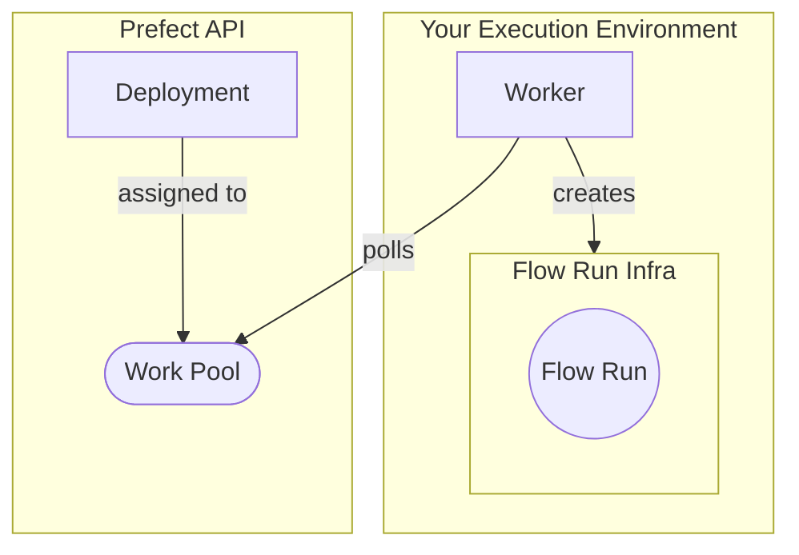

!!! note "Docker"
    This tutorial requires the use of Docker.

## Why workers and work pools?

Workers and work pools bridge the Prefect orchestration layer with the infrastructure the flows are actually executed on. 

The primary reason to use workers and work pools is for __dynamic infrastructure provisioning and configuration__. 
For example, you might have a workflow that has expensive infrastructure requirements and is only run infrequently. 
In this case, you don't want an idle process running within that infrastructure.  
Instead, you can use a lightweight _worker_ to dynamically provision the infrastructure only when a run of that workflow is ready to be executed.  

Other advantages to using workers and work pools include:

- You can configure default infrastructure configurations on your work pools that all jobs inherit and can override
- Platform teams can use work pools to expose opinionated (and enforced!) interfaces to the infrastructure that they oversee
- Work pools can be used to prioritize (or limit) runs through the use of work queues

The architecture of a worker/work pool deployment can be summarized with the following diagram: 



!!! note "Security Note"
    Prefect provides execution through its hybrid model, which allows you to deploy workflows that run in the environments best suited to their execution while allowing you to keep your code and data completely private. 
    There is no ingress required. 
    For more information [read more about our hybrid model].(https://www.prefect.io/security/overview/#overview)

Now that we’ve reviewed the concepts of a work pool and worker, let’s create them so that you can deploy your tutorial flow, and execute it later using the Prefect API.

## Setting up the worker and work pool

For this tutorial you will create a **Docker** type work pool via the CLI. 

Using the **Docker** work pool type means that all work sent to this work pool will run within a dedicated Docker container using a Docker client available to the worker.

!!! tip "Other work pool types"
    There are work pool types for all major managed code execution platforms, such as Kubernetes services or serverless computing environments such as AWS ECS, Azure Container Instances, and GCP Cloud Run.
    
    These are expanded upon in the [Guides](/2.12.1/guides) section.

### Create the work pool

In your terminal run the following command to set up a **Docker** type work pool. 
<div class="terminal">
```bash
prefect work-pool create --type docker my-docker-pool
```
</div>
Let’s confirm that the work pool was successfully created by running the following command in the same terminal. You should see your new `my-docker-pool` in the output list.
<div class="terminal">
```bash
prefect work-pool ls 
```
</div>
Finally, let’s double check that you can see this work pool in your Prefect UI. 
Navigate to the Work Pools tab and verify that you see `my-docker-pool` listed.

When you click into the `my-docker-pool`, select the "Work Queues" tab. 
You should see a red status icon listed for the default work queue signifying that this queue is not ready to submit work. 
Using and configuring work queues is an advanced deployment mode. 
You can learn more about them in the [work queue documentation](/2.12.1/concepts/work-pools/#work-queues).

To get the work queue healthy and ready to submit flow runs, you need to start a worker.

### Starting a worker

Workers are a lightweight polling process that kick off scheduled flow runs on a certain type of infrastructure (like Docker). 
To start a worker on your laptop, open a new terminal and confirm that your virtual environment has `prefect` installed.

Run the following command in this new terminal to start the worker:
<div class="terminal">
```bash
prefect worker start --pool my-docker-pool
```
</div>
You should see the worker start - it's now polling the Prefect API to request any scheduled flow runs it should pick up and then submit for execution. 
You’ll see your new worker listed in the UI under the Workers tab of the Work Pools page with a recent last polled date. 
You should also be able to see a `Healthy` status indicator in the default work queue under the work queue tab - progress!

You will need to keep this terminal session active in order for the worker to continue to pick up jobs. Since you are running this worker locally, the worker will terminate if you close the terminal. Therefore, in a production setting this worker should run as a daemonized or managed process. See next steps for more information on this.

Now that you’ve set up your work pool and worker, we have what we need to kick off and execute flow runs of flows deployed to this work pool. 
Let's deploy your tutorial flow to `my-docker-pool`.

## Create the deployment

From our previous steps, we now have:

1. [A flow](/2.12.1/tutorial/flows/)
2. A work pool
3. A worker

Now it’s time to put it all together.

In your terminal (not the terminal in which the worker is running), navigate to your `repo_info.py` file that we created in the first section.
For best results, this file should be in its own otherwise _empty directory_. 
Now run the following command ***from the root of this directory*** to begin deploying your flow:

<div class="terminal">
```bash
prefect deploy
```
</div>

!!! tip "Specifying an entrypoint"
    In non-interactive settings (like CI/CD), you can specify the entrypoint of your flow directly in the CLI. 
    
    For example, if `get_repo_info` is defined in `repo_info.py`, provide deployment details with flags `prefect deploy repo_info.py:get_repo_info -n my-deployment -p my-docker-pool`.

When running `prefect deploy` interactively, the CLI will discover all flows in your working directory. 
Select the flow you want to deploy, and the deployment wizard will walk you through the rest of the deployment creation process:

1. **Deployment name**: Choose a name, like `my-deployment`.
2. **Would you like to configure a schedule for this deployment? (y/n):** Type `n` for now, you can set up a schedule later.
3. **Which work pool would you like to deploy this flow to? (use arrow keys):** Select the work pool you just created, `my-docker-pool`.
4. **Would you like to build a custom Docker image for this deployment? (y/n):** Select `y` to have Prefect build an image for you.
5. **Repository name (e.g. your Docker Hub username):** For the purposes of the tutorial, you can input anything you'd like here.
6. **Image name (my-first-deployment):** Hit `Enter` to use the default image name.
7. **Image tag (latest):** Hit `Enter` to use the default image tag `latest`.
8. **Would you like to push this image to a remote registry? (y/n):** Select `n` for now; we can keep this image local.

Prefect will now build a custom Docker image containing your workflow code that the worker can use to dynamically spawn Docker containers whenever this workflow needs to run. 
Try it out:

<div class="terminal">
```bash
prefect deployment run 'get_repo_info/my-first-deployment'
```
</div>

!!! danger "Common Pitfalls"
    - When running `prefect deploy`, double check that you are at the **root of your repo**, otherwise the worker may attempt to use an incorrect flow entrypoint during remote execution!
    - Ensure that you have pushed any changes to your flow script to your GitHub repo - at any given time, your worker will pull the code that exists there!

As you continue to use Prefect, you'll likely author many different flows and deployments of them. 
Check out the next section to learn about defining deployments in a `prefect.yaml` file.

!!! tip "Did you know?"
    A Prefect flow can have more than one deployment. This can be useful if you want your flow to run in different execution environments or have multiple schedules.

## Next steps

- Learn about deploying multiple flows and CI/CD with our [`prefect.yaml`](/2.12.1/concepts/projects/#the-prefect-yaml-file).
- Check out some of our other [work pools](/2.12.1/concepts/work-pools/).
- [Concepts](/2.12.1/concepts/) contain deep dives into Prefect components.
- [Guides](/2.12.1/guides/) provide step-by-step recipes for common Prefect operations including:
    - [Deploying on Kubernetes](/2.12.1/guides/deployment/helm-worker/)
    - [Deploying flows in Docker](/2.12.1/guides/deployment/docker/)
    - [Writing tests](/2.12.1/guides/testing)
      
And more!
