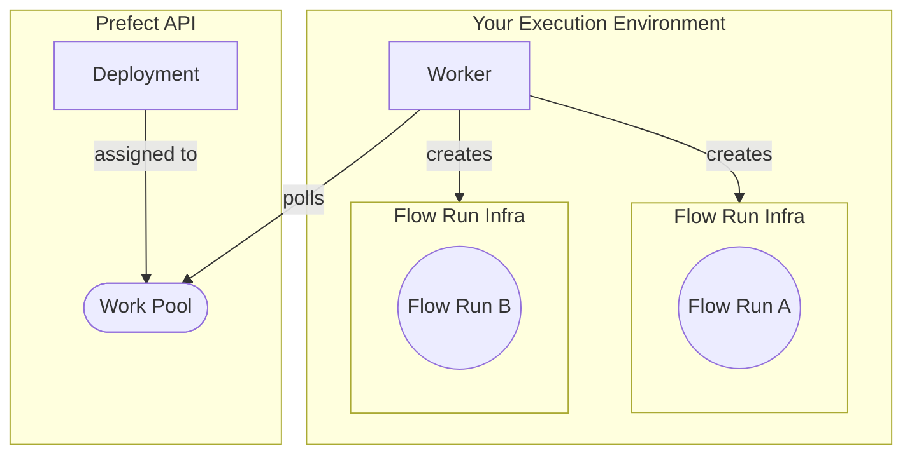

!!! note "Docker"
    This tutorial requires the use of Docker.

## Why workers and work pools?

Workers and work pools are a bridge between the Prefect orchestration layer and infrastructure for flow runs that can be dynamically provisioned. To transition from persistent infrastructure to dynamic infrastructure, use `flow.deploy` instead of `flow.serve`.

!!! tip "[Choosing Between `flow.deploy()` and `flow.serve()`](/2.13/concepts/deployments/#two-approaches-to-deployments)"
    The earlier section discussed the `serve` approach. For many use cases, `serve` is sufficient to meet scheduling and orchestration needs. Workers and work pools are **optional**. Just remember, if infrastructure needs escalate, workers and work pools can become a handy tool. The best part? You're not locked into one method. You can seamlessly combine approaches as needed. 
    
!!! note "Deployment definition methods differ slightly for workers"
    If you choose to use worker-based execution, the way you define deployments will be different. Deployments for workers are configured with `deploy`, which requires additional configuration. A deployment created with `serve` cannot be submitted to a worker.

The primary reason to use workers and work pools is for __dynamic infrastructure provisioning and configuration__. 
For example, you might have a workflow that has expensive infrastructure requirements and is run infrequently. 
In this case, you don't want an idle process running within that infrastructure. Instead, use a lightweight _worker_ to dynamically provision the infrastructure only when the workflow is scheduled to run.  

Other advantages to using workers and work pools include:

- You can configure default infrastructure configurations on your work pools that all jobs inherit and can override
- Platform teams can use work pools to expose opinionated (and enforced!) interfaces to the infrastructure that they oversee
- Work pools can be used to prioritize (or limit) flow runs through the use of [work queues](/2.13/concepts/work-pools/#work-queues)

The architecture of a worker/work pool deployment can be summarized with the following diagram: 



<sup>Notice above that the worker is in charge of provisioning the _flow run infrastructure_. In context of this tutorial, that flow run infrastructure is an ephemeral Docker container to host each flow run. Different [worker types](/2.13/concepts/work-pools/#worker-types)  create different types of flow run infrastructure.</sup>

Now that we’ve reviewed the concepts of a work pool and worker, let’s create them so that you can deploy your tutorial flow, and execute it later using the Prefect API.

## Set up a worker and work pool

For this tutorial you will create a **Docker** type work pool via the CLI. 

Using the **Docker** work pool type means that all work sent to this work pool will run within a dedicated Docker container using a Docker client available to the worker.

!!! tip "Other work pool types"
    There are [work pool types](/2.13/concepts/work-pools/#worker-types) for serverless computing environments such as AWS ECS, Azure Container Instances, and GCP Cloud Run. Kubernetes is also a popular type of work pool.
    
    These are expanded upon in the [Guides](/2.13/guides) section.

### Create a work pool

In your terminal run the following command to set up a **Docker** type work pool. 
<div class="terminal">
```bash
prefect work-pool create --type docker my-docker-pool
```
</div>
Let’s confirm that the work pool was successfully created by running the following command in the same terminal. You should see your new `my-docker-pool` in the output list.
<div class="terminal">
```bash
prefect work-pool ls 
```
</div>
Finally, let’s double check that you can see this work pool in your Prefect UI. 
Navigate to the Work Pools tab and verify that you see `my-docker-pool` listed.

When you click into `my-docker-pool` you should see a red status icon signifying that this work pool is not ready to submit work. 

To get the work pool ready to submit flow runs, you need to start a worker.

### Start a worker

Workers are a lightweight polling process that kick off scheduled flow runs on a certain type of infrastructure (like Docker). 
To start a worker on your laptop, open a new terminal and confirm that your virtual environment has `prefect` installed.

Run the following command in this new terminal to start the worker:
<div class="terminal">
```bash
prefect worker start --pool my-docker-pool
```
</div>
You should see the worker start - it's now polling the Prefect API to request any scheduled flow runs it should pick up and then submit for execution. 
You’ll see your new worker listed in the UI under the Workers tab of the Work Pools page with a recent last polled date. 
You should also be able to see a `Ready` status indicator on your work pool - progress!

You will need to keep this terminal session active in order for the worker to continue to pick up jobs. Since you are running this worker locally, the worker will terminate if you close the terminal. Therefore, in a production setting this worker should run as a daemonized or managed process. See next steps for more information on this.

Now that you’ve set up your work pool and worker, we have what we need to kick off and execute flow runs of flows deployed to this work pool. 
Let's deploy your tutorial flow to `my-docker-pool`.

## Create the deployment

From our previous steps, we now have:

1. [A flow](/2.13/tutorial/flows/)
2. A work pool
3. A worker

Now it’s time to put it all together. We're going to update our `repo_info.py` file so it will build a Docker image and update our deployment so our worker can execute it.

The updates that you need to make to `repo_info.py` are:

1. Change `flow.serve` to `flow.deploy`.
2. Tell `flow.deploy` which work pool to deploy to.
3. Tell `flow.deploy` the name to use for the Docker image it builds.

Here's what the updated `repo_info.py` looks like:

```python hl_lines="17-22" title="repo_info.py"
import httpx
from prefect import flow


@flow(log_prints=True)
def get_repo_info(repo_name: str = "PrefectHQ/prefect"):
    url = f"https://api.github.com/repos/{repo_name}"
    response = httpx.get(url)
    response.raise_for_status()
    repo = response.json()
    print(f"{repo_name} repository statistics 🤓:")
    print(f"Stars 🌠 : {repo['stargazers_count']}")
    print(f"Forks 🍴 : {repo['forks_count']}")


if __name__ == "__main__":
    get_repo_info.deploy(
        name="my-first-deployment", 
        work_pool_name="my-docker-pool", 
        image="my-first-deployment-image:tutorial"
        push=False
    )
```

!!! note "Why the `push=False`?"
    For this tutorial, your Docker worker is running on your machine, so we don't need to push the image built by `flow.deploy` to a registry. When your worker is running on a remote machine, you will need to push the image to a registry that the worker can access.

    Remove the `push=False` argument, include your registry name, and ensure you've [authenticated with the Docker CLI](https://docs.docker.com/engine/reference/commandline/login/) to push the image to a registry.

Now that you've updated your script, you can run it to deploy your flow to the work pool:

<div class="terminal">
```bash
python repo_info.py
```
</div>

Prefect will build a custom Docker image containing your workflow code that the worker can use to dynamically spawn Docker containers whenever this workflow needs to run. 

!!! note "What Dockerfile?"
    In this example, Prefect generates a Dockerfile for you that will build an image based off of one of Prefect's published images. The generated Dockerfile will copy the current directory into the Docker image and install any dependencies listed in a `requirements.txt` file.

    If you want to use a custom Dockerfile, you can specify the path to the Dockerfile using the `DeploymentImage` class:

    ```python hl_lines="21-25" title="repo_info.py"
    import httpx
    from prefect import flow
    from prefect.deployments import DeploymentImage


    @flow(log_prints=True)
    def get_repo_info(repo_name: str = "PrefectHQ/prefect"):
        url = f"https://api.github.com/repos/{repo_name}"
        response = httpx.get(url)
        response.raise_for_status()
        repo = response.json()
        print(f"{repo_name} repository statistics 🤓:")
        print(f"Stars 🌠 : {repo['stargazers_count']}")
        print(f"Forks 🍴 : {repo['forks_count']}")


    if __name__ == "__main__":
        get_repo_info.deploy(
            name="my-first-deployment", 
            work_pool_name="my-docker-pool", 
            image=DeploymentImage(
                name="my-first-deployment-image",
                tag="tutorial",
                dockerfile="Dockerfile"
            ),
            push=False
        )
    ```

### Modify the deployment

If you need to make updates to your deployment, you can do so by modifying your script and rerunning it. You'll need to make one update to specify a value for `job_variables` to ensure your Docker worker can successfully execute scheduled runs for this flow. See the example below.

The `job_variables` section allows you to fine-tune the infrastructure settings for a specific deployment. These values override default values in the specified work pool's [base job template](/2.13/concepts/work-pools/#base-job-template).

When testing images locally without pushing them to a registry (to avoid potential errors like docker.errors.NotFound), it's recommended to include an `image_pull_policy` job_variable set to `Never`. However, for production workflows, always consider pushing images to a remote registry for more reliability and accessibility.

Here's how you can easily set the `image_pull_policy` to be `Never` for this tutorial deployment without affecting the default value set on your work pool:

```python hl_lines="21" title="repo_info.py"
import httpx
from prefect import flow
from prefect.deployments import DeploymentImage


@flow(log_prints=True)
def get_repo_info(repo_name: str = "PrefectHQ/prefect"):
    url = f"https://api.github.com/repos/{repo_name}"
    response = httpx.get(url)
    response.raise_for_status()
    repo = response.json()
    print(f"{repo_name} repository statistics 🤓:")
    print(f"Stars 🌠 : {repo['stargazers_count']}")
    print(f"Forks 🍴 : {repo['forks_count']}")


if __name__ == "__main__":
    get_repo_info.deploy(
        name="my-first-deployment", 
        work_pool_name="my-docker-pool", 
        job_variables={"image_pull_policy": "Never"},
        image="my-first-deployment-image:tutorial",
        push=False
    )
```

To register this update to your deployment's parameters with Prefect's API, run:

```bash
python repo_info.py
```

Now everything is set up for us to submit a flow-run to the work pool:

```bash
prefect deployment run 'get_repo_info/my-deployment'
```

!!! danger "Common Pitfalls"
    - Store and run your deploy scripts at the **root of your repo**, otherwise the built Docker file may be missing files that it needs to execute!
    - Ensure that you have pushed any changes to your flow script to your GitHub repo - at any given time, your worker will pull the code that exists there!

!!! tip "Did you know?"
    A Prefect flow can have more than one deployment. This can be useful if you want your flow to run in different execution environments or have multiple schedules.

## Next steps

- Learn about deploying multiple flows and CI/CD with our [`prefect.yaml`](/2.13/guides/prefect-deploy/#managing-deployments).
- Check out some of our other [work pools](/2.13/concepts/work-pools/).
- [Concepts](/2.13/concepts/) contain deep dives into Prefect components.
- [Guides](/2.13/guides/) provide step-by-step recipes for common Prefect operations including:
    - [Deploying on Kubernetes](/2.13/guides/deployment/helm-worker/)
    - [Deploying flows in Docker](/2.13/guides/deployment/docker/)
    - [Writing tests](/2.13/guides/testing)
      
And more!
