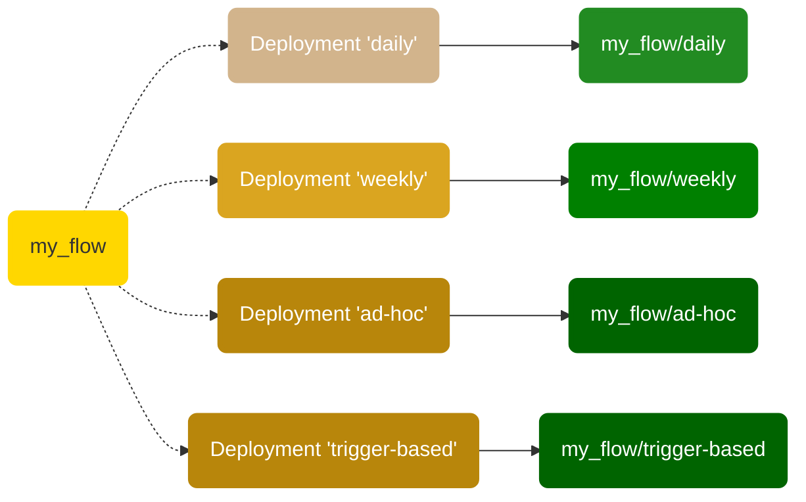

!!! warning "Workers are recommended"
    This page is about the block-based deployment model. The [Work Pools and Workers](/2.14.21/concepts/work-pools/) based [deployment model](/2.14.21/concepts/deployments/) simplifies the specification of a flow's infrastructure and runtime environment. If you have existing agents, you can [upgrade from agents to workers](/2.14.21/guides/upgrade-guide-agents-to-workers/) to significantly enhance the experience of deploying flows.

We encourage you to check out the new [deployment experience](/2.14.21/concepts/deployments/) with guided command line prompts and convenient CI/CD with `prefect.yaml` files.

With remote storage blocks, you can package not only your flow code script but also any supporting files, including your custom modules, SQL scripts and any configuration files needed in your project.

To define how your flow execution environment should be configured, you may either reference pre-configured infrastructure blocks or let Prefect create those automatically for you as anonymous blocks (this happens when you specify the infrastructure type using `--infra` flag during the build process).

!!! warning "Work queue affinity improved starting from Prefect 2.0.5"
    Until Prefect 2.0.4, tags were used to associate flow runs with work queues. Starting in Prefect 2.0.5, tag-based work queues are deprecated. Instead, work queue names are used to explicitly direct flow runs from deployments into queues.

    Note that **backward compatibility is maintained** and work queues that use tag-based matching can still be created and will continue to work. However, those work queues are now considered legacy and we encourage you to use the new behavior by specifying work queues explicitly on agents and deployments.

    See [Agents & Work Pools](/2.14.21/concepts/work-pools/) for details.

## Deployments and flows

Each deployment is associated with a single flow, but any given flow can be referenced by multiple deployments.

Deployments are uniquely identified by the combination of: `flow_name/deployment_name`.



This enables you to run a single flow with different parameters, based on multiple schedules and triggers, and in different environments. This also enables you to run different versions of the same flow for testing and production purposes.

## Deployment definition

A _deployment definition_ captures the settings for creating a [deployment object](#deployment-api-representation) on the Prefect API. You can create the deployment definition by:

- Run the [`prefect deployment build` CLI command](#create-a-deployment-on-the-cli) with deployment options to create a [`deployment.yaml`](#deploymentyaml) deployment definition file, then run `prefect deployment apply` to create a deployment on the API using the settings in `deployment.yaml`.
- Define a [`Deployment`](/2.14.21/api-ref/prefect/deployments/deployments/) Python object, specifying the deployment options as properties of the object, then building and applying the object using methods of `Deployment`.

The minimum required information to create a deployment includes:

- The path and filename of the file containing the flow script.
- The name of the entrypoint flow function &mdash; this is the flow function that starts the flow and calls and additional tasks or subflows.
- The name of the deployment.

You may provide additional settings for the deployment. Any settings you do not explicitly specify are inferred from defaults.


## Create a deployment on the CLI

To create a deployment on the CLI, there are two steps:

1. Build the deployment definition file `deployment.yaml`. This step includes uploading your flow to its configured remote storage location, if one is specified.
1. Create the deployment on the API.


### Build the deployment

To build the deployment definition file `deployment.yaml`, run the `prefect deployment build` Prefect CLI command from the folder containing your flow script and any dependencies of the script.

<div class="terminal">
```bash
$ prefect deployment build [OPTIONS] PATH
```
</div>

Path to the flow is specified in the format `path-to-script:flow-function-name` &mdash; The path and filename of the flow script file, a colon, then the name of the entrypoint flow function.

For example:

<div class="terminal">
```bash
$ prefect deployment build -n marvin -p default-agent-pool -q test flows/marvin.py:say_hi
```
</div>

When you run this command, Prefect:

- Creates a `marvin_flow-deployment.yaml` file for your deployment based on your flow code and options.
- Uploads your flow files to the configured storage location (local by default).
- Submit your deployment to the work queue `test`. The work queue `test` will be created if it doesn't exist.

!!! note "Uploading files may require storage filesystem libraries"
    Note that the appropriate filesystem library supporting the storage location must be installed prior to building a deployment with a storage block. For example, the AWS S3 Storage block requires the [`s3fs`](https://s3fs.readthedocs.io/en/latest/) library.

!!! tip "Ignore files or directories from a deployment"
    By default, Prefect uploads _all files_ in the current folder to the configured storage location (local by default) when you build a deployment.

    If you want to omit certain files or directories from your deployments, add a `.prefectignore` file to the root directory. `.prefectignore` enables users to omit certain files or directories from their deployments.

    Similar to other `.ignore` files, the syntax supports pattern matching, so an entry of `*.pyc` will ensure all `.pyc` files are ignored by the deployment call when uploading to remote storage.

### Deployment build options

You may specify additional options to further customize your deployment.


| Options                                                    | Description                                                                                                                                                                                                                                                                                                                                                        |
| ---------------------------------------------------------- | ------------------------------------------------------------------------------------------------------------------------------------------------------------------------------------------------------------------------------------------------------------------------------------------------------------------------------------------------------------------ |
| PATH                                                       | Path, filename, and flow name of the flow definition. (Required)                                                                                                                                                                                                                                                                                                   |
| `--apply`, `-a`                                            | When provided, automatically registers the resulting deployment with the API.                                                                                                                                                                                                                                                                                      |
| `--cron TEXT`                                              | A cron string that will be used to set a [`CronSchedule`](/2.14.21/concepts/schedules/) on the deployment. For example, `--cron "*/1 * * * *"` to create flow runs from that deployment every minute.                                                                                                                                                                      |
| `--help`                                                   | Display help for available commands and options.                                                                                                                                                                                                                                                                                                                   |
| `--infra-block TEXT`, `-ib`                                | The [infrastructure block](#block-identifiers) to use, in `block-type/block-name` format.                                                                                                                                                                                                                                                                          |
| `--infra`, `-i`                                            | The [infrastructure type](/2.14.21/concepts/infrastructure/) to use. (Default is `Process`)                                                                                                                                                                                                                                                                                |
| `--interval INTEGER`                                       | An integer specifying an interval (in seconds) that will be used to set an [`IntervalSchedule`](/2.14.21/concepts/schedules/) on the deployment. For example, `--interval 60` to create flow runs from that deployment every minute.                                                                                                                                       |
| `--name TEXT`, `-n`                                        | The name of the deployment.                                                                                                                                                                                                                                                                                                                                        |
| `--output TEXT`, `-o`                                      | Optional location for the YAML manifest generated as a result of the `build` step. You can version-control that file, but it's not required since the CLI can generate everything you need to define a deployment.                                                                                                                                                 |
| `--override TEXT`                                          | One or more optional infrastructure overrides provided as a dot delimited path. For example, specify an environment variable: `env.env_key=env_value`. For Kubernetes, specify customizations: `customizations='[{"op": "add","path": "/spec/template/spec/containers/0/resources/limits", "value": {"memory": "8Gi","cpu": "4000m"}}]'` (note the string format). |
| `--param`                                                  | An optional parameter override, values are parsed as JSON strings. For example, `--param question=ultimate --param answer=42`.                                                                                                                                                                                                                                     |
| `--params`                                                 | An optional parameter override in a JSON string format. For example, `--params=\'{"question": "ultimate", "answer": 42}\'`.                                                                                                                                                                                                                                        |
| `--path`                                                   | An optional path to specify a subdirectory of remote storage to upload to, or to point to a subdirectory of a locally stored flow.                                                                                                                                                                                                                                 |
| `--pool TEXT`, `-p`                                        | The [work pool](/2.14.21/concepts/work-pools/) that will handle this deployment's runs. │                                                                                                                                                                                                                                                                                  |
| `--rrule TEXT`                                             | An `RRule` that will be used to set an [`RRuleSchedule`](/2.14.21/concepts/schedules/) on the deployment. For example, `--rrule 'FREQ=HOURLY;BYDAY=MO,TU,WE,TH,FR;BYHOUR=9,10,11,12,13,14,15,16,17'` to create flow runs from that deployment every hour but only during business hours.                                                                                   |
| `--skip-upload`                                            | When provided, skips uploading this deployment's files to remote storage.                                                                                                                                                                                                                                                                                          |
| `--storage-block TEXT`, `-sb`| The [storage block](#block-identifiers) to use, in `block-type/block-name` or `block-type/block-name/path` format. Note that the appropriate library supporting the storage filesystem must be installed.                                                                                                                                                          |
| `--tag TEXT`, `-t`                                         | One or more optional tags to apply to the deployment.                                                                                                                                                                                                                                                                                                              |
| `--version TEXT`, `-v`                                     | An optional version for the deployment. This could be a git commit hash if you use this command from a CI/CD pipeline.                                                                                                                                                                                                                                             |
| `--work-queue TEXT`, `-q`                                  | The [work queue](/2.14.21/concepts/work-pools/) that will handle this deployment's runs. It will be created if it doesn't already exist. Defaults to `None`. Note that if a work queue is not set, work will not be scheduled.                                                                                                                                             |

### Block identifiers

When specifying a storage block with the `-sb` or `--storage-block` flag, you may specify the block by passing its slug. The storage block slug is formatted as `block-type/block-name`. 

For example, `s3/example-block` is the slug for an S3 block named `example-block`.

In addition, when passing the storage block slug, you may pass just the block slug or the block slug and a path.

- `block-type/block-name` indicates just the block, including any path included in the block configuration.
- `block-type/block-name/path` indicates a storage path in addition to any path included in the block configuration.

When specifying an infrastructure block with the `-ib` or `--infra-block` flag, you specify the block by passing its slug. The infrastructure block slug is formatted as `block-type/block-name`. 

| Block name         | Block class name   | Block type for a slug |
| ------------------ | ------------------ | --------------------- |
| Azure              | `Azure`            | `azure`               |
| Docker Container   | `DockerContainer`  | `docker-container`    |
| GitHub             | `GitHub`           | `github`              |
| GCS                | `GCS`              | `gcs`                 |
| Kubernetes Job     | `KubernetesJob`    | `kubernetes-job`      |
| Process            | `Process`          | `process`             |
| Remote File System | `RemoteFileSystem` | `remote-file-system`  |
| S3                 | `S3`               | `s3`                  |
| SMB                | `SMB`              | `smb`                 |
| GitLab Repository  | `GitLabRepository` | `gitlab-repository`   |

Note that the appropriate library supporting the storage filesystem must be installed prior to building a deployment with a storage block. For example, the AWS S3 Storage block requires the [`s3fs`](https://s3fs.readthedocs.io/en/latest/) library. See [Storage](/2.14.21/concepts/storage/) for more information.

### deployment.yaml

A deployment's YAML file configures additional settings needed to create a deployment on the server.

A single flow may have multiple deployments created for it, with different schedules, tags, and so on. A single flow definition may have multiple deployment YAML files referencing it, each specifying different settings. The only requirement is that each deployment must have a unique name.

The default `{flow-name}-deployment.yaml` filename may be edited as needed with the `--output` flag to `prefect deployment build`.

```yaml
###
### A complete description of a Prefect Deployment for flow 'Cat Facts'
###
name: catfact
description: null
version: c0fc95308d8137c50d2da51af138aa23
# The work queue that will handle this deployment's runs
work_queue_name: test
work_pool_name: null
tags: []
parameters: {}
schedule: null
infra_overrides: {}
infrastructure:
  type: process
  env: {}
  labels: {}
  name: null
  command:
  - python
  - -m
  - prefect.engine
  stream_output: true
###
### DO NOT EDIT BELOW THIS LINE
###
flow_name: Cat Facts
manifest_path: null
storage: null
path: /Users/terry/test/testflows/catfact
entrypoint: catfact.py:catfacts_flow
parameter_openapi_schema:
  title: Parameters
  type: object
  properties:
    url:
      title: url
  required:
  - url
  definitions: null
```

!!! note "Editing deployment.yaml"
    Note the big **DO NOT EDIT** comment in your deployment's YAML: In practice, anything above this block can be freely edited _before_ running `prefect deployment apply` to create the deployment on the API.

    We recommend editing most of these fields from the CLI or Prefect UI for convenience.

### Parameters in deployments

You may provide default parameter values in the `deployment.yaml` configuration, and these parameter values will be used for flow runs based on the deployment. 

To configure default parameter values, add them to the `parameters: {}` line of `deployment.yaml` as JSON key-value pairs. The parameter list configured in `deployment.yaml` *must* match the parameters expected by the entrypoint flow function.

```yaml
parameters: {"name": "Marvin", "num": 42, "url": "https://catfact.ninja/fact"}
```

!!! tip "Passing **kwargs as flow parameters"
    You may pass `**kwargs` as a deployment parameter as a `"kwargs":{}` JSON object containing the key-value pairs of any passed keyword arguments.

    ```
    parameters: {"name": "Marvin", "kwargs":{"cattype":"tabby","num": 42}
    ```

You can edit default parameters for deployments in the Prefect UI, and you can override default parameter values when creating ad-hoc flow runs via the Prefect UI.

To edit parameters in the Prefect UI, go the the details page for a deployment, then select **Edit** from the commands menu. If you change parameter values, the new values are used for all future flow runs based on the deployment.

To create an ad-hoc flow run with different parameter values, go the the details page for a deployment, select **Run**, then select **Custom**. You will be able to provide custom values for any editable deployment fields. Under **Parameters**, select **Custom**. Provide the new values, then select **Save**. Select **Run** to begin the flow run with custom values.

If you want the Prefect API to verify the parameter values passed to a flow run against the schema defined by `parameter_openapi_schema`, set `enforce_parameter_schema` to `true`.


### Create a deployment

When you've configured `deployment.yaml` for a deployment, you can create the deployment on the API by running the `prefect deployment apply` Prefect CLI command.

<div class="terminal">
```bash
$ prefect deployment apply catfacts_flow-deployment.yaml
```
</div>

For example:

<div class="terminal">
```bash
$ prefect deployment apply ./catfacts_flow-deployment.yaml
Successfully loaded 'catfact'
Deployment '76a9f1ac-4d8c-4a92-8869-615bec502685' successfully created.
```
</div>

`prefect deployment apply` accepts an optional `--upload` flag that, when provided, uploads this deployment's files to remote storage.

Once the deployment has been created, you'll see it in the [Prefect UI](/2.14.21/ui/flow-runs/) and can inspect it using the CLI.

<div class="terminal">
```bash
$ prefect deployment ls
                               Deployments
┏━━━━━━━━━━━━━━━━━━━━━━━━━━━━━━━━┳━━━━━━━━━━━━━━━━━━━━━━━━━━━━━━━━━━━━━━┓
┃ Name                           ┃ ID                                   ┃
┡━━━━━━━━━━━━━━━━━━━━━━━━━━━━━━━━╇━━━━━━━━━━━━━━━━━━━━━━━━━━━━━━━━━━━━━━┩
│ Cat Facts/catfact              │ 76a9f1ac-4d8c-4a92-8869-615bec502685 │
│ leonardo_dicapriflow/hello_leo │ fb4681d7-aa5a-4617-bf6f-f67e6f964984 │
└────────────────────────────────┴──────────────────────────────────────┘
```
</div>


When you run a deployed flow with Prefect, the following happens:

- The user runs the deployment, which creates a flow run. (The API creates flow runs automatically for deployments with schedules.)
- An agent picks up the flow run from a work queue and uses an infrastructure block to create infrastructure for the run.
- The flow run executes within the infrastructure.

[Agents and work pools](/2.14.21/concepts/work-pools/) enable the Prefect orchestration engine and API to run deployments in your local execution environments. To execute deployed flow runs you need to configure at least one agent.

!!! note "Scheduled flow runs"
    Scheduled flow runs will not be created unless the scheduler is running with either Prefect Cloud or a local Prefect server started with `prefect server start`.

    Scheduled flow runs will not run unless an appropriate [agent and work pool](/2.14.21/concepts/work-pools/) are configured.

## Create a deployment from a Python object

You can also create deployments from Python scripts by using the [`prefect.deployments.Deployment`][prefect.deployments.Deployment] class.

Create a new deployment using configuration defaults for an imported flow:

```python
from my_project.flows import my_flow
from prefect.deployments import Deployment

deployment = Deployment.build_from_flow(
    flow=my_flow,
    name="example-deployment", 
    version=1, 
    work_queue_name="demo",
    work_pool_name="default-agent-pool",
)
deployment.apply()
```

Create a new deployment with a pre-defined [storage block](/2.14.21/concepts/storage/) and an [infrastructure](/2.14.21/concepts/infrastructure/) override:

```python
from my_project.flows import my_flow
from prefect.deployments import Deployment
from prefect.filesystems import S3

storage = S3.load("dev-bucket") # load a pre-defined block

deployment = Deployment.build_from_flow(
    flow=my_flow,
    name="s3-example",
    version=2,
    work_queue_name="aws",
    work_pool_name="default-agent-pool",
    storage=storage,
    infra_overrides={
        "env": {
            "ENV_VAR": "value"
        }
    },
)

deployment.apply()
```

If you have settings that you want to share from an existing deployment you can load those settings:

```python
deployment = Deployment(
    name="a-name-you-used", 
    flow_name="name-of-flow"
)
deployment.load() # loads server-side settings
```

Once the existing deployment settings are loaded, you may update them as needed by changing deployment properties.

View all of the parameters for the `Deployment` object in the [Python API documentation](https://docs.prefect.io/api-ref/prefect/deployments/deployments/).

## Deployment API representation

When you create a deployment, it is constructed from deployment definition data you provide and additional properties set by client-side utilities.

Deployment properties include:

| Property                                                  | Description                                                                                                                    |
| --------------------------------------------------------- | ------------------------------------------------------------------------------------------------------------------------------ |
| `id`                                                      | An auto-generated UUID ID value identifying the deployment.                                                                    |
| `created`                                                 | A `datetime` timestamp indicating when the deployment was created.                                                             |
| `updated`                                                 | A `datetime` timestamp indicating when the deployment was last changed.                                                        |
| `name`                                                    | The name of the deployment.                                                                                                    |
| `version`                                                 | The version of the deployment                                                                                                  |
| `description`                                             | A description of the deployment.                                                                                               |
| `flow_id`                                                 | The id of the flow associated with the deployment.                                                                             |
| `schedule`                                                | An optional schedule for the deployment.                                                                                       |
| `is_schedule_active`                                      | Boolean indicating whether the deployment schedule is active. Default is True.                                                 |
| `infra_overrides`                                         | One or more optional infrastructure overrides                                                                                  |
| `parameters`                                              | An optional dictionary of parameters for flow runs scheduled by the deployment.                                                |
| `tags`                                                    | An optional list of tags for the deployment.                                                                                   |
| `work_queue_name`                                         | The optional work queue that will handle the deployment's run                                                                  |
| `parameter_openapi_schema`                                | JSON schema for flow parameters.                                                                                               |
| `enforce_parameter_schema`                                | Whether the API should validate the parameters passed to a flow run against the schema defined by `parameter_openapi_schema`   |
| `path`                                                    | The path to the deployment.yaml file                                                                                           |
| `entrypoint`                                              | The path to a flow entry point                                                                                                 |
| `storage_document_id`                                     | Storage block configured for the deployment.                                                                                   |
| `infrastructure_document_id` | Infrastructure block configured for the deployment.                                                                            |


You can inspect a deployment using the CLI with the `prefect deployment inspect` command, referencing the deployment with `<flow_name>/<deployment_name>`.

```bash
$ prefect deployment inspect 'Cat Facts/catfact'
{
    'id': '76a9f1ac-4d8c-4a92-8869-615bec502685',
    'created': '2022-07-26T03:48:14.723328+00:00',
    'updated': '2022-07-26T03:50:02.043238+00:00',
    'name': 'catfact',
    'version': '899b136ebc356d58562f48d8ddce7c19',
    'description': None,
    'flow_id': '2c7b36d1-0bdb-462e-bb97-f6eb9fef6fd5',
    'schedule': None,
    'is_schedule_active': True,
    'infra_overrides': {},
    'parameters': {},
    'tags': [],
    'work_queue_name': 'test',
    'parameter_openapi_schema': {
        'title': 'Parameters',
        'type': 'object',
        'properties': {'url': {'title': 'url'}},
        'required': ['url']
    },
    'path': '/Users/terry/test/testflows/catfact',
    'entrypoint': 'catfact.py:catfacts_flow',
    'manifest_path': None,
    'storage_document_id': None,
    'infrastructure_document_id': 'f958db1c-b143-4709-846c-321125247e07',
    'infrastructure': {
        'type': 'process',
        'env': {},
        'labels': {},
        'name': None,
        'command': ['python', '-m', 'prefect.engine'],
        'stream_output': True
    }
}
```

## Create a flow run from a deployment

### Create a flow run with a schedule

If you specify a schedule for a deployment, the deployment will execute its flow automatically on that schedule as long as a Prefect server and agent are running. Prefect Cloud creates schedules flow runs automatically, and they will run on schedule if an agent is configured to pick up flow runs for the deployment.

### Create a flow run with an event trigger

!!! cloud-ad "deployment triggers are only available in Prefect Cloud"

Deployments can optionally take a trigger specification, which will configure an automation to run the deployment based on the presence or absence of events, and optionally pass event data into the deployment run as parameters via jinja templating.

```yaml
triggers:
  - enabled: true
    match:
      prefect.resource.id: prefect.flow-run.*
    expect:
      - prefect.flow-run.Completed
    match_related:
      prefect.resource.name: prefect.flow.etl-flow
      prefect.resource.role: flow
    parameters:
      param_1: "{{ event }}"
```


When applied, this deployment will start a flow run upon the completion of the upstream flow specified in the `match_related` key, with the flow run passed in as a parameter. Triggers can be configured to respond to the presence or absence of arbitrary internal or external [events](/2.14.21/cloud/events). The trigger system and API are detailed in [Automations](/2.14.21/cloud/automations/).


### Create a flow run with Prefect UI
In the Prefect UI, you can click the **Run** button next to any deployment to execute an ad hoc flow run for that deployment.

The `prefect deployment` CLI command provides commands for managing and running deployments locally.

| Command           | Description                                                     |
| ----------------- | --------------------------------------------------------------- |
| `apply`           | Create or update a deployment from a YAML file.                 |
| `build`           | Generate a deployment YAML from /path/to/file.py:flow_function. |
| `delete`          | Delete a deployment.                                            |
| `inspect`         | View details about a deployment.                                |
| `ls`              | View all deployments or deployments for specific flows.         |
| `pause-schedule`  | Pause schedule of a given deployment.                           |
| `resume-schedule` | Resume schedule of a given deployment.                          |
| `run`             | Create a flow run for the given flow and deployment.            |
| `set-schedule`    | Set schedule for a given deployment.                            |

### Create a flow run in a Python script 

You can create a flow run from a deployment in a Python script with the `run_deployment` function.

```python
from prefect.deployments import run_deployment


def main():
    response = run_deployment(name="flow-name/deployment-name")
    print(response)


if __name__ == "__main__":
   main()
``` 

!!! tip "`PREFECT_API_URL` setting for agents"
    You'll need to configure [agents and work pools](/2.14.21/concepts/work-pools/) that can create flow runs for deployments in remote environments. [`PREFECT_API_URL`](/2.14.21/concepts/settings/#prefect_api_url) must be set for the environment in which your agent is running.

    If you want the agent to communicate with Prefect Cloud from a remote execution environment such as a VM or Docker container, you must configure `PREFECT_API_URL` in that environment.

## Examples

- [How to deploy Prefect flows to AWS](https://discourse.prefect.io/t/how-to-deploy-prefect-2-0-flows-to-aws/1252)
- [How to deploy Prefect flows to GCP](https://discourse.prefect.io/t/how-to-deploy-prefect-2-0-flows-to-gcp/1251)
- [How to deploy Prefect flows to Azure](https://discourse.prefect.io/t/how-to-deploy-prefect-2-0-flows-to-azure/1312)
- [How to deploy Prefect flows using files stored locally](https://discourse.prefect.io/t/how-to-deploy-prefect-2-0-flows-to-run-as-a-local-process-docker-container-or-a-kubernetes-job/1246)
