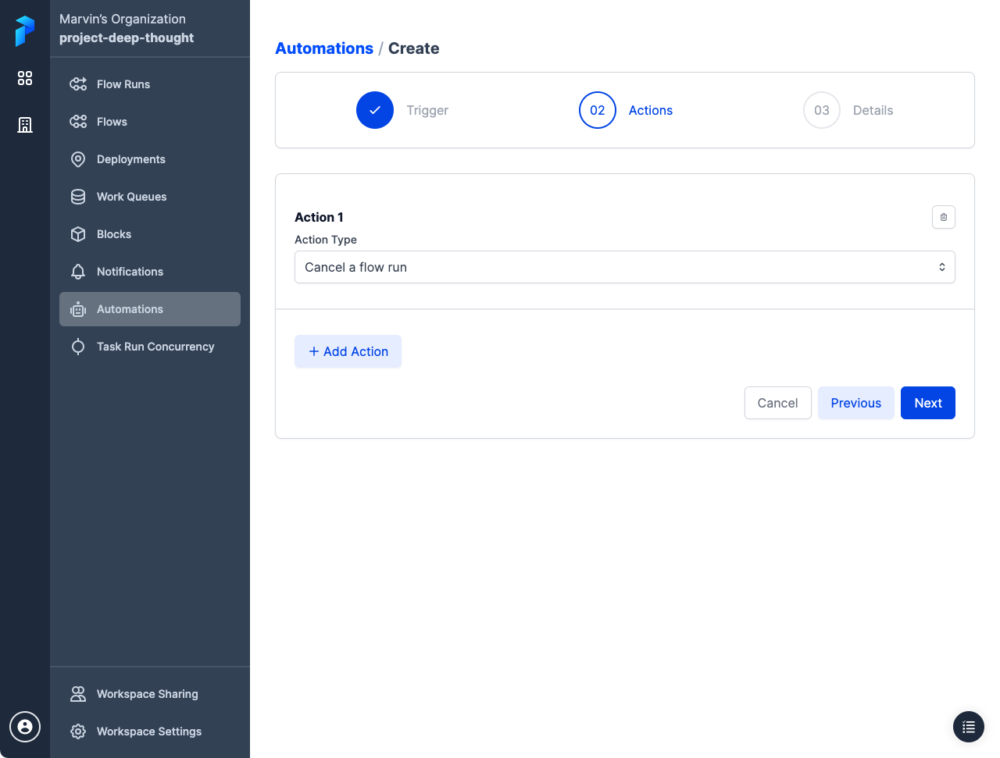
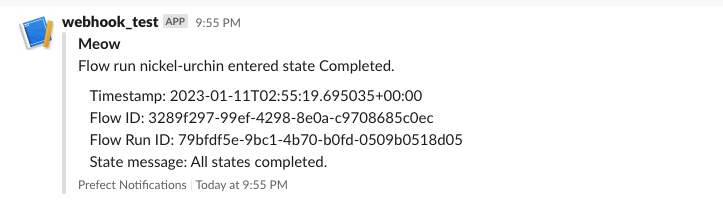

Automations in Prefect Cloud enable you to configure [actions](#actions) that Prefect executes automatically based on [trigger](#triggers) conditions related to your flows and work pools. 

Using triggers and actions you can automatically kick off flow runs, pause deployments, or send custom notifications in response to real-time monitoring events.

!!! cloud-ad "Automations are only available in Prefect Cloud"
    [Notifications](/2.8.7/ui/notifications/) in the open-source Prefect server provide a subset of the notification message-sending features avaiable in Automations.

## Automations overview

The **Automations** page provides an overview of all configured automations for your workspace.


Selecting the toggle next to an automation pauses execution of the automation. 

The button next to the toggle provides commands to copy the automation ID, edit the automation, or delete the automation.

Select the name of an automation to view **Details** about it.


The **Events** tab displays a list of triggers and actions related to the automation. You can filter the list on date or event type. Select the timestamp of an event to see further details.


## Create an automation

On the **Automations** page, select the **+** icon to create a new automation. You'll be prompted to configure:

- A [trigger](#triggers) condition that causes the automation to execute.
- One or more [actions](#actions) carried out by the automation.
- [Details](#details) about the automation, such as a name and description.

### Triggers

Triggers specify the conditions under which your action should be performed. Triggers can be of several types, including triggers based on: 

- Flow run state change
- Work queue health
- [Custom event](#automations-api) triggers

Importantly, triggers can be configured not only in reaction to events, but also proactively: to trigger in the absence of an event you expect to see.


For example, in the case of flow run state change triggers, you might expect production flows to finish in no longer than thirty minutes. But transient infrastructure or network issues could cause your flow to get “stuck” in a running state. A trigger could kick off an action if the flow stays in a running state for more than 30 minutes. This action could be on the flow itself, such as canceling or restarting it, or it could take the form of a notification so someone can take manual remediation steps.

!!! note "Work queue health"
    A work queue is "unhealthy" if it has not been polled in over 60 seconds OR if it has one or more late runs.

Custom Triggers

Custom triggers allow advanced configuration of the conditions on which a trigger executes its actions.


 
For example, if you would only like a trigger to execute an action if it receives 2 flow run failure events of a specific deployment within 10 seconds, you could paste in the following trigger configuration:

```json
{
  "match": {
    "prefect.resource.id": "prefect.flow-run.*"
  },
  "match_related": {
    "prefect.resource.id": "prefect.deployment.70cb25fe-e33d-4f96-b1bc-74aa4e50b761",
    "prefect.resource.role": "deployment"
  },
  "for_each": [
    "prefect.resource.id"
  ],
  "after": [],
  "expect": [
    "prefect.flow-run.Completed"
  ],
  "posture": "Reactive",
  "threshold": 2,
  "within": 10
}
```

Or, if your work queue enters an unhealthy state and you want your trigger to execute an action if it doesn't recover within 30 minutes, you could paste in the following trigger configuration:

```json
{
  "match": {
    "prefect.resource.id": "prefect.work-queue.70cb25fe-e33d-4f96-b1bc-74aa4e50b761"
  },
  "match_related": {},
  "for_each": [
    "prefect.resource.id"
  ],
  "after": [
    "prefect.work-queue.unhealthy"
  ],
  "expect": [
    "prefect.work-queue.healthy"
  ],
  "posture": "Proactive",
  "threshold": 0,
  "within": 1800
}
```

Or, if you wanted your trigger to fire if your log write events passed a threshold of 100 within 10 seconds, you could paste in the following trigger configuration:

```json
{
  "match": {
    "prefect.resource.id": "prefect.flow-run.*"
  },
  "after": [],
  "expect": [
    "prefect.log.write"
  ],
  "posture": "Reactive",
  "threshold": 100,
  "within": 10
}
```

### Actions

Actions specify what your automation does when its trigger criteria are met. Current action types include: 

- Cancel a flow run
- Pause or resume a deployment schedule
- Run a deployment
- Pause or resume a work queue
- Send a [notification](#automation-notifications)
- Call a webhook



### Selected and inferred action targets

Some actions require you to either select the target of the action, or specify that the target of the action should be inferred. 

Selected targets are simple, and useful for when you know exactly what object your action should act on &mdash; for example, the case of a cleanup flow you want to run or a specific notification you’d like to send.

Inferred targets are deduced from the trigger itself. 

For example, if a trigger fires on a flow run that is stuck in a running state, and the action is to cancel an inferred flow run, the flow run to cancel is inferred as the stuck run that caused the trigger to fire. 

Similarly, if a trigger fires on work queue health and the action is to pause an inferred work queue, the work queue to pause is inferred as the unhealthy work queue that caused the trigger to fire. 

Prefect tries to infer the relevant event whenever possible, but sometimes one does not exist.

### Details

Specify a name and, optionally, a description for the automation.


## Automation notifications

Notifications enable you to set up automation actions that send a message. 

Automation notifications support sending notifications via any predefined block that is capable of and configured to send a message. That includes, for example:

- Slack message to a channel
- Microsoft Teams message to a channel
- Email to a configured email address


!!! note "Notification blocks must be pre-configured"
    Notification blocks must be pre-configured prior to creating a notification action. Any existing blocks capable of sending messages will be shown in the block drop-down list.

    The **Add +** button cancels the current automation creation process and enables configuration a notification block.

## Templating notifications with Jinja

The notification body can include templated variables using [Jinja](https://palletsprojects.com/p/jinja/) syntax. Templated variable enable you to include details relevant to automation trigger, such as a flow or queue name. 

Jinja templated variable syntax wraps the variable name in double curly brackets, like `{{ variable }}`.

You can access properties of the underlying flow run objects including:

- [flow_run](/2.8.7/api-ref/server/schemas/core/#prefect.server.schemas.core.FlowRun)
- [flow](/2.8.7/api-ref/server/schemas/core/#prefect.server.schemas.core.Flow)
- [deployment](/2.8.7/api-ref/server/schemas/core/#prefect.server.schemas.core.Deployment)
- [work_queue](/2.8.7/api-ref/server/schemas/core/#prefect.server.schemas.core.WorkQueue)

In addition to its native properites, each object includes an `id` along with `created` and `updated` timestamps. 

The `flow_run|ui_url` token returns the URL for viewing the flow run in Prefect Cloud.

Here’s an example for something that would be relevant to a flow run state-based notification:

```
Flow run {{ flow_run.name }} entered state {{ flow_run.state.name }}. 

    Timestamp: {{ flow_run.state.timestamp }}
    Flow ID: {{ flow_run.flow_id }}
    Flow Run ID: {{ flow_run.id }}
    State message: {{ flow_run.state.message }}
```

The resulting Slack webhook notification would look something like this:



You could include `flow` and `deployment` properties.

```
Flow run {{ flow_run.name }} for flow {{ flow.name }}
entered state {{ flow_run.state.name }}
with message {{ flow_run.state.message }}

Flow tags: {{ flow.tags }}
Deployment name: {{ deployment.name }}
Deployment version: {{ deployment.version }}
Deployment parameters: {{ deployment.parameters }}
```

An automation that reports on work queue health might include notifications using `work_queue` properties.

```
Work queue health alert!

Name: {{ work_queue.name }}
Last polled: {{ work_queue.last_polled }}
```

In addition to those shortcuts for flows, deployments, and work pools, you have access to the automation and the event that triggered the automation. See the [Automations API](#automations-api) for additional details.

```
Automation: {{ automation.name }}
Description: {{ automation.description }}

Event: {{ event.id }}
Resource:

{{ label }}: {{ value }}

Related Resources:

    Role: {{ related.role }}
    
    {{ label }}: {{ value }}
    

```

Note that this example also illustrates the ability to use Jinja features such as iterator and for loop [control structures](https://jinja.palletsprojects.com/en/3.1.x/templates/#list-of-control-structures) when templating notifications.

## Automations API 

The [automations API](https://app.prefect.cloud/api/docs#tag/Automations) enables further programatic customization of trigger and action policies based on arbitrary [events](https://app.prefect.cloud/api/docs#tag/Events).
