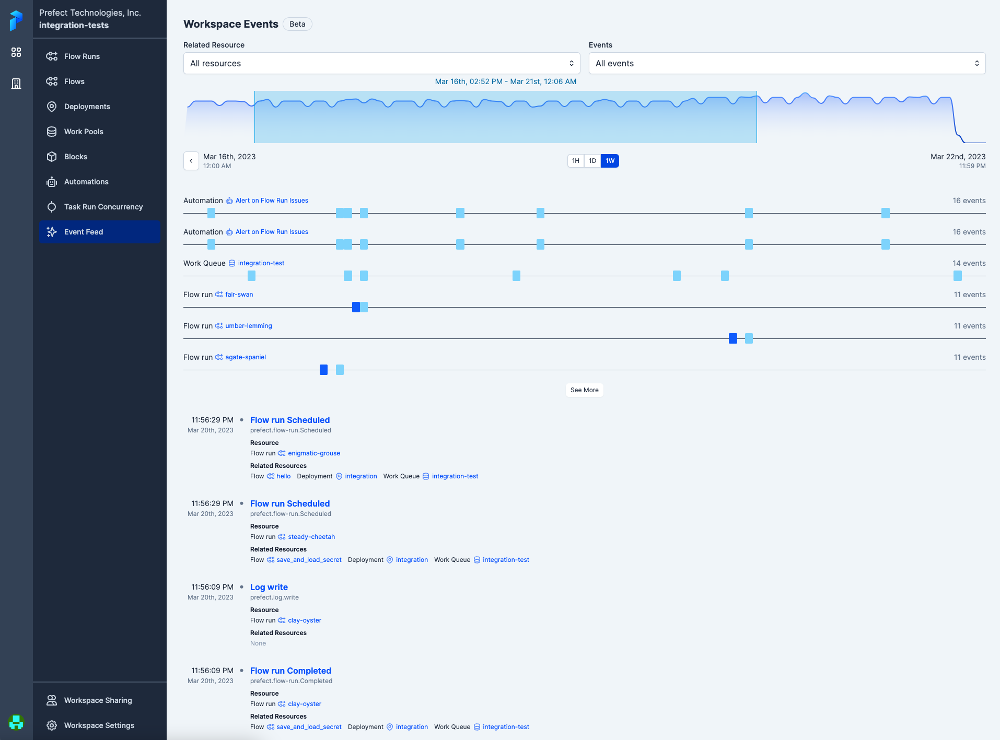
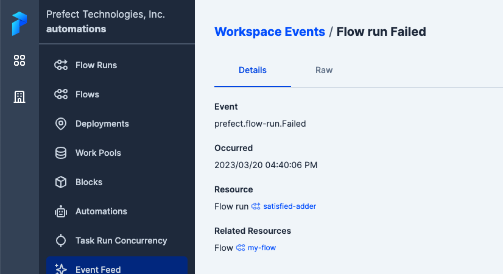

Prefect Cloud provides an interactive dashboard to analyze and take action on events that occurred in your workspace on the [event feed page](/2.8/concepts/events-and-resources/).

## Event feed 

The event feed is the primary place to view, search, and filter events to understand activity across your stack. Each entry displays data on the resource, related resource, and event that took place.

## Event details

You can view more information about an event by clicking into it, where you can view the full details of an event's resource, related resources, and its payload.

## Reacting to events

From an event page, you can easily configure an automation to trigger on the observation of matching events or a lack of matching events by clicking the automate button in the overflow menu:

The default trigger configuration will fire every time it sees an event with a matching resource identifier. Advanced configuration is possible via [custom triggers](/2.8/ui/automations/). 