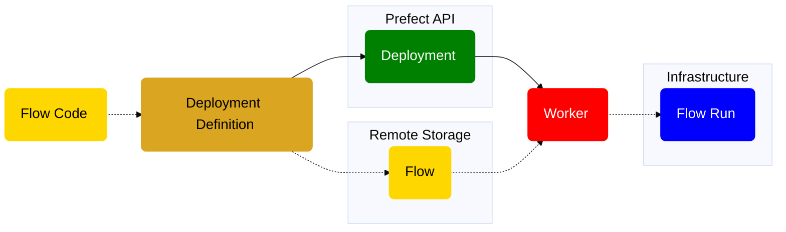

Work pools are a bridge between the Prefect orchestration layer and the infrastructure where flows are run.

The primary reason to use work pools is for **dynamic infrastructure provisioning and configuration**.
For example, you might have a workflow that has expensive infrastructure requirements and runs infrequently.
In this case, you don't want an idle process running within that infrastructure.

Other advantages of work pools:

- Configure default infrastructure configurations on your work pools that all jobs inherit and can override.
- Allow platform teams to use work pools to expose opinionated (and enforced) interfaces to the infrastructure that they oversee.
- Allow work pools to prioritize (or limit) flow runs through the use of [work queues](/3.0/deploy/infrastructure-concepts/work-pools/#work-queues).

<Tip>
    **Choosing Between `flow.deploy()` and `flow.serve()`**

    For many use cases, `serve` is sufficient for scheduling and orchestration.
    Work pools are great for complex infrastructure requirements. But they are optional.
    You are not locked into one method and can combine approaches as needed.
</Tip>


Work pools have different operational modes, each designed to work with specific infrastructures and work delivery methods:

1. Pull work pools: These require workers to actively poll for flow runs to execute.
2. [Push work pools](/3.0/deploy/infrastructure-examples/serverless): These submit runs directly to serverless infrastructure providers.
3. [Managed work pools](/3.0/deploy/infrastructure-examples/managed): These are administered by Prefect and handle both submission and execution of code.

Each type of work pool is optimized for different use cases, allowing you to choose the best fit for your specific infrastructure and workflow requirements. 
By using work pools, you can efficiently manage the distribution and execution of your Prefect flows across environments and infrastructures.

<Tip>
**Work pools are like pub/sub topics**

    Work pools help coordinate deployments with workers 
    through a known channel: the pool itself. This is similar to how "topics" are used to connect producers and consumers in a 
    pub/sub or message-based system. By switching a deployment's work pool, users can quickly change the worker that will execute their runs, 
    making it easy to promote runs through environments — or even to debug locally.
</Tip>

Users can control aspects of work pool behavior, such as how many runs the pool allows to run concurrently. You can modify these options 
at any time, and any workers requesting work for a specific pool only see matching flow runs.

The following diagram provides a high-level overview of the conceptual elements involved in defining a work-pool based 
deployment that is polled by a worker and executes a flow run based on that deployment.



### Work pool configuration

You can configure work pools by using any of the following:

- Prefect UI
- Prefect CLI commands
- [Prefect REST API](/3.0/api-ref/rest-api/)
- [Terraform provider for Prefect Cloud](https://registry.terraform.io/providers/PrefectHQ/prefect/latest/docs/resources/work_pool)

To manage work pools in the UI, click the **Work Pools** icon. This displays a list of currently configured work pools.


Select the **+** button to create a new work pool. You can specify the details about infrastructure created for this work pool.

To create a work pool through the Prefect CLI, use the `prefect work-pool create` command:

```bash
prefect work-pool create [OPTIONS] NAME
```

`NAME` is a required, unique name for the work pool.

Optional configuration parameters to filter work on the pool include:

| Option                                             | Description                                                                                                                                                |
| -------------------------------------------------- | ---------------------------------------------------------------------------------------------------------------------------------------------------------- |
| `--paused`                                         | If provided, the work pool is created in a paused state.                                                                                              |
| `--type`                                           | The type of infrastructure that can execute runs from this work pool.                                                             |
| `--set-as-default`                                 | Whether to use the created work pool as the local default for deployment.                                         |
| <span class="no-wrap">`--base-job-template`</span> | The path to a JSON file containing the base job template to use. If unspecified, Prefect uses the default base job template for the given worker type. |

To update a work pool through the Prefect CLI, use the `prefect work-pool update` command:

```bash
prefect work-pool update [OPTIONS] NAME
```

`NAME` is the name of the work pool to update.

Optional configuration parameters you can specify to update the work pool include:

| Option                                             | Description                                                                                                                                                |
| -------------------------------------------------- | ---------------------------------------------------------------------------------------------------------------------------------------------------------- |
| <span class="no-wrap">`--base-job-template`</span> | The path to a JSON file containing the base job template to use. If unspecified, Prefect uses the default base job template for the given worker type. |
| `--description`                                    | A description of the work pool.                                                                                                                            |
| `--concurrency-limit`                              | The maximum number of flow runs to run simultaneously in the work pool.                                                                                    |

<Tip>
**Managing work pools in CI/CD**

  Version control your base job template by committing it as a JSON file to a git repository and control updates to your 
  work pools' base job templates with the `prefect work-pool update` command in your CI/CD pipeline. 
  
  For example, use the following command to update a work pool's base job template to the contents of a file named `base-job-template.json`:

    ```bash
    prefect work-pool update --base-job-template base-job-template.json my-work-pool
    ```
</Tip>


### Work pool types

The following work pool types are supported by Prefect:

<Tabs>
  <Tab title="Prefect Cloud">

    | Infrastructure Type                  | Description                                                                                                                |
    | ------------------------------       | -------------------------------------------------------------------------------------------------------------------------- |
    | Process                              | Execute flow runs as subprocesses on a worker. Works well for local execution when first getting started.                    |
    | AWS Elastic Container Service        | Execute flow runs within containers on AWS ECS. Works with EC2 and Fargate clusters. Requires an AWS account.               |
    | Azure Container Instances            | Execute flow runs within containers on Azure's Container Instances service. Requires an Azure account.                      |
    | Docker                               | Execute flow runs within Docker containers. Works well for managing flow execution environments through Docker images. Requires  access to a running Docker daemon.  |
    | Google Cloud Run                     | Execute flow runs within containers on Google Cloud Run. Requires a Google Cloud Platform account.                          |
    | Google Cloud Run V2                  | Execute flow runs within containers on Google Cloud Run (V2 API). Requires a Google Cloud Platform account.                 |
    | Google Vertex AI                     | Execute flow runs within containers on Google Vertex AI. Requires a Google Cloud Platform account.                          |
    | Kubernetes                           | Execute flow runs within jobs scheduled on a Kubernetes cluster. Requires a Kubernetes cluster.                             |
    | Google Cloud Run - Push              | Execute flow runs within containers on Google Cloud Run. Requires a Google Cloud Platform account. Flow runs are pushed directly to your environment, without the need for a Prefect worker.  |
    | AWS Elastic Container Service - Push | Execute flow runs within containers on AWS ECS. Works with existing ECS clusters and serverless execution through AWS Fargate. Requires an AWS account. Flow runs are pushed directly to your environment, without the need for a Prefect worker.   |
    | Azure Container Instances - Push     | Execute flow runs within containers on Azure's Container Instances service. Requires an Azure account. Flow runs are pushed directly to your environment, without the need for a Prefect worker.    |
    | Modal - Push                         | Execute flow runs on Modal. Requires a Modal account. Flow runs are pushed directly to your Modal workspace, without the need for a Prefect worker.  |
    | Prefect Managed                      | Execute flow runs within containers on Prefect managed infrastructure.                                                      |
  </Tab>
  <Tab title="Self-hosted Prefect server">

    | Infrastructure Type           | Description              |
    | ----------------------------  | ------------------------ |
    | Process                       | Execute flow runs as subprocesses on a worker. Works well for local execution when first getting started.                       |
    | AWS Elastic Container Service | Execute flow runs within containers on AWS ECS. Works with EC2 and Fargate clusters. Requires an AWS account.                  |
    | Azure Container Instances     | Execute flow runs within containers on Azure's Container Instances service. Requires an Azure account.                         |
    | Docker                        | Execute flow runs within Docker containers. Works well for managing flow execution environments through Docker images. Requires access to a running Docker daemon.    |
    | Google Cloud Run              | Execute flow runs within containers on Google Cloud Run. Requires a Google Cloud Platform account.                             |
    | Google Cloud Run V2           | Execute flow runs within containers on Google Cloud Run (V2 API). Requires a Google Cloud Platform account.                    |
    | Google Vertex AI              | Execute flow runs within containers on Google Vertex AI. Requires a Google Cloud Platform account.                             |
    | Kubernetes                    | Execute flow runs within jobs scheduled on a Kubernetes cluster. Requires a Kubernetes cluster.                                |
  </Tab>
</Tabs>

### View work pools

At any time, users can see and edit configured work pools in the Prefect UI.

To view work pools with the Prefect CLI, you can:

- List (`ls`) all available pools
- Inspect (`inspect`) the details of a single pool
- Preview (`preview`) scheduled work for a single pool

`prefect work-pool ls` lists all configured work pools for the server.

```bash
prefect work-pool ls
```

For example:

```bash
                               Work pools
__________________________________________________________________________________________
| Name       |    Type        |                                   ID | Concurrency Limit |
__________________________________________________________________________________________
| barbeque   | docker         | 72c0a101-b3e2-4448-b5f8-a8c5184abd17 | None              |
| k8s-pool   | kubernetes     | 7b6e3523-d35b-4882-84a7-7a107325bb3f | None              |
| my-pool    | process        | cd6ff9e8-bfd8-43be-9be3-69375f7a11cd | None              |
__________________________________________________________________________________________
                       (**) denotes a paused pool
```

`prefect work-pool inspect` provides all configuration metadata for a specific work pool by ID.

```bash
prefect work-pool inspect 'test-pool'
```

Outputs information similar to the following:

```bash
Workpool(
    id='a51adf8c-58bb-4949-abe6-1b87af46eabd',
    created='2 minutes ago',
    updated='2 minutes ago',
    name='test-pool',
    filter=None,
)
```

`prefect work-pool preview` displays scheduled flow runs for a specific work pool by ID for the upcoming hour. The optional `--hours` flag lets you specify the number of hours to look ahead.

```bash
prefect work-pool preview 'test-pool' --hours 12
```

```bash
_____________________________________________________________________________________________
| Scheduled Star… | Run ID                     | Name         | Deployment ID               |
_____________________________________________________________________________________________
| 2022-02-26 06:… | 741483d4-dc90-4913-b88d-0… | messy-petrel | 156edead-fe6a-4783-a618-21… |
| 2022-02-26 05:… | 14e23a19-a51b-4833-9322-5… | unselfish-g…  | 156edead-fe6a-4783-a618-21… |
| 2022-02-26 04:… | deb44d4d-5fa2-4f70-a370-e… | solid-ostri… | 156edead-fe6a-4783-a618-21… |
| 2022-02-26 03:… | 07374b5c-121f-4c8d-9105-b… | sophisticat… | 156edead-fe6a-4783-a618-21… |
| 2022-02-26 02:… | 545bc975-b694-4ece-9def-8… | gorgeous-mo… | 156edead-fe6a-4783-a618-21… |
| 2022-02-26 01:… | 704f2d67-9dfa-4fb8-9784-4… | sassy-hedge… | 156edead-fe6a-4783-a618-21… |
| 2022-02-26 00:… | 691312f0-d142-4218-b617-a… | sincere-moo… | 156edead-fe6a-4783-a618-21… |
| 2022-02-25 23:… | 7cb3ff96-606b-4d8c-8a33-4… | curious-cat… | 156edead-fe6a-4783-a618-21… |
| 2022-02-25 22:… | 3ea559fe-cb34-43b0-8090-1… | primitive-f… | 156edead-fe6a-4783-a618-21… |
| 2022-02-25 21:… | 96212e80-426d-4bf4-9c49-e… | phenomenal-… | 156edead-fe6a-4783-a618-21… |
_____________________________________________________________________________________________
                                   (**) denotes a late run
```

### Work pool status

Work pools have three statuses:

- `READY`: A work pool has at least one online worker sending heartbeats to the work pool.
- `NOT_READY`: A work pool has no online workers.
- `PAUSED`: You can place a work pool in a paused status manually or through an automation. When a paused work pool is unpaused, it is reassigned the 
appropriate status based on whether any workers are sending heartbeats.

### Pause and delete work pools

You can pause a work pool at any time to stop the delivery of work to workers. Workers will not receive any work when polling a paused pool.

To pause a work pool through the Prefect CLI, use the `prefect work-pool pause` command:

```bash
prefect work-pool pause 'test-pool'
```

To resume a work pool through the Prefect CLI, use the `prefect work-pool resume` command with the work pool name.

<Note>
**Pausing a work pool does not pause deployment schedules**

Pausing a work pool does **not** pause the schedules of deployments associated with that work pool. Flow runs for associated deployments will
continue to be scheduled, but they will not run until the work pool is unpaused.
</Note>

To delete a work pool through the Prefect CLI, use the `prefect work-pool delete` command with the work pool name.

### Manage concurrency

Each work pool can optionally restrict concurrent runs of matching flows.

For example, a work pool with a concurrency limit of 5 only releases new work if fewer than five matching runs are in a 
`Running` or `Pending` state. If three runs are `Running` or `Pending`, polling the pool for work only results in two new runs—
even if there are many more available, to ensure that the concurrency limit is not exceeded.

When using the `prefect work-pool` Prefect CLI command to configure a work pool, the following subcommands set concurrency limits:

- `set-concurrency-limit`  sets a concurrency limit on a work pool
- `clear-concurrency-limit` clears any concurrency limits from a work pool

#### Base job template

Each work pool has a base job template that controls the behavior of the worker executing flow runs from the work pool.

The base job template acts as a contract defining the configuration passed to the worker for each flow run and the options available 
to deployment creators to customize worker behavior per deployment.

A base job template comprises a `job_configuration` section and a `variables` section.

The `variables` section defines the fields available that can be customized per deployment or flow run. The `variables` section follows the 
[OpenAPI specification](https://swagger.io/specification/), which allows work pool creators to place limits on provided values 
(for example, type, minimum, and maximum).

The job configuration section is interpolated with the values provided in the variables section. The resulting document is used to configure 
the environment created when executing a flow run. 

The values in the `job_configuration` can use placeholders to reference values provided in the `variables` section or hard-coded values. 
Declare placeholders with double curly braces, for example, `{{ variable_name }}`.

Here's an example of a base job template defined in JSON:
```json
{
  "job_configuration": {
    "command": "{{ command }}",
    "env": "{{ env }}",
    "labels": "{{ labels }}",
    "name": "{{ name }}",
    "stream_output": "{{ stream_output }}",
    "working_dir": "{{ working_dir }}"
  },
  "variables": {
    "type": "object",
    "properties": {
      "name": {
        "title": "Name",
        "description": "Name given to infrastructure created by a worker.",
        "type": "string"
      },
      "env": {
        "title": "Environment Variables",
        "description": "Environment variables to set when starting a flow run.",
        "type": "object",
        "additionalProperties": {
          "type": "string"
        }
      },
      "labels": {
        "title": "Labels",
        "description": "Labels applied to infrastructure created by a worker.",
        "type": "object",
        "additionalProperties": {
          "type": "string"
        }
      },
      "command": {
        "title": "Command",
        "description": "The command to use when starting a flow run. In most cases, this should be left blank and the command will be automatically generated by the worker.",
        "type": "string"
      },
      "stream_output": {
        "title": "Stream Output",
        "description": "If enabled, workers will stream output from flow run processes to local standard output.",
        "default": true,
        "type": "boolean"
      },
      "working_dir": {
        "title": "Working Directory",
        "description": "If provided, workers will open flow run processes within the specified path as the working directory. Otherwise, a temporary directory will be created.",
        "type": "string",
        "format": "path"
      }
    }
  }
}
```

Each work pool type is configured with a default base job template, which is a good place to make initial modifications. 
The default base template defines values that pass to every flow run, but you can override them on a per-deployment or per-flow run basis.

For example, these configuration options are available in the Prefect UI for `process` work pool:


The default base job template allows you to:
- set environment variables for spawned processes 
- set the working directory to execute flows
- control whether the flow run output is streamed to workers' standard output

You can examine the raw default base job template for a given worker type by running:

```bash
prefect work-pool get-default-base-job-template --type process
```

You can override each attribute on a per-deployment or per-flow run basis. When creating a deployment, you can 
specify these overrides in the `deployments.work_pool.job_variables` section of a `prefect.yaml` file or in the `job_variables` 
argument of a Python `flow.deploy` method.

For example, to turn off streaming output for a specific deployment, add the following to your `prefect.yaml`:

```yaml
deployments:
- name: demo-deployment
  entrypoint: demo_project/demo_flow.py:some_work
  work_pool:
    name: above-ground  
    job_variables:
        stream_output: false
```

Learn more about [customizing job variables](/3.0/deploy/infrastructure-concepts/customize).

<Tip>
**Advanced customization of the base job template**

    For advanced use cases, create work pools with fully customizable job templates. This customization is available when 
    creating or editing a work pool on the 'Advanced' tab within the UI or when updating a work pool via the Prefect CLI.

    Advanced customization is useful anytime the underlying infrastructure supports a high degree of customization. 
    In these scenarios a work pool job template allows you to expose a minimal and easy-to-digest set of options to deployment authors. 
    Additionally, these options are the _only_ customizable aspects for deployment infrastructure, which are useful for restricting 
    capabilities in secure environments. For example, the `kubernetes` worker type allows users to specify a custom job template  
    to configure the manifest that workers use to create jobs for flow execution.

    For more information and advanced configuration examples, see the [Kubernetes Worker](https://prefecthq.github.io/prefect-kubernetes/worker/) 
    documentation.

    See more information about [overriding a work pool's job variables](/3.0/deploy/infrastructure-concepts/customize).
</Tip>

### Work queues

Work queues offer advanced control over how runs are executed. Each work pool has a "default" queue which is used if another  work queue name is not specified. 
Add additional queues to a work pool to enable greater control over work delivery through fine-grained priority and concurrency. 


#### Queue priority

Each work queue has a priority indicated by a unique positive integer. Lower numbers take greater priority in the allocation of work with `1` being the highest priority. 
You can add new queues without changing the rank of the higher-priority queues.

#### Queue concurrency limits

Work queues can also have their own concurrency limits. Each queue is also subject to the global work pool concurrency limit, 
which cannot be exceeded.

#### Precise control with priority and concurrency

Together, work queue priority and concurrency enable precise control over work. For example, a pool may have three queues: 

- a "low" queue with priority `10` and no concurrency limit
- a "high" queue with priority `5` and a concurrency limit of `3` 
- a "critical" queue with priority `1` and a concurrency limit of `1`

This arrangement enables a pattern of two levels of priority: "high" and "low" for regularly scheduled flow runs, 
with the remaining "critical" queue for unplanned, urgent work, such as a backfill.

Priority determines the order of flow runs submitted for execution.
If all flow runs are capable of being executed with no limitation due to concurrency or otherwise,
priority is still used to determine order of submission, but there is no impact to execution.

If not all flow runs can execute, usually as a result of concurrency limits, priority determines which queues receive 
precedence to submit runs for execution.

Priority for flow run submission proceeds from the highest priority to the lowest priority. In the previous example, all work from the 
"critical" queue (priority 1) is submitted, before any work is submitted from "high" (priority 5). Once all work is submitted 
from priority queue "critical", work from the "high" queue begins submission.

If new flow runs are received on the "critical" queue while flow runs are still in scheduled on the "high" and "low" queues, flow run 
submission goes back to ensuring all scheduled work is first satisfied. This happens from the highest priority queue, until it is empty, 
in waterfall fashion.


<Tip>
**Work queue status**

    A work queue has a `READY` status when it has been polled by a worker in the last 60 seconds. Pausing a work queue gives it a 
    `PAUSED` status and means that it will accept no new work until it is unpaused. A user can control the work queue's paused status in the UI. 
    Unpausing a work queue gives the work queue a `NOT_READY` status unless a worker has polled it in the last 60 seconds.
</Tip>

## Next steps 

- Learn more about [workers](/3.0/deploy/infrastructure-concepts/workers) and how they interact with work pools
- Learn how to [deploy flows](/3.0/deploy/infrastructure-concepts/prefect-yaml) that run in work pools
- Learn how to set up work pools for:
  - [Kubernetes](/3.0/deploy/infrastructure-examples/kubernetes)
  - [Docker](/3.0/deploy/infrastructure-examples/docker)
  - [Serverless platforms](/3.0/deploy/infrastructure-examples/serverless)
  - [Infrastructure managed by Prefect Cloud](/3.0/deploy/infrastructure-examples/managed)
