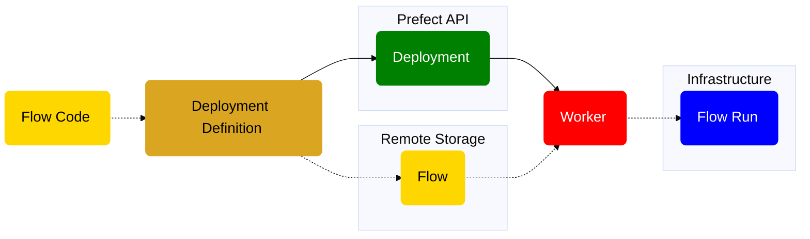

In this guide, you will configure a deployment that uses a work pool for dynamically provisioned infrastructure.
Work pools and workers bridge the Prefect _orchestration environment_ with your _execution environment_. 
When a [deployment](/3.0rc/deploy/serve-flows/) creates a flow run, it is submitted to a specific work pool for scheduling. 
A worker running in the execution environment polls its respective work pool for new runs to execute; or the work pool submits flow runs to serverless infrastructure directly, depending on the type of work pool.

All Prefect flow runs are tracked by the API. The API does not require prior registration of flows.
You can call a flow locally or on a remote environment and it will be trackable.

A deployment turns your workflow into an application you can manage through the Prefect API.
A deployment enables you to:

- Schedule flow runs.
- Specify event triggers for flow runs.
- Assign one or more tags to organize your deployments and flow runs. You can use those tags as filters in the Prefect UI.
- Assign custom parameter values for flow runs based on the deployment.
- Create ad-hoc flow runs from the API or Prefect UI.
- Upload flow files to a defined storage location for retrieval at run time.

<Note>
**Deployments created with `.serve`**

    A deployment created with the Python `flow.serve` method or the `serve` function runs flows in a subprocess on the same 
    machine where the deployment is created. It does not use a work pool or worker.
</Note>

## Work pool-based deployments

A work pool-based deployment is useful to dynamically scale the infrastructure where your flow code runs.
Work pool-based deployments contain information about the infrastructure type and configuration for your workflow execution.

Work pool-based deployment infrastructure options include the following:

- **Process**: runs flow in a subprocess. In most cases, you're better off using `.serve`.
- **[Docker](/3.0rc/deploy/dynamic-infra/deploy-docker/)**: - runs flows in an ephemeral Docker container.
- **[Kubernetes](/3.0rc/deploy/dynamic-infra/deploy-kubernetes/)**: - runs flows as a Kubernetes Job.
- **[Serverless Cloud Provider options](/3.0rc/deploy/dynamic-infra/push-runs-remote/)**: runs flows in a 
Docker container in a serverless cloud provider environment, 
such as AWS ECS, Azure Container Instance, Google Cloud Run, or Vertex AI.

The following diagram provides a high-level overview of the conceptual elements involved in defining a work-pool based 
deployment that is polled by a worker and executes a flow run based on that deployment.



These work pool types require a worker running on your infrastructure to poll a work pool for scheduled flow runs.

<Note>
**Additional work pool options available with Prefect Cloud**

    Prefect Cloud offers other flavors of work pools that don't require a worker:

    - **[Push Work Pools](/3.0rc/deploy/dynamic-infra/push-runs-serverless)**: serverless cloud options that don't require 
    a worker because Prefect Cloud submits them to your serverless cloud infrastructure on your behalf. 
    Prefect can auto-provision your cloud infrastructure for you and set it up to use your work pool.
    - **[Managed Execution](/3.0rc/deploy/control-runs/managed-execution/)**: Prefect Cloud submits and runs your 
    deployment on serverless infrastructure. No cloud provider account required.
</Note>

This guide focuses on deployments that require a worker.

Work pool-based deployments that use a worker also allow you to assign a work queue name to prioritize work 
and allow you to limit concurrent runs at the work pool level.

When creating a deployment that uses a work pool and worker, there are two important considerations:

- What instructions does a [worker](/3.0rc/deploy/control-runs/workers/) require to set up an execution environment for your flow? 
For example, a flow may have Python package requirements, unique Kubernetes settings, or Docker networking configuration.
- How should the flow code be accessed?

[Serve flows](/3.0rc/deploy/serve-flows/) shows how to create a deployment with a long-running process using `.serve`, 
and how to move to a [work-pool-based deployment](/3.0rc/deploy/dynamic-infra/push-runs-remote/) setup with `.deploy`.
Learn more about when to move to [work-pool-based deployments](/3.0rc/deploy/dynamic-infra/push-runs-remote/#why-workers-and-work-pools).

Next, you'll learn how to use `.deploy` to create deployments with Python code.
If you prefer to learn about using a YAML-based alternative for managing deployment configuration, skip to the 
[`prefect.yaml` section](#creating-work-pool-based-deployments-with-prefectyaml).

## Create work pool-based deployments with `.deploy`

### Automatically bake your code into a Docker image

Create a deployment from Python code by calling the `.deploy` method on a flow:

```python buy.py
from prefect import flow


@flow(log_prints=True)
def buy():
    print("Buying securities")


if __name__ == "__main__":
    buy.deploy(
        name="my-code-baked-into-an-image-deployment", 
        work_pool_name="my-docker-pool", 
        image="my_registry/my_image:my_image_tag"
    )
```

Ensure the [work pool](/3.0rc/deploy/control-runs/work-pools/) exists in the Prefect Cloud workspace you are 
authenticated to, or on your running self-hosted server instance.  
Then run the script to create a deployment (in future examples this step is omitted for brevity):

```bash
python buy.py
```

You should see messages in your terminal that Docker is building your image.
When the deployment build succeeds, you will see information in your terminal showing you how to start a worker for your 
deployment, and how to run your deployment.
Your deployment is visible on the `Deployments` page in the UI.

By default, `.deploy` builds a Docker image with your flow code baked into it and pushes the image to the 
[Docker Hub](https://hub.docker.com/) registry specified in the `image` argument`.

<Note>
**Authentication to Docker Hub**

    Your environment must be authenticated to your Docker registry to push an image to it.
</Note>

You can specify a registry other than Docker Hub by providing the full registry path in the `image` argument.

<Warning>
    If building a Docker image, your environment with your deployment needs Docker installed and running.
</Warning>

To avoid pushing to a registry, set `push=False` in the `.deploy` method:

```python

if __name__ == "__main__":
    buy.deploy(
        name="my-code-baked-into-an-image-deployment", 
        work_pool_name="my-docker-pool", 
        image="my_registry/my_image:my_image_tag",
        push=False
    )
```

To avoid building an image, set `build=False` in the `.deploy` method:

```python

if __name__ == "__main__":
    buy.deploy(
        name="my-code-baked-into-an-image-deployment", 
        work_pool_name="my-docker-pool", 
        image="my_registry/no-build-image:1.0",
        build=False
    )
```

The specified image must be available in your deployment's execution environment for accessible flow code.

Prefect generates a Dockerfile for you that builds an image based off of one of Prefect's published images. 
The generated Dockerfile copies the current directory into the Docker image and installs any dependencies listed 
in a `requirements.txt` file.

### Automatically build a custom Docker image with a local Dockerfile

If you want to use a custom Dockerfile, specify the path to the Dockerfile with the `DockerImage` class:

```python custom_dockerfile.py
from prefect import flow
from prefect.docker import DockerImage


@flow(log_prints=True)
def buy():
    print("Selling securities")


if __name__ == "__main__":
    buy.deploy(
        name="my-custom-dockerfile-deployment", 
        work_pool_name="my-docker-pool", 
        image=DockerImage(
            name="my_image",
            tag="deploy-guide",
            dockerfile="Dockerfile"
    ),
    push=False
)

```

The `DockerImage` object enables image customization.

For example, you can install a private Python package from GCP's artifact registry like this:

Create a custom base Dockerfile.

```
FROM python:3.10

ARG AUTHED_ARTIFACT_REG_URL
COPY ./requirements.txt /requirements.txt

RUN pip install --extra-index-url ${AUTHED_ARTIFACT_REG_URL} -r /requirements.txt
```

Create your deployment with the DockerImage class:

```python private-package.py
from prefect import flow
from prefect.deployments.runner import DockerImage
from prefect.blocks.system import Secret
from my_private_package import do_something_cool


@flow(log_prints=True)
def my_flow():
    do_something_cool()


if __name__ == "__main__":
    artifact_reg_url: Secret = Secret.load("artifact-reg-url")
    
    my_flow.deploy(
        name="my-deployment",
        work_pool_name="k8s-demo",
        image=DockerImage(
            name="my-image",
            tag="test",
            dockerfile="Dockerfile",
            buildargs={"AUTHED_ARTIFACT_REG_URL": artifact_reg_url.get()},
        ),
    )
```

Note that you used a [Prefect Secret block](/3.0rc/develop/blocks/) to load the URL configuration for 
the artifact registry above.

See all the optional keyword arguments for the [DockerImage class](https://docker-py.readthedocs.io/en/stable/images.html#docker.models.images.ImageCollection.build).

<Tip>
**Default Docker namespace**

    You can set the `PREFECT_DEFAULT_DOCKER_BUILD_NAMESPACE` setting to append a default Docker namespace to all images 
    you build with `.deploy`. This is helpful if you use a private registry to store your images.

    To set a default Docker namespace for your current profile run:

    ```bash
    prefect config set PREFECT_DEFAULT_DOCKER_BUILD_NAMESPACE=<docker-registry-url>/<organization-or-username>
    ```

    Once set, you can omit the namespace from your image name when creating a deployment:

    ```python with_default_docker_namespace.py
    if __name__ == "__main__":
        buy.deploy(
            name="my-code-baked-into-an-image-deployment", 
            work_pool_name="my-docker-pool", 
            image="my_image:my_image_tag"
        )
    ```

    The above code builds an image with the format `<docker-registry-url>/<organization-or-username>/my_image:my_image_tag` 
    when `PREFECT_DEFAULT_DOCKER_BUILD_NAMESPACE` is set.
</Tip>

### Store your code in git-based cloud storage

While baking code into Docker images is a popular deployment option, many teams store their workflow code in git-based 
storage, such as GitHub, Bitbucket, or Gitlab.

If you don't specify an `image` argument for `.deploy`, you must specify where to pull the flow code from at runtime 
with the `from_source` method.

Here's how to pull your flow code from a GitHub repository:

```python git_storage.py
from prefect import flow

if __name__ == "__main__":
    flow.from_source(
        "https://github.com/my_github_account/my_repo/my_file.git",
        entrypoint="flows/no-image.py:hello_world",
    ).deploy(
        name="no-image-deployment",
        work_pool_name="my_pool",
        build=False
    )
```

The `entrypoint` is the path to the file the flow is located in and the function name, separated by a colon.

Alternatively, you could specify a git-based cloud storage URL for a Bitbucket or Gitlab repository.

<Note>
    If you don't specify an image as part of your deployment creation, the image specified in the work pool 
    runs your flow.
</Note>

After creating a deployment, you may need to change your flow code.
Generally, you can just push your code to GitHub, without rebuilding your deployment.
The exception is if there is something the server needs to know about changes, such as the flow entrypoint parameters.
Rerunning the Python script with `.deploy` updates your deployment on the server with the new flow code.

If you need to provide additional configuration, such as specifying a private repository, you can provide a 
[`GitRepository`](https://prefect-python-sdk-docs.netlify.app/prefect/flows/#prefect.runner.storage.GitRepository) object instead of a URL:

```python private_git_storage.py
from prefect import flow
from prefect.runner.storage import GitRepository
from prefect.blocks.system import Secret

if __name__ == "__main__":
    flow.from_source(
        source=GitRepository(
        url="https://github.com/org/private-repo.git",
        branch="dev",
        credentials={
            "access_token": Secret.load("github-access-token")
        }
    ),
    entrypoint="flows/no-image.py:hello_world",
    ).deploy(
        name="private-git-storage-deployment",
        work_pool_name="my_pool",
        build=False
    )
```

Note the use of the Secret block to load the GitHub access token.
Alternatively, you could provide a username and password to the `username` and `password` fields of the `credentials` argument.

### Store your code in cloud provider storage

Another option for flow code storage is any [fsspec](https://filesystem-spec.readthedocs.io/en/latest/)-supported 
storage location, such as AWS S3, GCP GCS, or Azure Blob Storage.

For example, you can pass the S3 bucket path to `source`.

```python s3_storage.py
from prefect import flow

if __name__ == "__main__":
    flow.from_source(
        source="s3://my-bucket/my-folder",
        entrypoint="flows.py:my_flow",
    ).deploy(
        name="deployment-from-aws-flow",
        work_pool_name="my_pool",
    )
```

In the example above, your credentials are auto-discovered from your deployment creation environment. Your credentials 
must be available in your runtime environment.

If you need additional configuration for your cloud-based storage (for example, with a private S3 Bucket), we recommend using a 
[storage block](/3.0rc/develop/blocks/).
A storage block also ensures your credentials are available in both your deployment creation environment and your execution 
environment.

Here's an example that uses an `S3Bucket` block from the [prefect-aws library](https://prefecthq.github.io/prefect-aws/):

```python s3_storage_auth.py
from prefect import flow
from prefect_aws.s3 import S3Bucket

if __name__ == "__main__":
    flow.from_source(
        source=S3Bucket.load("my-code-storage"), entrypoint="my_file.py:my_flow"
    ).deploy(name="test-s3", work_pool_name="my_pool")
```

The deployment creation mechanics or `.serve` are similar to `.deploy`. `.deploy` 
just requires a work pool name and has a number of parameters dealing with flow code storage for Docker images.

Unlike `.serve`, if you don't specify an image to use for your flow, you must to specify where to pull the flow code from at runtime  
with the `from_source` method; `from_source` is optional with `.serve`.

### Additional configuration with `.deploy`

The examples so far have explored options for where to store flow code.
Next, see deployment configuration options.

To pass parameters to your flow, you can use the `parameters` argument in the `.deploy` method. Just pass in a dictionary of 
key-value pairs.

```python pass_params.py
from prefect import flow

@flow
def hello_world(name: str):
    print(f"Hello, {name}!")

if __name__ == "__main__":
    hello_world.deploy(
        name="pass-params-deployment",
        work_pool_name="my_pool",
        parameters=dict(name="Prefect"),
        image="my_registry/my_image:my_image_tag",
    )
```

The `job_variables` parameter allows you to fine-tune the infrastructure settings for a deployment.
The values passed in override default values in the specified work pool's 
[base job template](/3.0rc/deploy/control-runs/work-pools/#base-job-template).

You can override environment variables, such as `image_pull_policy` and `image`, for a specific deployment with the `job_variables` 
argument.

```python job_var_image_pull.py
if __name__ == "__main__":
    get_repo_info.deploy(
        name="my-deployment-never-pull", 
        work_pool_name="my-docker-pool", 
        job_variables={"image_pull_policy": "Never"},
        image="my-image:my-tag"",
        push=False
    )
```

Similarly, you can override the environment variables specified in a work pool through the `job_variables` parameter:

```python job_var_env_vars.py
if __name__ == "__main__":
    get_repo_info.deploy(
        name="my-deployment-never-pull", 
        work_pool_name="my-docker-pool", 
        job_variables={"env": {"EXTRA_PIP_PACKAGES": "boto3"} },
        image="my-image:my-tag"",
        push=False
    )
```

The dictionary key "EXTRA_PIP_PACKAGES" denotes a special environment variable that Prefect uses to install additional 
Python packages at runtime.
This approach is an alternative to building an image with a custom `requirements.txt` copied into it.

For more information on [overriding job variables](/3.0rc/deploy/dynamic-infra/customize).

### Work with multiple deployments with `deploy`

Create multiple deployments from one or more Python files that use `.deploy`.
You can manage these deployments independently of one another to deploy the same flow with different configurations 
in the same codebase.

To create multiple work pool-based deployments at once, use the `deploy` function, which is analogous to the `serve` function:

```python
from prefect import deploy, flow

@flow(log_prints=True)
def buy():
    print("Buying securities")


if __name__ == "__main__":
    deploy(
        buy.to_deployment(name="dev-deploy", work_pool_name="my-dev-work-pool"),
        buy.to_deployment(name="prod-deploy", work_pool_name="my-prod-work-pool"),
        image="my-registry/my-image:dev",
        push=False,
    )
```

In the example above you created two deployments from the same flow, but with different work pools.
Alternatively, you can create two deployments from different flows:

```python
from prefect import deploy, flow

@flow(log_prints=True)
def buy():
    print("Buying securities.")

@flow(log_prints=True)
def sell():
    print("Selling securities.")


if __name__ == "__main__":
    deploy(
        buy.to_deployment(name="buy-deploy"),
        sell.to_deployment(name="sell-deploy"),
        work_pool_name="my-dev-work-pool"
        image="my-registry/my-image:dev",
        push=False,
    )
```

In the example above, the code for both flows is baked into the same image.

You can specify one or more flows to pull from a remote location at runtime with the `from_source` method.
Here's an example of deploying two flows, one defined locally and one defined in a remote repository:

```python
from prefect import deploy, flow


@flow(log_prints=True)
def local_flow():
    print("I'm a flow!")

if __name__ == "__main__":
    deploy(
        local_flow.to_deployment(name="example-deploy-local-flow"),
        flow.from_source(
            source="https://github.com/org/repo.git",
            entrypoint="flows.py:my_flow",
        ).to_deployment(
            name="example-deploy-remote-flow",
        ),
        work_pool_name="my-work-pool",
        image="my-registry/my-image:dev",
    )
```

You could pass any number of flows to the `deploy` function.
This is useful if using a monorepo approach to your workflows.

## Create work pool-based deployments with prefect.yaml

The `prefect.yaml` file is a YAML file describing base settings for your deployments, procedural steps for preparing deployments, 
and instructions for preparing the execution environment for a deployment run.

Initialize your deployment configuration, which creates the `prefect.yaml` file, with the CLI command `prefect init` 
in any directory or repository that stores your flow code.

<Tip>
**Deployment configuration recipes**

Prefect ships with many off-the-shelf "recipes" that allow you to get started with more structure within 
your `prefect.yaml` file. Run `prefect init` to be prompted with available recipes in your installation. 
You can provide a recipe name in your initialization command with the `--recipe` flag, otherwise Prefect will attempt to 
guess an appropriate recipe based on the structure of your working directory (for example if you initialize within a `git` 
repository, Prefect will use the `git` recipe).
</Tip>

The `prefect.yaml` file contains:

- deployment configuration for deployments created from this file
- default instructions for how to build and push any necessary code artifacts (such as Docker images)
- default instructions for pulling a deployment in remote  execution environments (for example, cloning a GitHub repository).

You can override any deployment configuration through options available on the `prefect deploy` CLI command when creating a deployment.

<Tip>
**`prefect.yaml` file flexibility**

In older versions of Prefect, this file must be in the root of your repository or project directory and named `prefect.yaml`. 
With Prefect 3, this file can be located in a directory outside the project or a subdirectory inside the project. 
It can be named differently if the filename ends in `.yaml`. You can have multiple `prefect.yaml` files with the same name 
in different directories. 

By default, `prefect deploy` uses a `prefect.yaml` file in the project's root directory. To use a custom deployment 
configuration file, supply the new  `--prefect-file` CLI argument when running the `deploy` command from the root of your 
project directory:

`prefect deploy --prefect-file path/to/my_file.yaml`
</Tip>

The base structure for `prefect.yaml` looks like this:

```yaml
# generic metadata
prefect-version: null
name: null

# preparation steps
build: null
push: null

# runtime steps
pull: null

# deployment configurations
deployments:
- # base metadata
    name: null
    version: null
    tags: []
    description: null
    schedule: null

    # flow-specific fields
    entrypoint: null
    parameters: {}

    # infra-specific fields
    work_pool:
    name: null
    work_queue_name: null
    job_variables: {}
```

The metadata fields are always pre-populated for you. These fields are for bookkeeping purposes only. The other sections are 
pre-populated based on recipe; if no recipe is provided, Prefect attempts to guess an appropriate one based on local configuration.

You can create deployments with the CLI command `prefect deploy` without altering the `deployments` section of your 
`prefect.yaml` file. The `prefect deploy` command helps in deployment creation through interactive prompts. The `prefect.yaml` 
file facilitates version-controlling your deployment configuration and managing multiple deployments.

### Deployment actions

Deployment actions defined in your `prefect.yaml` file control the lifecycle of the creation and execution of your deployments.
The three actions available are `build`, `push`, and `pull`.
`pull` is the only required deployment action. It defines how Prefect pulls your deployment in remote execution 
environments.

Each action is defined as a list of steps executed in sequence. Each step has the following format:

```yaml
section:
- prefect_package.path.to.importable.step:
    id: "step-id" # optional
    requires: "pip-installable-package-spec" # optional
    kwarg1: value
    kwarg2: more-values
```

Every step optionally provides a `requires` field. Prefect uses this to auto-install if the step is not  
found in the current environment. Each step can specify an `id` to reference outputs in 
future steps. The additional fields map directly to Python keyword arguments to the step function. Within a given section, 
steps always run in their order within the `prefect.yaml` file.

<Tip> 
**Deployment instruction overrides**

    You can override `build`, `push`, and `pull` sections on a per-deployment basis; define `build`, `push`, and `pull` 
    fields within a deployment definition in the `prefect.yaml` file.

    The `prefect deploy` command uses any `build`, `push`, or `pull` instructions from the deployment's definition in the 
    `prefect.yaml` file.

    This capability is useful for multiple deployments that require different deployment instructions.
</Tip>

### The build action

Use the build section of `prefect.yaml` to specify setup steps or dependencies, 
(like creating a Docker image), required to run your deployments.

If you initialize with the Docker recipe, you are prompted to provide 
required information, such as image name and tag:

```bash
prefect init --recipe docker
>> image_name: < insert image name here >
>> tag: < insert image tag here >
```

<Tip>
**Use `--field` to avoid the interactive experience**

    We recommend that you only initialize a recipe when first creating your deployment structure. Then store 
    your configuration files within version control.
    Sometimes you may need to initialize programmatically and avoid the interactive prompts.  
    To do this, provide all required fields for your recipe using the `--field` flag:

    ```bash
    prefect init --recipe docker \
        --field image_name=my-repo/my-image \
        --field tag=my-tag
    ```

```yaml
build:
- prefect_docker.deployments.steps.build_docker_image:
    requires: prefect-docker>=0.3.0
    image_name: my-repo/my-image
    tag: my-tag
    dockerfile: auto
    push: true
```
</Tip>

Once you confirm that these fields are set to their desired values, this step automatically builds a Docker image with 
the provided name and tag and pushes it to the repository referenced by the image name.  
As the [`prefect-docker` package documentation explains](https://prefecthq.github.io/prefect-docker/deployments/steps/#prefect_docker.deployments.steps.BuildDockerImageResult), 
this step produces optional fields for future steps, or within `prefect.yaml` as template values.  
We recommend using `{{ image }}` within `prefect.yaml` (specifically the work pool's job variables section). This is so  
you don't risk your build step and deployment specification get out of sync with hardcoded values.  

<Note>
**Some steps require Prefect integrations**

In the build step example above, you relied on the `prefect-docker` package; in cases that deal with external services, 
additional required packages are auto-installed for you.
</Note>

**Pass output to downstream steps**

Each deployment action can be composed of multiple steps. For example, if you wanted to build a Docker image tagged with the 
current commit hash, you could use the `run_shell_script` step and feed the output into the `build_docker_image` step:

    ```yaml
    build:
        - prefect.deployments.steps.run_shell_script:
            id: get-commit-hash
            script: git rev-parse --short HEAD
            stream_output: false
        - prefect_docker.deployments.steps.build_docker_image:
            requires: prefect-docker
            image_name: my-image
            image_tag: "{{ get-commit-hash.stdout }}"
            dockerfile: auto
    ```

The `id` field is used in the `run_shell_script` step to reference its output in the next step.

### The push action

The push section is most critical for situations where code is not stored on persistent filesystems or in version control. 
In this scenario, code is often pushed and pulled from a Cloud storage bucket (for example, S3, GCS, Azure Blobs). 
The push section allows users to specify and customize the logic for pushing this code repository to arbitrary remote locations.

For example, a user who stores their code in an S3 bucket and relies on default worker settings for its runtime environment 
could use the `s3` recipe:

```bash
prefect init --recipe s3
>> bucket: < insert bucket name here >
```

In your newly created`prefect.yaml` file, you should find that the `push` and `pull` sections have been templated out 
as follows:

```yaml
push:
- prefect_aws.deployments.steps.push_to_s3:
    id: push-code
    requires: prefect-aws>=0.3.0
    bucket: my-bucket
    folder: project-name
    credentials: null

pull:
- prefect_aws.deployments.steps.pull_from_s3:
    requires: prefect-aws>=0.3.0
    bucket: my-bucket
    folder: "{{ push-code.folder }}"
    credentials: null
```

The bucket is populated with the provided value (which also could have been provided with the `--field` flag); note that the 
`folder` property of the `push` step is a template—the `pull_from_s3` step outputs both a `bucket` value as well as a `folder` 
value for the template downstream steps. This helps you keep your steps consistent across edits.

As discussed above, if you use [blocks](/3.0rc/develop/blocks/), you can template the credentials section with 
a block reference for secure and dynamic credentials access:

```yaml
push:
- prefect_aws.deployments.steps.push_to_s3:
    requires: prefect-aws>=0.3.0
    bucket: my-bucket
    folder: project-name
    credentials: "{{ prefect.blocks.aws-credentials.dev-credentials }}"
```

Anytime you run `prefect deploy`, this `push` section executes upon successful completion of your `build` section.

### The pull action

The pull section is the most important section within the `prefect.yaml` file. It contains instructions for preparing your 
flows for a deployment run. These instructions execute each time a deployment in this folder is run through a worker.

There are three main types of steps that typically show up in a `pull` section:

- `set_working_directory`: this step sets the working directory for the process prior to importing your flow
- `git_clone`: this step clones the provided repository on the provided branch
- `pull_from_{cloud}`: this step pulls the working directory from a Cloud storage location (for example, S3)

<Tip> 
**Use block and variable references**

    All [block and variable references](#templating-options) within your pull step will remain unresolved until runtime and 
    are pulled each time your deployment runs. This avoids storing sensitive information insecurely; it 
    also allows you to manage certain types of configuration from the API and UI without having to rebuild your deployment every time.
</Tip>

Below is an example of how to use an existing `GitHubCredentials` block to clone a private GitHub repository:

```yaml
pull:
    - prefect.deployments.steps.git_clone:
        repository: https://github.com/org/repo.git
        credentials: "{{ prefect.blocks.github-credentials.my-credentials }}"
```

Alternatively, you can specify a `BitBucketCredentials` or `GitLabCredentials` block to clone from Bitbucket or GitLab. In 
lieu of a credentials block, you can also provide a GitHub, GitLab, or Bitbucket token directly to the 'access_token` field. 
Use a Secret block to do this securely:

```yaml
pull:
    - prefect.deployments.steps.git_clone:
        repository: https://bitbucket.org/org/repo.git
        access_token: "{{ prefect.blocks.secret.bitbucket-token }}"
```

### Utility steps

Use utility steps within a build, push, or pull action to assist in managing the deployment lifecycle:

- `run_shell_script` allows for the execution of one or more shell commands in a subprocess, and returns the standard output 
and standard error of the script.
This step is useful for scripts that require execution in a specific environment, or those which have specific input and output 
requirements.

Here is an example of retrieving the short Git commit hash of the current repository to use as a Docker image tag:

```yaml
build:
    - prefect.deployments.steps.run_shell_script:
        id: get-commit-hash
        script: git rev-parse --short HEAD
        stream_output: false
    - prefect_docker.deployments.steps.build_docker_image:
        requires: prefect-docker>=0.3.0
        image_name: my-image
        tag: "{{ get-commit-hash.stdout }}"
        dockerfile: auto
```

<Warning>
**Provided environment variables are not expanded by default**

    To expand environment variables in your shell script, set `expand_env_vars: true` in your `run_shell_script` step. For example:

    ```yaml
    - prefect.deployments.steps.run_shell_script:
        id: get-user
        script: echo $USER
        stream_output: true
        expand_env_vars: true
    ```

    Without `expand_env_vars: true`, the above step returns a literal string `$USER` instead of the current user.
</Warning>

- `pip_install_requirements` installs dependencies from a `requirements.txt` file within a specified directory.

Here is an example of installing dependencies from a `requirements.txt` file after cloning:

```yaml
pull:
    - prefect.deployments.steps.git_clone:
        id: clone-step  # needed in order to be referenced in subsequent steps
        repository: https://github.com/org/repo.git
    - prefect.deployments.steps.pip_install_requirements:
        directory: {{ clone-step.directory }}  # `clone-step` is a user-provided `id` field
        requirements_file: requirements.txt
```

Here is an example that retrieves an access token from a third party key vault and uses it in a private clone step:

```yaml
pull:
- prefect.deployments.steps.run_shell_script:
    id: get-access-token
    script: az keyvault secret show --name <secret name> --vault-name <secret vault> --query "value" --output tsv
    stream_output: false
- prefect.deployments.steps.git_clone:
    repository: https://bitbucket.org/samples/deployments.git
    branch: master
    access_token: "{{ get-access-token.stdout }}"
```

You can also run custom steps by packaging them. In the example below, `retrieve_secrets` is a custom python module packaged 
into the default working directory of a Docker image (which is /opt/prefect by default).
`main` is the function entry point, which returns an access token (for example, `return {"access_token": access_token}`) like the 
preceding example, but utilizing the Azure Python SDK for retrieval.

```yaml
- retrieve_secrets.main:
    id: get-access-token
- prefect.deployments.steps.git_clone:
    repository: https://bitbucket.org/samples/deployments.git
    branch: master
    access_token: '{{ get-access-token.access_token }}'
```

### Templating options

Values that you place within your `prefect.yaml` file can reference dynamic values in several different ways:

- **step outputs**: every step of both `build` and `push` produce named fields such as `image_name`; you can reference these 
fields within `prefect.yaml` and `prefect deploy` will populate them with each call. References must be enclosed in double 
brackets and in `"{{ field_name }}"` format
- **blocks**: you can reference [Prefect blocks](/3.0rc/develop/blocks) with the  
`{{ prefect.blocks.block_type.block_slug }}` syntax. It is highly recommended that you use block references for any sensitive 
information (such as a GitHub access token or any credentials) to avoid hardcoding these values in plaintext
- **variables**: you can reference [Prefect variables](/3.0rc/develop/variables) with the  
`{{ prefect.variables.variable_name }}` syntax. Use variables to reference non-sensitive, reusable pieces of information 
such as a default image name or a default work pool name.
- **environment variables**: you can also reference environment variables with the special syntax `{{ $MY_ENV_VAR }}`. 
This is especially useful for referencing environment variables that are set at runtime.

Here's a `prefect.yaml` file as an example:

```yaml
build:
- prefect_docker.deployments.steps.build_docker_image:
    id: build-image
    requires: prefect-docker>=0.3.0
    image_name: my-repo/my-image
    tag: my-tag
    dockerfile: auto
    push: true

deployments:
- # base metadata
    name: null
    version: "{{ build-image.tag }}"
    tags:
        - "{{ $my_deployment_tag }}"
        - "{{ prefect.variables.some_common_tag }}"
    description: null
    schedule: null

    # flow-specific fields
    entrypoint: null
    parameters: {}

    # infra-specific fields
    work_pool:
        name: "my-k8s-work-pool"
        work_queue_name: null
        job_variables:
            image: "{{ build-image.image }}"
            cluster_config: "{{ prefect.blocks.kubernetes-cluster-config.my-favorite-config }}"
```

So long as your `build` steps produce fields called `image_name` and `tag`, every time you deploy a new version of our deployment, 
the `{{ build-image.image }}` variable is dynamically populated with the relevant values.

<Note>
**Docker step**

    The most commonly used build step is 
    [`prefect_docker.deployments.steps.build_docker_image`](/3.0rc/deploy/dynamic-infra/deploy-docker/) 
    which produces both the `image_name` and `tag` fields.

    For an example, check out [Deploy Docker](/3.0rc/deploy/dynamic-infra/deploy-docker/).
</Note>

A `prefect.yaml` file can have multiple deployment configurations that control the behavior of several deployments.
You can manage these deployments independently of one another, allowing you to deploy the same flow with different 
configurations in the same codebase.

### Work with multiple deployments with prefect.yaml

Prefect supports multiple deployment declarations within the `prefect.yaml` file. This method of declaring multiple 
deployments supports version control for all deployments through a single command.

Add new deployment declarations to the `prefect.yaml` file with a new entry to the `deployments` list. 
Each deployment declaration must have a unique `name` field to select deployment declarations when using the 
`prefect deploy` command.

<Warning>
    When using a `prefect.yaml` file that is in another directory or differently named, the value for
    the deployment `entrypoint` must be relative to the root directory of the project.
</Warning>

For example, consider the following `prefect.yaml` file:

```yaml
build: ...
push: ...
pull: ...

deployments:
- name: deployment-1
    entrypoint: flows/hello.py:my_flow
    parameters:
        number: 42,
        message: Don't panic!
    work_pool:
        name: my-process-work-pool
        work_queue_name: primary-queue

- name: deployment-2
    entrypoint: flows/goodbye.py:my_other_flow
    work_pool:
        name: my-process-work-pool
        work_queue_name: secondary-queue

- name: deployment-3
    entrypoint: flows/hello.py:yet_another_flow
    work_pool:
        name: my-docker-work-pool
        work_queue_name: tertiary-queue
```

This file has three deployment declarations, each referencing a different flow. Each deployment declaration has a unique `name` 
field and can be deployed individually with the `--name` flag when deploying.

For example, to deploy `deployment-1`, run:

```bash
prefect deploy --name deployment-1
```

To deploy multiple deployments, provide multiple `--name` flags:

```bash
prefect deploy --name deployment-1 --name deployment-2
```

To deploy multiple deployments with the same name, prefix the deployment name with its flow name:

```bash
prefect deploy --name my_flow/deployment-1 --name my_other_flow/deployment-1
```

To deploy all deployments, use the `--all` flag:

```bash
prefect deploy --all
```

To deploy deployments that match a pattern, run:

```bash
prefect deploy -n my-flow/* -n *dev/my-deployment -n dep*prod
```

The above command deploys:
- all deployments from the flow `my-flow`
- all flows ending in `dev` with a deployment named 
`my-deployment`
- all deployments starting with `dep` and ending in `prod`.

<Note>
**CLI Options When deploying multiple deployments**

    When deploying more than one deployment with a single `prefect deploy` command, any additional attributes provided are ignored.

    To provide overrides to a deployment through the CLI, you must deploy that deployment individually.
</Note>

### Reuse configuration across deployments

Because a `prefect.yaml` file is a standard YAML file, you can use [YAML aliases](https://yaml.org/spec/1.2.2/#71-alias-nodes) 
to reuse configuration across deployments.

This functionality allows multiple deployments to share the work pool configuration, deployment actions, or other 
configurations.

Declare a YAML alias with the `&{alias_name}` syntax and insert that alias elsewhere in the file with the `*{alias_name}` 
syntax. When aliasing YAML maps, you can override specific fields of the aliased map with the `<<: *{alias_name}` syntax and 
adding additional fields below.

We recommend adding a `definitions` section to your `prefect.yaml` file at the same level as the `deployments` section to store your 
aliases.

For example:

```yaml
build: ...
push: ...
pull: ...

definitions:
    work_pools:
        my_docker_work_pool: &my_docker_work_pool
            name: my-docker-work-pool
            work_queue_name: default
            job_variables:
                image: "{{ build-image.image }}"
    schedules:
        every_ten_minutes: &every_10_minutes
            interval: 600
    actions:
        docker_build: &docker_build
            - prefect_docker.deployments.steps.build_docker_image: &docker_build_config
                id: build-image
                requires: prefect-docker>=0.3.0
                image_name: my-example-image
                tag: dev
                dockerfile: auto
                push: true

deployments:
- name: deployment-1
    entrypoint: flows/hello.py:my_flow
    schedule: *every_10_minutes
    parameters:
        number: 42,
        message: Don't panic!
    work_pool: *my_docker_work_pool
    build: *docker_build # Uses the full docker_build action with no overrides

- name: deployment-2
    entrypoint: flows/goodbye.py:my_other_flow
    work_pool: *my_docker_work_pool
    build:
        - prefect_docker.deployments.steps.build_docker_image:
            <<: *docker_build_config # Uses the docker_build_config alias and overrides the dockerfile field
            dockerfile: Dockerfile.custom

- name: deployment-3
    entrypoint: flows/hello.py:yet_another_flow
    schedule: *every_10_minutes
    work_pool:
        name: my-process-work-pool
        work_queue_name: primary-queue

```

In the above example, YAML aliases reuse work pool, schedule, and build configuration across multiple deployments:

- `deployment-1` and `deployment-2` use the same work pool configuration
- `deployment-1` and `deployment-3` use the same schedule
- `deployment-1` and `deployment-2` use the same build deployment action, but `deployment-2` overrides the `dockerfile` 
field to use a custom Dockerfile

### Deployment declaration reference

#### Deployment fields

These are fields you can add to each deployment declaration.

| Property                                   | Description                                                                                                                                                                                                                                                                              |
| ------------------------------------------ | ---------------------------------------------------------------------------------------------------------------------------------------------------------------------------------------------------------------------------------------------------------------------------------------- |
| `name`                                     | The name to give to the created deployment. Used with the `prefect deploy` command to create or update specific deployments.                                                                                                                                                             |
| `version`                                  | An optional version for the deployment.                                                                                                                                                                                                                                                  |
| `tags`                                     | A list of strings to assign to the deployment as tags.                                                                                                                                                                                                                                   |
| <span class="no-wrap">`description`</span> | An optional description for the deployment.                                                                                                                                                                                                                                              |
| `schedule`                                 | An optional [schedule](/3.0rc/automate/add-schedules) to assign to the deployment. Fields for this section are documented in the [Schedule Fields](#schedule-fields) section.                                                                                                                      |
| `triggers`                                  | An optional array of [triggers](/3.0rc/deploy/serve-flows/#create-a-flow-run-with-an-event-trigger) to assign to the deployment |
| `entrypoint`                               | Required path to the `.py` file containing the flow you want to deploy (relative to the root directory of your development folder) combined with the name of the flow function. In the format `path/to/file.py:flow_function_name`. |
| `parameters`                               | Optional default values to provide for the parameters of the deployed flow. Should be an object with key/value pairs.                                                                                                                                                                    |
| <span class="no-wrap">`enforce_parameter_schema`</span>                              | Boolean flag that determines whether the API should validate the parameters passed to a flow run against the parameter schema generated for the deployed flow.                                                                                                                                                                    |
| `work_pool`                                | Information of where to schedule flow runs for the deployment. Fields for this section are documented in the [Work Pool Fields](#work-pool-fields) section.                                                                                                                              |

#### Schedule fields

These are fields you can add to a deployment declaration's `schedule` section.

| Property                                   | Description                                                                                                                                                                                                            |
| ------------------------------------------ | ---------------------------------------------------------------------------------------------------------------------------------------------------------------------------------------------------------------------- |
| `interval`                                 | Number of seconds indicating the time between flow runs. Cannot use them in conjunction with `cron` or `rrule`.                                                                                                         |
| <span class="no-wrap">`anchor_date`</span> | Datetime string indicating the starting or "anchor" date to begin the schedule. If no `anchor_date` is supplied, the current UTC time is used. Can only use with `interval`.                                       |
| `timezone`                                 | String name of a time zone, used to enforce localization behaviors like DST boundaries. See the [IANA Time Zone Database](https://www.iana.org/time-zones) for valid time zones.                                       |
| `cron`                                     | A valid cron string. Cannot use in conjunction with `interval` or `rrule`.                                                                                                                                         |
| `day_or`                                   | Boolean indicating how croniter handles day and day_of_week entries. Must use with `cron`. Defaults to `True`.                                                                                                     |
| `rrule`                                    | String representation of an RRule schedule. See the [`rrulestr` examples](https://dateutil.readthedocs.io/en/stable/rrule.html#rrulestr-examples) for syntax. Cannot used them in conjunction with `interval` or `cron`. |


#### Work pool fields

These are fields you can add to a deployment declaration's `work_pool` section.

| Property                                       | Description                                                                                                                                                                                               |
| ---------------------------------------------- | --------------------------------------------------------------------------------------------------------------------------------------------------------------------------------------------------------- |
| `name`                                         | The name of the work pool to schedule flow runs in for the deployment.                                                                                                                                    |
| <span class="no-wrap">`work_queue_name`</span> | The name of the work queue within the specified work pool to schedule flow runs in for the deployment. If not provided, the default queue for the specified work pool is used.                       |
| `job_variables`                                | Values used to override the default values in the specified work pool's [base job template](/3.0rc/deploy/control-runs/work-pools/#base-job-template). Maps directly to a created deployments `infra_overrides` attribute. |

#### Deployment mechanics

Anytime you run `prefect deploy` in a directory that contains a `prefect.yaml` file, the following actions take place in order:

- The `prefect.yaml` file load. First, the `build` section loads and all variable and block references resolve. The steps then run in the order provided.
- Next, the `push` section loads and all variable and block references resolve; the steps within this section then run in the order provided.
- Next, the `pull` section is templated with any step outputs but _is not run_. Block references are _not_ hydrated for security purposes: they are always resolved at runtime.
- Next, all variable and block references resolve with the deployment declaration. All flags provided through the `prefect deploy` CLI are then overlaid on the values loaded from the file.
- The final step occurs when the fully realized deployment specification is registered with the Prefect API.

<Tip>
**Deployment instruction overrides**

The `build`, `push`, and `pull` sections in deployment definitions take precedence over the corresponding sections above them in 
`prefect.yaml`.
</Tip>

Each time a step runs, the following actions take place in order:

- The step's inputs and block / variable references resolve.
- The step's function is imported; if it cannot be found, the special `requires` keyword installs the necessary packages.
- The step's function is called with the resolved inputs.
- The step's output is returned and used to resolve inputs for subsequent steps.

## Next steps

Now that you are familiar with creating deployments, you can explore infrastructure options for running your deployments:

- [Managed work pools](/3.0rc/deploy/control-runs/managed-execution/)
- [Push work pools](/3.0rc/deploy/dynamic-infra/push-runs-serverless/)
- [Kubernetes work pools](/3.0rc/deploy/dynamic-infra/deploy-kubernetes/)
- [Serverless hybrid work pools](/3.0rc/deploy/dynamic-infra/push-runs-remote/)
