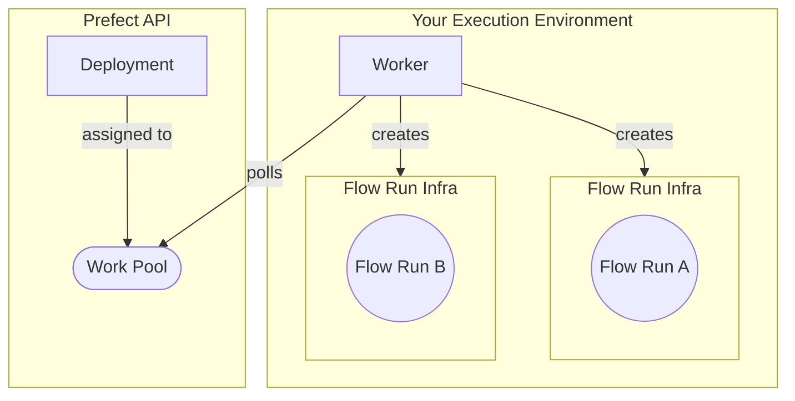

## Prerequisites

[Docker](https://docs.docker.com/engine/install/) installed and running on your machine.

## About workers

In the previous section of the tutorial, you learned how:

- work pools are a bridge between the Prefect orchestration layer and infrastructure for flow runs, and can be dynamically provisioned.
- to transition from persistent infrastructure to dynamic infrastructure with `flow.deploy` instead of `flow.serve`.

Work pools that rely on client-side workers enable you to run work flows in your own Docker containers, Kubernetes clusters, and serverless environments such as AWS ECS, Azure Container Instances, and GCP Cloud Run.

The following diagram summarizes the architecture of a worker-based work pool deployment:



<Tip>
Notice above that the worker is in charge of provisioning the _flow run infrastructure_.
In the context of this tutorial, that flow run infrastructure is an ephemeral Docker container to host each flow run.
Different [worker types](/3.0rc/deploy/dynamic-infra/control-runs/#worker-types) create different types of flow run infrastructure.
</Tip>

Next, create a work pool and worker to deploy your tutorial flow. You will execute it later with the Prefect API.

## Set up a work pool and worker

For this tutorial you will create a **Docker** type work pool through the CLI.

Using the **Docker** work pool type means that all work sent to this work pool runs within a dedicated Docker container using a Docker client available to the worker.

<Tip>
    **Other work pool types**

    There are [work pool types](/3.0rc/deploy/dynamic-infra/control-runs/#worker-types) for serverless computing environments such as AWS ECS, Azure Container Instances, Google Cloud Run, and Vertex AI.
    Kubernetes is also a popular work pool type.
</Tip>

### Create a work pool

To set up a **Docker** type work pool, run:


```bash
prefect work-pool create --type docker my-docker-pool
```


To confirm the work pool creation was successful, run:


```bash
prefect work-pool ls
```


You should see your new `my-docker-pool` listed in the output.

Next, check that you can see this work pool in your Prefect UI.

Navigate to the **Work Pools** tab and verify that you see `my-docker-pool` listed.

When you click into `my-docker-pool`, you should see a red status icon signifying that this work pool is not ready.

To make the work pool ready, start a worker.

### Start a worker

Workers are a lightweight polling process that kick off scheduled flow runs on a specific type of infrastructure (such as Docker).
To start a worker on your local machine, open a new terminal and confirm that your virtual environment has `prefect` installed.

Run the following command in this new terminal to start the worker:


```bash
prefect worker start --pool my-docker-pool

```


You should see the worker start.
It's now polling the Prefect API to check for any scheduled flow runs it should pick up and then submit for execution.
You’ll see your new worker listed in the UI under the **Workers** tab of the Work Pools page with a recent last polled date.

You should now see a `Ready` status indicator on your work pool.

Keep this terminal session active for the worker to continue to pick up jobs.
Since you are running this worker locally, the worker will terminate if you close the terminal.
In a production setting this worker should run as a [daemonized or managed process](/3.0rc/deploy/dynamic-infra/push-runs-remote/).

Next, deploy your tutorial flow to `my-docker-pool`.

## Create the deployment

From the previous steps, you now have:

1. [A flow](/3.0rc/develop/write-workflows/)
2. A work pool
3. A worker

Update your `repo_info.py` file to build a Docker image, and update your deployment so your worker can execute it.

Make the following updates in `repo_info.py`:

1. Change `flow.serve` to `flow.deploy`.
2. Tell `flow.deploy` which work pool to deploy to.
3. Tell `flow.deploy` the name for the Docker image to build.

The updated `repo_info.py` looks like this:

```python hl_lines="17-22" title="repo_info.py"
import httpx
from prefect import flow


@flow(log_prints=True)
def get_repo_info(repo_name: str = "PrefectHQ/prefect"):
    url = f"https://api.github.com/repos/{repo_name}"
    response = httpx.get(url)
    response.raise_for_status()
    repo = response.json()
    print(f"{repo_name} repository statistics 🤓:")
    print(f"Stars 🌠 : {repo['stargazers_count']}")
    print(f"Forks 🍴 : {repo['forks_count']}")


if __name__ == "__main__":
    get_repo_info.deploy(
        name="my-first-deployment", 
        work_pool_name="my-docker-pool", 
        image="my-first-deployment-image:tutorial",
        push=False
    )
```

<Note>
    **Why the `push=False`?**

    For this tutorial, your Docker worker is running on your machine, so you don't need to push the image built by `flow.deploy` to a registry. When your worker is running on a remote machine, you must push the image to a registry that the worker can access.

    Remove the `push=False` argument, include your registry name, and ensure you've [authenticated with the Docker CLI](https://docs.docker.com/engine/reference/commandline/login/) to push the image to a registry.

</Note>

Now that you've updated your script, run it to deploy your flow to the work pool:


```bash
python repo_info.py
```


Prefect builds a custom Docker image containing your workflow code that the worker can use to dynamically spawn Docker containers whenever this workflow needs to run.

<Note>
    **Dockerfile**
    
    In this example, Prefect generates a Dockerfile for you that builds an image based on one of Prefect's published images. The generated Dockerfile copies the current directory into the Docker image and installs any dependencies listed in a `requirements.txt` file.

    To use a custom Dockerfile, specify the path to the Dockerfile using the `DeploymentImage` class:

    ```python hl_lines="21-25" title="repo_info.py"
    import httpx
    from prefect import flow
    from prefect.deployments import DeploymentImage


    @flow(log_prints=True)
    def get_repo_info(repo_name: str = "PrefectHQ/prefect"):
        url = f"https://api.github.com/repos/{repo_name}"
        response = httpx.get(url)
        response.raise_for_status()
        repo = response.json()
        print(f"{repo_name} repository statistics 🤓:")
        print(f"Stars 🌠 : {repo['stargazers_count']}")
        print(f"Forks 🍴 : {repo['forks_count']}")


    if __name__ == "__main__":
        get_repo_info.deploy(
            name="my-first-deployment", 
            work_pool_name="my-docker-pool", 
            image=DeploymentImage(
                name="my-first-deployment-image",
                tag="tutorial",
                dockerfile="Dockerfile"
            ),
            push=False
        )
    ```
</Note>
### Modify the deployment

To update your deployment, modify your script and rerun it. You'll need to make one update to specify a value for `job_variables` to ensure your Docker worker can successfully execute scheduled runs for this flow. See the example below.

The `job_variables` section allows you to fine-tune the infrastructure settings for a specific deployment. These values override default values in the specified work pool's [base job template](/3.0rc/deploy/dynamic-infra/control-runs/#base-job-template).

When testing images locally without pushing them to a registry (to avoid potential errors like docker.errors.NotFound), we recommend including an `image_pull_policy` job_variable set to `Never`. However, for production workflows, push images to a remote registry for more reliability and accessibility.

Set the `image_pull_policy` as `Never` for this tutorial deployment without affecting the default value set on your work pool:

```python hl_lines="21" title="repo_info.py"
import httpx
from prefect import flow


@flow(log_prints=True)
def get_repo_info(repo_name: str = "PrefectHQ/prefect"):
    url = f"https://api.github.com/repos/{repo_name}"
    response = httpx.get(url)
    response.raise_for_status()
    repo = response.json()
    print(f"{repo_name} repository statistics 🤓:")
    print(f"Stars 🌠 : {repo['stargazers_count']}")
    print(f"Forks 🍴 : {repo['forks_count']}")


if __name__ == "__main__":
    get_repo_info.deploy(
        name="my-first-deployment", 
        work_pool_name="my-docker-pool", 
        job_variables={"image_pull_policy": "Never"},
        image="my-first-deployment-image:tutorial",
        push=False
    )
```

To register this update to your deployment's parameters with Prefect's API, run:


```bash
python repo_info.py
```


Submit a flow-run to the work pool:


```bash
prefect deployment run 'get_repo_info/my-deployment'
```


<Warning>
    **Common Pitfall**
    
    - Store and run your deploy scripts at the **root of your repo**, otherwise the built Docker file may be missing files that it needs to execute.
</Warning>

<Tip>
    **Multiple deployments**
    
    A Prefect flow can have more than one deployment. 
    This pattern is useful for a flow to run in different execution environments.
</Tip>

## Learn more

- Learn how to configure deployments in YAML with [`prefect.yaml`](/3.0rc/guides/prefect-deploy/).
- [Guides](/3.0rc/guides/) provide step-by-step recipes for common Prefect operations including:
  - [Deploying flows on Kubernetes](/3.0rc/deploy/dynamic-infra/deploy-kubernetes/)
  - [Deploying flows in Docker](/3.0rc/deploy/dynamic-infra/deploy-docker/)
  - [Deploying flows on serverless infrastructure](/3.0rc/deploy/dynamic-infra/push-runs-remote/)
  - [Daemonizing workers](/3.0rc/deploy/dynamic-infra/push-runs-remote/)

# Run Deployments on Serverless Infrastructure with Prefect Workers

Prefect provides hybrid work pools for workers to run flows on the serverless platforms of major cloud providers.
The following options are available:

- AWS Elastic Container Service (ECS)
- Azure Container Instances (ACI)
- Google Cloud Run
- Google Cloud Run V2
- Google Vertex AI


- Create a work pool that sends work to your chosen serverless infrastructure
- Deploy a flow to that work pool
- Start a worker in your serverless cloud provider that will poll its matched work pool for scheduled runs
- Schedule a deployment run that a worker will pick up from the work pool and run on your serverless infrastructure

!!! note "Push work pools don't require a worker"
    Options for push work pool versions of AWS ECS, Azure Container Instances, and Google Cloud Run that do not require a worker are available with Prefect Cloud.
    These push work pool options require connection configuration information to be stored on Prefect Cloud.
    Read more in the [Serverless Push Work Pool Guide](/3.0rc/deploy/dynamic-infra/push-runs-serverless/).

This is a brief overview of the options to run workflows on serverless infrastructure.
For in-depth guides, see the Prefect integration libraries:

- [AWS ECS guide in the `prefect-aws` docs](https://prefecthq.github.io/prefect-aws/ecs_guide/)
- [Azure Container Instances guide](/3.0rc/integrations/prefect-azure/aci_worker/)
- [Google Cloud Run guide in the `prefect-gcp` docs](https://prefecthq.github.io/prefect-gcp/gcp-worker-guide/).
- For Google Vertex AI, follow the Cloud Run guide, substituting *Google Vertex AI* where *Google Cloud Run* is mentioned.

!!! note "Choosing between Google Cloud Run and Google Vertex AI"
    Google Vertex AI is well-suited for machine learning model training applications in which GPUs or TPUs and high resource levels are desired.

## Steps

1. Make sure you have an user or service account on your chosen cloud provider with the necessary permissions to run serverless jobs
1. Create the appropriate serverless work pool that uses a worker in the Prefect UI
1. Create a deployment that references the work pool
1. Start a worker in your chose serverless cloud provider infrastructure
1. Run the deployment

## Next steps

Options for push versions on AWS ECS, Azure Container Instances, and Google Cloud Run work pools that do not require a worker are available with Prefect Cloud.
Read more in the [Serverless Push Work Pool Guide](/3.0rc/deploy/dynamic-infra/push-runs-serverless/).

Learn more about workers and work pools in the [Prefect concept documentation](/3.0rc/deploy/dynamic-infra/control-runs/).

Learn about installing dependencies at runtime or baking them into your Docker image in the [Deploying Flows to Work Pools and Workers guide](/3.0rc/guides/prefect-deploy/#creating-work-pool-based-deployments-with-deploy).

# Daemonize Processes for Prefect Deployments

When running workflow applications, it can be helpful to create long-running processes that run at startup and are robust to failure.
In this guide you'll learn how to set up a systemd service to create long-running Prefect processes that poll for scheduled flow runs.

A systemd service is ideal for running a long-lived process on a Linux VM or physical Linux server.
We will leverage systemd and see how to automatically start a [Prefect worker](/3.0rc/deploy/dynamic-infra/control-runs/#worker-overview) or long-lived [`serve` process](/3.0rc/develop/write-workflows/#serving-a-flow) when Linux starts.
This approach provides resilience by automatically restarting the process if it crashes.

In this guide we will:

* Create a Linux user
* Install and configure Prefect
* Set up a systemd service for the Prefect worker or `.serve` process

## Prerequisites

* An environment with a linux operating system with [systemd](https://systemd.io/) and Python 3.9 or later.
* A superuser account (you can run `sudo` commands).
* A Prefect Cloud account, or a local instance of a Prefect server running on your network.
* If daemonizing a worker, you'll need a Prefect [deployment](/3.0rc/deploy/serve-workflows/) with a [work pool](/3.0rc/deploy/dynamic-infra/control-runs/) your worker can connect to.

If using an [AWS t2-micro EC2 instance](https://aws.amazon.com/ec2/instance-types/t2/) with an AWS Linux image, you can install Python and pip with `sudo yum install -y python3 python3-pip`.

## Step 1: Add a user

Create a user account on your linux system for the Prefect process.
While you can run a worker or serve process as root, it's good security practice to avoid doing so unless you are sure you need to.

In a terminal, run:

```bash
sudo useradd -m prefect
sudo passwd prefect
```

When prompted, enter a password for the `prefect` account.

Next, log in to the `prefect` account by running:

```bash
sudo su prefect
```

## Step 2: Install Prefect

Run:

```bash
pip3 install prefect
```

This guide assumes you are installing Prefect globally, not in a virtual environment.
If running a systemd service in a virtual environment, you'll just need to change the ExecPath.
For example, if using [venv](https://docs.python.org/3/library/venv.html), change the ExecPath to target the `prefect` application in the `bin` subdirectory of your virtual environment.

Next, set up your environment so that the Prefect client will know which server to connect to.

If connecting to Prefect Cloud, follow [the instructions](https://docs.prefect.io/ui/cloud-get-started/#create-an-api-key) to obtain an API key and then run the following:

```bash
prefect cloud login -k YOUR_API_KEY
```

When prompted, choose the Prefect workspace you'd like to log in to.

If connecting to a self-hosted Prefect server instance instead of Prefect Cloud, run the following and substitute the IP address of your server:

```bash
prefect config set PREFECT_API_URL=http://your-prefect-server-IP:4200
```

Finally, run the `exit` command to sign out of the `prefect` Linux account.
This command switches you back to your sudo-enabled account so you will can run the commands in the next section.

## Step 3: Set up a systemd service

See the section below if you are setting up a Prefect worker.
Skip to the [next section](#setting-up-a-systemd-service-for-serve) if you are setting up a Prefect `.serve` process.

### Setting up a systemd service for a Prefect worker

Move into the `/etc/systemd/system` folder and open a file for editing.
We use the Vim text editor below.

```bash
cd /etc/systemd/system
sudo vim my-prefect-service.service
```

```title="my-prefect-service.service"
[Unit]
Description=Prefect worker

[Service]
User=prefect
WorkingDirectory=/home
ExecStart=prefect worker start --pool YOUR_WORK_POOL_NAME
Restart=always

[Install]
WantedBy=multi-user.target
```

Make sure you substitute your own work pool name.

### Setting up a systemd service for `.serve`

Copy your flow entrypoint Python file and any other files needed for your flow to run into the `/home` directory (or the directory of your choice).

Here's a basic example flow:

```python title="my_file.py"
from prefect import flow


@flow(log_prints=True)
def say_hi():
    print("Hello!")

if __name__=="__main__":
    say_hi.serve(name="Greeting from daemonized .serve")
```

If you want to make changes to your flow code without restarting your process, you can push your code to git-based cloud storage (GitHub, BitBucket, GitLab) and use `flow.from_source().serve()`, as in the example below.

```python title="my_remote_flow_code_file.py"
if __name__ == "__main__":
flow.from_source(
    source="https://github.com/org/repo.git",
    entrypoint="path/to/my_remote_flow_code_file.py:say_hi",
).serve(name="deployment-with-github-storage")
```

Make sure you substitute your own flow code entrypoint path.

Note that if you change the flow entrypoint parameters, you will need to restart the process.

Move into the `/etc/systemd/system` folder and open a file for editing.
We use the Vim text editor below.

```bash
cd /etc/systemd/system
sudo vim my-prefect-service.service
```

```title="my-prefect-service.service"
[Unit]
Description=Prefect serve

[Service]
User=prefect
WorkingDirectory=/home
ExecStart=python3 my_file.py
Restart=always

[Install]
WantedBy=multi-user.target
```

## Save, enable, and start the service

To save the file and exit Vim hit the escape key, type `:wq!`, then press the return key.

Next, run `sudo systemctl daemon-reload` to make systemd aware of your new service.

Then, run `sudo systemctl enable my-prefect-service` to enable the service.
This command will ensure it runs when your system boots.

Next, run `sudo systemctl start my-prefect-service` to start the service.

Run your deployment from UI and check out the logs on the **Flow Runs** page.

You can see if your daemonized Prefect worker or serve process is running and see the Prefect logs with `systemctl status my-prefect-service`.

That's it!
You now have a systemd service that starts when your system boots, and will restart if it ever crashes.

## Next steps

If you want to set up a long-lived process on a Windows machine the pattern is similar.
Instead of systemd, you can use [NSSM](https://nssm.cc/).

Check out other [Prefect guides](/3.0rc/guides/) to see what else you can do with Prefect!
