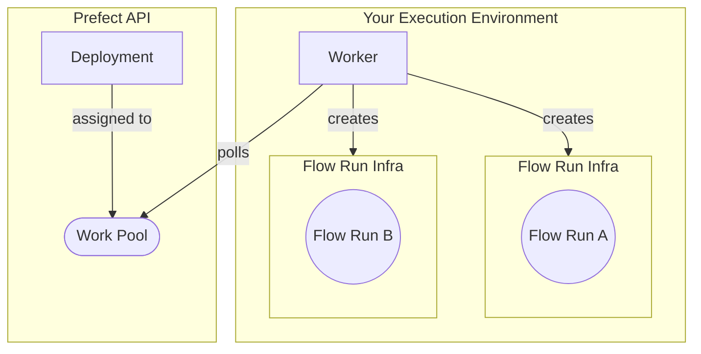

## Prerequisites

[Docker](https://docs.docker.com/engine/install/) installed and running on your machine.

## About workers

Work pools that rely on client-side workers enable you to run work flows in your own Docker containers, Kubernetes clusters, 
and serverless environments such as AWS ECS, Azure Container Instances, and GCP Cloud Run.

The following diagram summarizes the architecture of a worker-based work pool deployment:



<Tip>
Notice above that the worker is in charge of provisioning the _flow run infrastructure_.
In the context of this tutorial, that flow run infrastructure is an ephemeral Docker container to host each flow run.
Different [worker types](/3.0rc/deploy/workers/#worker-types) create different types of flow run 
infrastructure.
</Tip>

Next, create a work pool and worker to deploy your tutorial flow. You will execute it later with the Prefect API.

## Set up a work pool and worker

In this guide you will create a **Docker** type work pool through the CLI.

When you set the work pool type to **Docker**, the worker uses an available Docker 
client to execute all work sent to this pool inside a dedicated Docker container.

<Tip>
**Other work pool types**

There are [work pool types](/3.0rc/deploy/work-pools/#work-pool-types) for serverless computing 
environments such as AWS ECS, Azure Container Instances, Google Cloud Run, and Vertex AI.
Kubernetes is also a popular work pool type.
</Tip>

### Create a work pool

To set up a **Docker** type work pool, run:


```bash
prefect work-pool create --type docker my-docker-pool
```


To confirm the work pool creation was successful, run:


```bash
prefect work-pool ls
```

You should see your new `my-docker-pool` listed in the output.

Next, check that you can see this work pool in your Prefect UI.

Navigate to the **Work Pools** tab and verify that you see `my-docker-pool` listed.

When you click into `my-docker-pool`, you should see a red status icon signifying that this work pool is not ready.

To make the work pool ready, start a worker.

### Start a worker

Workers are a lightweight polling process that kick off scheduled flow runs on a specific type of infrastructure (such as Docker).
To start a worker on your local machine, open a new terminal and confirm that your virtual environment has `prefect` installed.

Run the following command in this new terminal to start the worker:


```bash
prefect worker start --pool my-docker-pool

```

You should see the worker start.
It's now polling the Prefect API to check for any scheduled flow runs it should pick up and then submit for execution.
You’ll see your new worker listed in the UI under the **Workers** tab of the Work Pools page with a recent last polled date.

You should now see a `Ready` status indicator on your work pool.

Keep this terminal session active for the worker to continue to pick up jobs.
Since you are running this worker locally, the worker will terminate if you close the terminal.
In a production setting this worker should run as a [daemonized or managed process](/3.0rc/deploy/static-infra/push-runs-remote/).

## Create the deployment

From the previous steps, you now have:

1. A work pool
1. A worker

Next, you'll create a deployment from your flow code.

### Automatically bake your code into a Docker image

Create a deployment from Python code by calling the `.deploy` method on a flow:

```python buy.py
from prefect import flow

@flow(log_prints=True)
def buy():
    print("Buying securities")

if __name__ == "__main__":
    buy.deploy(
        name="my-code-baked-into-an-image-deployment", 
        work_pool_name="my-docker-pool", 
        image="my_registry/my_image:my_image_tag"
    )
```

Ensure the [work pool](/3.0rc/deploy/work-pools/) exists in the Prefect Cloud workspace you are 
authenticated to, or on your running self-hosted server instance.  
Then run the script to create a deployment (in future examples this step is omitted for brevity):

<div class="terminal">
```bash
python buy.py
```
</div>

You should see messages in your terminal that Docker is building your image.
When the deployment build succeeds, you will see information in your terminal showing you how to start a worker for your 
deployment, and how to run your deployment.
Your deployment is visible on the `Deployments` page in the UI.

By default, `.deploy` builds a Docker image with your flow code baked into it and pushes the image to the 
[Docker Hub](https://hub.docker.com/) registry specified in the `image` argument`.

<Note>
**Authentication to Docker Hub**

    Your environment must be authenticated to your Docker registry to push an image to it.
</Note>

You can specify a registry other than Docker Hub by providing the full registry path in the `image` argument.

<Warning>
    If building a Docker image, your environment with your deployment needs Docker installed and running.
</Warning>

To avoid pushing to a registry, set `push=False` in the `.deploy` method:

```python

if __name__ == "__main__":
    buy.deploy(
        name="my-code-baked-into-an-image-deployment", 
        work_pool_name="my-docker-pool", 
        image="my_registry/my_image:my_image_tag",
        push=False
    )
```

To avoid building an image, set `build=False` in the `.deploy` method:

```python

if __name__ == "__main__":
    buy.deploy(
        name="my-code-baked-into-an-image-deployment", 
        work_pool_name="my-docker-pool", 
        image="my_registry/no-build-image:1.0",
        build=False
    )
```

The specified image must be available in your deployment's execution environment for accessible flow code.

Prefect generates a Dockerfile for you that builds an image based off of one of Prefect's published images. 
The generated Dockerfile copies the current directory into the Docker image and installs any dependencies listed 
in a `requirements.txt` file.

### Automatically build a custom Docker image with a local Dockerfile

If you want to use a custom Dockerfile, specify the path to the Dockerfile with the `DockerImage` class:

```python custom_dockerfile.py
from prefect import flow
from prefect.docker import DockerImage


@flow(log_prints=True)
def buy():
    print("Selling securities")


if __name__ == "__main__":
    buy.deploy(
        name="my-custom-dockerfile-deployment", 
        work_pool_name="my-docker-pool", 
        image=DockerImage(
            name="my_image",
            tag="deploy-guide",
            dockerfile="Dockerfile"
    ),
    push=False
)

```

The `DockerImage` object enables image customization.

For example, you can install a private Python package from GCP's artifact registry like this:

Create a custom base Dockerfile.

```
FROM python:3.10

ARG AUTHED_ARTIFACT_REG_URL
COPY ./requirements.txt /requirements.txt

RUN pip install --extra-index-url ${AUTHED_ARTIFACT_REG_URL} -r /requirements.txt
```

Create your deployment with the DockerImage class:

```python private-package.py
from prefect import flow
from prefect.deployments.runner import DockerImage
from prefect.blocks.system import Secret
from my_private_package import do_something_cool


@flow(log_prints=True)
def my_flow():
    do_something_cool()


if __name__ == "__main__":
    artifact_reg_url: Secret = Secret.load("artifact-reg-url")
    
    my_flow.deploy(
        name="my-deployment",
        work_pool_name="my-docker-pool",
        image=DockerImage(
            name="my-image",
            tag="test",
            dockerfile="Dockerfile",
            buildargs={"AUTHED_ARTIFACT_REG_URL": artifact_reg_url.get()},
        ),
    )
```

Note that you used a [Prefect Secret block](/3.0rc/develop/blocks/) to load the URL configuration for 
the artifact registry above.

See all the optional keyword arguments for the [DockerImage class](https://docker-py.readthedocs.io/en/stable/images.html#docker.models.images.ImageCollection.build).

<Tip>
**Default Docker namespace**

    You can set the `PREFECT_DEFAULT_DOCKER_BUILD_NAMESPACE` setting to append a default Docker namespace to all images 
    you build with `.deploy`. This is helpful if you use a private registry to store your images.

    To set a default Docker namespace for your current profile run:

    <div class="terminal">
    ```bash
    prefect config set PREFECT_DEFAULT_DOCKER_BUILD_NAMESPACE=<docker-registry-url>/<organization-or-username>
    ```
    </div>

    Once set, you can omit the namespace from your image name when creating a deployment:

    ```python with_default_docker_namespace.py
    if __name__ == "__main__":
        buy.deploy(
            name="my-code-baked-into-an-image-deployment", 
            work_pool_name="my-docker-pool", 
            image="my_image:my_image_tag"
        )
    ```

    The above code builds an image with the format `<docker-registry-url>/<organization-or-username>/my_image:my_image_tag` 
    when `PREFECT_DEFAULT_DOCKER_BUILD_NAMESPACE` is set.
</Tip>

### Store your code in git-based cloud storage

While baking code into Docker images is a popular deployment option, many teams store their workflow code in git-based 
storage, such as GitHub, Bitbucket, or Gitlab.

If you don't specify an `image` argument for `.deploy`, you must specify where to pull the flow code from at runtime 
with the `from_source` method.

Here's how to pull your flow code from a GitHub repository:

```python git_storage.py
from prefect import flow

if __name__ == "__main__":
    flow.from_source(
        "https://github.com/my_github_account/my_repo/my_file.git",
        entrypoint="flows/no-image.py:hello_world",
    ).deploy(
        name="no-image-deployment",
        work_pool_name="my-docker-pool",
        build=False
    )
```

The `entrypoint` is the path to the file the flow is located in and the function name, separated by a colon.

Alternatively, you could specify a git-based cloud storage URL for a Bitbucket or Gitlab repository.

<Note>
    If you don't specify an image as part of your deployment creation, the image specified in the work pool 
    runs your flow.
</Note>

After creating a deployment, you may need to change your flow code.
Generally, you can just push your code to GitHub, without rebuilding your deployment.
The exception is if there is something the server needs to know about changes, such as the flow entrypoint parameters.
Rerunning the Python script with `.deploy` updates your deployment on the server with the new flow code.

If you need to provide additional configuration, such as specifying a private repository, you can provide a 
[`GitRepository`](https://prefect-python-sdk-docs.netlify.app/prefect/flows/#prefect.runner.storage.GitRepository) object instead of a URL:

```python private_git_storage.py
from prefect import flow
from prefect.runner.storage import GitRepository
from prefect.blocks.system import Secret

if __name__ == "__main__":
    flow.from_source(
        source=GitRepository(
        url="https://github.com/org/private-repo.git",
        branch="dev",
        credentials={
            "access_token": Secret.load("github-access-token")
        }
    ),
    entrypoint="flows/no-image.py:hello_world",
    ).deploy(
        name="private-git-storage-deployment",
        work_pool_name="my-docker-pool",
        build=False
    )
```

Note the use of the Secret block to load the GitHub access token.
Alternatively, you could provide a username and password to the `username` and `password` fields of the `credentials` argument.

### Store your code in cloud provider storage

Another option for flow code storage is any [fsspec](https://filesystem-spec.readthedocs.io/en/latest/)-supported 
storage location, such as AWS S3, GCP GCS, or Azure Blob Storage.

For example, you can pass the S3 bucket path to `source`.

```python s3_storage.py
from prefect import flow

if __name__ == "__main__":
    flow.from_source(
        source="s3://my-bucket/my-folder",
        entrypoint="flows.py:my_flow",
    ).deploy(
        name="deployment-from-aws-flow",
        work_pool_name="my-docker-pool",
    )
```

In the example above, your credentials are auto-discovered from your deployment creation environment. Your credentials 
must be available in your runtime environment.

If you need additional configuration for your cloud-based storage (for example, with a private S3 Bucket), we recommend using a 
[storage block](/3.0rc/develop/blocks/).
A storage block also ensures your credentials are available in both your deployment creation environment and your execution 
environment.

Here's an example that uses an `S3Bucket` block from the [prefect-aws library](https://prefecthq.github.io/prefect-aws/):

```python s3_storage_auth.py
from prefect import flow
from prefect_aws.s3 import S3Bucket

if __name__ == "__main__":
    flow.from_source(
        source=S3Bucket.load("my-code-storage"), entrypoint="my_file.py:my_flow"
    ).deploy(name="test-s3", work_pool_name="my-docker-pool")
```

The deployment creation mechanics or `.serve` are similar to `.deploy`. `.deploy` 
just requires a work pool name and has a number of parameters dealing with flow code storage for Docker images.

Unlike `.serve`, if you don't specify an image to use for your flow, you must to specify where to pull the flow code from at runtime  
with the `from_source` method; `from_source` is optional with `.serve`.

### Additional configuration with `.deploy`

The examples so far have explored options for where to store flow code.
Next, see deployment configuration options.

To pass parameters to your flow, you can use the `parameters` argument in the `.deploy` method. Just pass in a dictionary of 
key-value pairs.

```python pass_params.py
from prefect import flow

@flow
def hello_world(name: str):
    print(f"Hello, {name}!")

if __name__ == "__main__":
    hello_world.deploy(
        name="pass-params-deployment",
        work_pool_name="my-docker-pool",
        parameters=dict(name="Prefect"),
        image="my_registry/my_image:my_image_tag",
    )
```

The `job_variables` parameter allows you to fine-tune the infrastructure settings for a deployment.
The values passed in override default values in the specified work pool's 
[base job template](/3.0rc/deploy/work-pools/#base-job-template).

You can override environment variables, such as `image_pull_policy` and `image`, for a specific deployment with the `job_variables` 
argument.

```python job_var_image_pull.py
if __name__ == "__main__":
    get_repo_info.deploy(
        name="my-deployment-never-pull", 
        work_pool_name="my-docker-pool", 
        job_variables={"image_pull_policy": "Never"},
        image="my-image:my-tag"",
        push=False
    )
```

Similarly, you can override the environment variables specified in a work pool through the `job_variables` parameter:

```python job_var_env_vars.py
if __name__ == "__main__":
    get_repo_info.deploy(
        name="my-deployment-never-pull", 
        work_pool_name="my-docker-pool", 
        job_variables={"env": {"EXTRA_PIP_PACKAGES": "boto3"} },
        image="my-image:my-tag"",
        push=False
    )
```

The dictionary key "EXTRA_PIP_PACKAGES" denotes a special environment variable that Prefect uses to install additional 
Python packages at runtime.
This approach is an alternative to building an image with a custom `requirements.txt` copied into it.

For more information on [overriding job variables](/3.0rc/deploy/customize).

### Work with multiple deployments with `deploy`

Create multiple deployments from one or more Python files that use `.deploy`.
You can manage these deployments independently of one another to deploy the same flow with different configurations 
in the same codebase.

To create multiple work pool-based deployments at once, use the `deploy` function, which is analogous to the `serve` function:

```python
from prefect import deploy, flow

@flow(log_prints=True)
def buy():
    print("Buying securities")


if __name__ == "__main__":
    deploy(
        buy.to_deployment(name="dev-deploy", work_pool_name="my-docker-pool"),
        buy.to_deployment(name="prod-deploy", work_pool_name="my-docker-pool"),
        image="my-registry/my-image:dev",
        push=False,
    )
```

In the example above you created two deployments from the same flow, but with different work pools.
Alternatively, you can create two deployments from different flows:

```python
from prefect import deploy, flow

@flow(log_prints=True)
def buy():
    print("Buying securities.")

@flow(log_prints=True)
def sell():
    print("Selling securities.")


if __name__ == "__main__":
    deploy(
        buy.to_deployment(name="buy-deploy"),
        sell.to_deployment(name="sell-deploy"),
        work_pool_name="my-docker-pool"
        image="my-registry/my-image:dev",
        push=False,
    )
```

In the example above, the code for both flows is baked into the same image.

You can specify one or more flows to pull from a remote location at runtime with the `from_source` method.
Here's an example of deploying two flows, one defined locally and one defined in a remote repository:

```python
from prefect import deploy, flow


@flow(log_prints=True)
def local_flow():
    print("I'm a flow!")

if __name__ == "__main__":
    deploy(
        local_flow.to_deployment(name="example-deploy-local-flow"),
        flow.from_source(
            source="https://github.com/org/repo.git",
            entrypoint="flows.py:my_flow",
        ).to_deployment(
            name="example-deploy-remote-flow",
        ),
        work_pool_name="my-docker-pool",
        image="my-registry/my-image:dev",
    )
```

You could pass any number of flows to the `deploy` function.
This is useful if using a monorepo approach to your workflows.

## Learn more

- [Deploy flows on Kubernetes](/3.0rc/deploy/dynamic-infra/deploy-kubernetes/)
- [Deploy flows in Docker](/3.0rc/deploy/static-infra/push-runs-remote/)
- [Deploy flows on serverless infrastructure](/3.0rc/deploy/dynamic-infra/push-runs-serverless/)
- [Daemonize workers](/3.0rc/deploy/static-infra/push-runs-remote/)