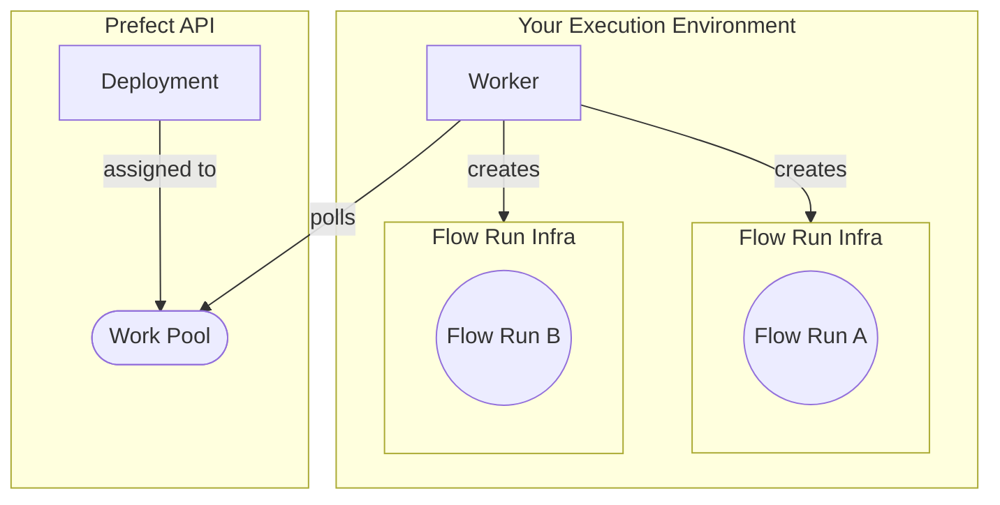

## Prerequisites

[Docker](https://docs.docker.com/engine/install/) installed and running on your machine.

## About workers

In the previous section of the tutorial, you learned how:

- work pools are a bridge between the Prefect orchestration layer and infrastructure for flow runs, and can be dynamically provisioned.
- to transition from persistent infrastructure to dynamic infrastructure with `flow.deploy` instead of `flow.serve`.

Work pools that rely on client-side workers enable you to run work flows in your own Docker containers, Kubernetes clusters, and serverless environments such as AWS ECS, Azure Container Instances, and GCP Cloud Run.

The following diagram summarizes the architecture of a worker-based work pool deployment:



<Tip>
Notice above that the worker is in charge of provisioning the _flow run infrastructure_.
In the context of this tutorial, that flow run infrastructure is an ephemeral Docker container to host each flow run.
Different [worker types](/3.0rc/concepts/work-pools/#worker-types) create different types of flow run infrastructure.
</Tip>

Next, create a work pool and worker to deploy your tutorial flow. You will execute it later with the Prefect API.

## Set up a work pool and worker

For this tutorial you will create a **Docker** type work pool through the CLI.

Using the **Docker** work pool type means that all work sent to this work pool runs within a dedicated Docker container using a Docker client available to the worker.

<Tip>
    **Other work pool types**

    There are [work pool types](/3.0rc/concepts/work-pools/#worker-types) for serverless computing environments such as AWS ECS, Azure Container Instances, Google Cloud Run, and Vertex AI.
    Kubernetes is also a popular work pool type.
</Tip>

### Create a work pool

To set up a **Docker** type work pool, run:


```bash
prefect work-pool create --type docker my-docker-pool
```


To confirm the work pool creation was successful, run:


```bash
prefect work-pool ls
```


You should see your new `my-docker-pool` listed in the output.

Next, check that you can see this work pool in your Prefect UI.

Navigate to the **Work Pools** tab and verify that you see `my-docker-pool` listed.

When you click into `my-docker-pool`, you should see a red status icon signifying that this work pool is not ready.

To make the work pool ready, start a worker.

### Start a worker

Workers are a lightweight polling process that kick off scheduled flow runs on a specific type of infrastructure (such as Docker).
To start a worker on your local machine, open a new terminal and confirm that your virtual environment has `prefect` installed.

Run the following command in this new terminal to start the worker:


```bash
prefect worker start --pool my-docker-pool

```


You should see the worker start.
It's now polling the Prefect API to check for any scheduled flow runs it should pick up and then submit for execution.
You’ll see your new worker listed in the UI under the **Workers** tab of the Work Pools page with a recent last polled date.

You should now see a `Ready` status indicator on your work pool.

Keep this terminal session active for the worker to continue to pick up jobs.
Since you are running this worker locally, the worker will terminate if you close the terminal.
In a production setting this worker should run as a [daemonized or managed process](/3.0rc/guides/deployment/daemonize/).

Next, deploy your tutorial flow to `my-docker-pool`.

## Create the deployment

From the previous steps, you now have:

1. [A flow](/3.0rc/tutorial/flows/)
2. A work pool
3. A worker

Update your `repo_info.py` file to build a Docker image, and update your deployment so your worker can execute it.

Make the following updates in `repo_info.py`:

1. Change `flow.serve` to `flow.deploy`.
2. Tell `flow.deploy` which work pool to deploy to.
3. Tell `flow.deploy` the name for the Docker image to build.

The updated `repo_info.py` looks like this:

```python hl_lines="17-22" title="repo_info.py"
import httpx
from prefect import flow


@flow(log_prints=True)
def get_repo_info(repo_name: str = "PrefectHQ/prefect"):
    url = f"https://api.github.com/repos/{repo_name}"
    response = httpx.get(url)
    response.raise_for_status()
    repo = response.json()
    print(f"{repo_name} repository statistics 🤓:")
    print(f"Stars 🌠 : {repo['stargazers_count']}")
    print(f"Forks 🍴 : {repo['forks_count']}")


if __name__ == "__main__":
    get_repo_info.deploy(
        name="my-first-deployment", 
        work_pool_name="my-docker-pool", 
        image="my-first-deployment-image:tutorial",
        push=False
    )
```

<Note>
    **Why the `push=False`?**

    For this tutorial, your Docker worker is running on your machine, so you don't need to push the image built by `flow.deploy` to a registry. When your worker is running on a remote machine, you must push the image to a registry that the worker can access.

    Remove the `push=False` argument, include your registry name, and ensure you've [authenticated with the Docker CLI](https://docs.docker.com/engine/reference/commandline/login/) to push the image to a registry.

</Note>

Now that you've updated your script, run it to deploy your flow to the work pool:


```bash
python repo_info.py
```


Prefect builds a custom Docker image containing your workflow code that the worker can use to dynamically spawn Docker containers whenever this workflow needs to run.

<Note>
    **Dockerfile**
    
    In this example, Prefect generates a Dockerfile for you that builds an image based on one of Prefect's published images. The generated Dockerfile copies the current directory into the Docker image and installs any dependencies listed in a `requirements.txt` file.

    To use a custom Dockerfile, specify the path to the Dockerfile using the `DeploymentImage` class:

    ```python hl_lines="21-25" title="repo_info.py"
    import httpx
    from prefect import flow
    from prefect.deployments import DeploymentImage


    @flow(log_prints=True)
    def get_repo_info(repo_name: str = "PrefectHQ/prefect"):
        url = f"https://api.github.com/repos/{repo_name}"
        response = httpx.get(url)
        response.raise_for_status()
        repo = response.json()
        print(f"{repo_name} repository statistics 🤓:")
        print(f"Stars 🌠 : {repo['stargazers_count']}")
        print(f"Forks 🍴 : {repo['forks_count']}")


    if __name__ == "__main__":
        get_repo_info.deploy(
            name="my-first-deployment", 
            work_pool_name="my-docker-pool", 
            image=DeploymentImage(
                name="my-first-deployment-image",
                tag="tutorial",
                dockerfile="Dockerfile"
            ),
            push=False
        )
    ```
</Note>
### Modify the deployment

To update your deployment, modify your script and rerun it. You'll need to make one update to specify a value for `job_variables` to ensure your Docker worker can successfully execute scheduled runs for this flow. See the example below.

The `job_variables` section allows you to fine-tune the infrastructure settings for a specific deployment. These values override default values in the specified work pool's [base job template](/3.0rc/concepts/work-pools/#base-job-template).

When testing images locally without pushing them to a registry (to avoid potential errors like docker.errors.NotFound), we recommend including an `image_pull_policy` job_variable set to `Never`. However, for production workflows, push images to a remote registry for more reliability and accessibility.

Set the `image_pull_policy` as `Never` for this tutorial deployment without affecting the default value set on your work pool:

```python hl_lines="21" title="repo_info.py"
import httpx
from prefect import flow


@flow(log_prints=True)
def get_repo_info(repo_name: str = "PrefectHQ/prefect"):
    url = f"https://api.github.com/repos/{repo_name}"
    response = httpx.get(url)
    response.raise_for_status()
    repo = response.json()
    print(f"{repo_name} repository statistics 🤓:")
    print(f"Stars 🌠 : {repo['stargazers_count']}")
    print(f"Forks 🍴 : {repo['forks_count']}")


if __name__ == "__main__":
    get_repo_info.deploy(
        name="my-first-deployment", 
        work_pool_name="my-docker-pool", 
        job_variables={"image_pull_policy": "Never"},
        image="my-first-deployment-image:tutorial",
        push=False
    )
```

To register this update to your deployment's parameters with Prefect's API, run:


```bash
python repo_info.py
```


Submit a flow-run to the work pool:


```bash
prefect deployment run 'get_repo_info/my-deployment'
```


<Warning>
    **Common Pitfall**
    
    - Store and run your deploy scripts at the **root of your repo**, otherwise the built Docker file may be missing files that it needs to execute.
</Warning>

<Tip>
    **Multiple deployments**
    
    A Prefect flow can have more than one deployment. 
    This pattern is useful for a flow to run in different execution environments.
</Tip>

## Learn more

- Learn how to configure deployments in YAML with [`prefect.yaml`](/3.0rc/guides/prefect-deploy/).
- [Concepts](/3.0rc/concepts/) contain deep dives into Prefect components
- [Guides](/3.0rc/guides/) provide step-by-step recipes for common Prefect operations including:
  - [Deploying flows on Kubernetes](/3.0rc/guides/deployment/kubernetes/)
  - [Deploying flows in Docker](/3.0rc/guides/docker/)
  - [Deploying flows on serverless infrastructure](/3.0rc/guides/deployment/serverless-workers/)
  - [Daemonizing workers](/3.0rc/guides/deployment/daemonize/)