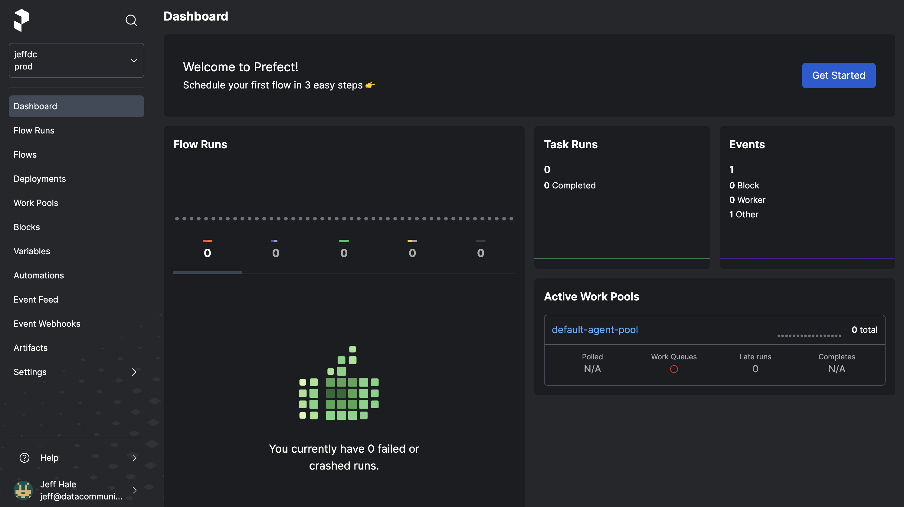

# Welcome to Prefect Cloud <span class="badge cloud"></span>

Prefect Cloud is a workflow coordination-as-a-service platform. Prefect Cloud provides all the capabilities of the [Prefect server](/tutorials/orchestration/#running-the-prefect-server) and UI in a hosted environment, plus additional features such as automations, workspaces, and organizations.

!!! success "Prefect Cloud Quickstart"
    Ready to jump right in and start running with Prefect Cloud? See the [Prefect Cloud Quickstart](/cloud/cloud-quickstart/) to create a workspace, configure a local execution environment, and write your first Prefect Cloud-monitored flow run.


Prefect Cloud includes all the features in the open-source Prefect server plus the following:

!!! cloud-ad "Prefect Cloud features"
    Features only available on Prefect Cloud include:

    - [User accounts](#user-accounts) &mdash; personal accounts for working in Prefect Cloud. 
    - [Workspaces](/cloud/workspaces/) &mdash; isolated environments to organize your flows, deployments, and flow runs.
    - [Automations](/cloud/automations/) &mdash; configure triggers, actions, and notifications in response to real-time monitoring events.
    - [Email notifications](/cloud/automations/) &mdash; send email alerts from Prefect's serves based on automation triggers.
    - [Organizations](/cloud/organizations/) &mdash; user and workspace management features that enable collaboration for larger teams.
    - [Service accounts](/cloud/users/service-accounts/) &mdash; configure API access for running agents or executing flow runs on remote infrastructure.
    - [Custom role-based access controls (RBAC)](/cloud/users/roles/) &mdash; assign users granular permissions to perform certain activities within an organization or a workspace.
    - [Single Sign-on (SSO)](/cloud/users/sso/) &mdash; authentication using your identity provider.
    - [Audit Log](/cloud/users/audit-log/) &mdash; a record of user activities to monitor security and compliance.
    - Collaborators &mdash; invite others to work in your [workspace](/cloud/workspaces/#workspace-collaborators) or [organization](/cloud/organizations/#organization-members).

## User accounts

When you sign up for Prefect Cloud, a personal account is automatically provisioned for you. A personal account gives you access to profile settings where you can view and administer your: 

- Profile, including profile handle and image
- API keys

As a personal account owner, you can create a [workspace](#workspaces) and invite collaborators to your workspace. 

[Organizations](#organizations) in Prefect Cloud enable you to invite users to collaborate in your workspaces with the ability to set [role-based access controls (RBAC)](#roles-and-custom-permissions) for organization members. Organizations may also configure [service accounts](#service-accounts) with API keys for non-user access to the Prefect Cloud API.

!!! cloud-ad "Prefect Cloud plans for teams of every size"
    See the [Prefect Cloud plans](https://www.prefect.io/pricing/) for details on options for individual users and teams.

## Workspaces

A workspace is an isolated environment within Prefect Cloud for your flows, deployments, and block configuration. See the [Workspaces](/cloud/workspaces/) documentation for more information about configuring and using workspaces.

Each workspace keeps track of its own:

- [Flow runs](/concepts/flows/) and task runs executed in an environment that is [syncing with the workspace](/cloud/#workspaces)
- [Flows](/concepts/flows/) associated with flow runs and deployments observed by the Prefect Cloud API
- [Deployments](/concepts/deployments/)
- [Work pools](/concepts/work-pools/)
- [Blocks](/concepts/blocks/) and [storage](/concepts/storage/)
- [Automations](/cloud/automations/)

When you first log into Prefect Cloud and create your workspace, it will most likely be empty. Don't Panic &mdash; you just haven't run any flows tracked by this workspace yet. See the [Prefect Cloud Quickstart](/cloud/cloud-quickstart/) to configure a local execution environment and start tracking flow runs in Prefect Cloud. 



## Events

Prefect Cloud allows you to see your events. TK image 


## Automations

Prefect Cloud [automations](/cloud/automations/) provide additional notification capabilities as the open-source Prefect server. Automations enable you to configure triggers and actions that can kick off flow runs, pause deployments, or send custom notifications in response to real-time monitoring events. 

## Organizations <span class="badge orgs"></span>

A Prefect Cloud [organization](/cloud/organizations/) is a type of account available on Prefect Cloud that enables more extensive and granular control over workspace collaboration. Within an organization account you can:

- Invite members to join the organization.
- Create organization workspaces.
- Configure members roles and permissions within the organization and for individual workspaces.
- Create service accounts that have credentials for non-user API access.

See the [Organizations](/cloud/organizations/) documentation for more information about managing users, service accounts, and workspaces in a Prefect Cloud organization.

## Service accounts <span class="badge orgs"></span>

Service accounts enable you to create a Prefect Cloud API key that is not associated with a user account. Service accounts are typically used to configure API access for running agents or executing flow runs on remote infrastructure. 

See the [service accounts](/cloud/users/service-accounts/) documentation for more information about creating and managing service accounts in a Prefect Cloud organization.

## Roles and custom permissions <span class="badge orgs"></span>

Role-based access control (RBAC) functionality in Prefect Cloud enables you to assign users granular permissions to perform certain activities within an organization or a workspace.

See the [role-based access controls (RBAC)](/cloud/roles/) documentation for more information about managing user roles in a Prefect Cloud organization.

## Single Sign-on (SSO) <span class="badge orgs"></span> <span class="badge enterprise"></span>

Prefect Cloud's [Organization and Enterprise plans](https://www.prefect.io/pricing) offer [single sign-on (SSO)](/cloud/users/sso/) authentication integration with your team’s identity provider. SSO integration can bet set up with identity providers that support OIDC and SAML.

## Audit Log <span class="badge orgs"></span> <span class="badge enterprise"></span>

Prefect Cloud's [Organization and Enterprise plans](https://www.prefect.io/pricing) offer [Audit Log](/cloud/users/audit-log/) compliance and transparency tools. Audit logs provide a chronological record of activities performed by users in your organization, allowing you to monitor detailed actions for security and compliance purposes. 

## Prefect Cloud REST API

The [Prefect REST API](/api-ref/rest-api/) is used for communicating data from Prefect clients to Prefect Cloud or a local Prefect server so that orchestration can be performed. This API is mainly consumed by Prefect clients like the Prefect Python Client or the Prefect UI.

!!! note "Prefect Cloud REST API interactive documentation"
    Prefect Cloud REST API documentation is available at <a href="https://app.prefect.cloud/api/docs" target="_blank">https://app.prefect.cloud/api/docs</a>.


## Start using Prefect Cloud

To create an account or sign in with an existing Prefect Cloud account, go to [http://app.prefect.cloud/](http://app.prefect.cloud/).

Then follow the steps in our [Prefect Cloud Quickstart](/ui/cloud-quickstart/) to create a workspace, configure a local execution environment, and start running workflows with Prefect Cloud.


## Prefect REST API

The [Prefect REST API](/api-ref/rest-api/) is used for communicating data from Prefect clients to Prefect Cloud so that orchestration can be performed. This API is mainly consumed by clients like the Prefect Python SDK or the Prefect UI.
=======
description: Gain overall visibility and coordination of your workflows with Prefect UI and Prefect Cloud.
icon: material/cloud-outline
tags:
    - UI
    - dashboard
    - visibility
    - coordination
    - coordination plane
    - orchestration
    - Prefect Cloud
---

# Prefect UI & Prefect Cloud 

The Prefect UI provides an overview of all of your flows. It was designed around a simple question: what's the health of my system?


There are two ways to access the UI:

- [Prefect Cloud](/ui/cloud/) is a hosted service that gives you observability over your flows, flow runs, and deployments, plus the ability to configure personal accounts, workspaces, and collaborators.
- The [Prefect UI](#using-the-prefect-ui) is also available as an open source, locally hosted orchestration engine, API server, and UI, giving you insight into the flows running with any local Prefect server instance.

The Prefect UI displays many useful insights about your flow runs, including:

- Flow run summaries
- Deployed flow details
- Scheduled flow runs
- Warnings for late or failed runs
- Task run details 
- Radar flow and task dependency visualizer 
- Logs

You can filter the information displayed in the UI by time, flow state, and tags.

## Using the Prefect UI

The Prefect UI is available via [Prefect Cloud](/ui/cloud/) by logging into your account at [https://app.prefect.cloud/](https://app.prefect.cloud/).

The Prefect UI is also available in any environment where a Prefect server is running with `prefect server start`.

<div class="terminal">
```bash
$ prefect server start
Starting...

 ___ ___ ___ ___ ___ ___ _____ 
| _ \ _ \ __| __| __/ __|_   _|
|  _/   / _|| _|| _| (__  | |
|_| |_|_\___|_| |___\___| |_|

Configure Prefect to communicate with the server with:

    prefect config set PREFECT_API_URL=http://127.0.0.1:4200/api

Check out the dashboard at http://127.0.0.1:4200
```
</div>

When the Prefect server is running, you can access the Prefect UI at [http://127.0.0.1:4200](http://127.0.0.1:4200).


The following sections provide details about Prefect UI pages and visualizations:

- [Flow Runs](/ui/flow-runs/) page provides a high-level overview of your flow runs.
- [Flows](/ui/flows/) provides an overview of specific flows tracked by by the API.
- [Deployments](/ui/deployments/) provides an overview of flow deployments that you've created on the API.
- [Work Pools](/ui/work-pools/) enable you to create and manage work pools that distribute flow runs to agents.
- [Blocks](/ui/blocks/) enable you to create and manage configuration for [blocks](/concepts/blocks/) such as [storage](/concepts/storage/).
- [Notifications](/ui/notifications/) enable you to create and manage alerts based on flow run states and tags.
- [Task Run Concurrency Limits](/ui/task-concurrency/) enable you to restrict the number of certain tasks that can run simultaneously.

## Navigating the UI

Use the left side of the Prefect UI to navigate between pages.

| Page | Description |
| --- | --- |
| **Flow Runs**      | Displays the **Flow Runs** dashboard displaying flow run status for the current API server or Prefect Cloud workspace. From this dashboard you can create [filters](/ui/flow-runs/#filters) to display only certain flow runs, or click into details about specific flows or flow runs. |
| **Flows**          | Displays a searchable list of flows tracked by the API. |
| **Deployments**    | Displays flow [deployments](/concepts/deployments/) created on the API. |
| **Work Pools** | Displays configured [work pools](/ui/work-pools/) and enables creating new work pools. |
| **Blocks**         | Displays a list of [blocks](/ui/blocks/) configured on the API and enables configuring new blocks. |
| **Notifications**  | Displays a list of configured [notifications](/ui/notifications/) and enables configuring new notifications. |
| <span class="no-wrap">**Task Run Concurrency**</span> | Displays a list of configured [task run concurrency limits](/ui/task-concurrency/) and enables configuring new limits. |

In Prefect Cloud, the Prefect icon returns you to the workspaces list. Currently, you can create only one workspace per personal account, but you may have access to other workspaces as a collaborator. See the [Prefect Cloud Workspaces](/ui/cloud/#workspaces) documentation for details. 

## Prefect Cloud

[Prefect Cloud](https://app.prefect.cloud) provides a hosted server and UI instance for running and monitoring deployed flows. Prefect Cloud includes:

- All of the features of the local Prefect UI.
- A personal account and workspace.
- API keys to sync deployments and flow runs with the Prefect Cloud API.
- A hosted Prefect database that stores flow and task run history.

See the [Prefect Cloud](/ui/cloud/) documentation for details about setting up accounts, workspaces, and API keys.

## Prefect REST API

The [Prefect REST API](/api-ref/rest-api/) is used for communicating data from Prefect clients to Prefect Cloud or a local Prefect server so that orchestration can be performed. This API is mainly consumed by clients like the Prefect Python Client or the Prefect UI.

!!! note "Prefect REST API interactive documentation"
    Prefect Cloud REST API documentation is available at <a href="https://app.prefect.cloud/api/docs" target="_blank">https://app.prefect.cloud/api/docs</a>.

    The Prefect REST API documentation for a local instance run with with `prefect server start` is available at <a href="http://localhost:4200/docs" target="_blank">http://localhost:4200/docs</a> or the `/docs` endpoint of the [`PREFECT_API_URL`](/concepts/settings/#prefect_api_url) you have configured to access the server.

    The Prefect REST API documentation for locally run open-source Prefect servers is also available in the [Prefect REST API Reference](/api-ref/rest-api-reference/).
