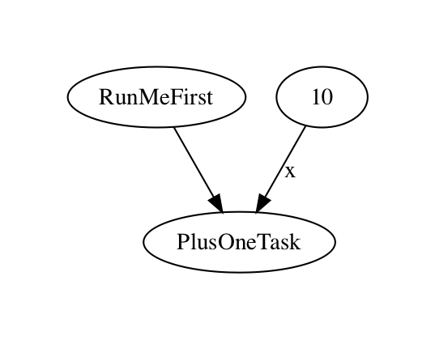

# Core Concepts

Prefect provides a number of building blocks that can be combined to create sophisticated data applications.

## Tasks

A `Task` represents a discrete action in a Prefect workflow.

A task is like a function: it optionally takes inputs, performs an action, and produces an optional result. In fact, the easiest way to create a task is simply by decorating a Python function:

```python
from prefect import task

@task
def plus_one(x):
    return x + 1
```

For more sophisticated tasks that may require customization, you can subclass the `Task` class directly:

```python
from prefect import Task

class HTTPGetTask(Task):

    def __init__(self, username, password, **kwargs):
        self.username = username
        self.password = password
        super().__init__(**kwargs)

    def run(self, url):
        return requests.get(url, auth=(self.username, self.password))
```

All `Task` subclasses must have a `run()` method.

::: danger

State that is stored in a task's `run()` method will not be available to future runs.

While this might work during local testing, Prefect tasks are ultimately run in distributed environments. Even if a task is run twice, it will not have access to local state that was set during a previous run.

Do NOT do this:

```python
class BadCounterTask(Task):

    def __init__(self, **kwargs):
        self.counter = 0
        super().__init__(**kwargs)

    def run(self):
        self.counter += 1 # this won't have the intended effect
        return self.counter
```

:::

Tasks usually won't exist as standalone objects; they will be organized or composed into Flows.

## Flows

A `Flow` is a container for `Tasks`. It represents an entire workflow or application by describing the dependencies between tasks.

### Functional API

The most convenient way to build a Prefect pipeline is with the **functional API**. The functional API is available any time you enter a `Flow` context. In this mode, you can call `Tasks` on other `Tasks` as if they were functions, and Prefect will build up a computational graph in the background by modifying the flow appropriately.

For example:

```python
from prefect import task, Task, Flow
import random

@task
def random_number():
    return random.randint(0, 100)

@task
def plus_one(x):
    return x + 1

with Flow('My Functional Flow') as flow:
    r = random_number()
    y = plus_one(x=r)
```

::: tip Using Task Subclasses with the Functional API
Note that in order to use a `Task` subclass with the functional API (as opposed to a `@task`-decorated function), you need to instantiate the class before calling it:

```python
class PlusOneTask(Task):
    def run(self, x):
        return x + 1

with Flow():
    task = PlusOneTask() # first create the Task instance
    result = task(10) # then call it with arguments
```

Instantiation is when properties including the task's `retry_delay`, `trigger`, and `caching` mechanisms are set. With the functional API, these properties can be passed as arguments to the `@task` decorator.

:::

### Imperative API

Prefect's **imperative API** allows more fine-grained control. Its main advantage over the functional API is that it allows tasks to be set as upstream or downstream dependencies without passing their results. This allows you to create a strict ordering of tasks through **state dependencies** without also creating **data dependencies**.

```python
from prefect import Task, Flow

class RunMeFirst(Task):
    def run(self):
        print("I'm running first!")

class PlusOneTask(Task):
    def run(self, x):
        return x + 1

flow = Flow('My Imperative Flow')
plus_one = PlusOneTask()
flow.set_dependencies(
    task=plus_one,
    upstream_tasks=[RunMeFirst()],
    keyword_tasks=dict(x=10))

flow.visualize()
```



::: tip
`flow.set_dependencies()` and `task.set_dependencies()` (the latter is only available inside an active flow context) are the main entrypoints for the imperative API. Flows also provide some lower-level methods like `add_task()` and `add_edge()` that can be used to manipulate the graph directly.
:::

### Running a flow

To run a flow, simply call `flow.run()`:

```python
from prefect import task, Flow
@task
def say_hello():
    print('Hello, world!')

with Flow() as flow:
    h = say_hello()

flow.run() # prints "Hello, world!"
```

This will return a `State` object representing the outcome of the run. To receive task states as well, supply a `return_tasks` argument to `flow.run()`:

```python
state = flow.run(return_tasks=[h])
state.result[h] # the task state of the say_hello task
```

:::tip Task classes vs Task instances
Notice that we passed `return_tasks=[h]`, not `return_tasks=[say_hello]`. This is because `h` represents a specific instance of a task that is contained inside the flow, whereas `say_hello` is just a generator of such tasks. Similarly, with a custom subclass, we would pass the task instance rather than the subclass itself.
:::

### Key tasks

When a flow runs, its state is determined by the state of its key tasks. By default, a flow's key tasks are its terminal tasks, which includes any task that has no downstream tasks. If the key tasks are all successful (including any skipped tasks), the flow is considered a `Success`. If any key tasks fail, the flow is considered `Failed`. No matter what state the key tasks are in, the flow is considered `Pending` if any of its tasks are unfinished.

::: tip When should you change the key tasks?

Generally, a flow's terminal tasks are appropriate key tasks. However, there are times when that isn't the case.

Consider a flow that takes some action, and has a downstream task that only runs if the main action fails, in order to clean up the environment. If the main task fails and the clean up task is successful, was the flow as a whole successful? To some users, the answer is yes: the clean up operation worked as expected. To other users, the answer is no: the main purpose of the flow was not achieved.

Custom key tasks allow you to alter this behavior to suit your needs.

:::


## Parameters

Parameters are special tasks that receive inputs whenever a flow is run.

The parameter task returns its input and can therefore be used to dynamically send information into the flow.

```python
from prefect import task, Flow, Parameter

@task
def plus_one(x):
    print(x + 1)

with Flow() as flow:
    x = Parameter('x')
    plus_one(x=x)

flow.run(parameters=dict(x=1)) # prints 2
flow.run(parameters=dict(x=100)) # prints 101
```

## Signals
Prefect does its best to infer the state of a running task. If the `run()` method succeeds, Prefect sets the state to `Success` and records any data that was returned. If the `run()` method raises an error, Prefect sets the state to `Failed` with an appropriate message.

Sometimes, you may want finer control over a task's state. For example, you may want a task to be skipped or to force a task to retry. In that case, raise the appropriate Prefect `signal`. It will be intercepted and transformed into the appropriate state.

Prefect provides signals for most states, including `RETRY`, `SKIP`, `FAILED`, and `SUCCESS`.

```python
from prefect import task
from prefect.engine import signals

def retry_if_negative(x):
    if x < 0:
        raise signals.RETRY()
    else:
        return x
```

Another common use of Prefect signals is when the task in question will be nested under other functions that could intercept its normal result or error. In that case, a signal could be used to "bubble up" a desired state change and bypass the normal return mechanism.


## Context

Prefect provides a powerful `Context` object to share information without requiring explicit arguments on a task's `run()` method.

The `Context` can be accessed at any time, and will be pre-populated with information before and during each flow run.

```python
@task
def try_unlock():
    if prefect.context.key == 'abc':
        return True
    else:
        raise signals.FAIL()

with Flow() as flow:
    try_unlock()

flow.run() # this run fails

with prefect.context(key='abc'):
    flow.run() # this run is successful
```

## Triggers

Triggers allow tasks to define how their state dependencies work. By default, every task has an `all_successful` trigger, meaning it will only run if all upstream tasks succeed. Other triggers include:
    - `all_failed`
    - `any_successful`
    - `any_failed`
    - `all_finished`, which is the same as always running
    - `manual_only`, which means Prefect will never run the task automatically

::: tip Use `manual_only` to pause a flow

When a flow encounters a `manual_only` trigger mid-run, it simply stops at that point. Tasks with `manual_only` triggers will never be run automatically unless they are one of the `start_tasks` of a run - meaning the user explicitly asked to run that task. Therefore, this trigger can be used to introduce pause/resume functionality in a flow.

:::
