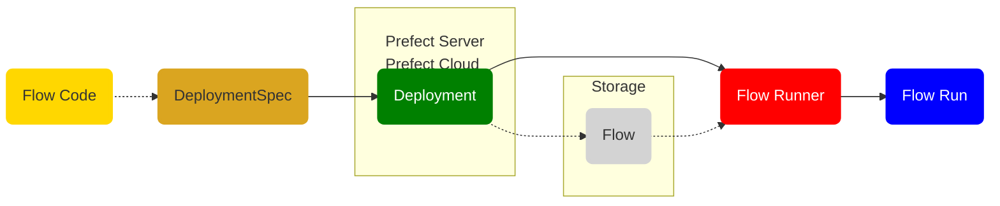
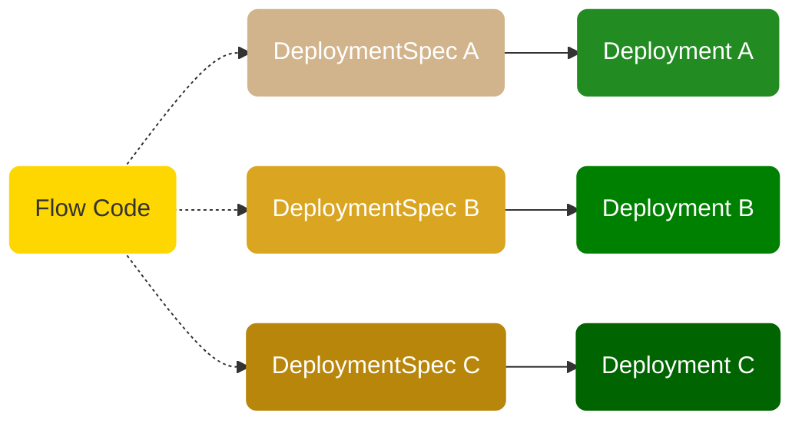

# Deployments

A deployment is a server-side concept that encapsulates a flow, allowing it to be scheduled and triggered via API. The deployment stores metadata about where your flow's code is stored and how your flow should be run.

Each deployment is associated with a single flow &mdash; though that flow could, in turn, call other tasks or subflows. Deployments are uniquely identified by the combination of flow_name/deployment_name. 

For detailed information about deployment objects, see the [prefect.deployments](/api-ref/prefect/deployments/) API documentation.

## Deployments overview

All Prefect flow runs are tracked by the API. The API does not require prior registration of flows. With Prefect, you can call a flow locally or on a remote environment and it will be tracked. 

Deployments are, however, necessary for scheduling flow runs.

Deployments persist your flow code to a [storage](/concepts/storage/) location and tell the server &mdash; either Prefect Cloud or a local Prefect API server &mdash; about the location to which a flow has been persisted so the server can schedule and execute flow runs for you, along with any details about the execution environment, parameters, and tags that should be used to create a flow run from the deployment. 

At a high level, you can think of a deployment as configuration for managing flows, whether you run them via the CLI, the UI, or the API.

The elements used to create deployments and run a flow from a deployment go together like this:



- Generally, you start with the a flow &mdash; the flow and task code that will execute your workflow.
- A [deployment specification](#deployment-specifications) includes the settings that will be used to create a deployment based on that flow code. 
- Using the deployment specification &mdash; the `DeploymentSpec` in the image above &mdash; you create a deployment object in the Prefect database via the API. 
- When creating or updating the deployment, your flow code is persisted to a [storage](/concepts/storage/) location &mdash; either the default storage for the API server or a storage location specified in your deployment specification.  
- When you run a deployment Prefect creates an appropriate [flow runner](/concepts/flow-runners/) instance via a [work queue and agent](/concepts/work-queues/) (not shown here). 
- The flow runner stands up any necessary execution environment for your flow run (based on settings in your deployment), retrieves the flow code from storage, and executes your flow run.

This is just a broad-strokes overview of creating a deployment for a flow and executing the flow based on the deployment. The following sections provide more detail on defining deployment specifications and creating deployments.

### Deployments and flows

Each deployment is associated with a single flow, but any given flow can have multiple deployments. 



This enables you to run a single flow with different parameters, on multiple schedules, and in different environments. This also allows you to run different versions of the same flow for testing and production purposes.

[Flow runners](/concepts/flow-runners/) enable you to dynamically allocate infrastructure for your flow runs. Since the flow's code must be retrieved on the created infrastructure, configuring flow runners is possible only for deployed flows.

A simple example of a deployment specification for a flow looks like this:

```python
from prefect.deployments import DeploymentSpec

DeploymentSpec(
    flow_location="flow.py",
    name="flow-deployment", 
)
```

Once the deployment has been created, you'll see it in the [Prefect UI](/ui/dashboard/) and can inspect it using the CLI.


When you run a deployed flow in Orion, the following happens:

- The user runs the deployment, which creates a flow run. (The API creates flow runs automatically for deployments with schedules.)
- An agent picks up the flow run from a work queue and uses a flow runner to create infrastructure for the run.
- The flow run executes within the infrastructure.

[Work queues and agents](/concepts/work-queues/) enable the Prefect orchestration engine and API to run deployments in your local execution environments. There is no default global work queue or agent, so to execute deployment flow runs you need to configure at least one work queue and agent. The [Deployments tutorial](/tutorials/deployments/) walks through the steps for configuring a work queue and starting an agent.

## Deployment representation in Orion

In Orion, a deployment is an instance of the Prefect [`Deployment`](/api-ref/orion/schemas/core/#prefect.orion.schemas.core.Deployment) object. When you create a deployment, it is constructed from deployment specification data you provide and additional properties calculated by client-side utilities.

Deployment properties include:

| Property | Description |
| --- | --- |
| `id` | An auto-generated UUID ID value identifying the deployment. |
| `created` | A `datetime` timestamp indicating when the deployment was created. |
| `updated` | A `datetime` timestamp indicating when the deployment was last changed. |
| `name` | The name of the deployment. |
| `flow_id` | The id of the flow associated with the deployment. |
| `flow_data` | A [`DataDocument`](/api-ref/orion/schemas/data/#prefect.orion.schemas.data.DataDocument) representing the flow code to execute. |
| `schedule` | An optional schedule for the deployment. |
| <span class="no-wrap">`is_schedule_active`</span> | Boolean indicating whether the deployment schedule is active. Default is True. |
| `parameters` | An optional dictionary of parameters for flow runs scheduled by the deployment. |
| `tags` | An optional list of tags for the deployment. |
| `flow_runner` | [`FlowRunnerSettings`](/api-ref/orion/schemas/core/#prefect.orion.schemas.core.FlowRunnerSettings) containing details about the flow runner to assign to flow runs associated with this deployment. |

You can inspect a deployment using the CLI with the `prefect deployment inspect` command, referencing the deployment with `<flow_name>/<deployment_name>`.

```bash 
$ prefect deployment inspect 'hello-world/hello-world-daily'
{
    'id': '710145d4-a5cb-4e58-a887-568e4df9da88',
    'created': '2022-04-25T20:23:42.311269+00:00',
    'updated': '2022-04-25T20:23:42.309339+00:00',
    'name': 'hello-world-daily',
    'flow_id': '80768746-cc02-4d25-a01c-4e4a92797142',
    'flow_data': {
        'encoding': 'blockstorage',
        'blob': '{"data": "\\"f8e7f81f24512625235fe5814f1281ae\\"", "block_id":
"c204821d-a44f-4b9e-aec3-fcf24619d22f"}'
    },
    'schedule': {
        'interval': 86400.0,
        'timezone': None,
        'anchor_date': '2020-01-01T00:00:00+00:00'
    },
    'is_schedule_active': True,
    'parameters': {},
    'tags': ['earth'],
    'flow_runner': {'type': 'universal', 'config': {'env': {}}}
}
```

The [prefect.orion.api.deployments](/api-ref/orion/api/deployments/) API also provides functions for inspecting deployments by ID or name.

## Deployment specifications

To create a deployment in Orion, you do not have to specify _all_ of the Deployment object properties. A _deployment specification_ lets you provide the details relevant to deploying your flow. When you create a deployment from a deployment specification, Orion uses the settings provided by your specification, defaults, and automatically constructed data such as timestamps and ids to create the underlying deployment object.

There are several ways to build a deployment specification and use it to create a deployment:

- If calling the API manually, construct a request with the fields specified by [`DeploymentCreate`](/api-ref/orion/schemas/actions/#prefect.orion.schemas.actions.DeploymentCreate).
- If using the `OrionClient`, the request will be constructed for you. See [`OrionClient.create_deployment`](/api-ref/prefect/client/#prefect.client.OrionClient.create_deployment) for the required fields.
- You can also write your deployment specification as Python or YAML and use the CLI to create the deployment. The CLI will generate the `DeploymentCreate` object to pass to the API.

### DeploymentSpec object

You can create a [`DeploymentSpec`](/api-ref/prefect/deployments/#prefect.deployments.DeploymentSpec) object in your application and pass that to Orion to create a deployment.

A `DeploymentSpec` object has the following required parameters:

| Parameter | Description |
| --------- | ----------- |
| `name` | String specifying the name of the deployment. |
| `flow` | The flow object to associate with the deployment. |
| <span class="no-wrap">`flow_location`</span> | String specifying the path to a script containing the flow to deploy. Inferred from `flow` if provided. |
| `flow_name` | String specifying the name of the flow to deploy. |
| `flow_runner` | Specifies the [flow runner](/api-ref/prefect/flow-runners/) used for flow runs. |
| `flow_storage` | A [prefect.blocks.storage](/api-ref/prefect/blocks/storage/) instance specifying the [storage](/concepts/storage/) to be used for the flow definition and results. |
| `parameters` | Dictionary of default parameters to set on flow runs from this deployment. If defined in Python, the values should be Pydantic-compatible objects. |
| `schedule` | [Schedule](/concepts/schedules/) instance specifying a schedule for running the deployment. |
| `tags` | List containing tags to assign to the deployment. |

Either the flow object or location must be provided.

If a flow location is provided, the script at the given location will be run when the deployment is created to load metadata about the flow. 

The flow definition for the deployment is stored in the default [storage](/concepts/storage/) configured for the Prefect API server or Prefect Cloud workspace, unless you specify a different storage with `flow_storage`. If you have no default storage set on the API, local file storage will be used by default.

!!! note "Defining flow storage on the deployment"
    At this time, while it is supported to specify the configuration of a storage block on a deployment, Prefect creates a new storage configuration for that storage each time you create or update the deployment. This does not affect the storage itself, but multiple storage IDs for duplicate storage records may be confusing. 
    
    Prefect does not currently provide the tools to manage duplicate storage block entries, so we recommend as a best practice creating storage directly on the Prefect Cloud workspace or Prefect API server and referencing the storage by ID.

    For more information and examples, see [Configuring storage](#configuring-storage).

## Deployment specifications as code

You can also define a [`DeploymentSpec`](/api-ref/prefect/deployments/#prefect.deployments.DeploymentSpec) object as either Python or YAML code. You can create deployment specifications of this type in two ways:

- In a Python script, setting `flow` to the flow object. The flow object can be from the same file or imported.
- In a Python or YAML file, setting `flow_location` to the path of the Python script containing the flow object.

In the second case, if there are multiple flows in the `flow_location`, you will need to also pass a `flow_name` to disambiguate.

If you define the `DeploymentSpec` within the file that contains the flow, you only need to specify the flow function and the deployment name. Other parameters are optional and are inferred or constructed by Orion utilities when you create a deployment.

```Python
from prefect import flow

@flow
def hello_world(name="world"):
    print(f"Hello {name}!")

# Note: a deployed flow does not need a command to 
# explicitly run the flow. The API handles this for you.
# hello_world()

from prefect.deployments import DeploymentSpec

DeploymentSpec(
    flow=hello_world,
    name="hello-world-daily",
)
```

If you define the `DeploymentSpec` in a separate Python deployment file, specify the path and filename of the file containing the flow definition, along with the deployment name. Other parameters are optional in the deployment specification.

```Python
from prefect.deployments import DeploymentSpec

DeploymentSpec(
    flow_location="/path/to/flow.py",
    name="hello-world-daily", 
)
```

Deployment specifications can also be written in YAML and refer to the flow's location instead of the flow object:

```yaml
name: hello-world-daily
flow_location: ./path/to/flow.py
flow_name: hello-world
tags:
- foo
- bar
parameters:
    name: "Earth"
schedule:
    interval: 3600
```

A deployment specification file or flow definition may include multiple deployment specifications, each representing settings for a different deployment for a flow. Each deployment specification for a given flow must have a unique name &mdash; Orion does not support duplicate instances of flow_name/deployment_name. You can, however, include deployment specifications for multiple different flows in a single deployment file.

!!! note "Writing multiple specifications in a single file"
    Multiple deployment specifications can be defined in a single file by using the `---` YAML document separator.

    For example:

    ```yaml
    name: first-deployment
    flow_location: ./path/to/first/flow.py
    ---
    name: second-deployment
    flow_location: ./path/to/second/flow.py
    ```

## Creating deployments 

Creating a deployment is the process of providing deployment specification data to Orion, which then creates the deployment object for the associated flow. If the deployment includes a schedule, Orion then immediately creates the schedule flow runs and begins running the scheduled flows.

There are several ways to create an Orion deployment:

- Using CLI commands and a Python or YAML [`DeploymentSpec`](/api-ref/prefect/deployments/#prefect.deployments.DeploymentSpec).
- Using [OrionClient](/api-ref/prefect/client/#prefect.client.OrionClient) to create a deployment with [`create_deployment`](/api-ref/prefect/client/#prefect.client.OrionClient.create_deployment). 
- Making an API call with a JSON document conforming to `DeploymentCreate`. (Not recommended at this time.)

### With the CLI

Create a deployment with the Prefect CLI using the `prefect deployment create` command, specifying the name of the file containing the deployment specification. 

You can also run `prefect deployment create` to update an existing deployment:

```bash
$ prefect deployment create <filename>
```

For example, if the hello-world deployment specification shown earlier is in the file flow.py, you'd see something like the following:

```bash
$ prefect deployment create hello_world.py
Loading deployment specifications from python script at 'hello_world.py'...
Creating deployment 'hello-world-daily' for flow 'hello-world'...
Deploying flow script from 'hello_world.py' using File Storage...
Created deployment 'hello-world/hello-world-daily'.
View your new deployment with:

    prefect deployment inspect 'hello-world/hello-world-daily'
```

!!! note "Scheduled flow runs"

    Scheduled flow runs will not be created unless the scheduler is running with either Prefect Cloud or a local Prefect API server started with `prefect orion start`. 
    
    Scheduled flow runs will not run unless an appropriate [work queue and agent](/concepts/work-queues/) are configured.  

### With the API

Coming soon.

## Running deployments

If you specify a schedule for a deployment, the deployment will execute its flow automatically on that schedule as long as the Orion API server and agent is running.

In the Orion dashboard, you can click the **Quick Run** button next to any deployment to execute an ad hoc flow run for that deployment.

The `prefect deployment` CLI command provides commands for managing and running deployments locally.

| Command | Description |
| ------- | ----------- |
| create | Create or update a deployment from a file. |
| run | Create a flow run for the given flow and deployment. |
| execute | Execute a local flow run for a given deployment. Does not require an agent and bypasses flow runner settings attached to the deployment. Intended for testing purposes. |
| inspect | View details about a deployment. |
| ls | View all deployments or deployments for specific flows. |

### With the API

Coming soon.

## Examples

A deployment requires two components: a flow definition and a deployment specification. Let's take a look at some practical examples demonstrating how you can define deployments for a flow.

Let's start with this simple flow: it simply prints a "Hello" message with a name provided as a parameter, and prints "Hello world!" if not passed a parameter.

```Python
# filename: hello_flow.py
from prefect import flow

@flow
def hello_world(name="world"):
    print(f"Hello {name}!")
```

### Single file deployments

To create a deployment for this flow, you can include the `DeploymentSpec` in the same file as the flow. In this case, `flow` specifies the base flow function, `hello_world`, and the deployment is named `hello-world`.

```Python
# filename: hello_flow.py
from prefect import flow

@flow
def hello_world(name="world"):
    print(f"Hello {name}!")

from prefect.deployments import DeploymentSpec

DeploymentSpec(
    flow=hello_world,
    name="hello-world",
    tags=["earth"],
)
```

### Separate deployment file

You can also create the deployment specification in a separate file, including a `flow_location` to indicate the path and filename of the flow definition. 

```Python
# filename: hello_deployment.py
from prefect.deployments import DeploymentSpec

DeploymentSpec(
    flow=hello_world,
    flow_location="/path/to/hello_flow.py",
    name="hello-world",
    tags=["earth"],
)
```

Note that, in this case, `flow` is optional &mdash; Prefect can infer the flow from your code. However, you can specify a `flow` in a deployment to start a flow run from a different flow function in the code file.

### Multiple deployments for a flow

You can create multiple `DeploymentSpec` definitions for the same flow code, enabling code reuse for different runtime scenarios by providing different schedules, parameters, tags, or base flow functions. This example creates three different deployments for the same flow, using different parameters and tags for each: one with a weekly schedule, one with a daily schedule, and one with no schedule. 

```Python
# filename: hello_deployment.py
from prefect.deployments import DeploymentSpec
from prefect.orion.schemas.schedules import IntervalSchedule
from datetime import timedelta

DeploymentSpec(
    flow_location="/path/to/hello_flow.py",
    name="hello-world-unscheduled",
    parameters={"name": "Trillian"},
    tags=["trillian","ad-hoc"],
)

DeploymentSpec(
    flow_location="/path/to/hello_flow.py",
    name="hello-world-daily",
    schedule=IntervalSchedule(interval=timedelta(days=1)),
    parameters={"name": "Arthur"},
    tags=["arthur","daily"],
)

DeploymentSpec(
    flow_location="/path/to/hello_flow.py",
    name="hello-world-weekly",
    schedule=IntervalSchedule(interval=timedelta(weeks=1)),
    parameters={"name": "Marvin"},
    tags=["marvin","weekly"],
)
```

### Configuring flow runners

You can configure a [flow runner](/concepts/flow-runners/) to be used for flow runs created by the deployment.

```Python
# filename: hello_deployment.py
from prefect.deployments import DeploymentSpec
from prefect.flow_runners import SubprocessFlowRunner
from prefect.flow_runners import FlowRunnerSettings

DeploymentSpec(
    flow_location="/path/to/hello_flow.py",
    name="hello-world-subprocess",
    flow_runner=SubprocessFlowRunner(),
    tags=["foo"],
)
```

### Configuring storage

You can specify or configure a [prefect.blocks.storage](/api-ref/prefect/blocks/storage/) instance, providing the [storage](/concepts/storage/) to be used for the flow definition and results. 

You can provide the specification of a storage block or the ID of storage already configured for a Prefect API server instance or Prefect Cloud (as configured for your execution environment).

```Python
from prefect import flow, get_run_logger

@flow
def hello_storage():
    logger = get_run_logger()
    logger.info(f"Uses a storage block on the flow runner!")

from prefect.deployments import DeploymentSpec
from prefect.blocks.storage import S3StorageBlock

# configure an S3StorageBlock instance 
DeploymentSpec(
    flow=hello_storage,
    name="storage instance test",
    flow_storage=S3StorageBlock(
        bucket="bucket-full-of-sunshine",
        aws_access_key_id="XXXXXXXXXXXXXXXXXXXX",
        aws_secret_access_key="xxxxxxxxxxxxxxxxxxxxxxxxxxxxxxxxxxxxxxxx",
    ),
    tags=["storage","tutorial"],
)

# specify an existing storage configuration by ID
DeploymentSpec(
    flow=hello_storage,
    name="storage id test",
    flow_storage="8cc24b10-0a4e-4b71-acc6-0ed0b923b5c2",
    tags=["storage","tutorial"],
)
```

If `flow_storage` is not specified, the default storage will be pulled from the server. If the server does not have a default, the deployment will attempt to use local storage.

If creating a deployment that specifies the configuration for a [prefect.blocks.storage](/api-ref/prefect/blocks/storage/) instance without an ID of existing storage, it will be registered as a new storage configuration with the server.

!!! note "Storage definitions create new storage blocks"

    If you specify the ID of an existing storage block configuration, Prefect uses that block and does not create a new one.

    Currently, if you specify the configuration for a storage block instance on the deployment, Prefect creates a new storage block for that storage configuration each time you create or update the deployment, even if an identical configuration already exists. Note that, if the storage configuration is the same, this does not create a new storage location, it simply creates a new pointer to the same storage location.
