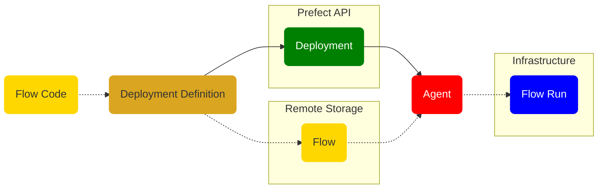
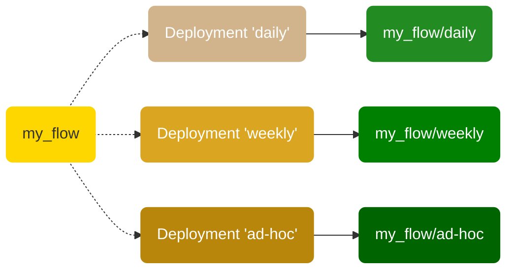

# Deployments

A deployment is a server-side concept that encapsulates a flow, allowing it to be scheduled and triggered via API. The deployment stores metadata about where your flow's code is stored and how your flow should be run.

Each deployment references a single "entrypoint" flow (though that flow may, in turn, call any number of tasks and subflows). Any single flow, however, may be referenced by any number of deployments.

At a high level, you can think of a deployment as configuration for managing flows, whether you run them via the CLI, the UI, or the API.

!!! warning "Deployments have changed since beta"
    Deployments based on `DeploymentSpec` are no longer supported. Instead, you can define deployments by using either the [`prefect deployment` CLI command](#create-a-deployment) or [the `Deployment` Python object](/api-ref/prefect/deployments/).

## Deployments overview

All Prefect flow runs are tracked by the API. The API does not require prior registration of flows. With Prefect, you can call a flow locally or on a remote environment and it will be tracked.

Creating a _deployment_ for a Prefect workflow means packaging workflow code, settings, and infrastructure configuration so that the workflow can be managed via the Prefect API and run remotely by a Prefect agent.

The following diagram provides a high-level overview of the conceptual elements involved in defining a deployment and executing a flow run based on that deployment.



!!! info "Your flow code and the Prefect hybrid model"
    In the diagram above, the dotted line indicates the path of your flow code in the lifecycle of a Prefect deployment, from creation to executing a flow run. Notice that your flow code stays within your storage and execution infrastructure and never lives on the Prefect server or database.

    This is the heart of the Prefect hybrid model: there's always a boundary between your code, your private infrastructure, and the Prefect backend, such as [Prefect Cloud](/ui/cloud/). Even if you're using a self-hosted Prefect Orion API, you only register the deployment metadata on the backend allowing for a clean separation of concerns.

When creating a deployment, a user must answer *two* basic questions:

- What instructions does an [agent](/concepts/work-queues/) need to set up an execution environment for my workflow? For example, a workflow may have Python requirements, unique Kubernetes settings, or Docker networking configuration.
- How should the flow code be accessed?

A deployment additionally enables you to:

- Schedule flow runs.
- Assign a work queue name to delegate deployment flow runs to work queues.
- Assign one or more tags to organize your deployments and flow runs. You can use those tags as filters in the [Prefect UI](/ui/flow-runs/).
- Assign custom parameter values for flow runs based on the deployment.
- Create ad-hoc flow runs from the API or Prefect UI.
- Upload flow files to a defined storage location for retrieval at run time.
- Specify run time infrastructure for flow runs, such as Docker or Kubernetes configuration.

With remote storage blocks, you can package not only your flow code script but also any supporting files, including your custom modules, SQL scripts and any configuration files needed in your project.

To define how your flow execution environment should be configured, you may either reference pre-configured infrastructure blocks or let Prefect create those automatically for you as anonymous blocks (this happens when you specify the infrastructure type using `--infra` flag during the build process).

!!! warning "Work queue affinity improved starting from Prefect 2.0.5"
    Until Prefect 2.0.4, tags were used to associate flow runs with work queues. Starting in Prefect 2.0.5, tag-based work queues are deprecated. Instead, work queue names are used to explicitly direct flow runs from deployments into queues.

    Note that **backward compatibility is maintained** and work queues that use tag-based matching can still be created and will continue to work. However, those work queues are now considered legacy and we encourage you to use the new behavior by specifying work queues explicitly on agents and deployments.

## Deployments and flows

Each deployment is associated with a single flow, but any given flow can be referenced by multiple deployments.

Deployments are uniquely identified by the combination of: `flow_name/deployment_name`.



This enables you to run a single flow with different parameters, on multiple schedules, and in different environments. This also enables you to run different versions of the same flow for testing and production purposes.

## Deployment definition

A _deployment definition_ captures the settings for creating a [deployment object](#deployment-api-representation) on the Prefect API. You can create the deployment definition by:

- Run the [`prefect deployment build` CLI command](#create-a-deployment) with deployment options to create a [`deployment.yaml`](#deploymentyaml) deployment definition file, then run `prefect deployment apply` to create a deployment on the API using the settings in `deployment.yaml`.
- Define a [`Deployment`](/api-ref/prefect/deployments/) Python object, specifying the deployment options as properties of the object, then building and applying the object using methods of `Deployment`.

The minimum required information to create a deployment includes:

- The path and filename of the file containing the flow script.
- The name of the entrypoint flow function &mdash; this is the flow function that starts the flow and calls and additional tasks or subflows.
- The name of the deployment.

You may provide additional settings for the deployment. Any settings you do not explicitly specify are inferred from defaults.


## Create a deployment on the CLI

To create a deployment on the CLI, there are two steps:

1. Build the deployment definition file `deployment.yaml`. This step includes uploading your flow to its configured remote storage location, if one is specified.
1. Create the deployment on the API.


### Build the deployment

To build the deployment definition file `deployment.yaml`, run the `prefect deployment build` Prefect CLI command from the folder containing your flow script and any dependencies of the script.

<div class="terminal">
```bash
$ prefect deployment build [OPTIONS] PATH
```
</div>

Path to the flow is specified in the format `path-to-script:flow-function-name` &mdash; The path and filename of the flow script file, a colon, then the name of the entrypoint flow function.

For example:

<div class="terminal">
```bash
$ prefect deployment build flows/marvin.py:say_hi -n marvin -q test
```
</div>

When you run this command, Prefect:

- Creates a `marvin_flow-deployment.yaml` file for your deployment based on your flow code and options.
- Uploads your flow files to the configured storage location (local by default).
- Submit your deployment to the work queue `test`. The work queue `test` will be created if it doesn't exist.

!!! note "Uploading files may require storage filesystem libraries"
    Note that the appropriate filesystem library supporting the storage location must be installed prior to building a deployment with a storage block. For example, the AWS S3 Storage block requires the [`s3fs`](https://s3fs.readthedocs.io/en/latest/) library.

!!! tip "Ignore files or directories from a deployment"
    By default, Prefect uploads _all files_ in the current folder to the configured storage location (local by default) when you build a deployment.

    If you want to omit certain files or directories from your deployments, add a `.prefectignore` file to the root directory. `.prefectignore` enables users to omit certain files or directories from their deployments.

    Similar to other `.ignore` files, the syntax supports pattern matching, so an entry of `*.pyc` will ensure all `.pyc` files are ignored by the deployment call when uploading to remote storage.

### Deployment build options

You may specify additional options to further customize your deployment.

| Options | Description |
| ------- | ----------- |
| PATH | Path, filename, and flow name of the flow definition. (Required) |
|  `-v`, `--version TEXT`            | An optional version for the deployment. This could be a git commit hash if you use this command from a CI/CD pipeline. |
|  `-n`, `--name TEXT`               | The name of the deployment. |
|  `-t`, `--tag TEXT`                | One or more optional tags to apply to the deployment. |
|  `-q`. `--work-queue TEXT`        |  The work queue that will handle this deployment's runs. It will be created if it doesn't already exist. Defaults to `None`. Note that if a work queue is not set, work will not be scheduled.
|  `-o`, `--output TEXT`            | Optional location for the YAML manifest generated as a result of the `build` step. You can version-control that file, but it's not required since the CLI can generate everything you need to define a deployment. |
|  `-i`, `--infra`                   | The [infrastructure type](/concepts/infrastructure/) to use. (Default is `Process`) |
|  `-ib`, `--infra-block TEXT`       | The [infrastructure block](#block-identifiers) to use, in `block-type/block-name` format. |
|  `--override TEXT`       | One or more optional infrastructure overrides provided as a dot delimited path. For example, `env.env_key=env_value`. |
|  <span class="no-wrap">`-sb`, `--storage-block TEXT`</span>    | The [storage block](#block-identifiers) to use, in `block-type/block-name` or `block-type/block-name/path` format. Note that the appropriate library supporting the storage filesystem must be installed. |
|  `--cron TEXT`    | A cron string that will be used to set a [`CronSchedule`](/concepts/schedules/) on the deployment. For example, `--cron "*/1 * * * *"` to create flow runs from that deployment every minute. |
|  `--interval INTEGER`     | An integer specifying an interval (in seconds) that will be used to set an [`IntervalSchedule`](/concepts/schedules/) on the deployment. For example, `--interval 60` to create flow runs from that deployment every minute. |
|  `--rrule TEXT`     | An `RRule` that will be used to set an [`RRuleSchedule`](/concepts/schedules/) on the deployment. For example, `--rrule 'FREQ=HOURLY;BYDAY=MO,TU,WE,TH,FR;BYHOUR=9,10,11,12,13,14,15,16,17'` to create flow runs from that deployment every hour but only during business hours. |
| `--apply` | When provided, automatically registers the resulting deployment with the API. |
| `--skip-upload` | When provided, skips uploading this deployment's files to remote storage. |
| `--path` | An optional path to specify a subdirectory of remote storage to upload to, or to point to a subdirectory of a locally stored flow. |

### Block identifiers

When specifying a storage block with the `-sb` or `--storage-block` flag, you may specify the block by passing its slug. The storage block slug is formatted as `block-type/block-name`. 

For example, `s3/example-block` is the slug for an S3 block named `example-block`.

In addition, when passing the storage block slug, you may pass just the block slug or the block slug and a path.

- `block-type/block-name` indicates just the block, including any path included in the block configuration.
- `block-type/block-name/path` indicates a storage path in addition to any path included in the block configuration.

When specifying an infrastructure block with the `-ib` or `--infra-block` flag, you specify the block by passing its slug. The infrastructure block slug is formatted as `block-type/block-name`. 

| Block name | Block class name | Block type for a slug |
| --- | --- | --- |
| Azure | `Azure` | `azure` |
| Docker Container | `DockerContainer` | `docker-container` |
| GitHub | `GitHub` | `github` |
| GCS | `GCS` | `gcs` |
| Kubernetes Job | `KubernetesJob` | `kubernetes-job` |
| Process | `Process` | `process` |
| Remote File System | `RemoteFileSystem` | `remote-file-system` |
| S3 | `S3` | `s3` |
| SMB | `SMB` | `smb` |

Note that the appropriate library supporting the storage filesystem must be installed prior to building a deployment with a storage block. For example, the AWS S3 Storage block requires the [`s3fs`](https://s3fs.readthedocs.io/en/latest/) library. See [Storage](/concepts/storage/) for more information.

### deployment.yaml

A deployment's YAML file configures additional settings needed to create a deployment on the server.

As a single flow may have multiple deployments created for it, with different schedules, tags, and so on. A single flow definition may have multiple deployment YAML files referencing it, each specifying different settings. The only requirement is that each deployment must have a unique name.

The default `{flow-name}-deployment.yaml` filename may be edited as needed with the `--output` flag to `prefect deployment build`.

```yaml
###
### A complete description of a Prefect Deployment for flow 'Cat Facts'
###
name: catfact
description: null
version: c0fc95308d8137c50d2da51af138aa23
# The work queue that will handle this deployment's runs
work_queue_name: test
tags: []
parameters: {}
schedule: null
infra_overrides: {}
infrastructure:
  type: process
  env: {}
  labels: {}
  name: null
  command:
  - python
  - -m
  - prefect.engine
  stream_output: true
###
### DO NOT EDIT BELOW THIS LINE
###
flow_name: Cat Facts
manifest_path: null
storage: null
path: /Users/terry/test/testflows/catfact
entrypoint: catfact.py:catfacts_flow
parameter_openapi_schema:
  title: Parameters
  type: object
  properties:
    url:
      title: url
  required:
  - url
  definitions: null
```

!!! note "Editing deployment.yaml"
    Note the big **DO NOT EDIT** comment in your deployment's YAML: In practice, anything above this block can be freely edited _before_ running `prefect deployment apply` to create the deployment on the API.

    We recommend editing most of these fields from the CLI or Prefect UI for convenience.

### Parameters in deployments

You may provide default parameter values in the `deployment.yaml` configuration, and these parameter values will be used for flow runs based on the deployment. 

To configure default parameter values, add them to the `parameters: {}` line of `deployment.yaml` as JSON key-value pairs. The parameter list configured in `deployment.yaml` *must* match the parameters expected by the entrypoint flow function.

```yaml
parameters: {"name": "Marvin", "num": 42, "url": "https://catfact.ninja/fact"}
```

!!! tip "Passing **kwargs as flow parameters"
    You may pass `**kwargs` as a deployment parameter as a `"kwargs":{}` JSON object containing the key-value pairs of any passed keyword arguments.

    ```yaml
    parameters: {"name": "Marvin", "kwargs":{"cattype":"tabby","num": 42}
    ```

You can edit default parameters for deployments in the Prefect UI, and you can override default parameter values when creating ad-hoc flow runs via the Prefect UI.

To edit parameters in the Prefect UI, go the the details page for a deployment, then select **Edit** from the commands menu. If you change parameter values, the new values are used for all future flow runs based on the deployment.

To create an ad-hoc flow run with different parameter values, go the the details page for a deployment, select **Run**, then select **Custom**. You will be able to provide custom values for any editable deployment fields. Under **Parameters**, select **Custom**. Provide the new values, then select **Save**. Select **Run** to begin the flow run with custom values.


## Create a deployment with the CLI

When you've configured `deployment.yaml` for a deployment, you can create the deployment on the API by running the `prefect deployment apply` Prefect CLI command.

<div class="terminal">
```bash
$ prefect deployment apply catfacts_flow-deployment.yaml
```
</div>

For example:

<div class="terminal">
```bash
$ prefect deployment apply ./catfacts_flow-deployment.yaml
Successfully loaded 'catfact'
Deployment '76a9f1ac-4d8c-4a92-8869-615bec502685' successfully created.
```
</div>

`prefect deployment apply` accepts an optional `--upload` flag that, when provided, uploads this deployment's files to remote storage.

Once the deployment has been created, you'll see it in the [Prefect UI](/ui/flow-runs/) and can inspect it using the CLI.

<div class="terminal">
```bash
$ prefect deployment ls
                               Deployments
┏━━━━━━━━━━━━━━━━━━━━━━━━━━━━━━━━┳━━━━━━━━━━━━━━━━━━━━━━━━━━━━━━━━━━━━━━┓
┃ Name                           ┃ ID                                   ┃
┡━━━━━━━━━━━━━━━━━━━━━━━━━━━━━━━━╇━━━━━━━━━━━━━━━━━━━━━━━━━━━━━━━━━━━━━━┩
│ Cat Facts/catfact              │ 76a9f1ac-4d8c-4a92-8869-615bec502685 │
│ leonardo_dicapriflow/hello_leo │ fb4681d7-aa5a-4617-bf6f-f67e6f964984 │
└────────────────────────────────┴──────────────────────────────────────┘
```
</div>


When you run a deployed flow with Prefect Orion, the following happens:

- The user runs the deployment, which creates a flow run. (The API creates flow runs automatically for deployments with schedules.)
- An agent picks up the flow run from a work queue and uses an infrastructure block to create infrastructure for the run.
- The flow run executes within the infrastructure.

[Agents and work queues](/concepts/work-queues/) enable the Prefect orchestration engine and API to run deployments in your local execution environments. To execute deployed flow runs you need to configure at least one agent.

!!! note "Scheduled flow runs"
    Scheduled flow runs will not be created unless the scheduler is running with either Prefect Cloud or a local Prefect Orion API server started with `prefect orion start`.

    Scheduled flow runs will not run unless an appropriate [agent and work queue](/concepts/work-queues/) are configured.

## Create a deployment from a Python object

You can also create deployments from Python scripts by using the [`prefect.deployments.Deployment`][prefect.deployments.Deployment] class.

Create a new deployment using configuration defaults for an imported flow:

```python
from my_project.flows import my_flow
from prefect.deployments import Deployment

deployment = Deployment.build_from_flow(
    flow=my_flow,
    name="example-deployment", 
    version=1, 
    work_queue_name="demo",
)
deployment.apply()
```

Create a new deployment with a pre-defined [storage block](/concepts/storage/) and an [infrastructure](/concepts/infrastructure/) override:

```python
from my_project.flows import my_flow
from prefect.deployments import Deployment
from prefect.filesystems import S3

storage = S3.load("dev-bucket") # load a pre-defined block

deployment = Deployment.build_from_flow(
    flow=my_flow,
    name="s3-example",
    version=2,
    work_queue_name="aws",
    storage=storage,
    infra_overrides=["env.SOME_IMPORTANT_CONFIG=true"],
)

deployment.apply()
```

If you have settings that you want to share from an existing deployment you can load those settings:

```python
deployment = Deployment(
    name="a-name-you-used", 
    flow_name="name-of-flow"
)
deployment.load() # loads server-side settings
```

Once the existing deployment settings are loaded, you may update them as needed by changing deployment properties.

View all of the parameters for the `Deployment` object in the [Python API documentation](https://docs.prefect.io/api-ref/prefect/deployments/).

## Deployment API representation

In Prefect Orion, when you create a deployment, it is constructed from deployment definition data you provide and additional properties calculated by client-side utilities.

Deployment properties include:

| Property | Description |
| --- | --- |
| `id` | An auto-generated UUID ID value identifying the deployment. |
| `created` | A `datetime` timestamp indicating when the deployment was created. |
| `updated` | A `datetime` timestamp indicating when the deployment was last changed. |
| `name` | The name of the deployment. |
| `version` | The version of the deployment
| `description` | A description of the deployment. |
| `flow_id` | The id of the flow associated with the deployment. |
| `schedule` | An optional schedule for the deployment. |
| `is_schedule_active` | Boolean indicating whether the deployment schedule is active. Default is True. |
| `infra_overrides` | One or more optional infrastructure overrides
| `parameters` | An optional dictionary of parameters for flow runs scheduled by the deployment. |
| `tags` | An optional list of tags for the deployment. |
| `work_queue_name` | The optional work queue that will handle the deployment's run |
| `parameter_openapi_schema` | JSON schema for flow parameters. |
| `path` | The path to the deployment.yaml file |
| `entrypoint` | The path to a flow entry point |
| `storage_document_id` | Storage block configured for the deployment. |
| <span class="no-wrap">`infrastructure_document_id`</span> | Infrastructure block configured for the deployment. |


You can inspect a deployment using the CLI with the `prefect deployment inspect` command, referencing the deployment with `<flow_name>/<deployment_name>`.

```bash
$ prefect deployment inspect 'Cat Facts/catfact'
{
    'id': '76a9f1ac-4d8c-4a92-8869-615bec502685',
    'created': '2022-07-26T03:48:14.723328+00:00',
    'updated': '2022-07-26T03:50:02.043238+00:00',
    'name': 'catfact',
    'version': '899b136ebc356d58562f48d8ddce7c19',
    'description': None,
    'flow_id': '2c7b36d1-0bdb-462e-bb97-f6eb9fef6fd5',
    'schedule': None,
    'is_schedule_active': True,
    'infra_overrides': {},
    'parameters': {},
    'tags': [],
    'work_queue_name': 'test',
    'parameter_openapi_schema': {
        'title': 'Parameters',
        'type': 'object',
        'properties': {'url': {'title': 'url'}},
        'required': ['url']
    },
    'path': '/Users/terry/test/testflows/catfact',
    'entrypoint': 'catfact.py:catfacts_flow',
    'manifest_path': None,
    'storage_document_id': None,
    'infrastructure_document_id': 'f958db1c-b143-4709-846c-321125247e07',
    'infrastructure': {
        'type': 'process',
        'env': {},
        'labels': {},
        'name': None,
        'command': ['python', '-m', 'prefect.engine'],
        'stream_output': True
    }
}
```

## Create a flow run from a deployment

If you specify a schedule for a deployment, the deployment will execute its flow automatically on that schedule as long as a Prefect Orion API server and agent is running. Prefect Cloud created scheduled flow runs automatically, and they will run on schedule if an agent is configured to pick up flow runs for the deployment.

In the [Prefect UI](/ui/deployments/), you can click the **Run** button next to any deployment to execute an ad hoc flow run for that deployment.

The `prefect deployment` CLI command provides commands for managing and running deployments locally.

| Command | Description |
| ------- | ----------- |
| `create`  | Create or update a deployment from a file. |
| `delete`  | Delete a deployment. |
| `execute` | Execute a local flow run for a given deployment. Does not require an agent and bypasses flow runner settings attached to the deployment. Intended for testing purposes. |
| `inspect` | View details about a deployment. |
| `ls`      | View all deployments or deployments for specific flows. |
| `preview` | Prints a preview of a deployment. |
| `run`     | Create a flow run for the given flow and deployment. |

!!! tip "`PREFECT_API_URL` setting for agents"
    You'll need to configure [agents and work queues](/concepts/work-queues/) that can create flow runs for deployments in remote environments. [`PREFECT_API_URL`](/concepts/settings/#prefect_api_url) must be set for the environment in which your agent is running.

    If you want the agent to communicate with Prefect Cloud from a remote execution environment such as a VM or Docker container, you must configure `PREFECT_API_URL` in that environment.

## Examples

- [How to deploy Prefect 2 flows to AWS](https://discourse.prefect.io/t/how-to-deploy-prefect-2-0-flows-to-aws/1252)
- [How to deploy Prefect 2 flows to GCP](https://discourse.prefect.io/t/how-to-deploy-prefect-2-0-flows-to-gcp/1251)
- [How to deploy Prefect 2 flows to Azure](https://discourse.prefect.io/t/how-to-deploy-prefect-2-0-flows-to-azure/1312)
- [How to deploy Prefect 2 flows using files stored locally](https://discourse.prefect.io/t/how-to-deploy-prefect-2-0-flows-to-run-as-a-local-process-docker-container-or-a-kubernetes-job/1246)