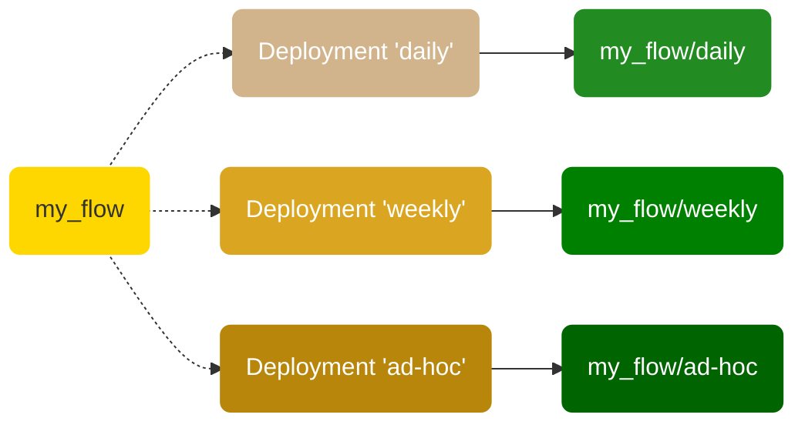

# Deployments

A deployment is a server-side concept that encapsulates a flow, allowing it to be scheduled and triggered via API. The deployment stores metadata about where your flow's code is stored and how your flow should be run.

Each deployment references a single flow (though that flow may, in turn, call any number of tasks and subflows). Any single flow, however, may be referenced by any number of deployments. 

At a high level, you can think of a deployment as configuration for managing flows, whether you run them via the CLI, the UI, or the API.

!!! warning "Deployments have changed since beta"
    Deployments based on `DeploymentSpec` are no longer supported. Instead, you can either define those using  `prefect deployment` CLI or the `Deployment` object.

## Deployments overview

All Prefect flow runs are tracked by the API. The API does not require prior registration of flows. With Prefect, you can call a flow locally or on a remote environment and it will be tracked. 

Creating a _deployment_ for a Prefect workflow means packaging workflow code, settings, and infrastructure configuration so that the workflow can be managed via the Prefect API and run remotely by a Prefect agent.  

When creating a deployment, a user must answer *two* basic questions:

- What instructions does the agent need to set up an execution environment for my workflow? For example, a workflow may have Python requirements, unique Kubernetes settings, or Docker networking configuration.
- Where and how can the agent access the flow code?

A deployment additionally enables you to:

- Schedule flow runs
- Assign `--work-queue` name to delegate flow runs to work queues
- Assign one or multiple `--tag` flags to organize your deployments and corresponding flow runs created from that deployment based on projects; you can use those assigned tags to filter for those projects in the Prefect UI
- Assign custom parameter values for flow runs based on the deployment
- Create ad-hoc flow runs from the API or Prefect UI
- Upload flow files to a defined storage location for retrieval at run time

Deployments are uniquely identified by the combination of: `flow_name/deployment_name`. 

With storage blocks, you can package not only your flow code script but also any supporting files, including your custom modules, SQL scripts and any configuration files needed in your project.

To define how your flow execution environment should be configured, you may either reference pre-configured infrastructure blocks or let Prefect create those as anonymous blocks automatically for you (this happens when you specify the infrastructure type using `--infra` flag during the build process).

### Deployments and flows

Each deployment is associated with a single flow, but any given flow can be referenced by multiple deployments. 



This enables you to run a single flow with different parameters, on multiple schedules, and in different environments. This also enables you to run different versions of the same flow for testing and production purposes.

## deployment.yaml

A deployment's YAML file configures additional settings needed to create a deployment on the server.

As a single flow may have multiple deployments created for it, with different schedules, tags, and so on, a single flow definition may have multiple deployment YAML files, each specifying different settings. The only requirement is that each deployment must have a unique name.

The default `{flow-name}-deployment.yaml` filename may be edited as needed with the `--output` flag to `prefect deployment build`.

```yaml
name: catfact
description: null
version: 94f321d0a24a9f8143495838327fe710
tags:
- test
schedule: null
parameters: {}
infra_overrides: {}
infrastructure:
  type: process
  env: {}
  labels: {}
  name: null
  command:
  - python
  - -m
  - prefect.engine
  stream_output: true
###
### DO NOT EDIT BELOW THIS LINE
###
flow_name: Cat Facts
manifest_path: null
storage: null
path: /Users/terry/test/testflows
entrypoint: catfact.py:catfacts_flow
parameter_openapi_schema:
  title: Parameters
  type: object
  properties:
    url:
      title: url
  required:
  - url
  definitions: null
```

!!! note "Editing deployment.yaml"
    Note the big **DO NOT EDIT** comment in your deployment's YAML: In practice, anything above this block can be freely edited _before_ running `prefect deployment apply` to create the deployment on the API. 
    
    That said, we recommend editing most of these fields in the Prefect UI for convenience.

## Create a deployment

To create a deployment from an existing flow script, there are two steps:

1. Build the `deployment.yaml` file, which includes uploading your flow to its configured storage location.
1. Create the deployment on the API.

### Build deployment

To build the `deployment.yaml`, run the following Prefect CLI command.

<div class="terminal">
```bash
$ prefect deployment build [OPTIONS] PATH
```
</div>

Path to the flow is specified in the format `path:flow-function-name` &mdash; The path and filename, a colon, then the name of the entrypoint flow function.

For example:

<div class="terminal">
```bash
$ prefect deployment build flows/marvin.py:say_hi -n marvin -t test
```
</div>

You may specify additional options to further customize your deployment.

| Options | Description |
| ------- | ----------- |
| PATH | Path, filename, and flow name of the flow definition. (Required) |
|  -n, --name TEXT               | The name of the deployment. |
|  -t, --tag TEXT                | One or more optional tags to apply to the deployment to organize your deployments and flow runs based on projects. |
|  -v, --version TEXT            | A version to give the deployment. This could be a git commit hash if you use this command from a CI/CD pipeline. |
|  -o, --output TEXT            | Optional location for the YAML manifest generated as a result of the `build` step. You can version-control that file, but it's not required since the CLI can generate everything you need to define a deployment. |
|  -i, --infra                   | The infrastructure type to use. (Default is `Process`) |
|  -ib, --infra-block TEXT       | The infrastructure block to use in `type/name` format. |
|  --override TEXT       | One or more optional infrastructure overrides provided as a dot delimited path, e.g., `env.env_key=env_value`. |
|  -sb, --storage-block TEXT     | The storage block to use in `type/name` format. |
|  -a, --apply     | Set this flag if you want to simultabeously build and apply the deployment within a single command. |
|  --cron TEXT     | A cron string that will be used to set a CronSchedule on the deployment, e.g. `--cron "*/1 * * * *"` to create flow runs from that deployment every minute. |
|  --interval INTEGER     | An integer specifying an interval (in seconds) that will be used to set an IntervalSchedule on the deployment, e.g. `--interval 60` to create flow runs from that deployment every minute. |
|  --rrule TEXT     | An RRule that will be used to set an RRuleSchedule on the deployment, e.g. `--rrule 'FREQ=HOURLY;BYDAY=MO,TU,WE,TH,FR;BYHOUR=9,10,11,12,13,14,15,16,17'` to create flow runs from that deployment every hour but only during business hours. |

When you run this command, Prefect: 

- Creates the and `marvin_flow-deployment.yaml` file for your deployment based on your flow code and options.
- Uploads your flow files to the configured storage location (local by default).

!!! note "Ignore files or directories from a deployment"
    If you want to omit certain files or directories from your deployments, add a `.prefectignore` file to the root directory. `.prefectignore` enables users to omit certain files or directories from their deployments. 

    Similar to other `.ignore` files, the syntax supports pattern matching, so an entry of `*.pyc` will ensure all `.pyc` files are ignored by the deployment call when uploading to remote storage. 

### Block indentifiers

You can provide storage (`-sb`) and infrastructure block (`-ib`) identifiers in your `deployment build` command. The required format of a block type consists of the `block-type` and `block-name` in the format `block-type/block-name`. Block name is the name that you provided when creating the block. The block type is the same name as the underlying file system or infrastructure block class, but split into separate words combined with hyphens. Here are some examples that illustrate the pattern:

| Block class name | Block type used in a deployment |
| ------- | ----------- |
| `LocalFileSystem` | `local-file-system` |
| `RemoteFileSystem` | `remote-file-system` |
| `S3` | `s3` |
| `GCS` | `gcs` |
| `Azure` | `azure` |
| `DockerContainer` | `docker-container` |
| `KubernetesJob` | `kubernetes-job` |
| `Process` | `process` |


### Create deployment in API

When you've configured `catfacts_flow-deployment.yaml` for a deployment, you can create the deployment on the API. Run the following Prefect CLI command.

<div class="terminal">
```bash
$ prefect deployment apply `catfacts_flow-deployment.yaml`
```
</div>

For example:

<div class="terminal">
```bash
$ prefect deployment apply ./catfacts_flow-deployment.yaml
Successfully loaded 'catfact'
Deployment '76a9f1ac-4d8c-4a92-8869-615bec502685' successfully created.
```
</div>

Once the deployment has been created, you'll see it in the [Prefect UI](/ui/flow-runs/) and can inspect it using the CLI.

<div class="terminal">
```bash
$ prefect deployment ls
                               Deployments
┏━━━━━━━━━━━━━━━━━━━━━━━━━━━━━━━━┳━━━━━━━━━━━━━━━━━━━━━━━━━━━━━━━━━━━━━━┓
┃ Name                           ┃ ID                                   ┃
┡━━━━━━━━━━━━━━━━━━━━━━━━━━━━━━━━╇━━━━━━━━━━━━━━━━━━━━━━━━━━━━━━━━━━━━━━┩
│ Cat Facts/catfact              │ 76a9f1ac-4d8c-4a92-8869-615bec502685 │
│ leonardo_dicapriflow/hello_leo │ fb4681d7-aa5a-4617-bf6f-f67e6f964984 │
└────────────────────────────────┴──────────────────────────────────────┘
```
</div>


When you run a deployed flow with Prefect Orion, the following happens:

- The user runs the deployment, which creates a flow run. (The API creates flow runs automatically for deployments with schedules.)
- An agent picks up the flow run from a work queue and uses an infrastructure block to create infrastructure for the run.
- The flow run executes within the infrastructure.

[Work queues and agents](/concepts/work-queues/) enable the Prefect orchestration engine and API to run deployments in your local execution environments. There is no default global work queue or agent, so to execute deployment flow runs you need to configure at least one work queue and agent. 

!!! note "Scheduled flow runs"
    Scheduled flow runs will not be created unless the scheduler is running with either Prefect Cloud or a local Prefect API server started with `prefect orion start`. 
    
    Scheduled flow runs will not run unless an appropriate [work queue and agent](/concepts/work-queues/) are configured.  

## Deployment API representation

In Prefect Orion, when you create a deployment, it is constructed from deployment specification data you provide and additional properties calculated by client-side utilities.

Deployment properties include:

| Property | Description |
| --- | --- |
| `id` | An auto-generated UUID ID value identifying the deployment. |
| `created` | A `datetime` timestamp indicating when the deployment was created. |
| `updated` | A `datetime` timestamp indicating when the deployment was last changed. |
| `name` | The name of the deployment. |
| `description` | A description of the deployment. |
| `flow_id` | The id of the flow associated with the deployment. |
| `schedule` | An optional schedule for the deployment. |
| <span class="no-wrap">`is_schedule_active`</span> | Boolean indicating whether the deployment schedule is active. Default is True. |
| `parameters` | An optional dictionary of parameters for flow runs scheduled by the deployment. |
| `tags` | An optional list of tags for the deployment. |
| `parameter_openapi_schema` | JSON schema for flow parameters. |
| `storage_document_id` | Storage block configured for the deployment. |
| `infrastructure_document_id` | Infrastructure block configured for the deployment. |


You can inspect a deployment using the CLI with the `prefect deployment inspect` command, referencing the deployment with `<flow_name>/<deployment_name>`.

```bash 
$ prefect deployment inspect 'Cat Facts/catfact'
{
    'id': '76a9f1ac-4d8c-4a92-8869-615bec502685',
    'created': '2022-07-26T03:48:14.723328+00:00',
    'updated': '2022-07-26T03:50:02.043238+00:00',
    'name': 'catfact',
    'description': None,
    'flow_id': '2c7b36d1-0bdb-462e-bb97-f6eb9fef6fd5',
    'schedule': None,
    'is_schedule_active': True,
    'parameters': {},
    'tags': ['test'],
    'parameter_openapi_schema': {
        'title': 'Parameters',
        'type': 'object',
        'properties': {'url': {'title': 'url'}},
        'required': ['url']
    },
    'path': '/Users/terry/test/testflows',
    'entrypoint': 'catfact.py:catfacts_flow',
    'manifest_path': None,
    'storage_document_id': None,
    'infrastructure_document_id': '2032f54c-c6e5-402c-a6c5-a6c54612df6c',
    'infrastructure': {
        'type': 'process',
        'env': {},
        'labels': {},
        'name': None,
        'command': ['python', '-m', 'prefect.engine'],
        'stream_output': True
    }
}
```

## Running deployments

If you specify a schedule for a deployment, the deployment will execute its flow automatically on that schedule as long as a Prefect Orion API server and agent is running.

In the [Prefect UI](/ui/deployments/), you can click the **Run** button next to any deployment to execute an ad hoc flow run for that deployment.

The `prefect deployment` CLI command provides commands for managing and running deployments locally.

| Command | Description |
| ------- | ----------- |
| `create`  | Create or update a deployment from a file. |
| `delete`  | Delete a deployment. |
| `execute` | Execute a local flow run for a given deployment. Does not require an agent and bypasses flow runner settings attached to the deployment. Intended for testing purposes. |
| `inspect` | View details about a deployment. |
| `ls`      | View all deployments or deployments for specific flows. |
| `preview` | Prints a preview of a deployment. |
| `run`     | Create a flow run for the given flow and deployment. |

!!! tip "`PREFECT_API_URL` setting for agents"
    You'll need to configure [work queues and agents](/concepts/work-queues/) that can create flow runs for deployments in remote environments. [`PREFECT_API_URL`](/concepts/settings/#prefect_api_url) must be set for the environment in which your agent is running. 

    If you want the agent to communicate with Prefect Cloud from a remote execution environment such as a VM or Docker container, you must configure `PREFECT_API_URL` in that environment.

## Examples

- [How to deploy Prefect 2.0 flows to AWS](https://discourse.prefect.io/t/how-to-deploy-prefect-2-0-flows-to-aws/1252)
- [How to deploy Prefect 2.0 flows to GCP](https://discourse.prefect.io/t/how-to-deploy-prefect-2-0-flows-to-gcp/1251)
- [How to deploy Prefect 2.0 flows to Azure](https://discourse.prefect.io/t/how-to-deploy-prefect-2-0-flows-to-azure/1312)
- [How to deploy Prefect 2.0 flows using files stored locally](https://discourse.prefect.io/t/how-to-deploy-prefect-2-0-flows-to-run-as-a-local-process-docker-container-or-a-kubernetes-job/1246)
