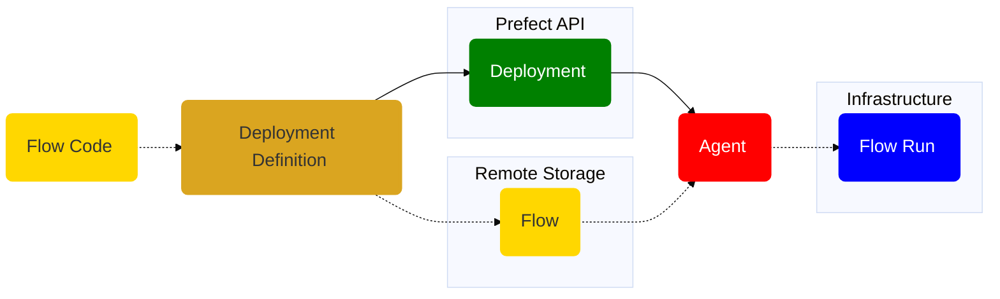

# Deployments

A deployment is a server-side concept that encapsulates a flow, allowing it to be scheduled and triggered via API. The deployment stores metadata about where your flow's code is stored and how your flow should be run.

Each deployment references a single "entrypoint" flow (though that flow may, in turn, call any number of tasks and subflows). Any single flow, however, may be referenced by any number of deployments.

At a high level, you can think of a deployment as configuration for managing flows, whether you run them via the CLI, the UI, or the API.

## Deployments overview

All Prefect flow runs are tracked by the API. The API does not require prior registration of flows. With Prefect, you can call a flow locally or on a remote environment and it will be tracked.

Creating a _deployment_ for a Prefect workflow means packaging workflow code, settings, and infrastructure configuration so that the workflow can be managed via the Prefect API and run remotely by a Prefect agent.

The following diagram provides a high-level overview of the conceptual elements involved in defining a deployment and executing a flow run based on that deployment.

!!! info "Your flow code and the Prefect hybrid model"
    In the diagram above, the dotted line indicates the path of your flow code in the lifecycle of a Prefect deployment, from creation to executing a flow run. Notice that your flow code stays within your storage and execution infrastructure and never lives on the Prefect server or database.

    This is the heart of the Prefect hybrid model: there's always a boundary between your code, your private infrastructure, and the Prefect backend, such as [Prefect Cloud](/ui/cloud/). Even if you're using a self-hosted Prefect server, you only register the deployment metadata on the backend allowing for a clean separation of concerns.

When creating a deployment, a user must answer *two* basic questions:

- What instructions does a [worker](/concepts/work-pools/) need to set up an execution environment for my workflow? For example, a workflow may have Python requirements, unique Kubernetes settings, or Docker networking configuration.
- How should the flow code be accessed?

A deployment additionally enables you to:

- Schedule flow runs.
- Specify event triggers for flow runs.
- Assign a work queue name to delegate deployment flow runs to work queues.
- Assign one or more tags to organize your deployments and flow runs. You can use those tags as filters in the Prefect UI.
- Assign custom parameter values for flow runs based on the deployment.
- Create ad-hoc flow runs from the API or Prefect UI.
- Upload flow files to a defined storage location for retrieval at run time.
- Specify run time infrastructure for flow runs, such as Docker or Kubernetes configuration.