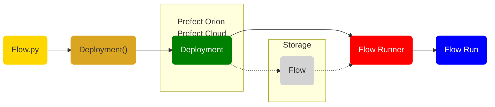
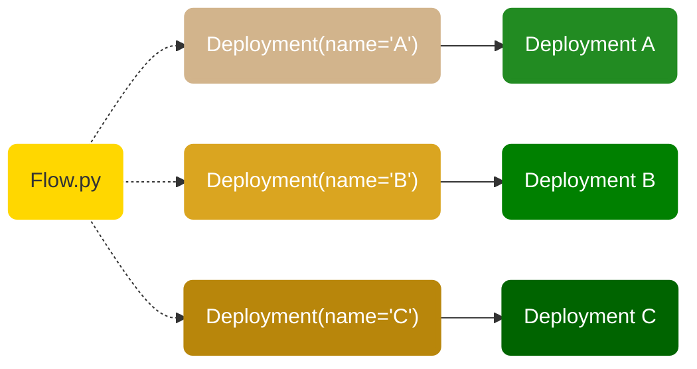

# Deployments

A deployment is a server-side concept that encapsulates a flow, allowing it to be scheduled and triggered via API. The deployment stores metadata about where your flow's code is stored and how your flow should be run.

Each deployment references to a single flow (though that flow may, in turn, call any number of tasks and subflows). Any single flow, however, may be referenced by any number of deployments. 

At a high level, you can think of a deployment as configuration for managing flows, whether you run them via the CLI, the UI, or the API.

For detailed information about deployment objects, see the [prefect.deployments](/api-ref/prefect/deployments/) API documentation.

!!! warning "Deployments are changing"
    Deployments now use `Deployment` for defining deployment objects, along with [prefect.packaging](/api-ref/prefect/packaging/) packagers to package flows and create a manifest that describes how Prefect can access and use the flow package.

    Deployments based on `DeploymentSpec` are no longer supported.

## Deployments overview

All Prefect flow runs are tracked by the API. The API does not require prior registration of flows. With Prefect, you can call a flow locally or on a remote environment and it will be tracked. 

Deployments enable you to:

- Schedule flow runs
- Tell the Prefect API where to find your flow code
- Package flow code and configuration 
- Assign tags for filtering flow runs on work queues and in the UI
- Create ad-hoc flow runs from the API or UI

Deployments can package your flow code and store the manifest in the API &mdash; either Prefect Cloud or a local Prefect Orion server run with `prefect orion start`. The manifest contains the parameter schema so the UI can display a rich interface for providing parameters for a run. 

Deployments are uniquely identified by the combination of flow_name/deployment_name. 

The elements used to create deployments and run a flow from a deployment go together like this:



To create a deployment you:

- Start with the flow and task code that will execute your workflow.
- If defining the deployment in code, create a [deployment specification](#deployment-specifications) that includes the settings used to create a deployment based on that flow code. 
- Using the deployment specification, create a deployment object in the Prefect database via the API. 
- When creating or updating the deployment, your flow code is persisted to a [storage](/concepts/storage/) location &mdash; either the default storage for the API server or a storage location specified in your deployment specification. 

When you run a deployment: 

- Prefect creates an appropriate [flow runner](/concepts/flow-runners/) instance via a [work queue and agent](/concepts/work-queues/) (not shown here). 
- The flow runner stands up any necessary execution environment for your flow run (based on settings in your deployment).
- The flow runner retrieves the flow code from storage. 
- The flow runner starts `prefect.engine` in the infrastructure, which executes the flow run code.
- The Orion orchestration engine monitors flow run state, reporting the run state and log messages in Prefect Cloud or your Prefect API server.

This is just a broad-strokes overview of creating a deployment for a flow and executing the flow based on the deployment. The following sections provide more detail on defining deployment specifications and creating deployments.

### Deployments and flows

Each deployment is associated with a single flow, but any given flow can be referenced by multiple deployments. 



This enables you to run a single flow with different parameters, on multiple schedules, and in different environments. This also allows you to run different versions of the same flow for testing and production purposes.

Deployments include the ability to indicate where your flow code can be found, and even package your code and persist it to storage so your code can be easily retrieved for creating flow runs. 

[Flow runners](/concepts/flow-runners/) enable you to dynamically specify infrastructure to execute runs of a deployment. Since the flow's code must be retrieved on the created infrastructure, configuring flow runners is possible only for deployed flows.

A simple example of a deployment specification for a flow looks like this:

```python
from prefect import flow
from prefect.deployments import Deployment

@flow(name="Kiki's Delivery Flow")
def kikis_delivery_flow(name="world"):
    print(f"Hello {name}!")

Deployment(
    flow=kikis_delivery_flow,
    name="kikis-adhoc-deployment",
)
```

Once the deployment has been created, you'll see it in the [Prefect UI](/ui/dashboard/) and can inspect it using the CLI.


When you run a deployed flow in Orion, the following happens:

- The user runs the deployment, which creates a flow run. (The API creates flow runs automatically for deployments with schedules.)
- An agent picks up the flow run from a work queue and uses a flow runner to create infrastructure for the run.
- The flow run executes within the infrastructure.

[Work queues and agents](/concepts/work-queues/) enable the Prefect orchestration engine and API to run deployments in your local execution environments. There is no default global work queue or agent, so to execute deployment flow runs you need to configure at least one work queue and agent. The [Deployments tutorial](/tutorials/deployments/) walks through the steps for configuring a work queue and starting an agent.

## Deployment representation in Orion

In Orion, a deployment is an instance of the Prefect [`Deployment`](/api-ref/orion/schemas/core/#prefect.orion.schemas.core.Deployment) object. When you create a deployment, it is constructed from deployment specification data you provide and additional properties calculated by client-side utilities.

Deployment properties include:

| Property | Description |
| --- | --- |
| `id` | An auto-generated UUID ID value identifying the deployment. |
| `created` | A `datetime` timestamp indicating when the deployment was created. |
| `updated` | A `datetime` timestamp indicating when the deployment was last changed. |
| `name` | The name of the deployment. |
| `flow_id` | The id of the flow associated with the deployment. |
| `flow_data` | A [`DataDocument`](/api-ref/orion/schemas/data/#prefect.orion.schemas.data.DataDocument) representing the flow code to execute. |
| `schedule` | An optional schedule for the deployment. |
| <span class="no-wrap">`is_schedule_active`</span> | Boolean indicating whether the deployment schedule is active. Default is True. |
| `parameters` | An optional dictionary of parameters for flow runs scheduled by the deployment. |
| `tags` | An optional list of tags for the deployment. |
| `flow_runner` | [`FlowRunnerSettings`](/api-ref/orion/schemas/core/#prefect.orion.schemas.core.FlowRunnerSettings) containing details about the flow runner to assign to flow runs associated with this deployment. |

You can inspect a deployment using the CLI with the `prefect deployment inspect` command, referencing the deployment with `<flow_name>/<deployment_name>`.

```bash 
$ prefect deployment inspect 'hello-world/hello-world-daily'
{
    'id': '710145d4-a5cb-4e58-a887-568e4df9da88',
    'created': '2022-04-25T20:23:42.311269+00:00',
    'updated': '2022-04-25T20:23:42.309339+00:00',
    'name': 'hello-world-daily',
    'flow_id': '80768746-cc02-4d25-a01c-4e4a92797142',
    'flow_data': {
        'encoding': 'blockstorage',
        'blob': '{"data": "\\"f8e7f81f24512625235fe5814f1281ae\\"", "block_id":
"c204821d-a44f-4b9e-aec3-fcf24619d22f"}'
    },
    'schedule': {
        'interval': 86400.0,
        'timezone': None,
        'anchor_date': '2020-01-01T00:00:00+00:00'
    },
    'is_schedule_active': True,
    'parameters': {},
    'tags': ['earth'],
    'flow_runner': {'type': 'universal', 'config': {'env': {}}}
}
```

The [prefect.orion.api.deployments](/api-ref/orion/api/deployments/) API also provides functions for inspecting deployments by ID or name.

## Deployment specifications

To create a deployment in Orion, you do not have to specify _all_ of the Deployment object properties. A _deployment specification_ lets you provide the details relevant to deploying your flow. When you create a deployment from a deployment specification, Orion uses the settings provided by your specification, defaults, and automatically constructed data such as timestamps and ids to create the underlying deployment object.

There are several ways to build a deployment specification and use it to create a deployment:

- If calling the API manually, construct a request with the fields specified by [`DeploymentCreate`](/api-ref/orion/schemas/actions/#prefect.orion.schemas.actions.DeploymentCreate).
- If using the `OrionClient`, the request will be constructed for you. See [`OrionClient.create_deployment`](/api-ref/prefect/client/#prefect.client.OrionClient.create_deployment) for the required fields.
- You can also write your deployment specification as Python or YAML and use the CLI to create the deployment. The CLI will generate the `DeploymentCreate` object to pass to the API.

## Deployment object

You can create a [`Deployment`](/api-ref/prefect/deployments/#prefect.deployments.Deployment) object in your code and pass it to Prefect Cloud or a Prefect Orion server instance to create a deployment.

A `Deployment` object has the following parameters:

| Parameter | Description |
| --------- | ----------- |
| `name` | String specifying the name of the deployment. |
| `flow` | The flow object to associate with the deployment. May provide the flow function name as `flow="flow_name"` if defined in the same file as the `Deployment` specification, or may provide additional information to define the flow code via a `FlowScript` or `PackageManifest` object. (Required) |
| <span class="no-wrap">`flow_runner`</span> | Specifies the [flow runner](/api-ref/prefect/flow-runners/) used for flow runs. Uses the `UniversalFlowRunner` if none is specified. |
| `packager` | The [prefect.packaging](/api-ref/prefect/packaging/) packager to use for packaging the flow. |
| `parameters` | Dictionary of default parameters to set on flow runs from this deployment. If defined in Python, the values should be Pydantic-compatible objects. |
| `schedule` | [Schedule](/concepts/schedules/) instance specifying a schedule for running the deployment. |
| `tags` | List containing tags to assign to the deployment. |

The `Deployment` specification must clearly indicate the flow function and the location of the file in which the function is defined on the `flow` parameter. If you define the `Deployment` within the file that contains the flow, you only need to specify the flow function and the deployment name.

If you are defining the `Deployment` specification in a different file from the flow code, you'll need to provide a flow location so the script at the given location will be run when the deployment is created to load metadata about the flow. You can provide that on the `flow` parameter using either a `FlowScript` or `PackageManifest` object.

`FlowScript` is a simple Pydantic model with the following properties:

| Parameter | Description |
| --------- | ----------- |
| `name` | String specifying the name of the flow object to associate with the deployment. Optional if the flow can be inferred from the script. |
| `path` | Path to a script containing the flow to deploy. |

```python
from prefect.deployments import Deployment
from prefect.deployments import FlowScript

Deployment(
    flow=FlowScript(
        path=Path(__file__).parent / "examples" / "multiple_flows_in_file.py",
        name="foo",
    )
)
```

Deployments can also be written in YAML and refer to the flow's location instead of the `Flow` object. If there are multiple flows in the file, a name will be needed to load the correct flow.

```yaml
name: my-first-deployment
flow:
    path: ./path-to-the-flow-script.py
    name: hello-world
tags:
    - foo
    - bar
parameters:
    name: "Earth"
schedule:
    interval: 3600
```

## Packagers

Packagers create a package for a flow.

A package contains the flow and is typically stored outside of Prefect. To facilitate interaction with the package, a manifest is returned from the packager that describes how to access and use the package.

Packaging a flow in Prefect comprises three major concepts:

- The packager creates a package from a flow and returns a `PackageManifest`.
- A `PackageManifest` is a JSON description of the package and the flow within it, allowing retrieval of the flow.
- A package is the object that contains the flow. For example, a Docker image.

The `PackageManifest` is stored on the API deployment's `flow_data` field.

Prefect provides three packagers:

| Packager | Description |
| -------- | ----------- |
| [`FilePackager`](/api-ref/prefect/packaging/#prefect.packaging.file.FilePackager) | The file packager packages the flow into a file. A file system can be specified to persist the file to a remote location. A serializer may be provided to customize the stored blob. |
| <span class="no-wrap">[`DockerPackager`](/api-ref/prefect/packaging/#prefect.packaging.docker.DockerPackager)</span> | The Docker packager packages the flow into a Docker image containing the flow and the runtime environment necessary to run the flow. The resulting image is optionally pushed to a container registry. | 
| [`OrionPackager`](/api-ref/prefect/packaging/#prefect.packaging.orion.OrionPackager) | The Orion packager packages the flow into an anonymous JSON block in the Orion database. A serializer may be provided to customize the stored blob. |

Prefect provides three serializers for packaging:

| Serializer | Description |
| ---------- | ----------- |
| <span class="no-wrap">[`ImportSerializer`](/api-ref/prefect/packaging/#prefect.packaging.serializers.ImportSerializer)</span> |  Serializes to a reference to the import path of the object. |
| [`PickleSerializer`](/api-ref/prefect/packaging/#prefect.packaging.serializers.PickleSerializer) | Serializes the object using cloudpickle or the pickle library of your choice. |
| [`SourceSerializer`](/api-ref/prefect/packaging/#prefect.packaging.serializers.SourceSerializer) | Serializes to the source code of the object's module. |

## Creating deployments 

Creating a deployment is the process of providing deployment specification data to the Prefect Orion API, which then creates the deployment object on the [Orion database](/concepts/database/) for the associated flow. If the deployment includes a schedule, Prefect Orion orchestration engion then immediately creates the scheduled flow runs and begins dispatching scheduled flow runs to work queues and agents for execution.

There are several ways to create a Prefect deployment:

- Using CLI commands and a Python or YAML [`Deployment`](#deployment-object).
- Using [`OrionClient`](/api-ref/prefect/client/#prefect.client.OrionClient) to create a deployment with [`create_deployment`](/api-ref/prefect/client/#prefect.client.OrionClient.create_deployment). 
- Using `OrionClient` and `Deployment.create()` to create a deployment directly from the specification.

### With the CLI

Create a deployment with the Prefect CLI using the `prefect deployment create` command, specifying the name of the file containing the deployment specification. 

To update an existing deployment run `prefect deployment create` &mdash; the Prefect Orion API will detect that the deployment exists and only make changes to the deployment rather than creating a new one:

<div class="terminal">
```bash
$ prefect deployment create <filename>
```
</div>

You can delete an existing deployment in the [Prefect UI](/ui/deployments/) or by running the `prefect deployment delete` CLI command, passing the deployment name.

For example, if a "hello-world" deployment specification is in the file `hello-world.py`, when creating the deployment you'd see something like the following:

<div class="terminal">
```bash
$ prefect deployment create hello_world.py
Loading deployment specifications from python script at 'hello_world.py'...
Creating deployment 'hello-world-daily' for flow 'hello-world'...
Deploying flow script from 'hello_world.py' using File Storage...
Created deployment 'hello-world/hello-world-daily'.
View your new deployment with:
    prefect deployment inspect 'hello-world/hello-world-daily'
```
</div>

!!! note "Scheduled flow runs"
    Scheduled flow runs will not be created unless the scheduler is running with either Prefect Cloud or a local Prefect API server started with `prefect orion start`. 
    
    Scheduled flow runs will not run unless an appropriate [work queue and agent](/concepts/work-queues/) are configured.  

## Running deployments

If you specify a schedule for a deployment, the deployment will execute its flow automatically on that schedule as long as a Prefect Orion API server and agent is running.

In the [Prefect UI](/ui/deployments/), you can click the **Quick Run** button next to any deployment to execute an ad hoc flow run for that deployment.

The `prefect deployment` CLI command provides commands for managing and running deployments locally.

| Command | Description |
| ------- | ----------- |
| `create`  | Create or update a deployment from a file. |
| `delete`  | Delete a deployment. |
| `execute` | Execute a local flow run for a given deployment. Does not require an agent and bypasses flow runner settings attached to the deployment. Intended for testing purposes. |
| `inspect` | View details about a deployment. |
| `ls`      | View all deployments or deployments for specific flows. |
| `preview` | Prints a preview of a deployment. |
| `run`     | Create a flow run for the given flow and deployment. |

## Examples

A deployment requires two components: a flow definition and a deployment specification. Let's take a look at some practical examples demonstrating how you can define deployments for a flow.

Let's start with this simple flow: it simply prints a "Hello" message with a name provided as a parameter, and prints "Hello world!" if not passed a parameter.

```Python
# filename: hello_flow.py
from prefect import flow

@flow
def hello_world(name="world"):
    print(f"Hello {name}!")
```

### Single file deployments

To create a deployment for this flow, you can include the `Deployment` in the same file as the flow. In this case, `flow` specifies the base flow function, `hello_world`, and the deployment is named `hello-world`.

```Python
# filename: hello_flow.py
from prefect import flow

@flow
def hello_world(name="world"):
    print(f"Hello {name}!")

from prefect.deployments import Deployment

Deployment(
    flow=hello_world,
    name="Hello World",
    tags=["test"],
)
```

### Separate deployment file

You can also create the deployment specification in a separate file, including a `FlowScript` to indicate the path and filename of the flow definition. 

```Python
# filename: hello_deployment.py
from prefect.deployments import Deployment
from prefect.deployments import FlowScript

Deployment(
    flow=FlowScript(path="/path/to/hello_flow.py", name="hello_world"),
    name="Hello World",
    tags=["test"],
)
```

Note that, in this case, `name="hello_world"` in the `FlowScript` is optional &mdash; Prefect can infer the flow from your code. However, you can specify a flow name in a deployment for added clarity in your code or to start a flow run from a different flow function in the code file if it contains more than one flow.

### Multiple deployments for a flow

You can create multiple `Deployment` definitions for the same flow code, enabling code reuse for different runtime scenarios by providing different schedules, parameters, tags, or base flow functions. This example creates three different deployments for the same flow, using different parameters and tags for each: one with a weekly schedule, one with a daily schedule, and one with no schedule. 

```Python
# filename: hello_deployment.py
from prefect.deployments import Deployment
from prefect.deployments import FlowScript
from prefect.orion.schemas.schedules import IntervalSchedule
from datetime import timedelta

Deployment(
    flow=FlowScript(path="/path/to/hello_flow.py", name="hello_world"),
    name="Hello World-unscheduled",
    parameters={"name": "Trillian"},
    tags=["trillian","ad-hoc"],
)

Deployment(
    flow=FlowScript(path="/path/to/hello_flow.py", name="hello_world"),
    name="Hello World-daily",
    schedule=IntervalSchedule(interval=timedelta(days=1)),
    parameters={"name": "Arthur"},
    tags=["arthur","daily"],
)

Deployment(
    flow=FlowScript(path="/path/to/hello_flow.py", name="hello_world"),
    name="Hello World-weekly",
    schedule=IntervalSchedule(interval=timedelta(weeks=1)),
    parameters={"name": "Marvin"},
    tags=["marvin","weekly"],
)
```

### Configuring flow runners

You can configure a [flow runner](/concepts/flow-runners/) to be used for flow runs created by the deployment.

```Python
# filename: hello_deployment.py
from prefect.deployments import Deployment
from prefect.deployments import FlowScript
from prefect.flow_runners import SubprocessFlowRunner

Deployment(
    flow=FlowScript(path="/path/to/hello_flow.py", name="hello_world"),
    name="Hello World-subprocess",
    flow_runner=SubprocessFlowRunner(),
    tags=["foo"],
)
```

### Packaging flows

Most of the previous examples assume the flow script will exist in the execution environment when you create a flow run for the deployment. Packaging a flow enables you to persist your flow script to a location from which flow runners can retrieve and run your code in the runtime execution environment. Packaging a flow also enables you to optionally serialize the flow code, create a Docker image containing your flow code, and specify requiements to be installed in the execution environment.

This example uses the `OrionPackager` and the `ImportSerializer`, which serializes a reference to the import path of the object to the Prefect Orion database.

```Python
# filename: hello_deployment.py
from prefect.deployments import Deployment
from prefect.deployments import FlowScript
from prefect.packaging import OrionPackager
from prefect.packaging.serializers import PickleSerializer 

Deployment(
    flow=FlowScript(path="/path/to/hello_flow.py", name="hello_world"),
    packager=OrionPackager(serializer=ImportSerializer()),
    name="Hello World",
    tags=["test"],
)
```

This example uses the `DockerPackager`, which uses the base Prefect Docker image to create an image with your flow code and Python requirements. `python_environment=CondaEnvironment.from_environment()` includes your current `conda` environment in the manifest so it can be replicated in the execution environment.

```Python
# filename: hello_deployment.py
from prefect.deployments import Deployment
from prefect.deployments import FlowScript
from prefect.packaging import DockerPackager
from prefect.software import PythonEnvironment, CondaEnvironment

Deployment(
    flow=FlowScript(path="/path/to/hello_flow.py", name="hello_world"),
    packager=DockerPackager(python_environment=CondaEnvironment.from_environment()),
    name="Hello World",
    tags=["test","docker"],
)
```