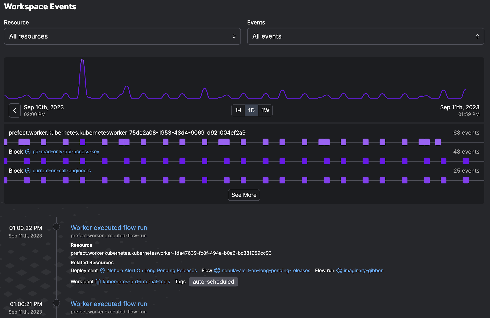

# Events

Events are the primary unit of observability in Prefect Cloud, and are designed to be a simple but complete record of something occuring somewhere in your stack at a given time. Prefect events can represent API calls, state changes, or events from your execution environment or infrastructure. Events enable both analysis of your data stack via (event feeds[link]) and the confiuration of stack reactivity via (automations[link])



## Event Specificiation

Events adhere to a structured [specification](https://app.prefect.cloud/api/docs#tag/Events) for consistency.


  
| Name | Type | Required? | Description |
| ---- | ---- | --------- | ----------- |
| occurred |  String | yes | When the event happened from the sender's perspective |
| event |  String | yes | The name of the event that happened |
| resource|  Object | yes | The primary Resource this event concerns |
| related | Array | no | A list of additional Resources involved in this event |
| payload | Object | no | An open-ended set of data describing what happened |
| id | String | yes | The client-provided identifier of this event |
| follows | String | no | The ID of an event that is known to have occurred prior to this one. |


## Event Grammar

Generally, the event value has a consistent and informative grammar - an events describes a resource and an action that a resource took. For example, events emitted by Prefect objects take the form of:


```
prefect.block.write-method.called
prefect-cloud.automation.action.executed
prefect-cloud.user.logged-in
```

## Event Sources

Events are automatically emitted by all prefect objects, including flows, tasks, deployments, work queues, and logs. Prefect-emitted events will contain the `prefect` or `prefect-cloud` resource prefix. Events can also be sent to the prefect [events API](https://app.prefect.cloud/api/docs#tag/Events) via authenticated http request.

Prefect provides an events client that emits events, for use in arbitrary python code that may not be a task or 
flow. Running the following code will emit events to Prefect Cloud, which will validate and ingest the event data.


```python3
from prefect.events import Event
from prefect.events.worker import get_events_worker

def some_function(name: str="kiki") -> None:
    print(f"hi {name}!")
    with get_events_worker() as event_client:
        event = Event(event=f"{name}.sent.event!", resource={f"prefect.resource.id":"coder.{name}"})
        event_client.emit(event)
          
some_function()
```

This event now appears in the event feed (link) where you can search for it, visualization similar events, and configure [automations](/ui/automations/) to react to the presence or absence of it.


# Resources

Every event has a primary resource, which describes what object emitted an event. Resources are used as quasi-stable identifiers for sources of events, and are identified by dot-delimited strings such as

```
prefect-cloud.automation.5b9c5c3d-6ca0-48d0-8331-79f4b65385b3.action.0
acme.user.kiki.script
prefect.flow-run.e3755d32-cec5-42ca-9bcd-af236e308ba6
```

Resources can optionally have additional arbitrary labels, such as:

```json
"resource": {
    "prefect.resource.id": "prefect-cloud.automation.5b9c5c3d-6ca0-48d0-8331-79f4b65385b3.action.0",
    "prefect-cloud.action.type": "call-webhook"
    }
```

Events can optionally contain related resources, used to tie the event from one resource to another, such as in the case that the primary resource acted on or with another resource:

```json
  "resource": {
    "prefect.resource.id": "prefect-cloud.automation.5b9c5c3d-6ca0-48d0-8331-79f4b65385b3.action.0",
    "prefect-cloud.action.type": "call-webhook"
    },
  "related": [
    {
        "prefect.resource.id": "prefect-cloud.automation.5b9c5c3d-6ca0-48d0-8331-79f4b65385b3",
        "prefect.resource.role": "automation",
        "prefect-cloud.name": "webhook_body_demo",
        "prefect-cloud.posture": "Reactive"
    }
  ]
```


