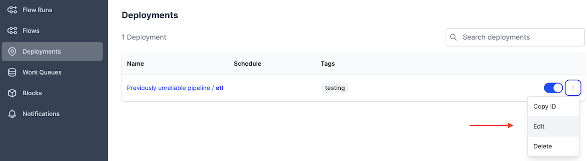
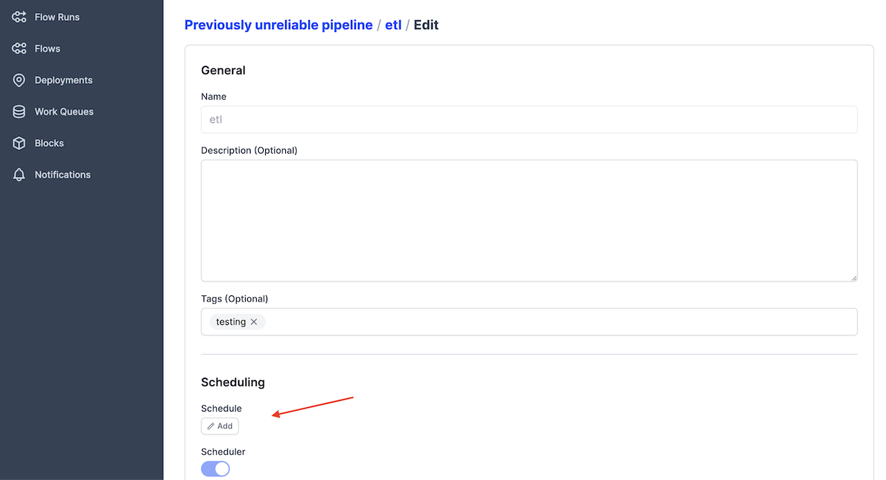
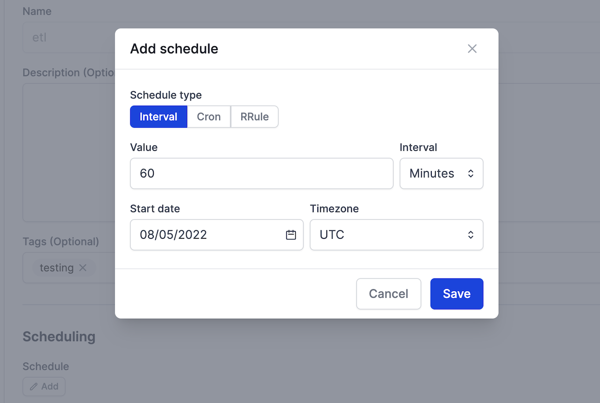

# Schedules

Schedules tell the Prefect API how to create new flow runs for you automatically on a specified cadence.

You can add a schedule to any flow [deployment](/concepts/deployments/). The Prefect `Scheduler` service periodically reviews every deployment and creates new flow runs according to the schedule configured for the deployment.

There are four recommended ways to create a schedule for a deployment:

- Use the Prefect UI
- Use the `cron`, `interval`, or `rrule` flags with the CLI  `deployment build` command
- Use the `schedule` parameter with a Python deployment file
- Manually edit the deployment YAML file's `schedule` section

## Creating schedules through the UI

You can add, modify, and view schedules by selecting **Edit** under the three dot menu next to a Deployment in the **Deployments** tab of the [Prefect UI](/ui/overview.md). 



To create a schedule from the UI, select **Add**. 



Then select **Interval** or **Cron** to create a schedule.



## Schedule types

Prefect supports several types of schedules that cover a wide range of use cases and offer a large degree of customization:

- [`Cron`](#cron) is most appropriate for users who are already familiar with `cron` from previous use.
- [`Interval`](#interval) is best suited for deployments that need to run at some consistent cadence that isn't related to absolute time.
- [`RRule`](#rrule) is best suited for deployments that rely on calendar logic for simple recurring schedules, irregular intervals, exclusions, or day-of-month adjustments.


## Creating schedules through the CLI with the `deployment build` command

When you build a deployment from the CLI you can use `cron`, `interval`, or `rrule` flags to set a schedule. 

<div class="terminal">
```bash
prefect deployment build demo.py:pipeline -n etl --cron "0 0 * * *"
```
</div>

This schedule will create flow runs for this deployment every day at midnight. 

`interval` and `rrule` are the other two command line schedule flags.

## Creating schedules through a Python deployment file

Here's how you create the equivalent schedule in a Python deployment file, with a timezone specified.

```python
from prefect.orion.schemas.schedules import CronSchedule

cron_demo = Deployment.build_from_flow(
    pipeline,
    "etl",
    schedule=(CronSchedule(cron="0 0 * * *", timezone="America/Chicago"))
)
```

`IntervalSchedule` and `RRuleSchedule` are the other two Python class schedule options.

## Creating schedules through a deployment YAML file's `schedule` section

Alternatively, you can edit the `schedule` section of the [deployment YAML file](/concepts/deployments/#deploymentyaml). 

```yaml
schedule:
  cron: 0 0 * * *
  timezone: America/Chicago
```

Let's discuss the three schedule types in more detail.

## Cron

A schedule may be specified with a [`cron`](https://en.wikipedia.org/wiki/Cron) pattern. Users may also provide a timezone to enforce DST behaviors.

`Cron` uses [`croniter`](https://github.com/kiorky/croniter) to specify datetime iteration with a `cron`-like format.

`Cron` properties include:

| Property | Description |
| --- | --- |
| cron | A valid `cron` string. (Required) |
| day_or | Boolean indicating how `croniter` handles `day` and `day_of_week` entries. Default is `True`. |
| timezone | String name of a time zone. (See the [IANA Time Zone Database](https://www.iana.org/time-zones) for valid time zones.) |

The `day_or` property defaults to `True`, matching `cron`, which connects those values using `OR`. If `False`, the values are connected using `AND`. This behaves like `fcron` and enables you to, for example, define a job that executes each 2nd Friday of a month by setting the days of month and the weekday.

!!! tip "Supported `croniter` features"
    While Prefect supports most features of `croniter` for creating `cron`-like schedules, we do not currently support "R" random or "H" hashed keyword expressions or the schedule jittering possible with those expressions.

!!! info "Daylight saving time considerations"
    If the `timezone` is a DST-observing one, then the schedule will adjust itself appropriately. 
    
    The `cron` rules for DST are based on schedule times, not intervals. This means that an hourly `cron` schedule fires on every new schedule hour, not every elapsed hour. For example, when clocks are set back, this results in a two-hour pause as the schedule will fire _the first time_ 1am is reached and _the first time_ 2am is reached, 120 minutes later. 
    
    Longer schedules, such as one that fires at 9am every morning, will adjust for DST automatically.
  
  See the Python [CronSchedule class docs](/api-ref/orion/schemas/schedules/#prefect.orion.schemas.schedules.CronSchedule) for more information. 


## Interval

An `Interval` schedule creates new flow runs on a regular interval measured in seconds. Intervals are computed from an optional `anchor_date`. For example, here's how you can create a schedule for every 10 minutes in the deployent YAML file.

```yaml
schedule:
  interval: 600
  timezone: America/Chicago 
```


`Interval` properties include:

| Property | Description |
| --- | --- |
| interval | `datetime.timedelta` indicating the time between flow runs. (Required) |
| anchor_date | `datetime.datetime` indicating the starting or "anchor" date to begin the schedule. If no `anchor_date` is supplied, the current UTC time is used.
| timezone | String name of a time zone, used to enforce localization behaviors like DST boundaries. (See the [IANA Time Zone Database](https://www.iana.org/time-zones) for valid time zones.) |

Note that the `anchor_date` does not indicate a "start time" for the schedule, but rather a fixed point in time from which to compute intervals. If the anchor date is in the future, then schedule dates are computed by subtracting the `interval` from it. Note that in this example, we import the [Pendulum](https://pendulum.eustace.io/) Python package for easy datetime manipulation. Pendulum isn’t required, but it’s a useful tool for specifying dates.

!!! info "Daylight saving time considerations"
    If the schedule's `anchor_date` or `timezone` are provided with a DST-observing timezone, then the schedule will adjust itself appropriately. Intervals greater than 24 hours will follow DST conventions, while intervals of less than 24 hours will follow UTC intervals. 
    
    For example, an hourly schedule will fire every UTC hour, even across DST boundaries. When clocks are set back, this will result in two runs that _appear_ to both be scheduled for 1am local time, even though they are an hour apart in UTC time. 
    
    For longer intervals, like a daily schedule, the interval schedule will adjust for DST boundaries so that the clock-hour remains constant. This means that a daily schedule that always fires at 9am will observe DST and continue to fire at 9am in the local time zone.

See the Python [IntervalSchedule class docs](/api-ref/orion/schemas/schedules/#prefect.orion.schemas.schedules.IntervalSchedule) for more information. 

## RRule

An `RRule` scheduling supports [iCal recurrence rules](https://icalendar.org/iCalendar-RFC-5545/3-8-5-3-recurrence-rule.html) (RRules), which provide convenient syntax for creating repetitive schedules. Schedules can repeat on a frequency from yearly down to every minute.

`RRule` uses the [dateutil rrule](https://dateutil.readthedocs.io/en/stable/rrule.html) module to specify iCal recurrence rules.

RRules are appropriate for any kind of calendar-date manipulation, including simple repetition, irregular intervals, exclusions, week day or day-of-month adjustments, and more. RRules can represent complex logic like: 

- The last weekday of each month 
- The fourth Thursday of November 
- Every other day of the week


`RRule` properties include:

| Property | Description |
| --- | --- |
| rrule | String representation of an RRule schedule. See the [`rrulestr` examples](https://dateutil.readthedocs.io/en/stable/rrule.html#rrulestr-examples) for syntax. |
| timezone | String name of a time zone. See the [IANA Time Zone Database](https://www.iana.org/time-zones) for valid time zones. |

You may find it useful to use an RRule string generator such as the [iCalendar.org RRule Tool](https://icalendar.org/rrule-tool.html) to help create valid RRules.

For example, the following RRule schedule creates flow runs on Monday, Wednesday, and Friday until July 30, 2024.

```yaml 
schedule:
  rrule: 'FREQ=WEEKLY;BYDAY=MO,WE,FR;UNTIL=20240730T040000Z'
```

!!! info "Daylight saving time considerations"
    Note that as a calendar-oriented standard, `RRules` are sensitive to the initial timezone provided. A 9am daily schedule with a DST-aware start date will maintain a local 9am time through DST boundaries. A 9am daily schedule with a UTC start date will maintain a 9am UTC time.


See the Python [RRuleSchedule class docs](/api-ref/orion/schemas/schedules/#prefect.orion.schemas.schedules.RRuleSchedule) for more information. 


## The `Scheduler` service

The `Scheduler` service is started automatically when `prefect orion start` is run and it is a built-in service of Prefect Cloud. 

By default, the `Scheduler` service visits deployments on a 60-second loop, though recently-modified deployments will be visited more frequently. The `Scheduler` evaluates each deployment's schedule and creates new runs appropriately. For typical deployments, it will create the next three runs, though more runs will be scheduled if the next 3 would all start in the next hour. 

More specifically, the `Scheduler` tries to create the smallest number of runs that satisfy the following constraints, in order:

- No more than 100 runs will be scheduled.
- Runs will not be scheduled more than 100 days in the future.
- At least 3 runs will be scheduled.
- Runs will be scheduled until at least one hour in the future.

These behaviors can all be adjusted through the relevant settings that can be viewed with the terminal command `prefect config view --show-defaults`:

<div class='terminal'>
```bash
PREFECT_ORION_SERVICES_SCHEDULER_DEPLOYMENT_BATCH_SIZE='100' 
PREFECT_ORION_SERVICES_SCHEDULER_ENABLED='True' 
PREFECT_ORION_SERVICES_SCHEDULER_INSERT_BATCH_SIZE='500' 
PREFECT_ORION_SERVICES_SCHEDULER_LOOP_SECONDS='60.0' 
PREFECT_ORION_SERVICES_SCHEDULER_MIN_RUNS='3' 
PREFECT_ORION_SERVICES_SCHEDULER_MAX_RUNS='100' 
PREFECT_ORION_SERVICES_SCHEDULER_MIN_SCHEDULED_TIME='1:00:00' 
PREFECT_ORION_SERVICES_SCHEDULER_MAX_SCHEDULED_TIME='100 days, 0:00:00' 
```
</div>

See the [Settings docs](/concepts/settings/) for more information on altering your settings.

These settings mean that if a deployment has an hourly schedule, the default settings will create runs for the next 4 days (or 100 hours). If it has a weekly schedule, the default settings will maintain the next 14 runs (up to 100 days in the future).

!!! tip "The `Scheduler` does not affect execution"
    The Prefect Orion `Scheduler` service only creates new flow runs and places them in `Scheduled` states. It is not involved in flow or task execution. 

If you change a schedule, previously scheduled flow runs that have not started are removed, and new scheduled flow runs are created to reflect the new schedule.

To remove all scheduled runs for a flow deployment, update the deployment YAML with no `schedule` value. Alternatively, remove the schedule via the UI.
