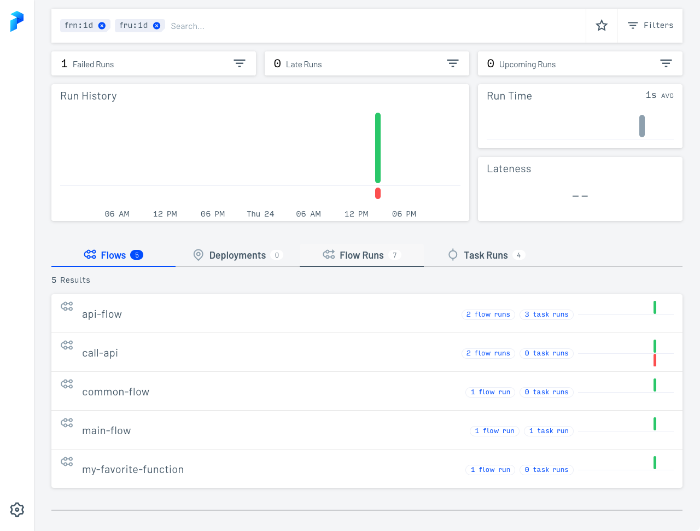

# Prefect Server

Once you've installed Prefect you have a Python SDK client that can communicate with [Prefect Cloud](https://app.prefect.cloud), the platform hosted by Prefect. At the same time you've also installed an [API server](../api-ref/) backed by a [database](/concepts/database/) and a UI.

TK add screenshot of Prefect Server UI timeline view


Spin up a local Prefect server UI with the `prefect server start` CLI command in the terminal:

<div class="terminal">
```bash
$ prefect server start
```
</div>

Open the URL for the Prefect server UI ([http://127.0.0.1:4200](http://127.0.0.1:4200) by default) in a browser. 



Shut down the Prefect server with <kdb> ctrl </kbd> + <kdb> c </kbd> in the terminal.

You can keep Prefect Server running in the background. TK talk about? 

## Differences between Prefect Server and Cloud

Prefect Server and Cloud share a base of features. Prefect Cloud also includes the following features that you can read about in the [Cloud](../cloud/) section of the docs. 

    - [User accounts](#user-accounts) &mdash; personal accounts for working in Prefect Cloud. 
    - [Workspaces](/cloud/workspaces/) &mdash; isolated environments to organize your flows, deployments, and flow runs.
    - [Automations](/cloud/automations/) &mdash; configure triggers, actions, and notifications in response to real-time monitoring events.
    - [Email notifications](/cloud/automations/) &mdash; send email alerts from Prefect's serves based on automation triggers.
    - [Organizations](/cloud/organizations/) &mdash; user and workspace management features that enable collaboration for larger teams.
    - [Service accounts](/cloud/users/service-accounts/) &mdash; configure API access for running agents or executing flow runs on remote infrastructure.
    - [Custom role-based access controls (RBAC)](/cloud/users/roles/) &mdash; assign users granular permissions to perform certain activities within an organization or a workspace.
    - [Single Sign-on (SSO)](/cloud/users/sso/) &mdash; authentication using your identity provider.
    - [Audit Log](/cloud/users/audit-log/) &mdash; a record of user activities to monitor security and compliance.
    - Collaborators &mdash; invite others to work in your [workspace](/cloud/workspaces/#workspace-collaborators) or [organization](/cloud/organizations/#organization-members).


## Configuring Prefect Server

Go to your terminal session and run this command to set the API URL to point to a Prefect server instance:

<div class='terminal'>
```bash
$ prefect config set PREFECT_API_URL="http://127.0.0.1:4200/api"
```
</div>

You must set the API Server address for containers.

You can save the API server address in a profile and use that profile