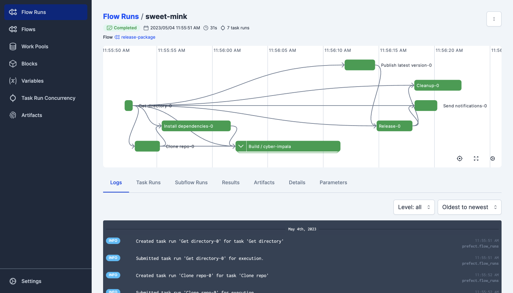

# Doing Cloud things
Here's how you do things with the Cloud providers.

So simple, anyone can use it.

=== "AWS"
    Make an [S3 Bucket](https://aws.amazon.com/s3)
    
    ``` bash
    pip install -U prefect
    ```

=== "Azure"
    Go do Azure things

    

=== "GCP"
    ```python

    def main():
        print("Hello world!")
        return 0
 
    ```


So tricky, anyone can have their permissions messed up.