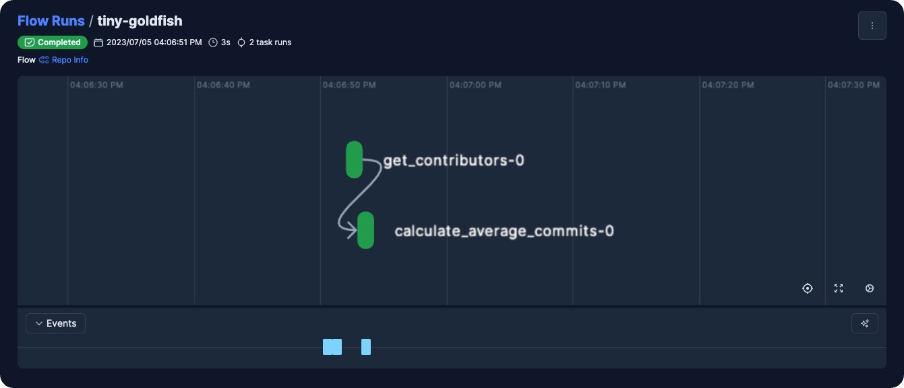

# Deployment Quickstart

This guide is designed to show you how to deploy a Prefect flow in as few steps as possible. For a more comprehensive introduction to Prefect's core components and how they work together, please follow our [tutorial](/tutorial/index/).

### Prerequisites

1. Before you start, make sure you have [prefect installed](/getting-started/installation) and are [connected to a Prefect server instance](getting-started/first_steps/#connect-to-prefects-api/). 
2. Optional: Prefect integrates well with version control platforms like GitHub and equivalent. Before you deploy your flow, consider pushing your flow code to a remote repo.

### Step 1: Author a Flow
**The fastest way to get started with Prefect is to add a `@flow` decorator to any python function**.

!!! Tip "Quick Tips"
    - At a minimum, you need to define at least one flow function.
    - Your flows can be segmented by introducing task (`@task`) functions, which can be invoked from within these flows.
    - A task represents a discrete unit of Python code, whereas flows are more akin to parent functions accommodating a broad range of workflow logic.
    - Flows can be called inside of other flows (we call these subflows) but a task **cannot** be run inside of another task or from outside the context of a flow.

Here is an example flow called `Get Repo Info` that contains tasks and a subflow:
```python
# my_flow.py
import httpx
from datetime import timedelta
from prefect import flow, task, get_run_logger
from prefect.tasks import task_input_hash


@task(
    cache_key_fn=task_input_hash, cache_expiration=timedelta(hours=1)
)  # Tasks support the ability to cache their return value
def get_url(url: str, params: dict = None):
    response = httpx.get(url, params=params)
    response.raise_for_status()
    return response.json()


@flow 
def get_open_issues(repo_name: str, open_issues_count: int, per_page: int = 10):
    issues = []
    pages = range(1, -(open_issues_count // -per_page) + 1)
    for page in pages:
        issues.append(
            get_url.submit(  # The submit method changes the task execution from sequential to concurrent
                f"https://api.github.com/repos/{repo_name}/issues",
                params={"page": page, "per_page": per_page, "state": "open"},
            )
        )
    return [
        i for p in issues for i in p.result()
    ]  # Use the result method to unpack a prefect future outside of a task


@flow(name="Get Repo Info", retries=3)  # Optionally add retries to flows and tasks
def get_repo_info(
    repo_name: str = "PrefectHQ/prefect",  # Prefect coerces parameter values based on type hints
):
    repo = get_url(f"https://api.github.com/repos/{repo_name}")  # - Task Call -
    issues = get_open_issues(repo_name, repo["open_issues_count"])  # - Subflow Call -
    issues_per_user = len(issues) / len(set([i["user"]["id"] for i in issues]))
    logger = (
        get_run_logger()
    )  # Use logger to add logs or set log_prints to True in flow argument to log stdout
    logger.info(f"PrefectHQ/prefect repository statistics 🤓:")
    logger.info(f"Stars 🌠 : {repo['stargazers_count']}")
    logger.info(f"Forks 🍴 : {repo['forks_count']}")
    logger.info(f"Average open issues per user 💌 : {issues_per_user:.2f}")


if __name__ == "__main__":
    get_repo_info() # Call a flow function for a local flow run!

```

### Step 2: Run your Flow locally
Prefect flows don't just look pythonic, they run like python functions too! 

Call any function that you've decorated with a `@flow` decorator to see a local instance of a flow run.

```bash
python my_flow.py
``` 

#### TODO CHANGE This

<div class="terminal">
```bash
15:14:07.025 | INFO    | prefect.engine - Created flow run 'dainty-lionfish' for flow 'Repo Info'
15:14:07.027 | INFO    | Flow run 'dainty-lionfish' - View at https://app.prefect.cloud/account/0ff44498-d380-4d7b-bd68-9b52da03823f/workspace/c859e5b6-1539-4c77-81e0-444c2ddcaafe/flow-runs/flow-run/3039d822-2e77-4d51-90bd-b5ccc4ff16b0
15:14:07.998 | INFO    | Flow run 'dainty-lionfish' - Created task run 'get_general_info-0' for task 'get_general_info'
15:14:07.999 | INFO    | Flow run 'dainty-lionfish' - Executing 'get_general_info-0' immediately...
15:14:08.822 | INFO    | Task run 'get_general_info-0' - Finished in state Completed()
15:14:13.833 | INFO    | Flow run 'dainty-lionfish' - Stars 🌠 : 12332
15:14:13.945 | INFO    | Flow run 'dainty-lionfish' - Created task run 'get_n_contributors-0' for task 'get_n_contributors'
15:14:13.946 | INFO    | Flow run 'dainty-lionfish' - Executing 'get_n_contributors-0' immediately...
15:14:14.656 | INFO    | Task run 'get_n_contributors-0' - Finished in state Completed()
15:14:19.837 | INFO    | Flow run 'dainty-lionfish' - Created task run 'calculate_average_commits-0' for task 'calculate_average_commits'
15:14:19.838 | INFO    | Flow run 'dainty-lionfish' - Executing 'calculate_average_commits-0' immediately...
15:14:20.440 | INFO    | Task run 'calculate_average_commits-0' - Finished in state Completed()
15:14:20.450 | INFO    | Flow run 'dainty-lionfish' - Average commits per contributor 💌 : 448.87
15:14:25.597 | INFO    | Flow run 'dainty-lionfish' - Finished in state Completed('All states completed.')
```
</div>


You'll find a link directing you to the flow run page conveniently positioned at the top of your flow logs.


Local flow run execution is great for development and testing, but in order to schedule flow runs or trigger them based on events, you’ll need to [deploy](/tutorial/deployments/) your flows.


### Step 3: Deploy the flow

Deploying your flows is, in essence, the act of informing the Prefect API of where, how, and when to run your flows.

!!! warning "Always run `prefect deploy` commands from the **root** level of your repo!"

When you run the `deploy` command, Prefect will automatically detect any flows defined in your repository. Select the one you wish to deploy. Then, follow the 🧙 wizard to name your deployment, add an optional schedule, create a work pool, optionally configure remote flow code storage, and more!

```bash
prefect deploy
```

!!! note "It's recommended to save the configuration for the deployment."
    Saving the configuration for your deployment will result in a `prefect.yaml` file populated with your first deployment. You can use this yaml file to edit and [define multiple deployments](/concepts/deployments-ux/) for this repo.
### Step 4: Start a Worker and Run Deployed Flow

Start a worker to manage local flow execution. Each worker polls its assigned [work pool](/tutorial/deployments/#why-work-pools-and-workers).

In a new terminal, run:
```bash
prefect worker start --pool '<work-pool-name>'
```

Now that your worker is started, you are ready to kick off deployed flow runs from either the UI or by running:

```bash
prefect deployment run '<flow-name>/<deployment-name>'
```

Congrats on your first successfully deployed flow run! 🎉

Now you've seen:

- how to define your flows and tasks using decorators
- how to deploy a flow
- how to start a worker

### Next Steps

- For a more detailed explanation of the concepts introduced above, our [tutorial](/tutorial/index/) is recommended. 
- Learn about deploying multiple flows and CI/CD with [`prefect.yaml`](/concepts/projects/#the-prefect-yaml-file)
- Check out some of our other [work pools](/concepts/work-pools/)
- [Our concepts](/concepts/) contain deep dives into Prefect components.
- [Guides](/guides/) provide step by step recipes for common Prefect operations including:
    - [Deploying on Kubernetes](/guides/deployment/helm-worker/)
    - [Deploying flows in Docker](/guides/deployment/docker/)