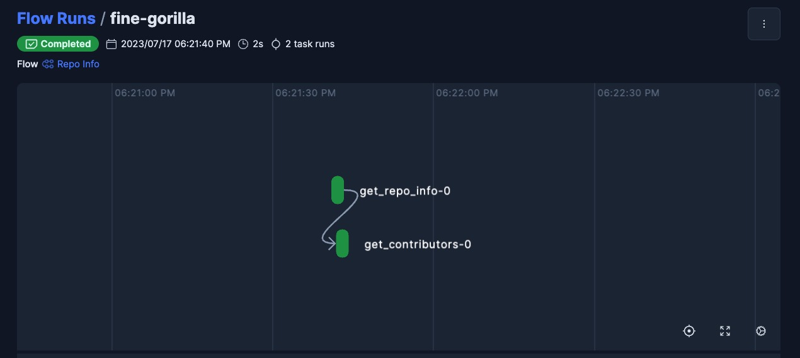

# Prefect Quickstart

This guide is designed to show you how to deploy a Prefect flow in as few steps as possible. For a more comprehensive introduction to Prefect's core components and how they work together, please follow our [tutorial](/tutorial/index/).

### Step 1: [Install Prefect](/getting-started/installation/)

<div class="terminal">
```bash
pip install -U prefect
```
</div>


### Step 2: Connect to Prefect's API

Sign up for a forever free [Prefect Cloud Account](/cloud/) or, alternatively, host your own [server](/host/) with a subset of Prefect Cloud's features.

1. To sign in with an existing account or register an account, go to [https://app.prefect.cloud/](https://app.prefect.cloud/).
2. [Create a workspace](#create-a-workspace) for your account.
3. Use the `prefect cloud login` Prefect CLI command to log into Prefect Cloud from your environment.

    <div class="terminal">
    ```bash
    prefect cloud login
    ```
    </div>

### Step 3: Author a Flow
**The fastest way to get started with Prefect is to add a `@flow` decorator to any python function**.

!!! tip "Rules of Thumb"
    - At a minimum, you need to define at least one flow function.
    - Your flows can be segmented by introducing task (`@task`) functions, which can be invoked from within these flows.
    - A task represents a discrete unit of Python code, whereas flows are more akin to parent functions accommodating a broad range of workflow logic.
    - Flows can be called inside of other flows (we call these subflows) but a task **cannot** be run inside of another task or from outside the context of a flow.

Here is an example flow called `Get Repo Info` that contains 2 tasks:
```python
# my_flow.py
import httpx
from prefect import flow, task

@task(retries=2)
def get_repo_info(repo_owner: str, repo_name: str):
    """ Get info about a repo - will retry twice after failing """
    url = f"https://api.github.com/repos/{repo_owner}/{repo_name}"
    api_response = httpx.get(url)
    api_response.raise_for_status()
    repo_info = api_response.json()
    return repo_info


@task
def get_contributors(repo_info: dict):
    contributors_url = repo_info["contributors_url"]
    response = httpx.get(contributors_url)
    response.raise_for_status()
    contributors = response.json()
    return contributors

@flow(name="Repo Info", log_prints=True)  
def repo_info(
    repo_owner: str = "PrefectHQ", repo_name: str = "prefect"
):
    # call our `get_repo_info` task
    repo_info = get_repo_info(repo_owner, repo_name)
    print(f"Stars 🌠 : {repo_info['stargazers_count']}")

    # call our `get_contributors` task, 
    # passing in the upstream result
    contributors = get_contributors(repo_info)
    print(
        f"Number of contributors 👷: {len(contributors)}"
    )


if __name__ == "__main__":
    # Call a flow function for a local flow run!
    repo_info()
```

### Step 4: Run your Flow locally
Call any function that you've decorated with a `@flow` decorator to see a local instance of a flow run.

<div class="terminal">
```bash
python my_flow.py
```
</div> 

<div class="terminal">
```bash
18:21:40.235 | INFO    | prefect.engine - Created flow run 'fine-gorilla' for flow 'Repo Info'
18:21:40.237 | INFO    | Flow run 'fine-gorilla' - View at https://app.prefect.cloud/account/0ff44498-d380-4d7b-bd68-9b52da03823f/workspace/c859e5b6-1539-4c77-81e0-444c2ddcaafe/flow-runs/flow-run/c5a85193-69ea-4577-aa0e-e11adbf1f659
18:21:40.837 | INFO    | Flow run 'fine-gorilla' - Created task run 'get_repo_info-0' for task 'get_repo_info'
18:21:40.838 | INFO    | Flow run 'fine-gorilla' - Executing 'get_repo_info-0' immediately...
18:21:41.468 | INFO    | Task run 'get_repo_info-0' - Finished in state Completed()
18:21:41.477 | INFO    | Flow run 'fine-gorilla' - Stars 🌠 : 12340
18:21:41.606 | INFO    | Flow run 'fine-gorilla' - Created task run 'get_contributors-0' for task 'get_contributors'
18:21:41.607 | INFO    | Flow run 'fine-gorilla' - Executing 'get_contributors-0' immediately...
18:21:42.225 | INFO    | Task run 'get_contributors-0' - Finished in state Completed()
18:21:42.232 | INFO    | Flow run 'fine-gorilla' - Number of contributors 👷: 30
18:21:42.383 | INFO    | Flow run 'fine-gorilla' - Finished in state Completed('All states completed.')
```
</div>


You'll find a link directing you to the flow run page conveniently positioned at the top of your flow logs.


Local flow run execution is great for development and testing, but in order to schedule flow runs or trigger them based on events, you’ll need to [deploy](/tutorial/deployments/) your flows.


### Step 5: Deploy the flow

Deploying your flows is, in essence, the act of informing the Prefect API of where, how, and when to run your flows.

!!! warning "Always run `prefect deploy` commands from the **root** level of your repo!"

When you run the `deploy` command, Prefect will automatically detect any flows defined in your repository. Select the one you wish to deploy. Then, follow the 🧙 wizard to name your deployment, add an optional schedule, create a work pool, optionally configure remote flow code storage, and more!

<div class="terminal">
```bash
prefect deploy
```
</div>

!!! note "It's recommended to save the configuration for the deployment."
    Saving the configuration for your deployment will result in a `prefect.yaml` file populated with your first deployment. You can use this yaml file to edit and [define multiple deployments](/concepts/deployments-ux/) for this repo.


### Step 5: Start a Worker and Run Deployed Flow

Start a worker to manage local flow execution. Each worker polls its assigned [work pool](/tutorial/deployments/#why-work-pools-and-workers).

In a new terminal, run:
<div class="terminal">
```bash
prefect worker start --pool '<work-pool-name>'
```
</div>

Now that your worker is started, you are ready to kick off deployed flow runs from either the UI or by running:

<div class="terminal">
```bash
prefect deployment run '<flow-name>/<deployment-name>'
```
</div>

Congrats on your first successfully deployed flow run! 🎉

Now you've seen:

- how to define your flows and tasks using decorators
- how to deploy a flow
- how to start a worker

### Next Steps

- For a more detailed explanation of the concepts introduced above, our [tutorial](/tutorial/index/) is recommended. 
- Learn about deploying multiple flows and CI/CD with [`prefect.yaml`](/concepts/projects/#the-prefect-yaml-file)
- Check out some of our other [work pools](/concepts/work-pools/)
- [Our concepts](/concepts/) contain deep dives into Prefect components.
- [Guides](/guides/) provide step by step recipes for common Prefect operations including:
    - [Deploying on Kubernetes](/guides/deployment/helm-worker/)
    - [Deploying flows in Docker](/guides/deployment/docker/)