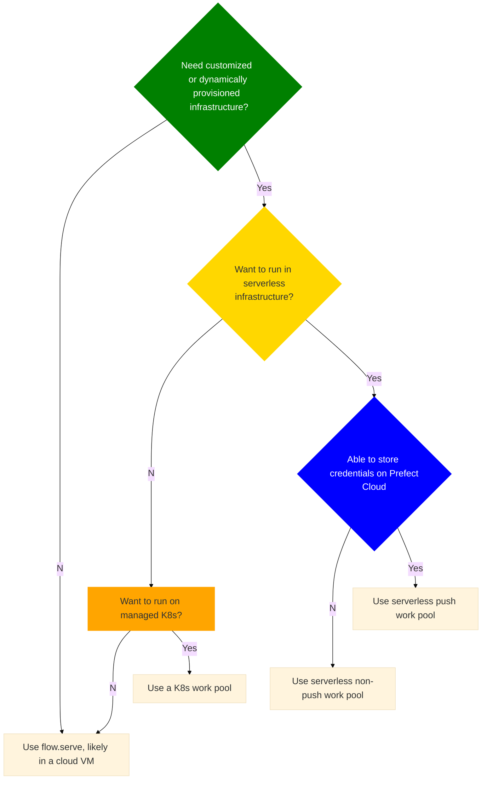

# Choose how to serve and deploy your flows

In this guide, we will help you choose among Prefect deployment serving options, and if needed, work pool infrastructure types.

We assume that you want to be able to schedule flow runs, so you that means you need a deployment.

Follow the flow chart below and click on the terminal nodes to go to the relevant documentation.

The first question in the flow chart "Need customized or dynamically provisioned infrastructure?" is getting at whether you need to run your flows in containers.
Nearly all of the of the options on the "Yes" path use Docker containers so that you can more easily scale your infrastructure up or down.

## Next steps

Read more about [deployment concepts](/concepts/deployments/), [scheduling flows](/concepts/schedules/), or [creating a worker-based deployemnt](/guides/prefect-deploy).
