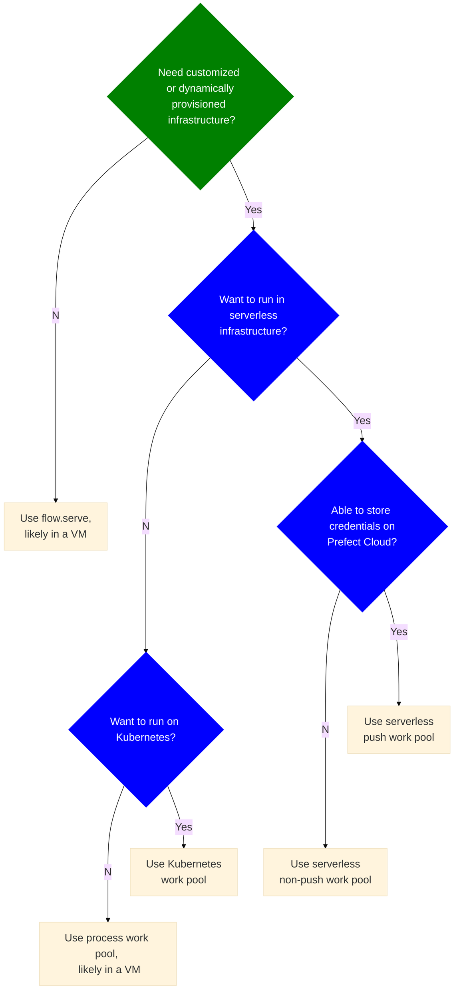

# Choose how to serve and deploy your flows

In this guide, we will help you choose among Prefect deployment serving options, and if needed, work pool infrastructure types.

We assume that you want to be able to schedule flow runs, so you that means you need a deployment.

Follow the flow chart below and click on the terminal nodes to go to the relevant documentation.

## Notes

The first question in the flow chart - "Need customized or dynamically provisioned infrastructure?" - gets at whether you want to run your flows in containers.
Nearly all of the of the options on the "Yes" path use Docker containers so that you can more easily scale your infrastructure up and down.

If you don't need customized or scalable infrastructure, you shouldn't need a worker and work pool and `flow.serve` should meet your needs.

"Want to run in serverless architecture"? gets at whether you want to run your workflows on serverless cloud options on AWS, Azure, or Google Cloud.

If you want to use serverless infrastructure and you're able to store your credentials in a [block(/concepts/blocks/) in our encrypted Prefect Cloud database, then AWS ECS, Azure Container Instances, or Google Cloud Run serverless push work pools are great options.
No worker is required with a push work pool.
Jobs are automatically submitted to your serverless infrastructure.

If push work pools aren't an option for you, you can choose among AWS ECS, Azure Container Instances, Google Cloud Run, or Google Vertex AI serverless work pools.

If you don't want to use serveless, Kubernetes is a very popular option for running workflows at scale.

If you need infrastructure customization and don't run on Kubernetes or serverless infrastructure, a process worker in a cloud VM or on you own server is a good option.

## Next steps

Read more about [deployment concepts](/concepts/deployments/), [scheduling flows](/concepts/schedules/), or [creating a worker-based deployemnt](/guides/prefect-deploy).
