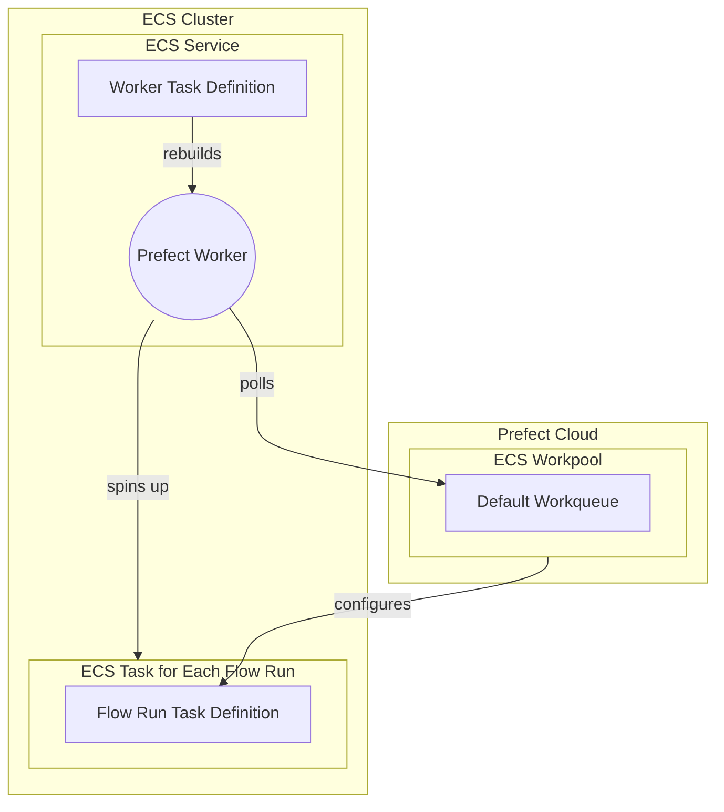

# ECS Execution

## General Introduction

prefect_workpool -- configures --> fr_task_definition

ECS (Elastic Container Service) tasks are a good option for hosting Prefect 2 flow runs due to the few reasons:

1. Scalability: ECS effortlessly scales your infrastructure based on demand, handling varying amounts of Prefect flow runs. It can automatically manage container distribution across multiple instances based on the demand, making it easier to handle varying amounts of Prefect flow runs.
2. Flexibility: With ECS, you can choose between using AWS Fargate or Amazon EC2 for running your containers. Fargate is a serverless option that abstracts away the underlying infrastructure, while EC2 allows you to manage and configure the instances yourself. This gives you the flexibility to select the best option based on your requirements.
3. AWS integration: Seamlessly connect with other AWS services, enabling comprehensive data pipelines and leveraging AWS IAM and CloudWatch.
4. Containerization: ECS supports Docker containers and provides containerized managed execution, which works well with Prefect 2's design, making deployment consistent and reproducible.

!!! tip "ECS Tasks != Prefect Tasks"
    An ECS Task is **not** the same thing as a Prefect task. ECS tasks are run as part of an ECS Cluster, they launch container(s) as defined in the ECS Task definition. An ECS *task definition* is the blueprint for the ECS task that describes which Docker container(s) to run and what you want to have happen inside these container(s).

The ECS task running the Prefect worker should be set up as an ECS service since it is a long running process and you want it to be re-built automatically if it ever stops unexpectedly. ECS services are used to guarantee that you always have some number of Tasks running at all times. For example, if a Task’s container exits due to an error, or the underlying EC2 instance fails and is replaced, the ECS Service will replace the failed Task. This makes ECS services perfect for managing a long running process like the Prefect Worker.

On the other hand, ECS Tasks are ephemeral instances of a Task Definition. An ECS Task Execution (as opposed to service execution) launches container(s) (as defined in the task definition) until they are stopped or exit on their own. This makes ECS Task executions perfect for running an ephemeral/temporary process like a Prefect Flow Run.

As mentioned above you have two options for a capacity provider, either EC2 or Fargate. Fargate makes it easier to get started but it will increase the time it takes to spin up infrastructure for each flow run. Provisioning EC2 instances for the ECS cluster can reduce this lead time.

## How to Get Started

First, you'll want to create an ECS Work Pool to so that you have something for the worker to point to.

