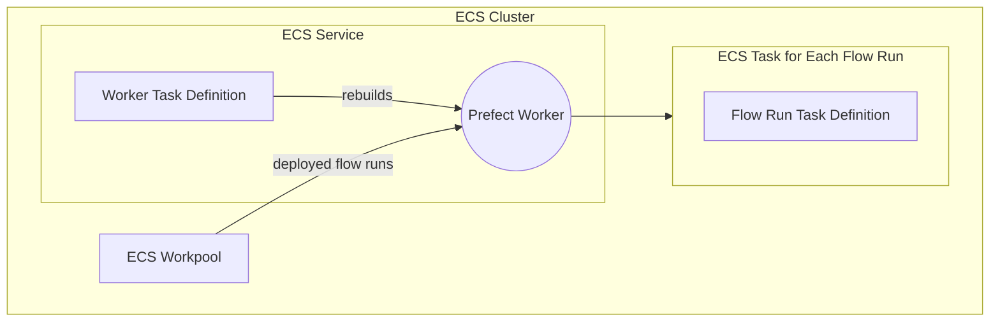

## ECS Execution

```mermaid
graph TB
    subgraph ecs_cluster[ECS Cluster]

        subgraph ecs_service[ECS Service]
            td_worker[Worker Task Definition] -- rebuilds --> prefect_worker((Prefect Worker))
        end

        prefect_worker --> ecs_task

        prefect_workpool[ECS Workpool] -- deployed flow runs --> prefect_worker

        subgraph ecs_task[ECS Task for Each Flow Run]
            flow_run_task_definition[Flow Run Task Definition]
        end

    end
```