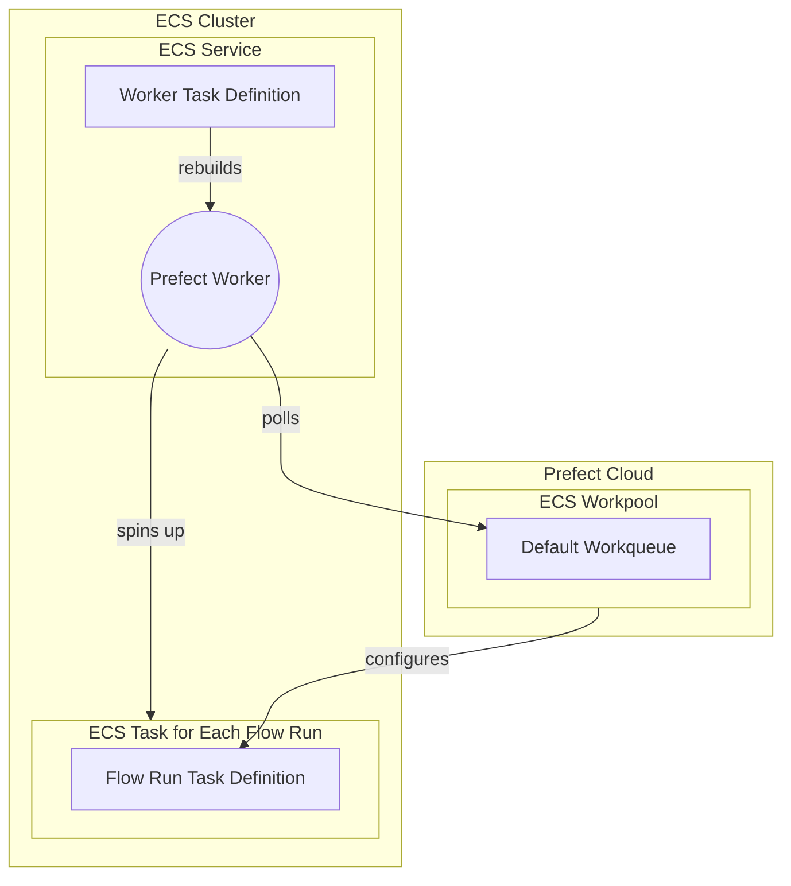

# ECS Execution

## General Introduction



prefect_workpool -- configures --> fr_task_definition

ECS (Elastic Container Service) tasks are a good option for hosting Prefect 2 flow runs due to the few reasons:

1. Scalability: ECS effortlessly scales your infrastructure based on demand, handling varying amounts of Prefect flow runs. It can automatically manage container distribution across multiple instances based on the demand, making it easier to handle varying amounts of Prefect flow runs.
2. Flexibility: With ECS, you can choose between using AWS Fargate or Amazon EC2 for running your containers. Fargate is a serverless option that abstracts away the underlying infrastructure, while EC2 allows you to manage and configure the instances yourself. This gives you the flexibility to select the best option based on your requirements.
3. AWS integration: Seamlessly connect with other AWS services, enabling comprehensive data pipelines and leveraging AWS IAM and CloudWatch.
4. Containerization: ECS supports Docker containers and provides containerized managed execution, which works well with Prefect 2's design, making deployment consistent and reproducible.

!!! tip "ECS Tasks != Prefect Tasks"
    An ECS Task is **not** the same thing as a Prefect task. ECS tasks are run as part of an ECS Cluster, they launch container(s) as defined in the ECS Task definition. An ECS *task definition* is the blueprint for the ECS task that describes which Docker container(s) to run and what you want to have happen inside these container(s).

The ECS task running the Prefect worker should be set up as an ECS service since it is a long running process and you want it to be re-built automatically if it ever stops unexpectedly. ECS services are used to guarantee that you always have some number of Tasks running at all times. For example, if a Task’s container exits due to an error, or the underlying EC2 instance fails and is replaced, the ECS Service will replace the failed Task. This makes ECS services perfect for managing a long running process like the Prefect Worker.

On the other hand, ECS Tasks are ephemeral instances of a Task Definition. An ECS Task Execution (as opposed to service execution) launches container(s) (as defined in the task definition) until they are stopped or exit on their own. This makes ECS Task executions perfect for running an ephemeral/temporary process like a Prefect Flow Run.

As mentioned above you have two options for a capacity provider, either EC2 or Fargate. Fargate makes it easier to get started but it will increase the time it takes to spin up infrastructure for each flow run. Provisioning EC2 instances for the ECS cluster can reduce this lead time.

# How to Get Started

#### Setting Up Prefect a Bare Bones ECS Work Pool
First, you'll want to create a bare bones ECS Work Pool so that you have something for the worker to point to.

`prefect work-pool create --type ecs my-ecs-pool`

## Setting up Prefect Worker in ECS Worker
Next, you'll want to start a Prefect worker in your ECS cluster.

#### Prerequisites
Before you begin, make sure you have the following prerequisites in place:

- An AWS account with permissions to create ECS services and IAM roles.
- The AWS CLI installed on your local machine. You can download it from the AWS website.
- A Docker image of your Prefect worker, which you can build and push to an Amazon ECR registry. TODO: Point to another file with instructions on building and pushing a container to host the worker.

### Step 1: Create an IAM Role for the ECS Task
TODO: Convert this 
First, you need to create an IAM role that the ECS task will use to access AWS resources. Here are the steps:

1. Open the IAM console and click on "Roles" in the left sidebar.
2. Click on the "Create role" button.
`aws iam create-role --role-name prefect-worker-ecs-role --assume-role-policy-document file://<path_to_trustpolicy.json>`
3. Select "ECS" as the trusted entity type and click on "Next: Permissions".
`aws iam create-role --role-name prefect-worker-ecs-role --assume-role-policy-document file://<path_to_trustpolicy.json>`
4. Select the "AmazonECSTaskExecutionRolePolicy" policy and click on "Next: Tags".
5. Add any tags you want to the role and click on "Next: Review".
6. Enter a name for the role (e.g., "prefect-worker-ecs-role") and click on "Create role".
`aws iam tag-role --role-name prefect-worker-ecs-role --tags Key=tagKey,Value=tagValue`
### Step 2: Create a Task Definition

Next, you need to create an ECS task definition that specifies the Docker image for the Prefect worker, the resources it requires, and the command it should run. 

Here are the steps:

1. Create a JSON file with the following contents:

```json
{
  "family": "prefect-worker-task",
  "networkMode": "awsvpc",
  "taskRoleArn": "<your-ecs-task-role-arn>",
  "executionRoleArn": "<your-ecs-task-role-arn>",
  "containerDefinitions": [
    {
      "name": "prefect-worker",
      "image": "<your-ecr-image>",
      "cpu": 512,
      "memory": 1024,
      "essential": true,
      "command": [
        "prefect",
        "worker",
        "start",
        "--pool",
        "my-ecs-pool"
      ]
      "environment": [
        {
          "name": "PREFECT_API_URL",
          "value": "https://api.prefect.cloud/api/accounts/<your-account-id>/workspaces/<your-workspace-id>"
        },
        {
          "name": "PREFECT_API_KEY",
          "value": "<your-api-key>"
        }
      ]
    }
  ]
}
```

- Use `prefect config view` to see the values for `PREFECT_API_URL`. For the `PREFECT_API_KEY`, organization tier can create a [service account](https://docs.prefect.io/latest/cloud/users/service-accounts/) for the worker, personal tiers can pass a user’s API key here.
- Replace `<your-ecs-task-role-arn>` with the ARN of the IAM role you created in Step 1, and `<your-ecr-image>` with the URI of the Docker image you pushed to Amazon ECR.

## Step 3: Create an ECS Service to Host and Restart your worker as needed

Finally, you can create an ECS Fargate service that will run your Prefect worker task without needing to manage the underlying EC2 instances. Here are the steps:
1. Open a terminal window and run the following command to create an ECS Fargate service:

```lua
aws ecs create-service \
    --service-name prefect-worker-service \
    --cluster <your-ecs-cluster> \
    --task-definition file://<path-to-task-definition-file>.json \
    --launch-type FARGATE \
    --desired-count 1 \
    --network-configuration "awsvpcConfiguration={subnets=[<your-subnet-ids>],securityGroups=[<your-security-group-ids>]}"
```


Replace `<your-ecs-cluster>` with the name of your ECS cluster, `<path-to-task-definition-file>` with the path to the JSON file you created in Step 2, `<your-subnet-ids>` with a comma-separated list of your VPC subnet IDs, and `<your-security-group-ids>` with a comma-separated list of your VPC security group IDs.
1. Wait for the ECS service to be created. You can check its status by running the following command:

```sql
aws ecs describe
```

*Sanity Check* 
Work pool page will allow you to reference any newly created workers
TODO: Insert screenshot

### Now lets get this worker to deploy its first flow run!
TODO: clean this up and add more
Create a simple flow 
prefect deploy my_flow.py:my_flow --name ecs-worker-test-deployment --pool my-ecs-pool
run the flow

## Trouble Shooting
TODO: Add more here

## Next Steps -- ECS Work Pool Configuration Options for finer tuned flow execution
TODO: Add in reccomendations for ecs workpool fields