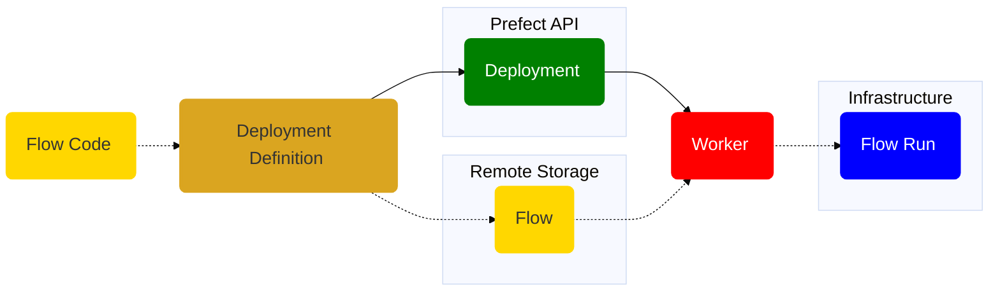

# Choosing how to build and serve a deployment

In this guide, we will help you choose among Prefect deployment creation, deployment serving, and work pool options

We assume that you want to be able to schedule flow runs, so you that means you need a deployment.

##

Questions

1. Do you need customized or dynamically provisioned infrastructure?
    No:
        Use flow.serve likely in a cloud VM - see forthcoming guide (could run in Docker container on the VM)
    Yes
        1. Want to run in Severless?
            No
            1. Want to run on managed K8s?
                No
                    1. Want to run in
                Yes
                    Grab a helm chart and see the nice K8s guide
            Yes
                1. Want/able to use a push work pool (no worker required)
                    Yes
                        Use a push work pool - see the guide
                    No
                        Use a serveless (non-push work pool) - also gives option for Vertex AI - Jeff working on combo guide
