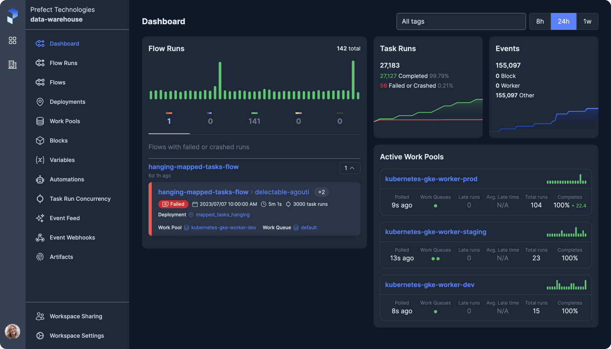

# **Welcome to Prefect**

Prefect is a workflow orchestration tool empowering developers to build, observe, and react to data pipelines.

It's the easiest way to transform any Python function into a unit of work that can be observed and orchestrated. Just bring your Python code, sprinkle in a few decorators, and go!

With Prefect you gain:

<ul class="ul-line-height-compress" style="columns: 2">
    <li> <a href="/concepts/schedules"> scheduling </a> </li>
    <li> <a href="/concepts/tasks/#task-arguments"> retries </a> </li>
    <li> <a href="/concepts/logs/"> logging </a> </li>
     <li> <a href="/concepts/task-runners/#task-runners"> convenient async functionality</a> </li>
    <li> <a href="/concepts/tasks/#caching"> caching</a> </li>
    <li> <a href="/cloud/automations/"> notifications</a> </li>
    <li> <a href="/cloud/overview/"> observability</a> </li>
    <li> <a href="/cloud/webhooks/"> event-based orchestration</a> </li>
</ul>

<figure markdown>

<figcaption>Prefect UI</figcaption>
</figure>

#### New to Prefect?
Start with the [tutorial](/tutorial/) and then check out the [concepts](/concepts/index/) for more in-depth information. For deeper dives on specific use cases, explore our [guides](guides/index/) for common use-cases. <div style="height: 10px"></div>

[Concepts](/concepts){ .md-button .main-button--secondary .full } [Tutorial](/tutorial/){ .md-button .md-button--primary .main-button--primary .full }  [Guides](guides){ .md-button .main-button--secondary .full }

<div style="height: 10px"></div>
<p>Altenatively, read on for a quick sample of Prefect in action.</p>
---

## Quick start: Hello Prefect

Install Prefect with 

<div class="terminal">
```bash
pip install -U prefect
```
</div>

See the [install guide](/getting-started/installation/) for more detailed installation instructions.

### Run a basic flow

Decorate your Python function with the `flow` decorator.

```python hl_lines="1 3"
from prefect import flow

@flow
def my_favorite_function():
    print("What is your favorite number?")
    return 42

print(my_favorite_function())
```

That's it! Your function is now a flow. Run the code as you normally would, and you'll see its execution in the Prefect logs:

<div class="terminal">
```bash
$ python hello_prefect.py
15:27:42.543 | INFO    | prefect.engine - Created flow run 'olive-poodle' for flow 'my-favorite-function'
15:27:42.543 | INFO    | Flow run 'olive-poodle' - Using task runner 'ConcurrentTaskRunner'
What is your favorite number?
15:27:42.652 | INFO    | Flow run 'olive-poodle' - Finished in state Completed()
42
```
</div>

Prefect automatically persists useful metadata about your flow run such as the start time, end time, and state. Keep exploring to learn how to add retries, notifications, scheduling and much more!

## Next steps
Try our [tutorial](/tutorial) and [guides](/guides), or go deeper with [concepts](/concepts).

!!! tip "Need help?"
    Get your questions answered with a Prefect product advocate by [Booking A Rubber Duck](https://calendly.com/prefect-experts/prefect-product-advocates?utm_campaign=prefect_docs_cloud&utm_content=prefect_docs&utm_medium=docs&utm_source=dpcs)!

---

## Community

- Join over 25,000 engineers in the [Prefect Slack community](https://prefect.io/slack)
- [Give Prefect a ⭐️ on GitHub](https://github.com/PrefectHQ/prefect)

---

!!! tip "Changing from 'Orion'"
    With the 2.8.1 release, **we removed references to "Orion" and replaced them with more explicit, conventional nomenclature throughout the codebase**. These changes clarify the function of various components, commands, and variables. See the [Release Notes](https://github.com/PrefectHQ/prefect/blob/main/RELEASE-NOTES.md#release-281) for details.

!!! help "Looking for Prefect 1 Core and Server?"
    Prefect 2 is used by thousands of teams in production. It is highly recommended that you use Prefect 2 for all new projects. 
    
    If you are looking for the Prefect 1 Core and Server documentation, it is still available at [http://docs-v1.prefect.io/](http://docs-v1.prefect.io/).
