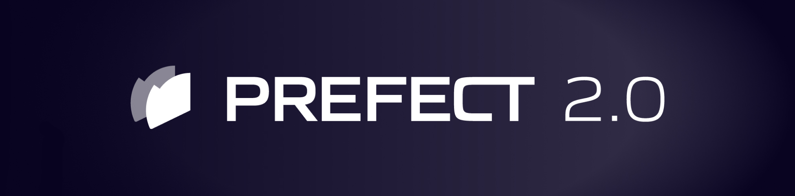
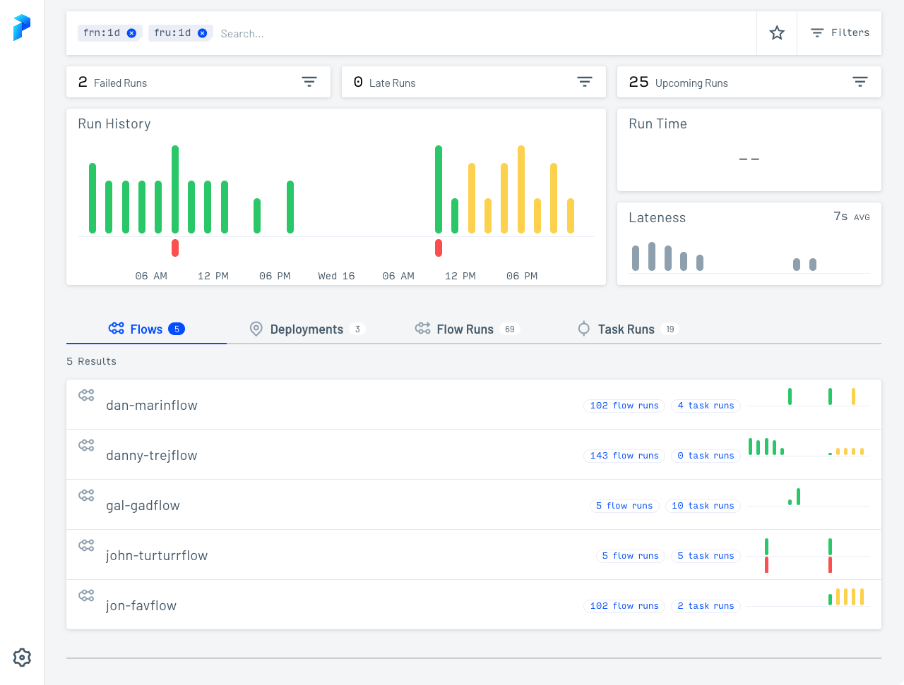

#

## Welcome!

Prefect 2.0 is the second-generation workflow orchestration platform from [Prefect](https://www.prefect.io).

Prefect 2.0 has been designed from the ground up to handle the dynamic, scalable workloads that the modern data stack demands. Powered by Orion, a brand-new, asynchronous rules engine, it represents an enormous amount of research, development, and dedication to a simple idea:

_**You should love your workflows again.**_

Read the docs, run the code, or host the UI. Join thousands of community members in [our Slack community](https://www.prefect.io/slack) to share your thoughts and feedback. Thanks for being part of the mission to build a new kind of workflow system and, of course, **happy engineering!**

!!! info "Don't Panic"
    Prefect 2.0 is under active development and may change rapidly. For production use, we recommend [Prefect 1.0](https://github.com/prefecthq/prefect).
---

## Hello, Orion!

Powered by the Orion engine, Prefect is the easiest way to transform any function into a unit of work that can be observed and governed by orchestration rules. 

Add workflow features like retries, distributed execution, scheduling, caching, and much more, with minimal changes to your code. Every activity is tracked and becomes visible in the Orion Dashboard.

### No DAGs required

You don’t need to rewrite your entire workflow as a directed acyclic graph (DAG) to take advantage of Prefect 2.0. DAGs represent a rigid, constrained, outdated framework for creating modern, dynamic data and computation workflows. 

With Prefect 2.0, you're not limited by the rigid requirements of DAGs. 

- You can use native code alongside Prefect flows and tasks in workflows, enabling you to choose which individual elements of your workflow code you want to be registered with the orchestration API.
- Flows can include logic to determine execution paths at runtime, using native constructs such as `if` statements and Prefect constructs such as futures and state.
- Workflows can be modified at any time: you can run flows and tasks with custom runtime parameters, change schedules at any time, execute ad hoc runs, and even generate flow runs in response to runtime conditions or streaming events.

For a deeper discussion about how and why Prefect 2.0 moved away from a reliance on DAGs, see [Prefect Orion: Our Second-Generation Workflow Engine](https://www.prefect.io/blog/announcing-prefect-orion/).

### Basic orchestration

Decorate functions to automatically retry them on failure while providing complete visibility in the Prefect 2.0 UI.


```python hl_lines="1 5 11"
from prefect import flow, task
from typing import List
import httpx

@task(retries=3)
def get_stars(repo: str):
    url = f"https://api.github.com/repos/{repo}"
    count = httpx.get(url).json()["stargazers_count"]
    print(f"{repo} has {count} stars!")

@flow(name="GitHub Stars")
def github_stars(repos: List[str]):
    for repo in repos:
        get_stars(repo)

# run the flow!
github_stars(["PrefectHQ/Prefect", "PrefectHQ/miter-design"])
```

### Parallel execution

Control task execution by changing a flow's `task_runner`. The tasks in this flow, using the `DaskTaskRunner`, will automatically be submitted to run in parallel on a [Dask.distributed](http://distributed.dask.org/) cluster:

```python hl_lines="2 12"
from prefect import flow, task
from prefect.task_runners import DaskTaskRunner
from typing import List
import httpx

@task(retries=3)
def get_stars(repo: str):
    url = f"https://api.github.com/repos/{repo}"
    count = httpx.get(url).json()["stargazers_count"]
    print(f"{repo} has {count} stars!")

@flow(name="GitHub Stars", task_runner=DaskTaskRunner())
def github_stars(repos: List[str]):
    for repo in repos:
        get_stars(repo)

# run the flow!
if __name__ == "__main__":
    github_stars(["PrefectHQ/Prefect", "PrefectHQ/miter-design"])
```

!!! warning "Guarding \__main__"
    When using Python multiprocessing (as Dask does), best practice is to guard global-scope calls with `if __name__ == "__main__":`. This avoids an infinite recursion if you run the code as a standalone script (with certain process start methods). If you run the code interactively, you don't need the guard.
---

### Async concurrency

With native async support, concurrent parallelism is easy. Asynchronous flows can include a mix of synchronous and asynchronous tasks, just like Python.

```python hl_lines="4 7-9 14-15 18"
from prefect import flow, task
from typing import List
import httpx
import asyncio

@task(retries=3)
async def get_stars(repo: str):
    async with httpx.AsyncClient() as client:
        response = await client.get(f"https://api.github.com/repos/{repo}")
    count = response.json()["stargazers_count"]
    print(f"{repo} has {count} stars!")

@flow(name="GitHub Stars")
async def github_stars(repos: List[str]):
    await asyncio.gather(*[get_stars(repo) for repo in repos])

# run the flow!
asyncio.run(github_stars(["PrefectHQ/Prefect", "PrefectHQ/miter-design"]))
```

### Orion dashboard

After running flows, fire up the UI to gain insight into their execution:

```bash
prefect orion start
```



From here, you can continue to use Prefect interactively or set up automated [deployments](concepts/deployments.md).

## Next steps

Prefect 2.0 was designed to be incrementally adopted into your workflows, and our documentation is organized to support your exploration as much as possible. It is organized into four main sections whose applicability will depend on your objectives and comfort level.

### Getting started

Begin by [installing Prefect 2.0](getting-started/installation.md) on your machine, then follow one of our [friendly tutorials](tutorials/first-steps) to learn by example. See the [Getting Started overview](getting-started/overview) for more.

### Concepts

Learn more about Prefect 2.0's features and design by reading our in-depth [concept docs](concepts/overview.md). These are intended to introduce the building blocks of Prefect, build up to orchestration and deployment, and finally cover some of the advanced use cases that Prefect makes possible.

### Frequently asked questions

Prefect 2.0 represents a fundamentally new way of building and orchestrating data workflows. Learn more about the project by reading our [FAQ](faq.md).

### API reference

Prefect 2.0 provides a number of programmatic workflow interfaces, each of which is documented in the [API Reference](api-ref/overview). This is where you can learn how a specific function works, or see the expected payload for a REST endpoint.

## Join the community

Prefect 2.0 was made possible by the fastest-growing community of data engineers. The [Prefect Slack community](https://prefect.io/slack) is a fantastic place to learn more, ask questions, or get help with workflow design. The [Prefect Discourse](https://discourse.prefect.io/) is an additional community-driven knowledge base to find answers to your Prefect-related questions. Join us and thousands of friendly data engineers to help build a new kind of workflow system.
