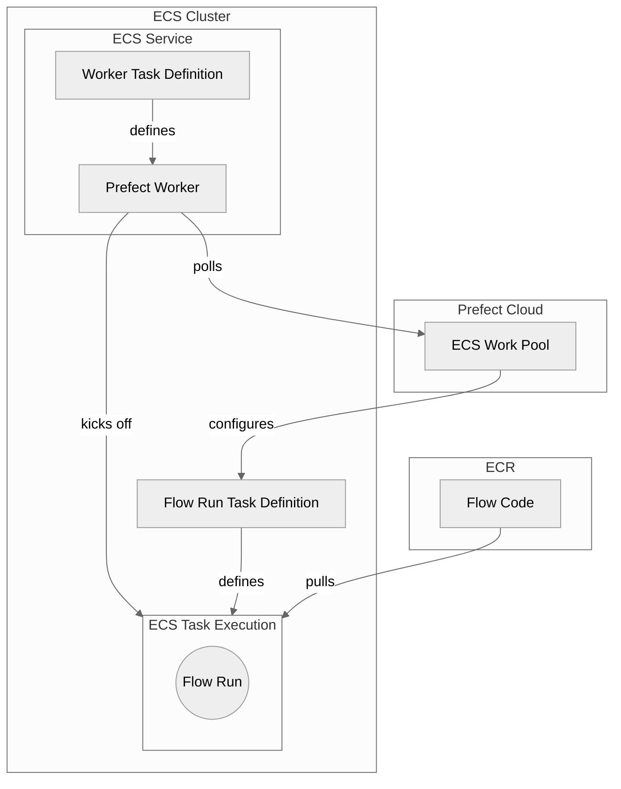

## Why use ECS for flow run execution?

ECS (Elastic Container Service) is an excellent choice for executing Prefect flow runs in production environments:

- **Production-ready scalability**: ECS automatically scales your infrastructure based on demand, efficiently managing container distribution across multiple instances
- **Flexible compute options**: Choose between AWS Fargate for serverless execution or Amazon EC2 for faster job start times and additional control
- **Native AWS integration**: Seamlessly connect with AWS services like IAM, CloudWatch, Secrets Manager, and VPC networking
- **Containerized reliability**: Docker container support ensures reproducible deployments and consistent runtime environments
- **Cost optimization**: Pay only for the compute resources you use with automatic scaling and spot instance support

## Architecture Overview

ECS workers operate within your AWS infrastructure, providing secure and scalable flow execution. Prefect enables remote flow execution via workers and work pools - to learn more about these concepts see the [deployment docs](/v3/deploy/infrastructure-concepts/work-pools/).



### Key Components

- **ECS Worker**: Long-running service that polls work pools and manages flow run execution. Runs as an ECS Service for auto-recovery in case of failure
- **Task Definitions**: Blueprint for ECS tasks that describes which Docker containers to run and their configuration
- **ECS Cluster**: Provides the underlying compute capacity with auto-scaling capabilities
- **Work Pools**: Typed according to infrastructure - flow runs in `ecs` work pools are executed as ECS tasks
- **Flow Run Tasks**: Ephemeral ECS tasks that execute individual Prefect flows until completion

### How It Works

1. **Continuous Polling**: The ECS worker continuously polls your Prefect server or Prefect Cloud for scheduled flow runs
2. **Task Creation**: When work is available, the worker creates ECS task definitions based on work pool configuration
3. **Flow Execution**: Flow runs are launched as ECS tasks with appropriate resource allocation and configuration
4. **Auto-scaling**: ECS automatically manages container distribution and scaling based on demand
5. **Cleanup**: After flow completion, containers are cleaned up while the worker continues polling

<Tip>
**ECS tasks ≠ Prefect tasks**

An ECS task is **not** the same as a [Prefect task](/v3/develop/write-tasks). ECS tasks are groupings of containers that run within an ECS Cluster, defined by task definitions. They're ideal for ephemeral processes like Prefect flow runs.
</Tip>

## Deployment options

### With the `prefect-aws` CLI

The fastest way to deploy production-ready ECS workers is by using the `prefect-aws` CLI:

```bash
prefect-aws ecs-worker deploy-service \
  --work-pool-name my-ecs-pool \
  --stack-name prefect-ecs-worker \
  --existing-cluster-identifier my-ecs-cluster \
  --existing-vpc-id vpc-12345678 \
  --existing-subnet-ids subnet-12345,subnet-67890 \
  --prefect-api-url https://api.prefect.cloud/api/accounts/.../workspaces/... \
  --prefect-api-key your-api-key
```

This command creates a CloudFormation stack that provisions all the infrastructure required for a production-ready ECS worker service.

**Key benefits:**
- **One-command deployment**: Provisions complete infrastructure with a single command
- **CloudFormation managed**: Infrastructure as code with rollback capabilities
- **Auto-scaling configured**: Built-in scaling policies for production workloads
- **Monitoring included**: CloudWatch logs and alarms pre-configured
- **Production defaults**: Secure, optimized settings out of the box

**Additional CLI commands:**
- `prefect-aws ecs-worker list` - View all deployed stacks
- `prefect-aws ecs-worker status <stack-name>` - Check deployment status
- `prefect-aws ecs-worker delete <stack-name>` - Clean up infrastructure
- `prefect-aws ecs-worker export-template` - Export CloudFormation templates for customization

For detailed CLI options run `prefect-aws ecs-worker deploy-service --help`.

### Manual deployment
For users who want full control over their ECS infrastructure setup:

**[Deploy manually →](/integrations/prefect-aws/ecs-worker/manual-deployment)**
Step-by-step guide for creating ECS clusters, task definitions, and configuring workers from scratch.

## Prerequisites

Before deploying ECS workers, ensure you have:

- **AWS Account**: Active AWS account with appropriate permissions
- **IAM Permissions**: Rights to create ECS clusters, task definitions, and IAM roles
- **Docker Knowledge**: Basic understanding of containerization concepts
- **Prefect Setup**: Active Prefect server or Prefect Cloud workspace

## Getting started

1. **Choose your deployment method**: Manual setup provides maximum flexibility, while infrastructure as code offers reproducible deployments
2. **Configure AWS credentials**: Set up IAM roles and permissions for secure AWS service access
3. **Create work pools**: Define work pool configurations that match your ECS infrastructure
4. **Deploy workers**: Launch ECS workers that will poll for and execute flow runs
5. **Monitor and scale**: Use CloudWatch and ECS metrics to optimize performance

## Next steps

- **[Manual Deployment Guide](/integrations/prefect-aws/ecs-worker/manual-deployment)** - Complete walkthrough for setting up ECS workers step-by-step
- **[Work Pool Configuration](/v3/deploy/infrastructure-concepts/work-pools/)** - Learn about Prefect work pools and worker concepts
- **[AWS ECS Documentation](https://docs.aws.amazon.com/ecs/)** - Official AWS documentation for ECS services
- **[Prefect Cloud Push Work Pools](/v3/how-to-guides/deployment_infra/serverless)** - Serverless alternative to self-managed workers
