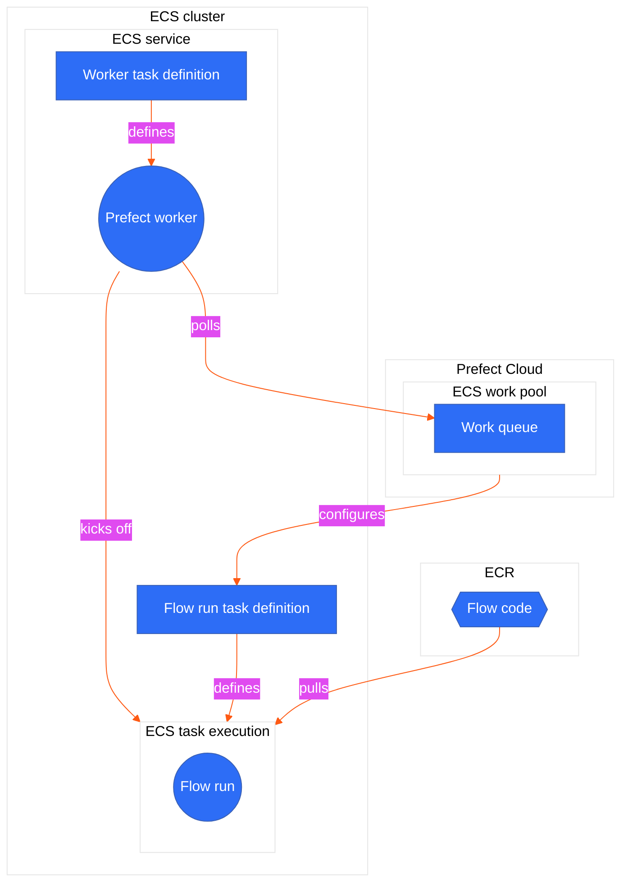

## Why use ECS for flow run execution?

ECS (Elastic Container Service) tasks are a good option for executing Prefect flow runs for several reasons:

1. **Scalability**: ECS scales your infrastructure in response to demand, effectively managing Prefect flow runs. ECS automatically administers container distribution across multiple instances based on demand.
2. **Flexibility**: ECS lets you choose between AWS Fargate and Amazon EC2 for container operation. Fargate abstracts the underlying infrastructure, while EC2 has faster job start times and offers additional control over instance management and configuration.
3. **AWS Integration**: Easily connect with other AWS services, such as AWS IAM and CloudWatch.
4. **Containerization**: ECS supports Docker containers and offers managed execution. Containerization encourages reproducible deployments.

## ECS flow run execution

Prefect enables remote flow execution via workers and work pools. To learn more about these concepts please see our [deployment docs](/3.0rc/deploy/control-runs/work-pools/).

For details on how workers and work pools are implemented for ECS, see the diagram below.



## ECS and Prefect

<Tip>
**ECS tasks != Prefect tasks**

An ECS task is **not** the same thing as a [Prefect task](3.0rc/develop/write-tasks).

ECS tasks are groupings of containers that run within an ECS Cluster. An ECS task's behavior is determined by its task definition.
</Tip>

An [*ECS task definition*](https://docs.aws.amazon.com/AmazonECS/latest/developerguide/task_definitions.html) is the blueprint for the ECS task. It describes which Docker containers to run and what you want to have happen inside these containers.

ECS tasks are instances of a task definition. A Task Execution launches container(s) as defined in the task definition **until they are stopped or exit on their own**. This setup is ideal for ephemeral processes such as a Prefect flow run.

The ECS task running the Prefect worker should be an [**ECS Service**](https://docs.aws.amazon.com/AmazonECS/latest/developerguide/ecs_services.html), given its long-running nature and need for **auto-recovery in case of failure**. An ECS service automatically replaces any task that fails, which is ideal for managing a long-running process such as a Prefect worker.

When a Prefect flow is scheduled to run it goes into the work pool specified in the flow's deployment. Work pools are typed according to the infrastructure the flow will run on. Flow runs scheduled in an `ecs` typed work pool are executed as ECS tasks. Only Prefect ECS workers can poll an `ecs` typed work pool.

When the ECS worker receives a scheduled flow run from the ECS work pool it is polling, it spins up the specified infrastructure on AWS ECS. The worker knows to build an ECS task definition for each flow run based on the configuration specified in the work pool.

Once the flow run completes, the ECS containers of the cluster are spun down to a single container that continues to run the Prefect worker. This worker continues polling for work from the Prefect work pool.

If you specify a task definition [ARN (Amazon Resource Name)](https://docs.aws.amazon.com/IAM/latest/UserGuide/reference-arns.html) in the work pool, the worker will use that ARN when spinning up the ECS Task, rather than creating a task definition from the fields supplied in the work pool configuration.

You can use either EC2 or Fargate as the capacity provider. Fargate simplifies initiation, but lengthens infrastructure setup time for each flow run. Using EC2 for the ECS cluster can reduce setup time. In this example, we will show how to use Fargate.

<Tip>
If you prefer infrastructure as code check out this [Terraform module](https://registry.terraform.io/providers/PrefectHQ/prefect/latest/docs/resources/work_pool) to provision an ECS cluster with a worker.
</Tip>

## Prerequisites

- An AWS account with permissions to create ECS services and IAM roles.
- The AWS CLI installed on your local machine. You can [download it from the AWS website](https://docs.aws.amazon.com/cli/latest/userguide/getting-started-install.html).
- An [ECS Cluster](https://docs.aws.amazon.com/AmazonECS/latest/developerguide/clusters.html) to host both the worker and the flow runs it submits. This guide uses the default cluster. To create your own follow [this guide](https://docs.aws.amazon.com/AmazonECS/latest/userguide/create_cluster.html).
- A [VPC](https://docs.aws.amazon.com/vpc/latest/userguide/what-is-amazon-vpc.html) configured for your ECS tasks. This guide uses the default VPC.
- Prefect Cloud account or Prefect self-managed instance.

## Step 1: Set up an ECS work pool

Before setting up the worker, create a [work pool](3.0rc/deploy/control-runs/work-pools/) of type ECS for the worker to pull work from. If doing so from the CLI, be sure to authenticate with Prefect Cloud or run a local Prefect server instance.

Create a work pool from the CLI:

```bash
prefect work-pool create --type ecs my-ecs-pool
```

Or from the Prefect UI:


Because this guide uses Fargate as the capacity provider and the default VPC and ECS cluster, no further configuration is needed.

Next, set up a Prefect ECS worker that will discover and pull work from this work pool.

## Step 2: Start a Prefect worker in your ECS cluster

First start by creating the [IAM role](https://docs.aws.amazon.com/IAM/latest/UserGuide/id_roles_create_for-custom.html#roles-creatingrole-custom-trust-policy-console) required in order for your worker and flows to run. The sample flow in this guide doesn't interact with many other AWS services, so you will only be creating one role, `taskExecutionRole`.  To create an IAM role for the ECS task using the AWS CLI, follow these steps:

### 1. Create a trust policy

The trust policy will specify that the ECS service containing the Prefect worker will be able to assume the role required for calling other AWS services.

Save this policy to a file, such as `ecs-trust-policy.json`:

```json
{
    "Version": "2012-10-17",
    "Statement": [
        {
            "Effect": "Allow",
            "Principal": {
                "Service": "ecs-tasks.amazonaws.com"
            },
            "Action": "sts:AssumeRole"
        }
    ]
}
```

### 2. Create the IAM roles

Use the `aws iam create-role` command to create the roles that you will be using. For this guide, the `ecsTaskExecutionRole` will be used by the worker to start ECS tasks, and will also be the role assigned to the ECS tasks running your Prefect flows.

```bash
    aws iam create-role \
    --role-name ecsTaskExecutionRole \
    --assume-role-policy-document file://ecs-trust-policy.json
```


Depending on the requirements of your flows, it is advised to create a [second role for your ECS tasks](https://docs.aws.amazon.com/AmazonECS/latest/developerguide/task-iam-roles.html). This role will contain the permissions required by the ECS tasks in which your flows will run. For example, if your workflow loads data into an S3 bucket, you would need a role with additional permissions to access S3.

### 3. Attach the policy to the role

For this guide the ECS worker will require permissions to pull images from ECR and publish logs to CloudWatch. Amazon has a managed policy named `AmazonECSTaskExecutionRolePolicy` that grants the permissions necessary for starting ECS tasks. [See here](https://docs.aws.amazon.com/AmazonECS/latest/developerguide/task_execution_IAM_role.html) for other common execution role permissions. Attach this policy to your task execution role:

```bash
    aws iam attach-role-policy \
    --role-name ecsTaskExecutionRole \
    --policy-arn arn:aws:iam::aws:policy/service-role/AmazonECSTaskExecutionRolePolicy
```

Remember to replace the `--role-name` and `--policy-arn` with the actual role name and policy Amazon Resource Name (ARN) you want to use.

## Step 3: Creating an ECS worker service

### 1. Launch an ECS Service to host the worker

Next, create an ECS task definition that specifies the Docker image for the Prefect worker, the resources it requires, and the command it should run. In this example, the command to start the worker is `prefect worker start --pool my-ecs-pool`.

**Create a JSON file with the following contents:**

```json
{
    "family": "prefect-worker-task",
    "networkMode": "awsvpc",
    "requiresCompatibilities": [
        "FARGATE"
    ],
    "cpu": "512",
    "memory": "1024",
    "executionRoleArn": "<ecs-task-role-arn>",
    "taskRoleArn": "<ecs-task-role-arn>",
    "containerDefinitions": [
        {
            "name": "prefect-worker",
            "image": "prefecthq/prefect:3-latest",
            "cpu": 512,
            "memory": 1024,
            "essential": true,
            "command": [
                "/bin/sh",
                "-c",
                "pip install prefect-aws && prefect worker start --pool my-ecs-pool --type ecs"
            ],
            "environment": [
                {
                    "name": "PREFECT_API_URL",
                    "value": "prefect-api-url>"
                },
                {
                    "name": "PREFECT_API_KEY",
                    "value": "<prefect-api-key>"
                }
            ]
        }
    ]
}
```

- Use `prefect config view` to view the `PREFECT_API_URL` for your current Prefect profile. Use this to replace `<prefect-api-url>`.

- For the `PREFECT_API_KEY`, if you are on a paid plan you can create a [service account](https://docs.prefect.io/latest/cloud/manage-users/service-accounts/) for the worker. If your are on a free plan, you can pass a user’s API key.

- Replace both instances of `<ecs-task-role-arn>` with the ARN of the IAM role you created in Step 2. You can grab this by running:
```
aws iam get-role --role-name taskExecutionRole --query 'Role.[RoleName, Arn]' --output text
```

- Notice that the CPU and Memory allocations are relatively small. The worker's main responsibility is to submit work through API calls to AWS, _not_ to execute your Prefect flow code.

<Tip>
    To avoid hardcoding your API key into the task definition JSON see [how to add sensitive data using AWS secrets manager to the container definition](https://docs.aws.amazon.com/AmazonECS/latest/developerguide/specifying-sensitive-data-tutorial.html#specifying-sensitive-data-tutorial-create-taskdef).
</Tip>

### 2. Register the task definition

Before creating a service, you first need to register a task definition. You can do that using the `register-task-definition` command in the AWS CLI. Here is an example:

```bash
aws ecs register-task-definition --cli-input-json file://task-definition.json
```

Replace `task-definition.json` with the name of your JSON file.

### 3. Create an ECS service to host your worker

Finally, create a service that will manage your Prefect worker:

Open a terminal window and run the following command to create an ECS Fargate service:

```bash
aws ecs create-service \
    --service-name prefect-worker-service \
    --cluster <ecs-cluster> \
    --task-definition <task-definition-arn> \
    --launch-type FARGATE \
    --desired-count 1 \
    --network-configuration "awsvpcConfiguration={subnets=[<subnet-ids>],securityGroups=[<security-group-ids>],assignPublicIp='ENABLED'}"
```

- Replace `<ecs-cluster>` with the name of your ECS cluster.
- Replace `<task-definition-arn>` with the ARN of the task definition you just registered.
- Replace `<subnet-ids>` with a comma-separated list of your VPC subnet IDs. Ensure that these subnets are aligned with the vpc specified on the work pool in step 1. You can view subnet ids with the following command:
    `aws ec2 describe-subnets --filter Name=<vpc-id>`
- Replace `<security-group-ids>` with a comma-separated list of your VPC security group IDs.


The work pool page in the Prefect UI allows you to check the health of your workers - make sure your new worker is live! Note that it can take a few minutes for an ECS service to come online.

If your worker does not come online and you are using the command from this guide, you may not be using the default VPC. For connectivity issues, check your VPC's configuration and refer to the [ECS outbound networking guide](https://docs.aws.amazon.com/AmazonECS/latest/bestpracticesguide/networking-outbound.html).

## Step 4: Pick up a flow run with your new worker

This guide uses ECR to store a Docker image containing your flow code. To do this, we will write a flow, then deploy it using build and push steps that copy flow code into a Docker image and push that image to an ECR repository.

### 1. Write a simple test flow

`my_flow.py`

```python
from prefect import flow
from prefect.logging import get_run_logger

@flow
def my_flow():
    logger = get_run_logger()
    logger.info("Hello from ECS!!")

if __name__ == "__main__":
    my_flow()
```

### 2. Create an ECR repository

Use the following AWS CLI command to create an ECR repository. The name you choose for your repository will be reused in the next step when defining your Prefect deployment.

```bash
aws ecr create-repository \
--repository-name <my-ecr-repo> \
--region <region>
```

### 3. Create a `prefect.yaml` file

To have Prefect build your image when deploying your flow create a `prefect.yaml` file with the following specification:

```yaml
name: ecs-worker-guide
# this is pre-populated by running prefect init
prefect-version: 2.14.20

# build section allows you to manage and build docker images
build:
- prefect_docker.deployments.steps.build_docker_image:
    id: build_image
    requires: prefect-docker>=0.3.1
    image_name: <my-ecr-repo>
    tag: latest
    dockerfile: auto

# push section allows you to manage if and how this project is uploaded to remote locations
push:
- prefect_docker.deployments.steps.push_docker_image:
    requires: prefect-docker>=0.3.1
    image_name: '{{ build_image.image_name }}'
    tag: '{{ build_image.tag }}'

 # the deployments section allows you to provide configuration for deploying flows
deployments:
- name: my_ecs_deployment
    version:
    tags: []
    description:
    entrypoint: flow.py:my_flow
    parameters: {}
    work_pool:
        name: ecs-dev-pool
        work_queue_name:
        job_variables:
        image: '{{ build_image.image }}'
    schedules: []
pull:
    - prefect.deployments.steps.set_working_directory:
        directory: /opt/prefect/ecs-worker-guide

```

### 4. [Deploy](https://docs.prefect.io/deploy/serve-flows/#create-a-deployment) the flow to the Prefect Cloud or your self-managed server instance, specifying the ECS work pool when prompted

```bash
prefect deploy my_flow.py:my_ecs_deployment
```

### 5. Find the deployment in the UI and click the **Quick Run** button!

## Optional next steps

1. Now that you are confident your ECS worker is healthy, you can experiment with different work pool configurations.

    - Do your flow runs require higher `CPU`?
    - Would an EC2 `Launch Type` speed up your flow run execution?

    These infrastructure configuration values can be set on your ECS work pool or they can be overridden on the deployment level through [job_variables](/3.0rc/deploy/serve-flows/#workers-and-work-pools) if desired.
