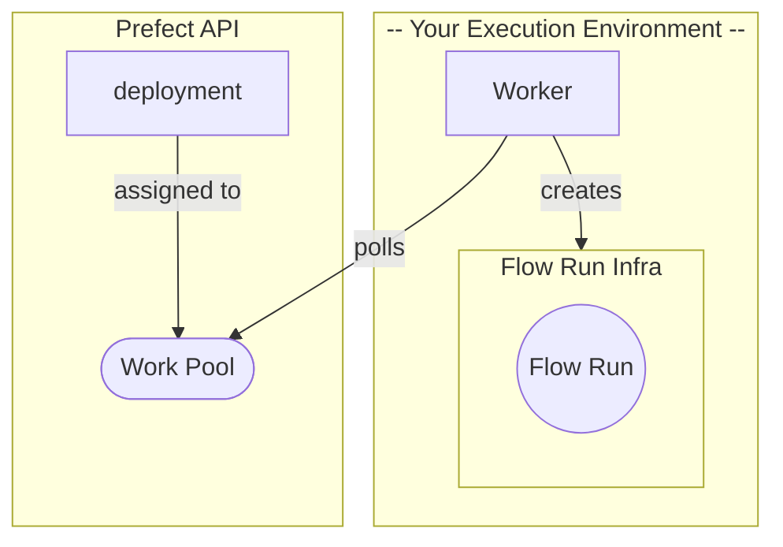

# Deploying Flows

## Why Deploy?

One of the most common reasons to use a tool like Prefect is [scheduling](/concepts/schedules). You want your flows running on production infrastructure in a consistent and predictable way. Up to this point, we’ve demonstrated running Prefect flows as scripts, but this means *you* have been the one triggering flow runs. In order to schedule flow runs or trigger them based on [events](/cloud/events/) you’ll need to [deploy](/concepts/deployments/) them.

A deployed flow gets the following additional cababilities:

- flows triggered by scheduling
- remote execution of flows triggered from the UI
- flow triggered by automations or events

## What is a Deployment?

Deploying your flows is, in essence, the act of informing Prefect of:

1. Where to run your flows
2. How to run your flows
3. When to run your flows

This information is encapsulated and sent to Prefect as a [Deployment](/concepts/deployments/) which contains the crucial metadata needed for orchestration. Deployments elevate workflows from functions that you call manually to API-managed entities.

Attributes of a deployment include (but are not limited to):

- __Flow entrypoint__: path to your flow function would start the flow
- __Work pool__: points to the infrastructure you want your flow to run in
- __Schedule__: optional schedule for this deployment
- __Tags__: optional metadata

Before you build your first deployment, its helpful to understand how Prefect configures flow run infrastrucuture. This means setting up a work pool and a worker to enable **your flows** to run on **your infrastructure**.

## Why Workpools and Workers?

Running Prefect flows locally is great for testing and development purposes. But for production settings, Prefect work pools and workers allow you to run flows in the environments best suited to their execution.

Workers and work pools bridge the Prefect orchestration layer with the infrastructure the flows are actually executed on.

You can configure work pools within the Prefect UI. They prioritize the flows and respond to polling from the worker. Workers are light-weight processes that run in the environment where flows are executed.

**Work Pools:**

- Organize the flows for your worker to pick up and execute.
- Describe the ephemeral infrastructure configuration that the worker will create for each flow run.
- Prioritize the flows and respond to polling from its worker(s).



!!! note "Security Note:"
    Prefect provides execution through the hybrid model which allows you to deploy workflows that run in the environments best suited to their execution while allowing you to keep your code and data completely private. There is no ingress required. For more information see [here.](https://www.prefect.io/security/overview/#overview)

Now that we’ve reviewed the concepts of a Work Pool and Worker, let’s create them so that you can deploy your tutorial flow, and execute it later using the Prefect Orchestration API.

## Setting up the Worker and Work Pool

For this tutorial you will create a *process type* work pool via the CLI. 

The process work pool type specifies that all work sent to this work pool will run as a subprocess inside the same infrastructure from which the worker is started.

!!! tip "Other Workpools"
    There are work pool types for all major managed code execution platforms, such as Kubernetes services or serverless computing environments such as AWS ECS, Azure Container Instances, or GCP Cloud Run, which are expanded upon in the guides section.

In your terminal run the following command to set up a work pool. 
<div class="terminal">
```bash
prefect work-pool create --type process my-process-pool
```
</div>
Let’s confirm that the work pool was successfully created by running the following command in the same terminal. You should see your new `my-process-pool` in the output list.
<div class="terminal">
```bash
prefect work-pool ls 
```
</div>
Finally, let’s double check that you can see this work pool in the Prefect Cloud UI. Navigate to the Work Pool tab and verify that you see `my-process-pool` listed.

<div class="terminal">
```bash
                                             Work Pools                                             
┏━━━━━━━━━━━━━━━━━━━━━━━┳━━━━━━━━━━━━━━━┳━━━━━━━━━━━━━━━━━━━━━━━━━━━━━━━━━━━━━━┳━━━━━━━━━━━━━━━━━━━┓
┃ Name                  ┃ Type          ┃                                   ID ┃ Concurrency Limit ┃
┡━━━━━━━━━━━━━━━━━━━━━━━╇━━━━━━━━━━━━━━━╇━━━━━━━━━━━━━━━━━━━━━━━━━━━━━━━━━━━━━━╇━━━━━━━━━━━━━━━━━━━┩
│ my-process-pool       │ process       │ 33ce63a5-cc80-4f43-9092-11122ccea60b │ None              │
└───────────────────────┴───────────────┴──────────────────────────────────────┴───────────────────┘
```
</div>
When you click into the `my-process-pool`, select the "Work Queues" tab. You should see a red status icon listed for the default work queue signifying that this queue is not ready to submit work. Work queues are an advanced feature. You can learn more about them in the [work queue documentation.](/concepts/work-pools/#work-queues) 

To get the work queue healthy and ready to submit flow runs, you need to start a worker.

Workers are a lightweight polling system that kick-off flow runs submitted to them by their work pool. To start a worker on your laptop, open a new terminal and confirm that your virtual environment is activated. Run the following command in this new terminal to start the worker:
<div class="terminal">
```bash
prefect worker start --pool my-process-pool
```
</div>
You should see the worker start. It is now polling the Prefect API to request any scheduled flow runs for it to start. You’ll see your new worker listed in the UI under the worker tab of the Work Pool page with a recent last polled date. You should also be able to see a healthy status indicator in the default work queue under the work queue tab.

You will need to keep this terminal session active in order for the worker continue to pick up jobs. Since you are running this worker locally, the worker will terminate if you close the terminal. In a production setting, this worker should be running as a daemonized or managed process. See next steps for more information on this.

Now that we’ve set up your work pool and worker, they are ready to kick off deployed flow runs. Lets deploy your tutorial flow to `my-process-pool`.

## Create a Deployment

### From our previous steps, we now have:

1. A flow
2. A work pool
3. A worker
4. An understanding of Prefect Deployments

Now it’s time to put it all together.

!!! warning "Push Your Flow Code!"
    Ensure that you have pushed any recent changes in your flow script to your GitHub repo.

In your terminal (not the terminal in which the worker is running), let’s run the following command to begin deploying your flow. Ensure that the current directory represents the root of your github repo.

!!! danger "Danger"
    Before running any `prefect deploy` or `prefect init` commands, double check that you are at the **root of your repo**, otherwise the worker may struggle to get to the same entrypoint during remote execution!

<div class="terminal">
```bash
prefect deploy my_flow.py:get_repo_info
```
</div>

!!! note "CLI Note:"
    This deployment command follows the following format `prefect deploy entrypoint` that you can use to deploy your flows in the future:
    
    `prefect deploy path_to_flow/my_flow_file.py:flow_func_name`

Now that you have run the deploy command, the CLI will prompt you through different options you can set with your deployment.

1. Name your deployment `my-deployment`
2. Type `n` for now, you can set up a schedule later
3. Select the work pool you just created, `my-process-pool`
4. When asked if you would like your workers to pull your flow code from its remote repository, select yes if you’ve been following along and defining your flow code script from within a GitHub repository:
    - __`y`__: Recommended: Prefect will automatically register your GitHub repo as the the remote location of this flow’s code. This means a worker started on any machine (for example: on your laptop, on your team-mate’s laptop, or in a cloud VM) will be able to facilitate execution of this deployed flow.
    - __`n`__: If you would like to continue this tutorial without the use of GitHub, thats ok, Prefect will always first look to see if the flow code exists locally before referring to remote flow code storage, so your local `my-process-pool` should have all it needs to complete the execution of this deployed flow.

!!! tip "Did you know?"
    A Prefect flow can have more than one deployment. This can be useful if you want your flow to run in different execution environments or have multiple different schedules. 

As you continue to use Prefect, you'll likely author many different flows and deployments of them. Check out the next section to learn about defining deployments in a `deployment.yaml` file.

## Next Steps

- Learn about deploying multiple flows and CI/CD with our [`prefect.yaml`](/concepts/projects/#the-prefect-yaml-file)
- Check out some of our other [work pools](/concepts/work-pools/)
- [Concepts](/concepts/) contain deep dives into Prefect components.
- [Guides](/guides/) provide step by step recipes for common Prefect operations including:
    - [Deploying on Kubernetes](/guides/deployment/helm-worker/)
    - [Deploying flows in Docker](/guides/deployment/docker/)
    - [Writing tests](/guides/testing)
      
And more!
