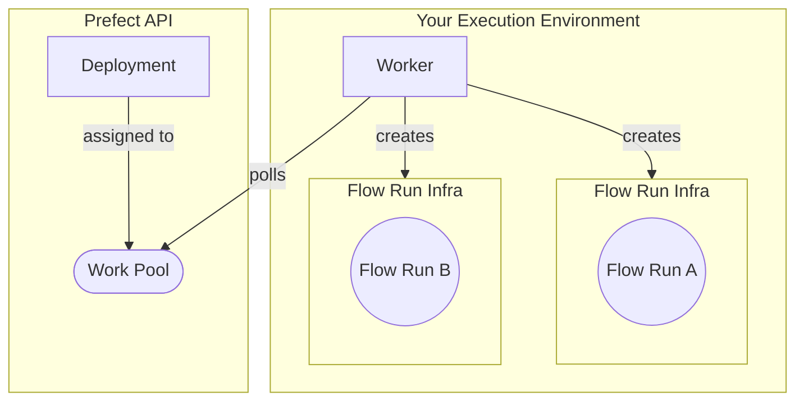

# Workers

This part of the tutorial creates a Docker work pool with workers that can handle more complex infrastructure management and monitoring.

## Prerequisites

* Install [Docker](https://docs.docker.com/engine/install/).
* To start a worker on your local machine, confirm that your virtual environment has `prefect`.

## Why workers

While `serve` handles basic scheduling, work pools with client-side workers are essential for complex or dynamic infrastructure needs. With workers, you can:

* Scale execution resources automatically based on workload.
* Enhance security by running flows in isolated environments.
* Optimize resource utilization by provisioning infrastructure only when needed.
* Execute flows in Docker containers, Kubernetes clusters, and serverless platforms (AWS ECS, Azure Container Instances, GCP Cloud Run).

The diagram shows a worker-based deployment architecture where the worker dynamically provisions Docker containers to host individual flow runs:



## Create a work pool

1. Create a Docker work pool named `my-docker-pool`:

    <div class="terminal">

    ```bash
    prefect work-pool create --type docker my-docker-pool
    ```

    </div>

    Using the **Docker** work pool type means that all work sent to this work pool runs within a dedicated Docker container using a Docker client available to the worker.

1. Verify its creation:

    <div class="terminal">

    ```bash
    prefect work-pool ls
    ```

    </div>

1. Confirm its visibility on the Prefect UI's **Work Pools** tab (red status indicates it's not ready yet).

To make the work pool ready, you need to start a worker.

## Start a worker

Workers monitor the Prefect API for scheduled flow runs and initiate execution on your chosen infrastructure.

Start a local worker for `my-docker-pool`:

<div class="terminal">

```bash
prefect worker start --pool my-docker-pool

```

</div>

The worker appears in the UI's **Workers** tab (Work Pools page), with a recent last polled date to check for any scheduled flow runs it should pick up and then submit for execution. Your work pool's status should now be `Ready`.

This local worker terminates if you close the terminal session. In production, workers should run as a [daemonized or managed process](/guides/deployment/daemonize/).

## Create the deployment

Deploy your flow to `my-docker-pool`:

1. Make the following changes to your `repo_info.py` file:

    * Change `flow.serve` to `flow.deploy`.
    * Specify your target work pool using `flow.deploy`.
    * Set the name for the Docker image

    Your`repo_info.py` should look like:

    ```python hl_lines="17-22" title="repo_info.py"
    import httpx
    from prefect import flow


    @flow(log_prints=True)
    def get_repo_info(repo_name: str = "PrefectHQ/prefect"):
        url = f"https://api.github.com/repos/{repo_name}"
        response = httpx.get(url)
        response.raise_for_status()
        repo = response.json()
        print(f"{repo_name} repository statistics 🤓:")
        print(f"Stars 🌠 : {repo['stargazers_count']}")
        print(f"Forks 🍴 : {repo['forks_count']}")


    if __name__ == "__main__":
        get_repo_info.deploy(
            name="my-first-deployment", 
            work_pool_name="my-docker-pool", 
            image="my-first-deployment-image:tutorial",
            push=False
        )
    ```

    For this tutorial, your Docker worker is running on your machine, so you don't need to push the image built by `flow.deploy` to a registry. When your worker is running on a remote machine, you need to [push the image to a registry that the worker can access](/guides/prefect-deploy/#creating-work-pool-based-deployments-with-deploy).

1. Deploy your flow to the work pool:

    <div class="terminal">

    ```bash
    python repo_info.py
    ```

    </div>

Prefect builds a custom Docker image containing your workflow code that the worker can use to dynamically spawn Docker containers whenever this workflow needs to run.

### Modify the deployment

To modify your deployment, edit your script and run it again. 

## Execute scheduled flow runs

Customize infrastructure settings for specific deployments by updating the `job_variables` section:

* **Local testing**: Set `image_pull_policy: Never` to avoid pulling from registries.
* **Production**: Always push images to a remote registry for reliability.

This example sets the `image_pull_policy` to `Never` for local testing:

```python hl_lines="21" title="repo_info.py"
import httpx
from prefect import flow


@flow(log_prints=True)
def get_repo_info(repo_name: str = "PrefectHQ/prefect"):
    url = f"https://api.github.com/repos/{repo_name}"
    response = httpx.get(url)
    response.raise_for_status()
    repo = response.json()
    print(f"{repo_name} repository statistics 🤓:")
    print(f"Stars 🌠 : {repo['stargazers_count']}")
    print(f"Forks 🍴 : {repo['forks_count']}")


if __name__ == "__main__":
    get_repo_info.deploy(
        name="my-first-deployment", 
        work_pool_name="my-docker-pool", 
        job_variables={"image_pull_policy": "Never"},
        image="my-first-deployment-image:tutorial",
        push=False
    )
```

To register this update to your deployment's parameters with Prefect's API, run:

<div class="terminal">

```bash
python repo_info.py
```

</div>

Submit a flow run to the work pool:

<div class="terminal">

```bash
prefect deployment run 'get_repo_info/my-deployment'
```

</div>

**Remember**: Store deployment scripts at the repository root to avoid missing files in the Docker image.

## Next steps

- Explore deployment configurations with [`prefect.yaml`](/guides/prefect-deploy/).
- Deep dive into Prefect [concepts](/concepts/).
- Use Prefect [guides](/guides/) for:
  - [Deploying flows on Kubernetes](/guides/deployment/kubernetes/)
  - [Deploying flows in Docker](/guides/deployment/docker/)
  - [Deploying flows on serverless infrastructure](/guides/deployment/serverless-workers/)
  - [Daemonizing workers](/guides/deployment/daemonize/)

Happy building!
