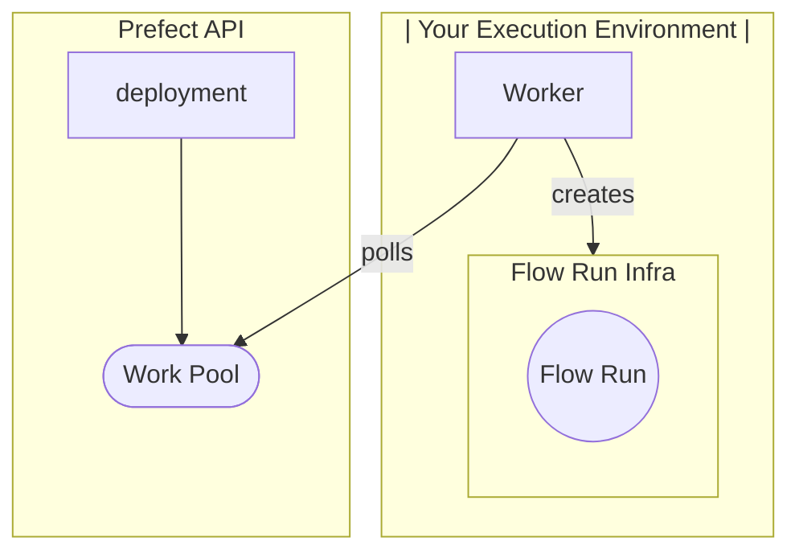

# Deploying Flows

## Why Deploy

The most common reason to use a tool like Prefect, is scheduling. You want your workflows running in some production infrastructure in a consistent and predictable way. Up to this point, we’ve demonstrated running Prefect flows as scripts, but this means *you* have been the one triggering flow runs. In order to schedule flow runs or trigger them based on events you’ll need to understand Prefect’s concept of a flow's [Deployment](/concepts/deployments/).

A deployed flow gets the following additional cababilities:

- flows triggered by scheduling
- remote execution of flows triggered from the UI
- flow triggered by automations or events

## What is a Deployment

Deploying your flows is, in essence, the act of informing the Prefect API of:

1. Where to run your flows 
2. How to run your flows
3. When to run your flows 

This information is encapsulated and sent to Prefect as a “[Deployment](https://docs.prefect.io/2.10.13/concepts/deployments/?h=deployment#deployments-overview)” which becomes the server side object containing the crucial metadata needed for Prefect’s API to execute your flow as desired. Deployments elevate workflows from functions that you call manually to API-managed entities.

Attributes of a deployment include (but are not limited to): 

- Flow entrypoint = path to your flow function would start the flow
- Workpool = points to the infra you want your flow to run in
- Schedule = optional schedule for this deployment

In order to run **your flows** on **your infrastructure,** you are going to need to set up a work pool and a worker. 

## Why Workpools and Workers
Easily running Prefect flows locally is great for testing and development purposes. But for production settings, Prefect provides you with the worker/work pool concepts to allow you to run flows in the environments best suited to their execution. For example, its considered best practice to leverage managed execution platforms, like Kubernetes services or serverless computing environments such as AWS ECS, Azure Container Instances, or GCP Cloud Run. For more information see the [next steps](/tutorials/next_steps/)


Workers and work pools bridge the Prefect orchestration API with your execution environments in your cloud provider.

You can configure work pools on Prefect’s side. They describe the infrastructure configuration for deployed flow runs that get sent to that pool. organize the flows for your worker to pick up and execute. They prioritize the flows and respond to polling from its worker.

Workers are light-weight, long-running polling processes polling that you host in your execution environment. Workers pick up work from their work pool and spin up ephemeral infrastructure each flow run according to metadata passed to them in the form of deployments.



!!! note "Security Note:"
    Prefect provides execution through the hybrid model which allows you to deploy workflows that run in the environments best suited to their execution while allowing you to keep your code and data completely private. There is no ingress required. For more information see [here.](https://www.prefect.io/security/overview/#overview)

Now that we’ve reviewed the concepts of a Work Pool and Worker, let’s create them so that you can deploy your tutorial flow, and execute it later using the Prefect Orchestration API.

## Setting up the Worker and Work Pool
For this tutorial you will create a *process type* work pool via the CLI. 

The process work pool type specifies that all work sent to this work pool will run as a subprocess inside the same infrastructure from which the worker is started.

!!! tip "Security Note:"
    Aside from process, there are a variety of different work pool types you might consider in a production setting to containerize your flow runs that leverage managed execution platforms, like Kubernetes services or serverless computing environments such as AWS ECS, Azure Container Instances, or GCP Cloud Run which are expanded upon in the guides section.

In your terminal set to your Prefect workspace run the following command to set up a work pool. 

```prefect work-pool create --type process tutorial-process-pool```

Now that you have created the work pool, let’s confirm that the work pool was successfully created by running the following command in the same terminal.  You should see your new ```tutorial-process-pool``` in the output list.

```prefect work-pool ls```

Finally, let’s double check in the Prefect Cloud UI that you can see this work pool. Navigate to the Work Pool tab and verify that you see `tutorial-process-pool` listed.

When you click into the `tutorial-process-pool` you can click into the tab for work queues.  You should see a red status icon next listed for the default work queue signifying that this queue is not ready to submit work. Work queues are an advanced topic to help determine flow priority. You can learn more about work queues in the [work queue documentation.](https://docs.prefect.io/2.10.13/concepts/work-pools/#work-queues) 

To get the work queue healthy and ready to submit flow runs, you need to start a worker in your execution environment. For this tutorial, your execution environment is on your laptop or dev machine.

As mentioned above, workers are a lightweight polling system that kick-off flow runs submitted to them by their work pool. To start your worker you will open a new terminal, make sure the same virtual environment is enabled as your python script.  Run the following command in this new terminal to start the worker:

```prefect worker start --pool tutorial-process-pool```

You should see the worker start, its now polling the Prefect API to see if there are any scheduled flow runs to kick off. You’ll see your new worker listed in the UI under the worker tab of the Work Pool page with a recent Last Polled date. You should also be able to see a healthy status indicator in the default work queue under the work queue tab.

You will need to keep this terminal running in order to have the worker continue to pick up jobs.  Since you are running this worker locally, the worker will terminate if you close the terminal.  When running in a production environment, this worker should be running as a damonized or managed process.

Now that we’ve set up your work pool and worker, they are ready to kick off deployed flow runs. Lets build a deployment that sends work to your `tutorial-process-pool` on a schedule.

!!! tip "Note:"
    Double check you have same file path as python code you were running earlier.

---
description: Learn about the Prefect orchestration engine and API.
tags:
    - work pools
    - agents
    - orchestration
    - database
    - API
    - UI
    - storage
search:
  boost: 2
---

From our previous steps we now have:

1. A flow
2. A work pool
3. A worker
4. An understanding of Prefect Deployments

Now it’s time to put it all together.

In your terminal (not the terminal associated with the worker), let’s run the following command to begin deploying your flow.  Ensure that the current directory is set to the same directory as when you were running the flow locally.  You can double check this by typing `ls` in the terminal and you should see the flow file in the output.

```bash
prefect deploy my_flow.py:get_repo_info
```

This deployment command follows the following format that you can use to deploy your flows in the future:  `prefect deploy path_to_flow/my_flow_file.py:flow_func_name` 

<aside>
☝🏼 Warning:
Ensure that you run the prefect deploy command from the top/root/base of your repo, otherwise the worker may struggle to get to the same entrypoint during remote execution.

</aside>

- <<Screenshot of Deployment Wizard for our reference>>
    
    
    

Now that you have run the deploy command, the CLI will prompt you through different options you can set with your deployment.

- name your deployment `my-deployment`
- type n for now, you can set up a schedule later
- select the work pool you just created, tutorial-process-pool
- When asked if you would like your workers to pull your flow code from its remote repository, select yes if you’ve been following along and defining your flow code script from within a github repository.
    - y: Reccomended: Prefect will automatically register your GitHub repo as the the location of this flow’s remote flow code. This means a worker started on any machine, on your laptop, on your team-mate’s laptop, or in your cloud provider
    - n: If you would like to continue this tutorial without the use of GitHub, thats ok, Prefect will always look first to see if the flow code exists locally before referring to remote flow code storage.

Prefect becomes powerful when it allows you to trigger flow runs in a variety of executions environments, so understanding how Prefect workers access flow code remotely is an important concept to grasp. 

Note that Prefect has automatically done a few things for you:

- registered the existence of this flow [with your local project](https://docs.prefect.io/concepts/projects/#the-prefect-directory)
- created a description for this deployment based on the docstring of your flow function
- parsed the parameter schema for this flow function in order to expose an API for running this flow

<aside>
☝🏼 Aside from GitHub, Prefect offers a variety of options for remote flow code storage.

</aside>

## Deployment YAML

You can use a deployment.yaml file to define this deployment along with all deployments you might create for a given repository of flow code. 

<aside>
❗ Tip: A flow can have one or many deployments.

</aside>

To start a deployment.yaml file, type:

`prefect project init`

And populate the deployment object information in the `deployment.yaml` like shown below:

```yaml
deployments:
- name: my-deployment
  tags: [my-tag]
  description: a flow that checks github
  schedule: null
  entrypoint: my_flow.py:get_repo_info
  parameters: {}
  work_pool:
    name: tutorial-process-pool
```