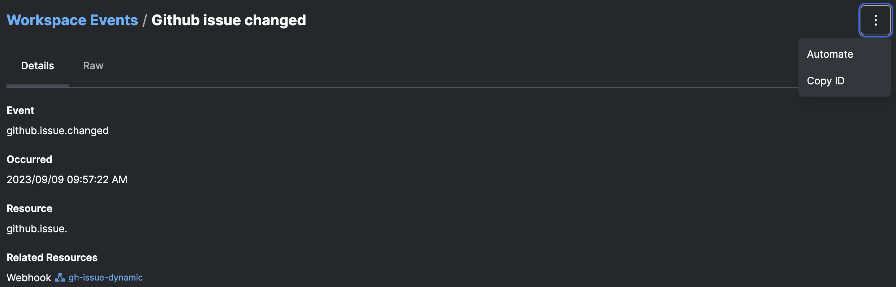

# Events

Prefect Cloud provides an interactive dashboard to analyze and take action on events that occurred in your worksapce on the [events page](/concepts/events-and-resources/).

## Events feed

The event feed is the primary place to view, search, and filter events to understand how data is moving through your stack.

## Event details

You can view more information about an event by clicking into it, where you can view the full details of an events resource, related resources, and payload.

## Automating based on events

From an event page, you can easily configure an automation for matching events by clickign the automation button in the overflow menu:

