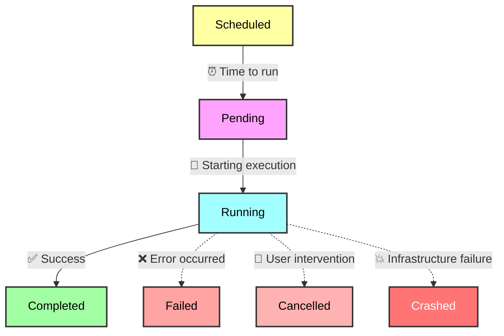

```python
from prefect import flow

@flow(log_prints=True)
def explain_flows():
    print("run any python code here!")
    print("encapsulate that business logic!")

if __name__ == "__main__":
    explain_flows()
```

## What is a flow?

Flows are defined as decorated Python functions. Above, `explain_flows` is an instance of a flow.

Flows accept inputs, perform work, and potentially return a result.

Generally, flows behave like Python functions, but they have some additional capabilities:

- Metadata about their execution, like each [state](/v3/concepts/states/) the flow enters, is automatically tracked.
- Input arguments can be type validated as workflow [parameters](#specify-flow-parameters).
- [Retries](/v3/how-to-guides/workflows/retries) can be performed on failure, with configurable delay and retry limits.
- [Timeouts](/v3/how-to-guides/workflows/write-and-run#cancel-a-workflow-if-it-runs-for-too-long) can be enforced to prevent unintentional, long-running workflows.
- A flow can be [deployed](/v3/how-to-guides/deployments/create-deployments/), which exposes an API for interacting with it remotely.

<Tip>
Flows do not need to call other Prefect tasks or flows, but they can.
</Tip>

### Running a flow

A **flow run** is a representation of a single invocation of a flow.


#### The life of a flow run

Each flow run has its own [state](/v3/concepts/states/) lifecycle that is tracked by the Prefect database.

A normal flow run lifetime looks like this:



A flow run's lifecycle may be interrupted at any point, whether by:
- manual or accidental cancellation or deletion of the flow run
- disappearance or malfunction of the flow run's host infrastructure
- other unforeseen issues and circumstances (e.g. networking!)

From the perspective of a Prefect server and its clients, a flow run should eventually reach a terminal state. If it doesn't for one of the above reasons, it is called a ["zombie" flow run](/v3/advanced/detect-zombie-flows/).

#### Different ways to create a flow run

The simplest way to create a flow run is to call a `@flow` decorated function (i.e. `__call__`), just like a normal Python function.

```python
from prefect import flow

@flow
def beep():
    print("boop")

beep()
```


You can also create a flow run by:

- Using external schedulers (e.g. `cron` or [Modal](https://modal.com/)) to invoke flows among vanilla Python code
- Triggering an ad-hoc run of a deployment that exists in Prefect Cloud or your Prefect server
- Configuring a [schedule](/v3/how-to-guides/deployments/create-schedules) or [automation](/v3/how-to-guides/automations/creating-automations) to trigger a flow on an interval or sequence of events

[Deployments](/v3/how-to-guides/deployments/create-deployments/) exist to enable [arbitrary infrastructures](/v3/concepts/work-pools/) and schedules for your flow to run on.

However and wherever you run your flow, Prefect monitors the **flow run**, capturing its state for observability.
To customize the default instrumentation of your workflow, you may [log a variety of metadata](/v3/how-to-guides/workflows/add-logging) or [emit events](/v3/advanced/use-custom-event-grammar) about flow runs for monitoring, troubleshooting, and auditing purposes.

### Specify flow parameters

As with any Python function, you can pass arguments to a flow, including both positional and keyword arguments.
These arguments defined on your flow function are called **parameters**.
Within a flow run, you can access the values of your parameters via [runtime context](/v3/concepts/runtime-context/#access-runtime-information).

Prefect automatically performs type conversion of inputs using any provided type hints.
Type hints provide a simple way to enforce typing on your flow parameters and can be customized with [Pydantic](https://pydantic-docs.helpmanual.io/).
Prefect supports any Pydantic model as a type hint for a flow parameter.

Similarly, when invoking a flow run from a [deployment](/v3/how-to-guides/deployments/create-deployments/), Prefect will attempt to coerce provided parameters to the parameter schema implied by your flow function's type signature

<Accordion title="View the parameter schema for a flow">

You can get a sense of the parameter schema for a flow by inspecting the type signature of the flow function.

```python
import inspect
from prefect import flow

@flow
def schleeb(x: int, y: str, z: bool | None = None):
    print(f"x: {x}, y: {y}, z: {z}")

inspect.signature(schleeb)
```
```bash
<Signature(x: int, y: str, z: bool | None = None)>
```

Or retrieve the actual schema inferred from the flow function's type signature as a `BaseModel` instance.

{/* pmd-metadata: notest */}
```python
schleeb.parameters.model_json_schema()
```

```json
{
  "description": "Simple data model corresponding to an OpenAPI `Schema`.",
  "properties": {
    "title": {
      "const": "Parameters",
      "default": "Parameters",
      "title": "Title",
      "type": "string"
    },
    "type": {
      "const": "object",
      "default": "object",
      "title": "Type",
      "type": "string"
    },
    "properties": {
      "type": "object",
      "additionalProperties": true,
      "title": "Properties"
    },
    "required": {
      "items": {
        "type": "string"
      },
      "title": "Required",
      "type": "array"
    },
    "definitions": {
      "additionalProperties": true,
      "title": "Definitions",
      "type": "object"
    }
  },
  "title": "ParameterSchema",
  "type": "object"
}
```
</Accordion>

<Warning>
**Prefect API requires keyword arguments**

When creating flow runs from the Prefect API, you must specify parameter names when overriding defaults.
The values passed cannot be positional.
</Warning>

Parameters are validated before a flow is run.
If a flow run for a deployment receives invalid parameters, it moves from a `Pending` state to a `Failed` state without entering a `Running` state.

<Note>
Flow run parameters cannot exceed `512kb` in size.

When possible, prefer passing a reference to a large object and load it during your flow run.
</Note>

For a deep dive into flow parameters, see the [form-building tutorial](/v3/advanced/form-building).

## Organize flows with subflows and tasks

A single flow function _can_ contain all of your workflow's code.
However, if you put all your code in a single flow function and any line of code fails, the entire flow fails and must be retried from the beginning.
It is possible to go overboard with encapsulation, but making your workflows more granular can often help make your code easier to reason about and debug.

Flows can call [tasks](/v3/concepts/tasks) to perform concurrent and transactional work quickly.

Flows are free to call other flows (each potentially containing their flows and tasks, and so on), the resulting runs referred to as "child" flow or task runs.

### Why both flows and tasks?

Flows are convenient for composition, deployment, and server-side interaction and maintain a consistent context for task runs.

Tasks are quick, cacheable, retryable, have [transactional semantics](/v3/advanced/transactions/) and are easy to run concurrently.

### Considerations when nesting flows

In the UI, each child flow run is linked to its parent and can be individually observed.

For most purposes, nested flow runs behave just like unnested flow runs. There is a full representation of the nested flow run in the backend as if it had been called separately. Nested flow runs differ from normal flow runs in that they resolve any passed task futures into data. This allows data to be passed from the parent flow run to a nested flow run easily.

When a nested flow run starts, it creates a new [task runner](/v3/concepts/task-runners/) for any tasks it contains.
When the nested flow run completes, the task runner shuts down.
Nested flow runs block execution of the parent flow run until completion.
However, asynchronous nested flows can run concurrently with [AnyIO task groups](https://anyio.readthedocs.io/en/stable/tasks.html) or [asyncio.gather](https://docs.python.org/3/library/asyncio-task.html#id6).

The relationship between nested runs is recorded through a special task run in the parent flow run that represents the child flow run.
The `state_details` field of the task run representing the child flow run includes a `child_flow_run_id`.
The `state_details` field of the nested flow run includes a `parent_task_run_id`.

You can define multiple flows within the same file.
Whether running locally or through a [deployment](/v3/how-to-guides/deployments/create-deployments), you must indicate which flow is the entrypoint for a flow run.

<Warning>
**Cancel nested flow runs**

A nested flow run cannot be cancelled without cancelling its parent flow run.
If you need to be able to cancel a nested flow run independent of its parent flow run, we recommend deploying it separately and starting it with
the [run_deployment](https://reference.prefect.io/prefect/deployments/flow_runs/#prefect.deployments.flow_runs.run_deployment) method.
</Warning>

Some scenarios where you might want to define a nested flow rather than call tasks individually include:

- **Observability**: Nested flows, like any other flow run, have first-class observability within the Prefect UI and Prefect Cloud. You'll
see nested flows' status in the **Runs** dashboard rather than having to dig down into the tasks within a specific flow run.
See [Final state determination](#final-state-determination) for examples of using task state within flows.
- **Conditional business logic**: If you have a group of tasks that run only under certain conditions, you can group them within a nested flow and
conditionally run the nested flow rather than each task individually.
- **Parameterized workflows**: Flows have first-class support for parameterization, making it easy to run the same group of tasks in different use
cases by simply passing different parameters to the nested flow in which they run.
- **Task runners**: Nested flows enable you to specify the task runner used for tasks within the flow. For example, to optimize
parallel execution of certain tasks with Dask, group them in a nested flow that uses the Dask task runner. You can use a different
task runner for each nested flow.

## Supported function types

Almost any standard Python function can be turned into a Prefect flow by adding the `@flow` decorator.

In particular, Prefect supports:

- Synchronous functions
- Asynchronous functions
- Instance methods
- Class methods
- Static methods
- Generators

<Warning>
**Generator functions are consumed when returned from flows**

The result of a completed flow must be serializable, but generators cannot be serialized.
Therefore, if you return a generator from a flow, the generator will be fully consumed and its yielded values will be returned as a list.
This can lead to unexpected behavior or blocking if the generator is infinite or very large.

Here is an example of proactive generator consumption:

```python
from prefect import flow


def gen():
    yield from [1, 2, 3]
    print('Generator consumed!')


@flow
def f():
    return gen()


f()  # prints 'Generator consumed!'
```

If you need to return a generator without consuming it, you can `yield` it instead of using `return`.
Values yielded from generator flows are not considered final results and do not face the same serialization constraints:

```python
from prefect import flow


def gen():
    yield from [1, 2, 3]
    print('Generator consumed!')


@flow
def f():
    yield gen()


generator = next(f())
list(generator) # prints 'Generator consumed!'
```
</Warning>


## Final state determination

A [state](/v3/concepts/states) is a record of the status of a particular task run or flow run.

import FinalFlowState from '/snippets/final-flow-state.mdx'

<FinalFlowState />

### Return a future

If a flow returns one or more futures, the final state is determined based on the underlying states.

```python
from prefect import flow, task


@task
def always_fails_task():
    raise ValueError("I fail successfully")


@task
def always_succeeds_task():
    print("I'm fail safe!")
    return "success"


@flow
def always_succeeds_flow():
    x = always_fails_task.submit().result(raise_on_failure=False)
    y = always_succeeds_task.submit(wait_for=[x])
    return y


if __name__ == "__main__":
    always_succeeds_flow()
```

This flow run finishes in a **Completed** final state because the flow returns the future of the task that succeeds.

### Return multiple states or futures

If a flow returns a mix of futures and states, the final state is determined by resolving all futures to states,
then determining if any of the states are not `COMPLETED`.

```python
from prefect import task, flow


@task
def always_fails_task():
    raise ValueError("I am bad task")


@task
def always_succeeds_task():
    return "foo"


@flow
def always_succeeds_flow():
    return "bar"


@flow
def always_fails_flow():
    x = always_fails_task()
    y = always_succeeds_task()
    z = always_succeeds_flow()
    return x, y, z
```

Running `always_fails_flow` fails because one of the three returned futures fails.

If multiple states are returned, they must be contained in a `set`, `list`, or `tuple`.

### Return a manual state

If a flow returns a manually created state, the final state is determined based upon the return value.

```python
from prefect import task, flow
from prefect.states import Completed, Failed


@task
def always_fails_task():
    raise ValueError("I fail successfully")


@task
def always_succeeds_task():
    print("I'm fail safe!")
    return "success"


@flow
def always_succeeds_flow():
    x = always_fails_task.submit()
    y = always_succeeds_task.submit()
    if y.result() == "success":
        return Completed(message="I am happy with this result")
    else:
        return Failed(message="How did this happen!?")


if __name__ == "__main__":
    always_succeeds_flow()
```

If a flow run returns any other object, then it is recorded as `COMPLETED`

### Custom named states

You can also create custom named states to provide more granularity in your flow run states.

For example, we could create a `Skipped` state to indicate that a flow run was skipped.

```python
from prefect import flow
from prefect.states import Completed

@flow
def my_flow(work_to_do: bool):
    if not work_to_do:
        return Completed(message="No work to do 💤", name="Skipped")
    else:
        return Completed(message="Work was done 💪")


if __name__ == "__main__":
    my_flow(work_to_do=False)
```
