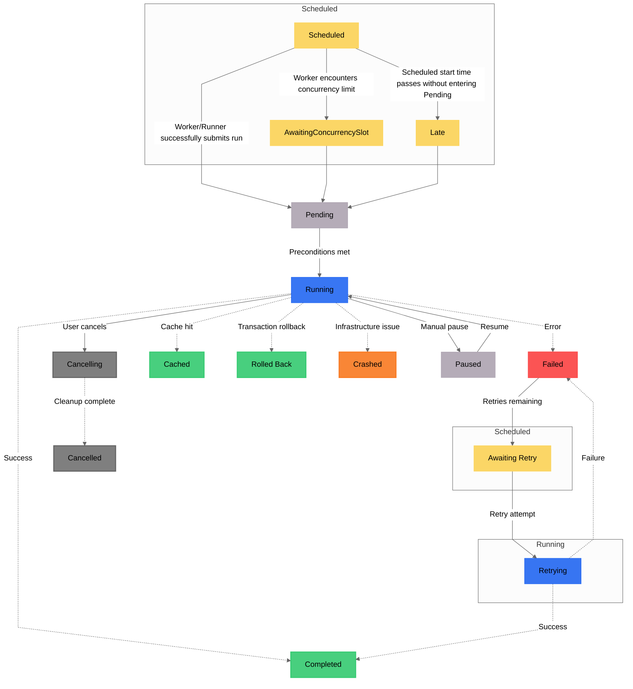

States are rich objects that contain information about the status of a particular [task](/v3/develop/write-tasks)
run or [flow](/v3/develop/write-flows/) run.

You can learn many things about a task or flow by examining its current state or the
history of its states. For example, you might observe that a given run:

- is `Scheduled` to run for the third time in an hour
- is `Late` because the associated worker process is not responding
- was `Scheduled` to run, but later `Cancelled` via button in the UI
- was `Cached` from a previous run instead of `Running` again
- has `Completed` after `Running` among its fellow task runs
- ended up `Failed` because Claude left pydantic 1.x syntax in your code
- ended up `Crashed` because you Ctrl-C'd the process

<Note>
**Only runs have states**:
Flows and tasks are templates that describe what a system does;
only when we **run** the system does it also take on a state.
</Note>

## State types

Prefect states have names and types.
A state's name is often, but not always, synonymous with its type. For example, a task run
that is running for the first time has a state with the name Running and the type `RUNNING`. However, if the task retries,
that same task run will have the name Retrying and the type `RUNNING`.

State _types_ drive orchestration logic, whereas state _names_ provide visual bookkeeping.

The full list of states and state types includes:

| Name | Type | Terminal? | Description
| --- | --- | --- | --- |
| `Scheduled` | `SCHEDULED` | No | The run will begin at a particular time in the future. |
| `Late` | `SCHEDULED` | No | The run's scheduled start time has passed, but it has not transitioned to PENDING (15 seconds by default). |
| <span class="no-wrap">`AwaitingRetry`</span> | `SCHEDULED` | No | The run did not complete successfully because of a code issue and had remaining retry attempts. |
| <span class="no-wrap">`AwaitingConcurrencySlot`</span> | `SCHEDULED` | No | The run is waiting to occupy a concurrency slot prior to submission. |
| `Resuming` | `SCHEDULED` | No | The run is scheduled to resume execution. |
| `Pending` | `PENDING` | No | The run has been submitted to execute, but is waiting on necessary preconditions to be satisfied. |
| `Running` | `RUNNING` | No | The run code is currently executing. |
| `Retrying` | `RUNNING` | No | The run code is currently executing after previously not completing successfully. |
| `Paused` | `PAUSED` | No | The run code has stopped executing until it receives manual approval to proceed. |
| `Suspended` | `PAUSED` | No | The run code has stopped executing and the process has exited. |
| `Cancelling` | `CANCELLING` | No | The infrastructure on which the code was running is being cleaned up. |
| `Cancelled` | `CANCELLED` | Yes | The run did not complete because a user determined that it should not. |
| `Completed` | `COMPLETED` | Yes | The run completed successfully. |
| `Cached` | `COMPLETED` | Yes | The run result was loaded from a previously cached value. |
| `RolledBack` | `COMPLETED` | Yes | The run completed successfully but the transaction rolled back and executed rollback hooks. |
| `Failed` | `FAILED` | Yes | The run did not complete because of a code issue and had no remaining retry attempts. |
| `TimedOut` | `FAILED` | Yes | The run did not complete because it exceeded its time out. |
| `Crashed` | `CRASHED` | Yes | The run did not complete because of an infrastructure issue. |

## State transitions

When a flow run changes states, you can often tell if it is behaving normally or not.
Here are some common state transitions and what they mean:

|    | From | To | Triggered By | Explanation |
| --- | --------------- | ------------ | ----------- | ----------- |
| ✅ | None | Scheduled | Manual run, automation, or schedule | A flow run has been created and scheduled for future execution. |
| ✅ | Scheduled | Pending | Worker | A worker is attempting to start the infrastructure for your flow run. |
| ⛔ | Scheduled | Late | Cloud or self-hosted server | Typically means that a worker did not pick up the run because 1) no workers are healthy, 2) workers are not polling the right work pool or work queue, or 3) workers are concurrency limited. |
| ✅ | Pending | Running | Worker | The infrastructure was provisioned and the flow is running |
| ⛔ | Pending | Crashed | Worker or runner | Something went wrong. Some possibilities are 1) the worker could have failed to create the infrastructure, 2) the code is not present in storage or the worker failed to authenticate, or 3) the code has missing or broken imports, or syntax errors. |
| ✅ | Running | Completed | Flow run | The flow completed successfully. |
| ⛔ | Running | Failed | Flow run | This usually means that your code raised an exception, check the flow run logs. |
| ⛔ | Running | Crashed | Worker or flow run | Probably not a raised exception in your code, but could be an infrastructure issue such as 1) an out of memory error, 2) an evicted pod, or 3) a timeout. |

## Final state determination

The final state of a flow or task run depends on a number of factors; generally speaking there are three categories of terminal states:
- `COMPLETED`: a run in any `COMPLETED` state did not encounter any errors or exceptions and returned successfully
- `FAILED`: a run in any `FAILED` state encountered an error during execution, such as a raised exception
- `CRASHED`: a run in any `CRASHED` state was interrupted by an OS signal such as a `KeyboardInterrupt` or `SIGTERM`

The flow of state transitions can be visualized here:

<Note>
States are represented by their name, with boxes behind states clarifying their underlying type. Dotted lines lead to terminal states.
</Note>



### Task return values

A task will be placed into a `Completed` state if it returns  _any_ Python object, with one exception:
if a task explicitly returns a Prefect `Failed` state, the task will be marked `Failed`.

```python
from prefect import task, flow
from prefect.states import Completed, Failed


@task
def toggle_task(fail: bool):
    if fail:
        return Failed(message="I was instructed to fail.")
    else:
        return Completed(message="I was instructed to succeed.")


@flow
def example():
    # this run will be set to a `Failed` state
    state_one = toggle_task(fail=True)

    # this run will be set to a `Completed` state
    state_two = toggle_task(fail=False)

    # similarly, the flow run will fail because we return a `Failed` state
    return state_one, state_two
```

You can also access state objects directly within a flow through the `return_state` flag:

```python
from prefect import flow, task


@task
def add_one(x):
    return x + 1


@flow
def my_flow():
    result = add_one(1)
    assert isinstance(result, int) and result == 2

    state = add_one(1, return_state=True)
    assert state.is_completed() is True
    assert state.result() == 2
```

<Tip>
Returning a `State` via `return_state=True` is useful when you want to conditionally respond to the terminal states of a task or flow. For example, `if state.is_failed(): ...`.
</Tip>


### Flow return values

import FinalFlowState from '/snippets/final-flow-state.mdx'

<FinalFlowState />

## State change hooks

State change hooks execute code in response to **_client side_** changes in flow or task run states, enabling you to define actions for
specific state transitions in a workflow.

State hooks have the following signature:

```python
from prefect import Task, Flow
from prefect.states import State
from prefect.client.schemas.objects import TaskRun, FlowRun

def my_task_state_hook(task: Task, run: TaskRun, state: State) -> None:
    ...

def my_flow_state_hook(flow: Flow, run: FlowRun, state: State) -> None:
    ...
```

State change hooks are versatile, allowing you to specify multiple state change hooks for the same state transition,
or to use the same state change hook for different transitions.


### Further reading

- See examples of [how to execute code in response to entering states](/v3/how-to-guides/workflows/state-change-hooks) in your flows and tasks.