```python
from prefect import task

@task(log_prints=True)
def explain_tasks():
    print("run any python code here!")
    print("but maybe just a little bit")

if __name__ == "__main__":
    explain_tasks()
```

## What is a task?

Tasks are defined as decorated Python functions. Above, `explain_tasks` is an instance of a task.

Tasks are cache-able and retryable units of work that are easy to execute concurrently, in parallel, and/or with [transactional semantics](/v3/advanced/transactions).

Like flows, tasks are free to call other tasks or flows, there is no required nesting pattern.

Generally, tasks behave like normal Python functions, but they have some additional capabilities:

- Metadata about task runs, such as run time and final state, is automatically tracked
- Each [state](/v3/concepts/states/) the task enters is recorded, enabling observability and state-based logic
- [Futures](/v3/how-to-guides/workflows/run-work-concurrently#handling-futures) from upstream tasks are automatically resolved by downstream tasks
- [Retries](/v3/how-to-guides/workflows/retries) can be performed on failure, with configurable delay and retry limits
- [Caching](/v3/how-to-guides/workflows/cache-workflow-steps) enables result reuse across workflow executions
- [Concurrency](/v3/how-to-guides/workflows/run-work-concurrently) via `.submit()` and `.map()` allow concurrent execution within and across workflows
- [Timeouts](/v3/how-to-guides/workflows/write-and-run#cancel-a-workflow-if-it-runs-for-too-long) can be enforced to prevent unintentional, long-running operations

Tasks are uniquely identified by a task key, which is a hash composed of the task name and the fully qualified name of the function.


## Running a task

A **task run** is a representation of a single invocation of a task.

### The life of a task run

Like flow runs, each task run has its own state lifecycle. Task states provide observability into execution progress and enable sophisticated runtime logic based on upstream outcomes.

Like flow runs, each task run can be observed in the Prefect UI or CLI.

A normal task run lifecycle looks like this:

```mermaid
flowchart TD
    A[Pending] -->|🚀 Starting execution| B[Running]
    A -->|📦 Cached result available| C[Completed]
    B -->|✅ Success| C[Completed]
    B -.->|⌠Error occurred| D[Retrying/AwaitingRetry]
    B -.->|💥 Infrastructure failure| E[Crashed]
    D -->|🔄 Retry attempt| B
    D -.->|😵 Retries exhausted| F[Failed]

    style A fill:#f9f,stroke:#333,stroke-width:2px,color:#000
    style B fill:#9ff,stroke:#333,stroke-width:2px,color:#000
    style C fill:#9f9,stroke:#333,stroke-width:2px,color:#000
    style D fill:#ff9,stroke:#333,stroke-width:2px,color:#000
    style E fill:#f66,stroke:#333,stroke-width:2px,color:#fff
    style F fill:#f99,stroke:#333,stroke-width:2px,color:#000

    classDef default fill-opacity:0.9
```



<Note>
**[Background tasks](#background-tasks) have an additional state**

When using `.delay()`, background tasks start in a `Scheduled` state before transitioning to `Pending`. This allows them to be queued and distributed to available workers.
</Note>

### Different ways to create a task run

There are three primary ways to invoke a task, each suited to different execution patterns:

#### Calling a task directly (`__call__`)

The simplest way to create a task run is to call a `@task` decorated function directly, just like a normal Python function. This blocks the calling thread until the task completes and returns the result.

```python
from prefect import task

@task
def add_integers(a: int, b: int) -> int:
    return a + b

if __name__ == "__main__":
    result = add_integers(1, 2)  # blocks until complete, returns 3
```

Use direct calls when you need the result immediately and don't require concurrent execution.

#### Submitting a task (`.submit()`)

Tasks may be submitted to a [task runner](/v3/concepts/task-runners) for concurrent execution. Calling `.submit()` returns a `PrefectFuture` immediately, allowing the calling code to continue while the task runs in the background.

```python
from prefect import flow, task

@task
def add_integers(a: int, b: int) -> int:
    return a + b

@flow
def my_flow():
    future = add_integers.submit(1, 2)  # returns immediately
    # do other work...
    result = future.result()  # blocks until complete, returns 3
```

The future should be resolved (via `.result()` or `.wait()`) from the same context that submitted it. Use `.submit()` when you want to run multiple tasks concurrently within a flow or need fine-grained control over when to wait for results.

For more details on concurrent execution patterns, see [how to run work concurrently](/v3/how-to-guides/workflows/run-work-concurrently).

#### Delaying a task (`.delay()`)

When the result of a task is not required by the caller, it may be delayed to run on separate infrastructure by an available [task worker](/v3/how-to-guides/workflows/run-background-tasks#task-workers). Like `.submit()`, calling `.delay()` returns a `PrefectFuture` immediately, but this future does not need to be resolved from the context that submitted it.

```python
from prefect import task

@task
def send_email(to: str, subject: str):
    # send email...
    pass

# In a web endpoint handler:
future = send_email.delay("user@example.com", "Welcome!")  # returns immediately
# The HTTP response can return without waiting for the email to send
```

Use `.delay()` for fire-and-forget scenarios like web applications where you need to dispatch work without blocking the response, or when you want to scale task execution independently from the main application.

For implementation details, see [how to run background tasks](/v3/how-to-guides/workflows/run-background-tasks).

#### Comparison summary

| Method | Blocks? | Returns | Resolve from same context? | Use case |
|--------|---------|---------|---------------------------|----------|
| `task()` | Yes | Result | N/A | Simple, sequential execution |
| `task.submit()` | No | `PrefectFuture` | Yes | Concurrent execution within a flow |
| `task.delay()` | No | `PrefectFuture` | No | Background execution on separate infrastructure |

## Task orchestration model
### Client-side orchestration

Prefect tasks are orchestrated client-side, which means that task runs are created and updated locally. This allows for efficient handling of large-scale workflows with many tasks and improves reliability when connectivity fails intermittently.

Task updates are logged in batch, leading to eventual consistency for task states in the UI and API queries.

### State dependencies

Tasks automatically resolve dependencies based on data flow between them. When a task receives the result or future of an upstream task as input, Prefect establishes an implicit state dependency such that a downstream task cannot begin until the upstream task has `Completed`.

Explicit state dependencies can be introduced with [the `wait_for` parameter.](/v3/how-to-guides/workflows/run-work-concurrently#creating-state-dependencies)

## Task composition within flows

Tasks are typically organized into [flows](/v3/concepts/flows#organize-flows-with-subflows-and-tasks) to create comprehensive workflows.
Each task offers isolated observability within the Prefect UI. Task-level metrics, logs, and state information help identify bottlenecks and troubleshoot issues at a granular level. Tasks can also be reused across multiple flows, promoting consistency and modularity across an organization's data ecosystem.

<Note>
**How big should a task be?**

Prefect encourages "small tasks." As a rule of thumb, each task should represent a logical step or significant "side effect" in your workflow.
This allows task-level observability and orchestration to narrate your workflow out-of-the-box.


</Note>

For detailed configuration options and implementation guidance, see [how to write and run workflows](/v3/how-to-guides/workflows/write-and-run).

## Background tasks

Background tasks are an alternate task execution model where tasks are submitted in a non-blocking manner by one process and executed by a pool of processes. This execution model is particularly valuable for web applications and workflows that need to dispatch heavy or long-running work without waiting for completion to dedicated, horizontally scaled infrastructure.

When a task is executed with `.delay()`, it pushes the resulting task run onto a server-side topic, which is distributed to an available [task worker](/v3/how-to-guides/workflows/run-background-tasks#task-workers) for execution.

<Note>
Prefect background tasks can be used in place of tools like [Celery](https://docs.celeryq.dev/en/stable/getting-started/introduction.html) and [RabbitMQ](https://www.rabbitmq.com/) for task queue functionality.
</Note>

Background tasks are useful for scenarios such as:
- Web applications that need to trigger long-running processes without blocking HTTP responses
- Workflows that dispatch work to specialized infrastructure or resource pools
- Systems that need to scale task execution independently from the main application

For implementation details, see [how to run background tasks](/v3/how-to-guides/workflows/run-background-tasks).
