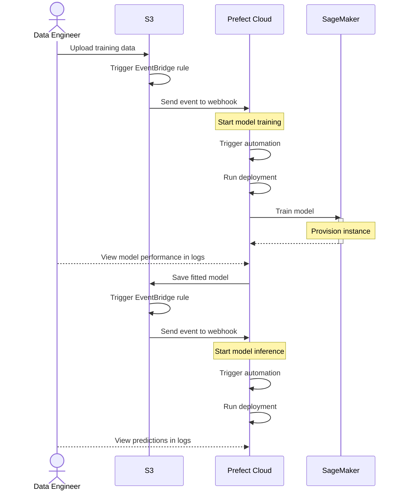

In the [Extract data from websites](/v3/tutorials/scraping) tutorial, you learned how to handle data dependencies and ingest large amounts of data.
Now, you'll learn how to train a machine learning model using your data.
Here's the pipeline that you'll construct:



## Prerequisites

* A free [Prefect Cloud account](https://app.prefect.cloud) and an API key
* The [Prefect SDK](/v3/get-started/install)
* An AWS account, including:
  * The ability to create an `ml.g4dn.xlarge` instance with SageMaker.
  * An access key with full access to S3 and SageMaker.
* Optional: [Terraform](https://developer.hashicorp.com/terraform/install)

## Log in to Prefect Cloud

If needed, log in to your Prefect Cloud account.

```bash
prefect cloud login
```

## Create a work pool

Create a new Process work pool named `my-work-pool` in Prefect Cloud.

```bash
prefect work-pool create my-work-pool --type process
```

Now, in a separate terminal, start a worker in that work pool.

```bash
prefect worker start --pool my-work-pool
```

Leave this worker running for the rest of the tutorial.

## Create deployments

Clone the repository with the flow code you'll be deploying to Prefect Cloud.

```bash
git clone https://github.com/PrefectHQ/demos.git
cd demos/
```

Now deploy the `model-training` flow to Prefect Cloud.
This flow trains an [XGBoost model](https://github.com/dmlc/xgboost) on the [Iris dataset](https://archive.ics.uci.edu/dataset/53/iris) using SageMaker.

```bash
python model_training.py
```

<Expandable title="model training flow">
This is the flow that you just deployed to Prefect Cloud.

{/* pmd-metadata: notest */}
```python
from prefect import flow, task
from prefect_aws import AwsCredentials
from prefect.cache_policies import NONE
from prefect.blocks.system import Secret
import sagemaker
from sagemaker.xgboost.estimator import XGBoost
import boto3
from sagemaker.session import Session
from typing import TypedDict, Union

class TrainingInputs(TypedDict):
    train: str
    validation: str

@task(log_prints=True)
def get_sagemaker_session(aws_credentials: AwsCredentials) -> Session:
    """Create a SageMaker session using AWS credentials."""
    boto_session = boto3.Session(
        aws_access_key_id=aws_credentials.aws_access_key_id,
        aws_secret_access_key=aws_credentials.aws_secret_access_key.get_secret_value(),
        region_name=aws_credentials.region_name
    )
    return sagemaker.Session(boto_session=boto_session)

@task
def get_training_inputs(data_bucket: str) -> TrainingInputs:
    """Get the S3 paths for training and test data."""
    return {
        "train": f"s3://{data_bucket}/train.csv",
        "validation": f"s3://{data_bucket}/test.csv"
    }

@task
def create_training_script(model_bucket: str) -> None:
    """Create the training script dynamically from template"""
    # Read the template
    with open("templates/sagemaker_script_template.py", "r") as f:
        training_script = f.read()

    # Format the script with the model bucket
    training_script = training_script.format(model_bucket=model_bucket)

    # Write the formatted script
    with open("train.py", "w") as f:
        f.write(training_script)

@task(cache_policy=NONE)
def create_xgboost_estimator(sagemaker_session: Session, role_arn: str) -> XGBoost:
    """Create and configure the XGBoost estimator."""
    hyperparameters = {
        "max_depth": 5,
        "eta": 0.2,
        "gamma": 4,
        "min_child_weight": 6,
        "subsample": 0.8,
        "objective": "multi:softmax",
        "num_class": 3,
        "num_round": 100,
        "tree_method": "gpu_hist"
    }

    return XGBoost(
        entry_point="train.py",
        hyperparameters=hyperparameters,
        role=role_arn,
        instance_count=1,
        instance_type="ml.g4dn.xlarge",
        framework_version="1.7-1",
        py_version="py3",
        sagemaker_session=sagemaker_session
    )

@flow(log_prints=True)
def train_model(data_bucket: Union[str, None] = None, model_bucket: Union[str, None] = None) -> XGBoost:
    """Main flow to train XGBoost model on Iris dataset using SageMaker."""
    data_bucket = data_bucket or "prefect-ml-data"
    model_bucket = model_bucket or "prefect-model"

    # Load AWS credentials from Prefect Block
    aws_credentials = AwsCredentials.load("aws-credentials")
    
    # Get SageMaker role ARN from Prefect Secret Block
    role_arn = Secret.load("sagemaker-role-arn").get()
    
    # Create SageMaker session
    sagemaker_session = get_sagemaker_session(aws_credentials)

    # Get training inputs
    training_inputs = get_training_inputs(data_bucket)
    create_training_script(model_bucket)
    
    # Create and train estimator
    estimator = create_xgboost_estimator(sagemaker_session, role_arn)

    estimator.fit(training_inputs, wait=True)
    
    return estimator
```
</Expandable>

<Expandable title="SageMaker script template">
And this is the template for the script that SageMaker uses to train the model.

{/* pmd-metadata: notest */}
```python
import argparse
import boto3
import os
import json
import pandas as pd
import numpy as np
import xgboost as xgb
from sklearn.preprocessing import LabelEncoder

if __name__ == "__main__":
    parser = argparse.ArgumentParser()

    # Hyperparameters are described here.
    parser.add_argument(
        "--max_depth",
        type=int,
    )
    parser.add_argument("--eta", type=float)
    parser.add_argument("--gamma", type=float)
    parser.add_argument("--min_child_weight", type=float)
    parser.add_argument("--subsample", type=float)
    parser.add_argument("--verbosity", type=int)
    parser.add_argument("--objective", type=str)
    parser.add_argument("--num_round", type=int)
    parser.add_argument("--tree_method", type=str, default="auto")
    parser.add_argument("--predictor", type=str, default="auto")
    parser.add_argument("--num_class", type=int)

    # Sagemaker specific arguments. Defaults are set in the environment variables.
    parser.add_argument("--output-data-dir", type=str, default=os.environ["SM_OUTPUT_DATA_DIR"])
    parser.add_argument("--model-dir", type=str, default=os.environ["SM_MODEL_DIR"])
    parser.add_argument("--train", type=str, default=os.environ["SM_CHANNEL_TRAIN"])
    parser.add_argument("--validation", type=str, default=os.environ["SM_CHANNEL_VALIDATION"])
    parser.add_argument("--num-round", type=int, default=100)

    args, _ = parser.parse_known_args()

    # Load training and validation data with appropriate column names
    column_names = ['sepal_length', 'sepal_width', 'petal_length', 'petal_width', 'target']
    train_data = pd.read_csv(os.path.join(args.train, "train.csv"), 
                            names=column_names, 
                            header=None)
    validation_data = pd.read_csv(os.path.join(args.validation, "test.csv"), 
                                names=column_names, 
                                header=None)

    # For XGBoost, we need to convert the text labels to numeric values
    # Create a label encoder
    label_encoder = LabelEncoder()
    y_train = label_encoder.fit_transform(train_data['target'])
    y_validation = label_encoder.transform(validation_data['target'])

    # Get features (all columns except target)
    X_train = train_data.drop('target', axis=1)
    X_validation = validation_data.drop('target', axis=1)

    # Create DMatrix for XGBoost
    dtrain = xgb.DMatrix(X_train, label=y_train)
    dvalidation = xgb.DMatrix(X_validation, label=y_validation)

    hyperparameters = {{
        "max_depth": args.max_depth,
        "eta": args.eta,
        "gamma": args.gamma,
        "min_child_weight": args.min_child_weight,
        "subsample": args.subsample,
        "verbosity": args.verbosity,
        "objective": args.objective,
        "tree_method": args.tree_method,
        "predictor": args.predictor,
        "num_class": args.num_class
    }}

    # Train the model
    watchlist = [(dtrain, "train"), (dvalidation, "validation")]
    model = xgb.train(
        hyperparameters,
        dtrain,
        num_boost_round=args.num_round,
        evals=watchlist,
        early_stopping_rounds=10
    )

    # Save the model
    filename = "xgboost-model"
    model_location = os.path.join(args.model_dir, filename)
    model.save_model(model_location)

    # Save the model parameters
    hyperparameters_location = os.path.join(args.model_dir, "hyperparameters.json")
    with open(hyperparameters_location, "w") as f:
        json.dump(hyperparameters, f)

    # Upload the model to an S3 bucket for inference using boto3
    s3_client = boto3.client('s3')
    bucket_name = "{model_bucket}"
    s3_client.upload_file(
        model_location,
        bucket_name,
        filename
    )
```
</Expandable>

Next, deploy the `model-inference` flow to Prefect Cloud.
This flow calculates performance metrics using the fitted model from S3.

```bash
python model_inference.py
```

<Expandable title="model inference flow">
This is the flow that you just deployed to Prefect Cloud.

{/* pmd-metadata: notest */}
```python
from prefect import flow, task
from prefect_aws import S3Bucket
import xgboost as xgb
import numpy as np
import tempfile
import os
from typing import Union

# Load the saved model:
@task
def load_model(filename: str) -> xgb.Booster:
    """Load a saved XGBoost model from S3"""

    # Get the S3 bucket block
    s3_bucket = S3Bucket.load("s3-bucket-block")

    # Create a temporary file to store the model
    with tempfile.NamedTemporaryFile(delete=False) as temp_file:
        temp_path = temp_file.name
        
        # Download the model file
        s3_bucket.download_object_to_path(
            from_path=filename,
            to_path=temp_path
        )
        
        # Load the XGBoost model
        model = xgb.Booster()
        model.load_model(temp_path)
    
    # Clean up the temporary file
    os.unlink(temp_path)

    return model

# Run inference with loaded model:
@task
def predict(model: xgb.Booster, X: Union[list[list[float]], np.ndarray]) -> np.ndarray:
    """Make predictions using the loaded model
    Args:
        model: Loaded XGBoost model
        X: Features array/matrix in the same format used during training
    """
    # Convert input to DMatrix (optional but recommended)
    dtest = xgb.DMatrix(np.array(X))
    # Get predictions
    predictions = model.predict(dtest)
    return predictions

@flow(log_prints=True)
def run_inference(samples: Union[list[list[float]], None] = None) -> None:
    samples = samples or [[5.0,3.4,1.5,0.2], [6.4,3.2,4.5,1.5], [7.2,3.6,6.1,2.5]]
    model = load_model('xgboost-model')
    predictions = predict(model, samples)
    for sample, prediction in zip(samples, predictions):
        print(f"Prediction for sample {sample}: {prediction}")
```
</Expandable>

## Provision cloud resources

import { home } from "/snippets/resource-management/vars.mdx"

This tutorial uses AWS S3 and EventBridge to store data and emit events, and Prefect webhooks and automations to trigger your flows.
We'll use <a href={home.tf}>Terraform</a> so you don't have to provision these resources manually.

Set the following environment variables:

```bash
# Prefect auth
export PREFECT_API_KEY=<Your Prefect API key>
export PREFECT_CLOUD_ACCOUNT_ID=<Your account ID>

# AWS auth
export AWS_ACCESS_KEY_ID=<Your AWS access key ID>
export AWS_SECRET_ACCESS_KEY=<Your AWS secret access key>
export AWS_REGION=us-east-1

# Terraform variables
export TF_VAR_prefect_workspace_id=<Your workspace ID>
export TF_VAR_data_bucket_name=prefect-ml-data # You may need to change this if the bucket name is already taken
export TF_VAR_model_bucket_name=prefect-model  # ...
export TF_VAR_model_training_deployment_id=<Your model-training deployment ID>
export TF_VAR_model_inference_deployment_id=<Your model-inference deployment ID>
```

Switch to the `infra/` directory.

```bash
cd infra/
```

Provision these resources with Terraform.

```bash
terraform init
terraform apply
```

<Note>
When you're ready to permanently delete these resources, empty the `prefect-ml-data` and `prefect-model` buckets and then run `terraform destroy` in your terminal.
</Note>

### Alternative: manual provisioning

If you don't want to use Terraform, you can create the resources manually.

<Expandable title="manual instructions">
#### Create a webhook for model training

In Prefect Cloud, create a webhook named `model-training`:

* Create a new service account named `s3` to enforce webhook authentication (save the API key somewhere safe)
* Use the following static template:  
```json
{
    "event": "webhook.called",
    "resource": {
        "prefect.resource.id": "webhook.resource.id"
    }
}
```

Note the URL for this webhook, as you'll need it later.

#### Create a webhook for model inference

In Prefect Cloud, create a webhook named `model-inference`:

* You can use the same service account that you created for the model training webhook.
* Use the following static template:  
```json
{
    "event": "webhook.called",
    "resource": {
        "prefect.resource.id": "webhook.resource.id"
    }
}
```

Note the URL for this webhook, as you'll need it later.

#### Create an automation for model training

In Prefect Cloud, create an automation with a **custom** trigger type:

* Trigger on any event matching `webhook.called` from the `model-training` webhook.
Since the webhook is a related resource, you must go to the **JSON** tab and move the `prefect.resource.id` section from the `match` to the `match_related` array.
* Trigger whenever you see that event 1 time within 1 minute (this ensures your model will train only once when a batch of files are uploaded).
* Run the `train-model > model-training` deployment whenever this automation is triggered.
  * You only need to change the `data_bucket` and `model_bucket` parameters if you use different bucket names than those used in this tutorial.
* Name this automation `train-model`.

#### Create an automation for model inference

In Prefect Cloud, create an automation with a **custom** trigger type:

* Trigger on any event matching `webhook.called` from the `model-inference` webhook.
As before, you must move the `prefect.resource.id` section from the `match` to the `match_related` array, using the **JSON** tab.
* Trigger whenever you see that event 1 time within 1 minute (this ensures your model will train only once when a batch of files are uploaded).
* Run the `run-inference > model-inference` deployment whenever this automation is triggered.
* Name this automation `run-inference`.

#### Create S3 buckets

Your data and model will be stored in S3.
Create the following buckets in AWS:

* Create a `prefect-ml-data` bucket to store training and test data.
* Create a `prefect-model` bucket to store the trained model.
* Turn on EventBridge notifications for all events in these buckets.

<Note>
You may need to choose different S3 bucket names if they're already in use.
</Note>

#### Create an EventBridge rule for training

In AWS, create an EventBridge rule named `training-data-changed` to trigger model training whenever a new object is uploaded to the `prefect-ml-data` bucket.

* Event pattern:  
```json
{
  "source": ["aws.s3"],
  "detail-type": ["Object Created"],
  "detail": {
    "bucket": {
      "name": ["prefect-ml-data"]
    }
  }
}
```
* Target:  
An EventBridge API destination named `model-training-webhook`, set to the endpoint for the `model-training` webhook that you created in Prefect Cloud.
  * Use an HTTP POST method.
  * To authenticate with the webhook, create a new Connection named `prefect-webhooks`, configure its authorization to use **API Key**, and set the **API key name** to `Authorization` and the **Value** to `Bearer <service-account-api-key>`.  
    <Note>
    The service account API key is the API key you created for the `s3` service account in Prefect Cloud.
    </Note>

#### Create an EventBridge rule for inference

In AWS, create an EventBridge rule named `model-changed` to trigger model inference whenever a new object is uploaded to the `prefect-model` bucket.

* Event pattern:  
```json
{
  "source": ["aws.s3"],
  "detail-type": ["Object Created"],
  "detail": {
    "bucket": {
      "name": ["prefect-model"]
    }
  }
}
```
* Target:  
Create an EventBridge API destination named `model-inference-webhook`, set to the endpoint of the `model-inference` webhook that you created earlier.
You can reuse the connection that you created for the `training-data-changed` rule.

#### Create an IAM role for S3 and SageMaker

Your Prefect flows need access to the AWS resources that you created.
Create an IAM role named `prefect-tutorial` with the `Amazon SageMaker Full Access` and `Amazon S3 Full Access` policies.
Note the role ARN, as you'll need this later.
</Expandable>

## Grant access to AWS resources

Your Prefect flows need access to the AWS resources that you just provisioned.
Create the following blocks in Prefect Cloud:

* An **AWS Credentials** block named `aws-credentials`.
Set the `AWS Access Key ID` and `AWS Access Key Secret` fields to the values from the access key you created earlier.
* An **S3 Bucket** block named `s3-bucket-block`, set to the name of your model bucket (`prefect-model` by default).
This block can use the `aws-credentials` block you created earlier.
* A **Secret** block named `sagemaker-role-arn`.
This block stores the IAM role ARN for SageMaker that you created earlier.

Now, when you run your flows in Prefect Cloud, they can use these blocks to authenticate with AWS.

## Test the ML pipeline

Use the AWS Console to upload the following files to the `prefect-ml-data` bucket:

* [train.csv](https://raw.githubusercontent.com/PrefectHQ/demos/refs/heads/main/datasets/train.csv)
* [test.csv](https://raw.githubusercontent.com/PrefectHQ/demos/refs/heads/main/datasets/test.csv)

After the files are uploaded, the `train-model` flow will automatically run.
Open the flow run details in Prefect Cloud to see the model training logs.
Training will take a few minutes.

```
...
[43]#011train-mlogloss:0.18166#011validation-mlogloss:0.24436
[44]#011train-mlogloss:0.18166#011validation-mlogloss:0.24436
[45]#011train-mlogloss:0.18168#011validation-mlogloss:0.24422
[46]#011train-mlogloss:0.18166#011validation-mlogloss:0.24443
[47]#011train-mlogloss:0.18166#011validation-mlogloss:0.24443
[48]#011train-mlogloss:0.18165#011validation-mlogloss:0.24458

2024-12-20 20:16:56 Completed - Training job completed

Training seconds: 101
Billable seconds: 101
Memory usage post-training: total - 17179869184, percent - 78.2%
Finished in state Completed()
```

After training is complete, the model will be uploaded to the `prefect-model` bucket, which will trigger the `run-inference` flow.
Inference will take a few seconds to complete, after which you can see the predictions in the flow logs:

```
...
Prediction for sample [5.0, 3.4, 1.5, 0.2]: 0.0
Prediction for sample [6.4, 3.2, 4.5, 1.5]: 1.0
Prediction for sample [7.2, 3.6, 6.1, 2.5]: 2.0
Finished in state Completed()
```

## Next steps

In this tutorial, you learned how to publish data to S3 and train a machine learning model whenever that data changes.
You're well on your way to becoming a Prefect expert!

Now that you've finished this tutorial series, continue your learning journey by going deep on the following topics:

- Write [flows](/v3/develop/write-flows) and [tasks](/v3/develop/write-tasks)
- Manage [Prefect Cloud and server instances](/v3/manage)
- Run workflows on [work pools](/v3/deploy/infrastructure-concepts/work-pools) using Kubernetes, Docker, and serverless infrastructure.

<Tip>
Need help? [Book a meeting](https://calendly.com/prefect-experts/prefect-product-advocates?utm_campaign=prefect_docs_cloud&utm_content=prefect_docs&utm_medium=docs&utm_source=docs) with a Prefect Product Advocate to get your questions answered.
</Tip>
