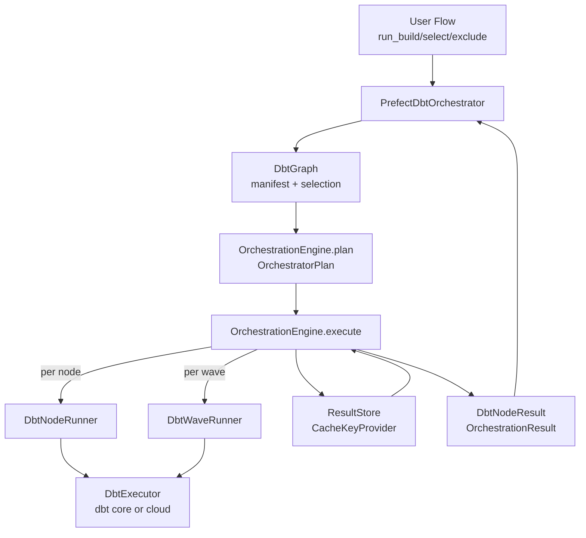

# Per-Node dbt Orchestration Mode

## Overview

Introduce a per-node dbt orchestration mode that allows Prefect to orchestrate each dbt node (model, seed, snapshot, test) individually. This enables per-node retries, caching, and observability while still supporting a lower-overhead per-wave execution mode.

## Why This Change

Prefect currently delegates most execution control to dbt. This limits retry granularity, makes it harder to apply Prefect-native caching, and reduces visibility into node-level performance and failures. A per-node orchestration mode gives Prefect the opportunity to express dbt execution in Prefect-native terms without altering dbt's graph semantics.

## Desired Outcomes

- Improve observability with per-node task runs and richer metadata.
- Reduce mean time to recovery by enabling per-node retries.
- Enable deterministic caching and cache invalidation per node.
- Provide consistent concurrency controls across dbt and non-dbt workloads.
- Preserve the existing dbt runner for users who prefer dbt-managed orchestration.

## Goals

- Per-node orchestration with Prefect-native retries and caching.
- Optional per-wave execution mode for reduced process overhead.
- Support dbt Core and dbt Cloud execution backends.
- Preserve existing `PrefectDbtRunner` behavior.

## Non-Goals

- Rewriting existing `PrefectDbtRunner`.
- Changing dbt compilation semantics or graph resolution.

## Usage Examples

### Example 1: Basic Per-Node Orchestration

```python
from pathlib import Path
from prefect import flow
from prefect_dbt import PrefectDbtOrchestrator, PrefectDbtSettings

@flow
def run_dbt_build():
    settings = PrefectDbtSettings(
        project_dir=Path("./my_dbt_project"),
        profiles_dir=Path("~/.dbt"),
    )

    orchestrator = PrefectDbtOrchestrator(settings=settings)
    results = orchestrator.run_build()

    success = sum(1 for r in results.values() if r["status"] == "success")
    failed = sum(1 for r in results.values() if r["status"] == "error")
    print(f"Completed: {success} succeeded, {failed} failed")

    return results
```

### Example 2: Production Setup with Caching and Concurrency

```python
from pathlib import Path
from prefect import flow
from prefect_dbt import (
    PrefectDbtOrchestrator,
    PrefectDbtSettings,
    TestStrategy,
)

@flow
def run_production_dbt():
    settings = PrefectDbtSettings(
        project_dir=Path("./analytics"),
        profiles_dir=Path("./profiles"),
    )

    orchestrator = PrefectDbtOrchestrator(
        settings=settings,
        concurrency_limit_name="dbt-warehouse",
        threads=2,
        enable_caching=True,
        result_storage="s3-bucket/dbt-results",
        cache_key_storage="s3-bucket/dbt-cache-keys",
        retries=3,
        retry_delay_seconds=60,
        test_strategy=TestStrategy.IMMEDIATE,
    )

    return orchestrator.run_build()
```

### Example 3: CI Incremental Builds (State-Based Execution)

```python
from pathlib import Path
from prefect import flow
from prefect_dbt import PrefectDbtOrchestrator, PrefectDbtSettings, ExecutionMode

@flow
def run_ci_incremental():
    settings = PrefectDbtSettings(
        project_dir=Path("./analytics"),
        profiles_dir=Path("./profiles"),
    )

    orchestrator = PrefectDbtOrchestrator(
        settings=settings,
        state_path=Path("./prod_artifacts"),
        defer=True,
        execution_mode=ExecutionMode.PER_WAVE,
    )

    return orchestrator.run_build(select="state:modified+")
```

### Example 4: Freshness-Aware Caching (Event-Driven Pipelines)

```python
from pathlib import Path
from prefect import flow
from prefect_dbt import PrefectDbtOrchestrator, PrefectDbtSettings
from prefect_dbt.core.cache import create_freshness_aware_cache_policy

@flow
def run_on_fresh_data():
    """Only run models whose sources have new data.

    This is ideal for event-driven pipelines where you want to:
    - Skip models when source tables haven't changed
    - Automatically re-run when new data arrives
    - Reduce unnecessary compute costs

    Requires:
    - Sources configured with `freshness` and `loaded_at_field` in dbt
    - Previous run artifacts for comparison (state_path)
    """
    settings = PrefectDbtSettings(
        project_dir=Path("./analytics"),
        profiles_dir=Path("./profiles"),
    )

    orchestrator = PrefectDbtOrchestrator(
        settings=settings,
        # Point to previous run artifacts for freshness comparison
        state_path=Path("./prod_artifacts"),
        # Use freshness-aware cache policy (includes max_loaded_at in cache key)
        cache_policy_factory=create_freshness_aware_cache_policy,
    )

    # Only run models whose upstream sources have new data
    results = orchestrator.run_build(only_fresh_sources=True)
    return results


@flow
def run_with_freshness_caching():
    """Alternative: Use freshness in cache key without selector filtering.

    Models still run on schedule, but cache is invalidated when source
    data changes (even if SQL is unchanged).
    """
    settings = PrefectDbtSettings(project_dir=Path("./analytics"))

    orchestrator = PrefectDbtOrchestrator(
        settings=settings,
        # Freshness-aware caching: cache key includes source max_loaded_at
        cache_policy_factory=create_freshness_aware_cache_policy,
        enable_caching=True,
    )

    # All models run, but cache hits only when source data unchanged
    results = orchestrator.run_build()
    return results
```

### Example 5: dbt Cloud Executor (Ephemeral Jobs)

```python
from prefect import flow
from prefect_dbt import PrefectDbtOrchestrator, TestStrategy
from prefect_dbt.cloud.credentials import DbtCloudCredentials
from prefect_dbt.core.executors import DbtCloudExecutor

@flow
def run_dbt_cloud():
    """Per-node orchestration using dbt Cloud ephemeral jobs."""
    # Load credentials from Prefect block
    # Create with: prefect block register -m prefect_dbt.cloud
    credentials = DbtCloudCredentials.load("my-dbt-cloud")

    # Explicitly configure dbt Cloud executor
    cloud_executor = DbtCloudExecutor(
        credentials=credentials,
        project_id=12345,
        environment_id=67890,
        job_name_prefix="prefect-ci",
        # Optional: defer to a production job for state comparison
        defer_to_job_id=111,
    )

    orchestrator = PrefectDbtOrchestrator(
        executor=cloud_executor,
        # Standard orchestrator options still work
        concurrency_limit_name="dbt-cloud-slots",
        test_strategy=TestStrategy.IMMEDIATE,
    )

    results = orchestrator.run_build()
    return results
```

### Example 6: Different Test Strategies

```python
from prefect import flow
from prefect_dbt import PrefectDbtOrchestrator, PrefectDbtSettings, TestStrategy

@flow
def run_with_deferred_tests():
    """Run all models first, then all tests in a separate phase."""
    settings = PrefectDbtSettings(project_dir=Path("./analytics"))

    orchestrator = PrefectDbtOrchestrator(
        settings=settings,
        test_strategy=TestStrategy.DEFERRED,  # Tests run after all models
    )

    results = orchestrator.run_build()
    return results

@flow
def run_models_only():
    """Run models without any tests (useful for dev iterations)."""
    settings = PrefectDbtSettings(project_dir=Path("./analytics"))

    orchestrator = PrefectDbtOrchestrator(
        settings=settings,
        test_strategy=TestStrategy.SKIP,  # No tests
    )

    results = orchestrator.run_build()
    return results
```

### Example 7: Selective Execution with Filters

```python
from prefect import flow
from prefect_dbt import PrefectDbtOrchestrator, PrefectDbtSettings

@flow
def run_selective():
    settings = PrefectDbtSettings(project_dir=Path("./analytics"))
    orchestrator = PrefectDbtOrchestrator(settings=settings)

    # Run only mart models
    results = orchestrator.run_build(select="marts")

    # Run staging models and everything downstream
    results = orchestrator.run_build(select="staging+")

    # Run everything upstream of a specific model (inclusive)
    results = orchestrator.run_build(select="+company_summary")

    # Run models matching a pattern
    results = orchestrator.run_build(select="stg_*")

    # Run models with a specific tag
    results = orchestrator.run_build(select="tag:daily")

    # Exclude specific models
    results = orchestrator.run_build(exclude="stg_legacy_*")

    # Full refresh incremental models
    results = orchestrator.run_build(full_refresh=True)

    return results
```

### Example 8: Per-Wave Execution Mode (Lower Overhead)

```python
from prefect import flow
from prefect_dbt import PrefectDbtOrchestrator, PrefectDbtSettings, ExecutionMode

@flow
def run_fast():
    """Lower overhead mode - one dbt invocation per wave instead of per node.

    Trade-offs:
    - Faster execution (fewer dbt process startups)
    - No per-node retries (entire wave retries on failure)
    - No per-node caching (wave-level only)
    - Useful for CI or when nodes rarely fail
    """
    settings = PrefectDbtSettings(project_dir=Path("./analytics"))

    orchestrator = PrefectDbtOrchestrator(
        settings=settings,
        execution_mode=ExecutionMode.PER_WAVE,
    )

    results = orchestrator.run_build()
    return results
```

### Example 9: Custom Cache Policy

```python
from pathlib import Path
from typing import Any, Optional
from prefect import flow
from prefect.cache_policies import CachePolicy
from prefect.context import TaskRunContext
from prefect_dbt import PrefectDbtOrchestrator, PrefectDbtSettings
from prefect_dbt.core.manifest import DbtNode, ManifestParser

class CustomDbtCachePolicy(CachePolicy):
    """Custom cache policy that includes environment in cache key."""

    def __init__(self, node: DbtNode, environment: str):
        self.node = node
        self.environment = environment

    def compute_key(
        self,
        task_ctx: TaskRunContext,
        inputs: dict[str, Any],
        flow_parameters: dict[str, Any],
        **kwargs: Any,
    ) -> Optional[str]:
        # Include environment in cache key so dev/prod don't share cache
        return f"{self.node.unique_id}-{self.environment}-v1"

def custom_cache_factory(
    project_dir: Path,
    parser: ManifestParser,
    node: DbtNode,
    upstream_keys: dict[str, str],
) -> CachePolicy:
    """Factory function to create custom cache policies."""
    import os
    environment = os.getenv("DBT_ENVIRONMENT", "dev")
    return CustomDbtCachePolicy(node=node, environment=environment)

@flow
def run_with_custom_cache():
    settings = PrefectDbtSettings(project_dir=Path("./analytics"))

    orchestrator = PrefectDbtOrchestrator(
        settings=settings,
        cache_policy_factory=custom_cache_factory,
    )

    results = orchestrator.run_build()
    return results
```

### Example 10: Handling Results and Failures

```python
from prefect import flow, get_run_logger
from prefect_dbt import PrefectDbtOrchestrator, PrefectDbtSettings

@flow
def run_and_report():
    logger = get_run_logger()
    settings = PrefectDbtSettings(project_dir=Path("./analytics"))
    orchestrator = PrefectDbtOrchestrator(settings=settings)

    results = orchestrator.run_build()

    # Categorize results
    succeeded = [k for k, v in results.items() if v["status"] == "success"]
    failed = [k for k, v in results.items() if v["status"] == "error"]
    skipped = [k for k, v in results.items() if v["status"] == "skipped"]

    logger.info(f"Succeeded ({len(succeeded)}): {succeeded}")
    logger.info(f"Skipped ({len(skipped)}): {skipped}")

    if failed:
        logger.error(f"Failed ({len(failed)}): {failed}")
        for node_id in failed:
            error = results[node_id].get("error", "Unknown error")
            logger.error(f"  {node_id}: {error}")

        # Optionally raise to mark flow as failed
        raise RuntimeError(f"{len(failed)} nodes failed")

    return results
```

### Example 11: Parameterized Flow for Deployment

```python
from pathlib import Path
from prefect import flow
from prefect_dbt import (
    PrefectDbtOrchestrator,
    PrefectDbtSettings,
    TestStrategy,
    ExecutionMode,
)

@flow(name="dbt-orchestrated-build")
def run_dbt(
    select: str | None = None,
    exclude: str | None = None,
    full_refresh: bool = False,
    test_strategy: str = "immediate",
    execution_mode: str = "per_node",
    concurrency_limit: str | None = "dbt-warehouse",
    state_path: str | None = None,
    defer: bool = False,
):
    """Parameterized dbt build flow for deployment.

    Deploy with:
        prefect deploy run_dbt.py:run_dbt -n dbt-build

    Trigger with:
        prefect deployment run dbt-orchestrated-build/dbt-build \
            --param select="marts" \
            --param full_refresh=true
    """
    settings = PrefectDbtSettings(
        project_dir=Path("./analytics"),
        profiles_dir=Path("./profiles"),
    )

    orchestrator = PrefectDbtOrchestrator(
        settings=settings,
        concurrency_limit_name=concurrency_limit,
        test_strategy=test_strategy,
        execution_mode=execution_mode,
        state_path=Path(state_path) if state_path else None,
        defer=defer,
    )

    results = orchestrator.run_build(
        select=select,
        exclude=exclude,
        full_refresh=full_refresh,
    )

    # Return summary for visibility in UI
    return {
        "total": len(results),
        "succeeded": sum(1 for r in results.values() if r["status"] == "success"),
        "failed": sum(1 for r in results.values() if r["status"] == "error"),
        "skipped": sum(1 for r in results.values() if r["status"] == "skipped"),
    }
```

## Proposed Interfaces

```python
from __future__ import annotations

from dataclasses import dataclass
from enum import Enum
from pathlib import Path
from typing import Callable, Iterable, Mapping, Protocol, TypedDict

from prefect.cache_policies import CachePolicy


# Type alias for cache policy factory functions
CachePolicyFactory = Callable[
    [Path, "ManifestParser", "DbtNode", dict[str, str]],  # (project_dir, parser, node, upstream_keys)
    CachePolicy
]


class ExecutionMode(str, Enum):
    """Selects how execution is grouped.

    - `PER_NODE`: execute each dbt node independently.
    - `PER_WAVE`: execute dependency waves in batches.
    """
    PER_NODE = "per_node"
    PER_WAVE = "per_wave"


class TestStrategy(str, Enum):
    """Controls when (or if) tests run relative to models.

    - `IMMEDIATE`: run tests alongside models in their wave.
    - `DEFERRED`: run tests after all non-test nodes.
    - `SKIP`: do not execute tests.
    """
    IMMEDIATE = "immediate"
    DEFERRED = "deferred"
    SKIP = "skip"


@dataclass
class PrefectDbtSettings:
    """Captures dbt project paths and runtime directories.

    Attributes:
        project_dir: Root of the dbt project.
        profiles_dir: Directory containing dbt profiles.yml.
        profiles_dir_required: Enforces profile directory validation.
        target_dir: Optional override for dbt target directory.
        log_dir: Optional override for dbt log directory.
    """
    project_dir: Path
    profiles_dir: Path | None = None
    profiles_dir_required: bool = True
    target_dir: Path | None = None
    log_dir: Path | None = None


class DbtNodeResult(TypedDict):
    """Normalized node-level execution result metadata.

    Keys:
        unique_id: dbt unique identifier for the node.
        status: Node execution status (e.g. success, error, skipped).
        execution_time: Runtime duration in seconds, if available.
        message: Optional error or status message.
        thread_id: Optional thread identifier used by dbt.
    """
    unique_id: str
    status: str
    execution_time: float | None
    message: str | None
    thread_id: str | None


class DbtResults(TypedDict):
    """Executor-level result bundle keyed by node id.

    Keys:
        results: Mapping from node id to node result metadata.
    """
    results: Mapping[str, DbtNodeResult]


class DbtExecutor(Protocol):
    """Backend abstraction for running dbt Core or dbt Cloud.

    Implementations handle manifest loading and execution.
    """
    def get_manifest(self) -> Mapping[str, object]:
        """Return a parsed manifest.json structure."""
        ...

    def run_nodes(
        self,
        node_ids: Iterable[str],
        *,
        threads: int | None = None,
        target: str | None = None,
        defer: bool = False,
        state_path: Path | None = None,
        full_refresh: bool = False,
    ) -> DbtResults:
        """Execute an explicit list of node ids.

        Args:
            node_ids: Ordered node ids to execute.
            threads: Optional dbt thread count for this invocation.
            target: Optional dbt target name override.
            defer: Whether to enable dbt deferral.
            state_path: Path to dbt state artifacts for deferral.
            full_refresh: Whether to force full refresh for incremental nodes.
        """
        ...

    def run_selection(
        self,
        selection: str,
        *,
        threads: int | None = None,
        target: str | None = None,
        defer: bool = False,
        state_path: Path | None = None,
        full_refresh: bool = False,
    ) -> DbtResults:
        """Execute a dbt selection expression.

        Args:
            selection: dbt selection string (e.g. "state:modified+").
            threads: Optional dbt thread count for this invocation.
            target: Optional dbt target name override.
            defer: Whether to enable dbt deferral.
            state_path: Path to dbt state artifacts for deferral.
            full_refresh: Whether to force full refresh for incremental nodes.
        """
        ...


class DbtCoreExecutor:
    """Executor for dbt Core CLI execution.

    Args:
        settings: Local dbt project configuration.
    """

    def __init__(self, *, settings: PrefectDbtSettings) -> None:
        ...


class DbtCloudExecutor:
    """Executor for dbt Cloud via ephemeral jobs.

    Args:
        credentials: Prefect block for dbt Cloud auth.
        project_id: dbt Cloud project identifier.
        environment_id: dbt Cloud environment identifier.
    """

    def __init__(
        self,
        *,
        credentials: object,
        project_id: int,
        environment_id: int,
    ) -> None:
        ...


class PrefectDbtOrchestrator:
    """Public entry point for planning and running dbt flows.

    Keyword Args:
        settings: Local dbt project configuration.
        executor: Optional executor override (Core or Cloud).
            Use `DbtCloudExecutor` for dbt Cloud configuration.
        execution_mode: Per-node or per-wave execution strategy.
        test_strategy: Controls when tests run.
        threads: dbt thread count for each execution call.
        concurrency_limit_name: Prefect global concurrency limit name.
        enable_caching: Enables per-node (or per-wave) caching.
        cache_key_storage: Storage location for cache keys.
        result_storage: Storage location for cached results.
        cache_policy_factory: Factory function to create cache policies per node.
            Use `create_freshness_aware_cache_policy` for source freshness support.
        retries: Per-node retry count.
        retry_delay_seconds: Delay between retries.
        state_path: dbt state path for selection and deferral.
        defer: Whether to defer to state artifacts.
    """
    def __init__(
        self,
        *,
        settings: PrefectDbtSettings | None = None,
        executor: DbtExecutor | None = None,
        execution_mode: ExecutionMode = ExecutionMode.PER_NODE,
        test_strategy: TestStrategy = TestStrategy.IMMEDIATE,
        threads: int | None = None,
        concurrency_limit_name: str | None = None,
        enable_caching: bool = False,
        cache_key_storage: str | None = None,
        result_storage: str | None = None,
        cache_policy_factory: CachePolicyFactory | None = None,
        retries: int = 0,
        retry_delay_seconds: int = 0,
        state_path: Path | None = None,
        defer: bool = False,
    ) -> None:
        ...

    def run_build(
        self,
        *,
        select: str | None = None,
        exclude: str | None = None,
        full_refresh: bool = False,
        only_fresh_sources: bool = False,
    ) -> Mapping[str, DbtNodeResult]:
        """Run models/seeds/snapshots/tests for a selection.

        Args:
            select: dbt selection string to include.
            exclude: dbt selection string to exclude.
            full_refresh: Whether to full-refresh incremental models.
            only_fresh_sources: If True, only run models whose upstream sources
                have new data (uses dbt's `source_status:fresher+` selector).
                Requires `state_path` to be configured for comparison.
        """
        ...

    def run_seed(self, *, select: str | None = None) -> Mapping[str, DbtNodeResult]:
        """Run seed nodes.

        Args:
            select: dbt selection string to include.
        """
        ...

    def run_snapshot(
        self, *, select: str | None = None, full_refresh: bool = False
    ) -> Mapping[str, DbtNodeResult]:
        """Run snapshot nodes.

        Args:
            select: dbt selection string to include.
            full_refresh: Whether to full-refresh snapshots.
        """
        ...

    def run_test(self, *, select: str | None = None) -> Mapping[str, DbtNodeResult]:
        """Run test nodes.

        Args:
            select: dbt selection string to include.
        """
        ...
```

## Internal Interfaces (Implementation Omitted)

```python
from __future__ import annotations

from dataclasses import dataclass
from enum import Enum
from typing import Iterable, Mapping, Protocol, Sequence, TypedDict


class NodeKind(str, Enum):
    """Categorizes dbt nodes for planning and test scheduling."""
    MODEL = "model"
    SEED = "seed"
    SNAPSHOT = "snapshot"
    TEST = "test"


@dataclass
class DbtNode:
    """Canonical node representation derived from manifest data.

    Attributes:
        unique_id: dbt unique identifier.
        name: Human-readable dbt node name.
        kind: Normalized node kind.
        depends_on: Upstream node identifiers.
        resource_type: Raw dbt resource type string.
    """
    unique_id: str
    name: str
    kind: NodeKind
    depends_on: Sequence[str]
    resource_type: str


class DbtGraph(Protocol):
    """Provides selection, dependency, and wave planning utilities."""
    def nodes(self) -> Mapping[str, DbtNode]:
        """Return all nodes keyed by unique id."""
        ...

    def selection(self, select: str | None, exclude: str | None) -> Sequence[str]:
        """Resolve select/exclude expressions to node ids."""
        ...

    def waves(self, node_ids: Iterable[str]) -> Sequence[Sequence[str]]:
        """Group node ids into dependency waves."""
        ...

    def tests_for_nodes(self, node_ids: Iterable[str]) -> Sequence[str]:
        """Return test node ids associated with the given nodes."""
        ...


class CacheKeyProvider(Protocol):
    """Computes cache keys from node inputs and metadata."""
    def compute_key(self, node: DbtNode) -> str:
        """Return a deterministic cache key for a node."""
        ...


class ResultStore(Protocol):
    """Reads and writes cached node results."""
    def read(self, cache_key: str) -> DbtNodeResult | None:
        """Return cached result if present for a key."""
        ...

    def write(self, cache_key: str, result: DbtNodeResult) -> None:
        """Persist a node result to cache storage."""
        ...


class OrchestrationResult(TypedDict):
    """Execution metadata enriched with cache and retry info.

    Keys:
        node_id: dbt node identifier.
        status: Execution outcome for the node.
        cached: Whether the node used cached results.
        retries: Number of retries attempted.
    """
    node_id: str
    status: str
    cached: bool
    retries: int


class OrchestratorPlan(Protocol):
    """Planned node ordering, waves, and test scheduling."""
    def node_ids(self) -> Sequence[str]:
        """Return the ordered node ids included in the plan."""
        ...

    def waves(self) -> Sequence[Sequence[str]]:
        """Return node ids grouped into execution waves."""
        ...

    def tests_for_wave(self, wave: Sequence[str]) -> Sequence[str]:
        """Return test ids that should run with or after the wave."""
        ...


class DbtNodeRunner(Protocol):
    """Executes a single node in per-node mode."""
    def run(self, node_id: str) -> DbtNodeResult:
        """Execute a single node id and return its result."""
        ...


class DbtWaveRunner(Protocol):
    """Executes a batch of nodes in per-wave mode."""
    def run(self, node_ids: Sequence[str]) -> Mapping[str, DbtNodeResult]:
        """Execute a wave of node ids and return per-node results."""
        ...


class OrchestrationEngine(Protocol):
    """Produces execution plans and runs them."""
    def plan(
        self,
        *,
        select: str | None,
        exclude: str | None,
        include_tests: bool,
    ) -> OrchestratorPlan:
        """Build an execution plan for a selection.

        Args:
            select: dbt selection string to include.
            exclude: dbt selection string to exclude.
            include_tests: Whether to include tests in the plan.
        """
        ...

    def execute(self, plan: OrchestratorPlan) -> Mapping[str, OrchestrationResult]:
        """Execute the plan and return orchestration results."""
        ...
```

## Architecture Flow

This flow shows how user input, planning, execution, and caching interact in the per-node orchestrator. The executor swap point is the `DbtExecutor` dependency, which can be satisfied by `DbtCoreExecutor` or `DbtCloudExecutor`.



## Behavior Summary

- `ExecutionMode.PER_NODE` runs each node independently.
- `ExecutionMode.PER_WAVE` batches nodes by dependency wave.
- `TestStrategy.IMMEDIATE` runs tests in the same wave as models.
- `TestStrategy.DEFERRED` runs tests after all model/seed/snapshot nodes.
- `TestStrategy.SKIP` does not execute tests.
- Caching is applied per node (or per wave when using per-wave mode).
- Global concurrency limit is supported via `concurrency_limit_name`.

## Migration Notes

- Existing users can continue to use `PrefectDbtRunner` unchanged.
- Opt in by using `PrefectDbtOrchestrator`.
- Switching back is a code-only change.

## References

- Existing runner: `prefect/src/integrations/prefect-dbt/prefect_dbt/core/runner.py`
- dbt Cloud integration: `prefect/src/integrations/prefect-dbt/prefect_dbt/cloud/`
